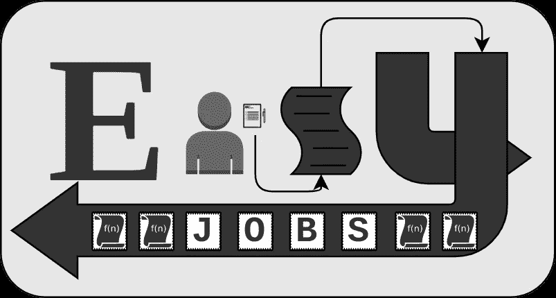
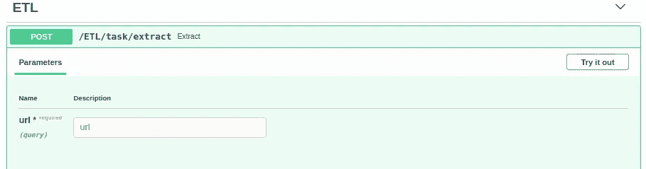
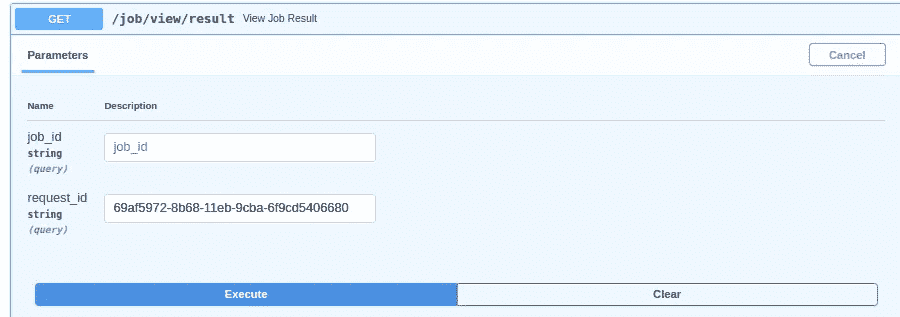
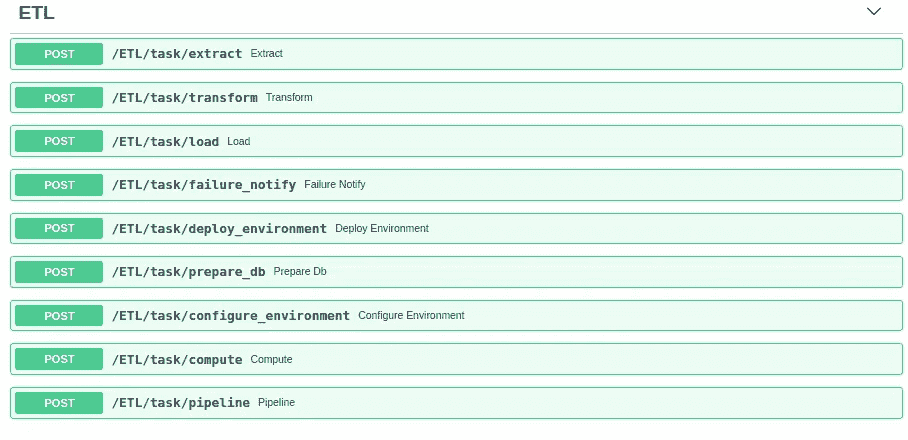
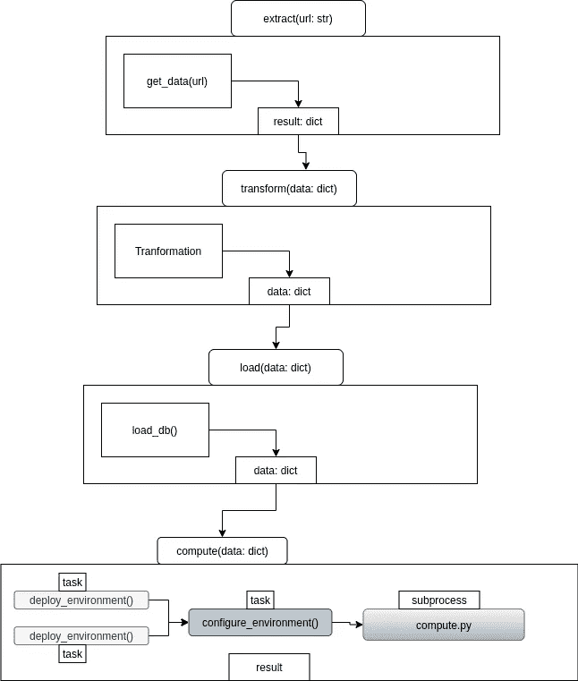
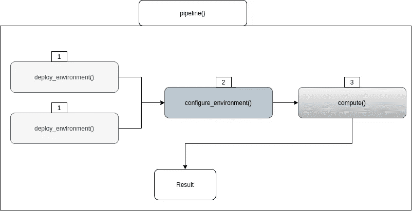

# 使用 EasyJobs & FastAPI 创建数据管道

> 原文：<https://medium.com/analytics-vidhya/creating-a-data-pipeline-with-easyjobs-fastapi-4e302556f05d?source=collection_archive---------3----------------------->



FastAPI 很快在 python 社区中声名鹊起，因为它在为几乎任何东西开发 RestAPI 时都很容易使用。

EasyJobs 是一个为 FastAPI 构建的作业调度和任务分发库，它可以为几乎任何东西创建一个管道——带有内置的 web 挂钩。

# 设置

```
**$** virtualenv -p python3.7 easy-job-env ** 
$** source easy-jobs-env/bin/activate ** 
(easy-job-env)$** pip install easyjobs
```

# **ETL —提取—>转换—>加载**

数据管道是一个最常见的真实世界的例子，一个需要被调度、排序并且应该易于配置的过程。让我们看看数据管道最常见的例子:ETL(提取、转换、加载)。

# 轻松工作经理

在开始之前，让我们首先配置 EasyJobsManager，它将为我们的管道提供一个 RestAPI。

```
# manager.py
import asyncio, os
from easyjobs.manager import EasyJobsManager
from fastapi import FastAPIserver = FastAPI()[@server](http://twitter.com/server).on_event('startup')
async def startup():
    server.job_manager = await EasyJobsManager.create(
        server,
        server_secret='abcd1234'
    )
```

要启动我们的管理器，只需运行:

```
uvicorn --host 0.0.0.0 --port 8220 manager:server
```


现在，我们可以看看我们的“经理/文档”页面，该页面目前只包含经理端点。

# 轻松工作

接下来让我们配置我们的 Worker，我们将把我们的 ETL 管道和逻辑添加到其中:

```
import asyncio, os
from fastapi import FastAPI
from easyjobs.workers.worker import EasyJobsWorkerserver = FastAPI()[@server](http://twitter.com/server).on_event('startup')
async def setup():
    worker = await EasyJobsWorker.create(
        server,
        server_secret='abcd1234',
        manager_host='0.0.0.0',
        manager_port=8220,
        manager_secret='abcd1234',
        jobs_queue='ETL',
        max_tasks_per_worker=5
    ) every_minute = '* * * * *'
    default_args = {'kwargs': {'url': ['[http://stats'](http://stats')]}}
```

worker 定义了一个将向其注册的 JOBS_QUEUE。一旦工作人员注册了一些任务，就可以在工作人员上看到该队列。

您可能还注意到，我们还利用了 FastAPI 的 on_event startup，这是管理器和工作器如何挂钩到 asyncio 事件循环的方法。

```
every_minute = '* * * * *'
default_args = {'kwargs': {'url': ['[http://stats'](http://stats')]}}
```

这是一个简单的 cron 计划，它定义了任务运行的频率。

# **摘录**

我们管道的第一部分。

```
 async def get_data(url):
        print(f"get_data: {url}")
        return {'a': 1, 'b': 2, 'c': 3} [@worker](http://twitter.com/worker).task(run_after=['transform'], schedule=every_minute,   default_args=default_args)
    async def extract(url: str):
        print(f"extract started")
        data = await get_data(url)
        print(f"extract finished")
        return {'data': data}
```

两个方法，get_data()用于模拟数据提取，extract，任务以 URL 作为参数。

如果我们现在运行我们的 worker，并等待大约 30-45 秒，您会注意到我们的 Manager API 上有一个新的端点可用:

```
uvicorn --host 0.0.0.0 --port 8221 job_worker:server --workers=5
```



每一分钟，这个任务都应该使用提供的默认参数来触发，但是也可以从 API 手动触发。


产生的 request_id 可用于管理器，查看作业结果:



# 转换、加载及更多

单个端点很难称为管道。EasyJobs 的真正强大之处在于它能够链接相关任务，然后将这些任务分配给所有工作人员，以尽可能快的速度运行:

```
 [@worker](http://twitter.com/worker).task(run_after=['load'])
    async def transform(data: dict):
        print(f"transform started")
        for k in data.copy():
            data[k] = int(data[k]) + 2
        print(f"transform finished")
        return {'data': data} [@worker](http://twitter.com/worker).task(on_failure='failure_notify', run_after=['compute'])
    async def load(data):
        print(f"load started")
        await load_db(data)
        print(f"load finished")
        return {'data': data} [@worker](http://twitter.com/worker).task()
    async def failure_notify(job_failed):
        await send_email('[admin@company.io](mailto:admin@company.io)', job_failed)
        return job_failed [@worker](http://twitter.com/worker).task()
    async def deploy_environment():
        print(f"deploy_environment - started")
        await asyncio.sleep(5)
        print(f"deploy_environment - completed")
        return f"deploy_environment - completed" [@worker](http://twitter.com/worker).task()
    async def prepare_db():
        print(f"prepare_db - started")
        await asyncio.sleep(5)
        print(f"prepare_db - completed")
        return f"prepare_db - completed"
    [@worker](http://twitter.com/worker).task(run_before=['deploy_environment', 'prepare_db'])
    async def configure_environment():
        print(f"configure_environment - starting")
        await asyncio.sleep(5)
        print(f"configure_environment - finished")
        return f"configure_environment - finished" os.environ['WORKER_TASK_DIR'] = '/home/josh/Documents/python/easyjobs' [@worker](http://twitter.com/worker).task(subprocess=True, run_before=['configure_environment'])
    async def compute(data: dict):
        pass

    [@worker](http://twitter.com/worker).task()
    async def pipeline():
        print(f"pipeline started")
        result = await compute(data={'test': 'data'})
        print(f"pipeline - result is {result} - finished")
        return result
```

再次刷新 worker & /docs 页面，您会看到一组新的端点



# 任务流程



```
# Worker Output
extract started
get_data: ['http://stats']
extract finished
transform started
transform finished
load started
load finished
prepare_db - started
deploy_environment - started
prepare_db - completed
deploy_environment - completed
configure_environment - starting
configure_environment - finished
task subprocess called with ['/home/josh/Documents/python/easyjobs/compute.py', '0.0.0.0', '8220', 'abcd1234', 'c3076f7f-8b5c-11eb-9cba-6f9cd5406680', '{"args": [], "kwargs": {"data": {"a": 3, "b": 4, "c": 5}}}']
starting heavy computation on {'a': 3, 'b': 4, 'c': 5}
```

## 管道



```
pipeline started
deploy_environment - started
prepare_db - started
deploy_environment - completed
prepare_db - completed
configure_environment - starting
configure_environment - finished
task subprocess called with ['/home/josh/Documents/python/easyjobs/compute.py', '0.0.0.0', '8220', 'abcd1234', '23970547-8b5d-11eb-9cba-6f9cd5406680', '{"args": [], "kwargs": {"data": {"test": "data"}}}']
starting heavy computation on {'test': 'data'}
pipeline - result is {'result': 'I slept for 5 seconds - blocking - with data', 'test': 'data'} - finished
```

pipeline()是嵌套依赖和使用 **run_before** 并行化的依赖任务的一个很好的例子。

# 结论

文档:[https://easyjobs.readthedocs.io/en/latest/#quick-start](https://easyjobs.readthedocs.io/en/latest/#quick-start)

源代码:[https://github.com/codemation/easyjobs](https://github.com/codemation/easyjobs)