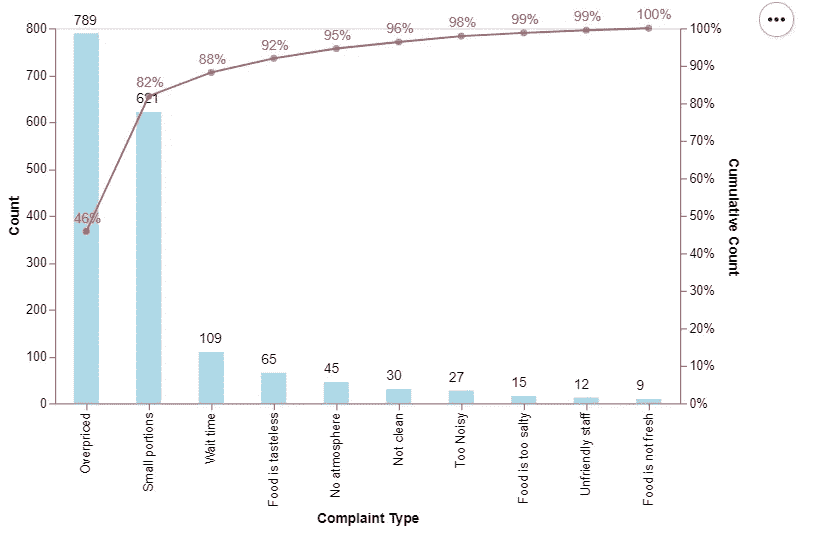
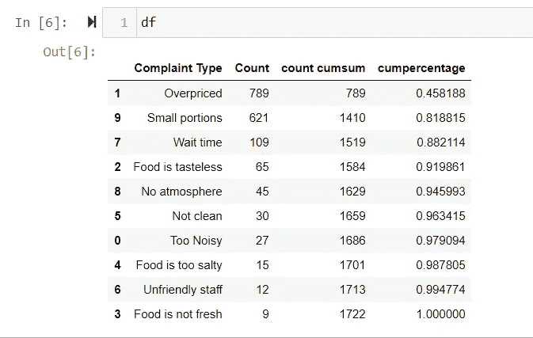

# 在 Altair 中创建双轴帕累托图

> 原文：<https://medium.com/analytics-vidhya/creating-a-dual-axis-pareto-chart-in-altair-e3673107dd14?source=collection_archive---------11----------------------->



## 什么是帕累托图？

按照维基百科的说法，**帕累托图**是一种既包含[条](https://en.wikipedia.org/wiki/Bar_chart)又包含[线图](https://en.wikipedia.org/wiki/Line_chart)的图表，其中单个数值用条**表示，递减**表示，累计总数用线表示。这张图表是以帕累托原理命名的，而帕累托原理的名字又来自著名的意大利经济学家维尔弗雷多·帕累托。

帕累托图的目的是突出一组(通常很大)因素中最重要的因素。在[质量控制](https://en.wikipedia.org/wiki/Quality_control)中，它通常代表最常见的缺陷来源、发生率最高的缺陷类型或客户投诉最频繁的原因等。

在这篇文章中，我们将分析顾客对一家餐馆的每条负面评价的百分比。我们有一组行动项目，即“投诉类型”和在“计数”栏中登记投诉的顾客数量，如下图所示。

```
#Capture the complaint type and count in a dictionary
data_dict = {"Complaint Type" : ['Too Noisy', 'Overpriced', 'Food is tasteless', 'Food is not fresh', 'Food is too salty', 'Not clean', 'Unfriendly staff', 'Wait time', 'No atmosphere', 'Small portions'],
            "Count" : [27, 789, 65, 9, 15, 30, 12, 109, 45, 621]
            }# create a dataframe from the dictionary
df = pd.DataFrame(data_dict)#The sort is key to calculate the cumulative sums
# And also to display the counts in descending order of importance 
# of the complaintsdf = df.sort_values(by=['Count'], ascending=False)# The cumulative percentage is calculated using Pandas Cumsum
# Since the dataframe is sorted by the count, the cumsum adds up the complaints from the largest to the smallest.df["count cumsum"] = df["Count"].cumsum()# Dividing the cumulative sum for each complaint by the total gets
# us to the 100% at the enddf["cumpercentage"] = df["count cumsum"]/(df["Count"].sum())
```



我们首先创建一个已经排序的“投诉类型”数据帧列的列表。这将满足 Pareto 图定义所要求的以降序显示投诉的条件。

为了直观显示这些数据，我们需要两个 Y 轴，一个表示投诉数量，一个表示百分比数量。对于每个 Y 轴编码，我们将指定这个列表作为排序顺序来对齐两个图表。投诉本身将位于 X 轴上。

```
sort_order = df["Complaint Type"].tolist()# The base element adds data (the dataframe) to the Chart
# The categories of complaints are positioned along the X axisbase = alt.Chart(df).encode(
    x = alt.X("Complaint Type:O",sort=sort_order),
).properties (
width = 500
)# Create the bars with length encoded along the Y axis 
bars = base.mark_bar(size = 20).encode(
    y = alt.Y("Count:Q"),
).properties (
width = 500
)# Create the line chart with length encoded along the Y axis
line = base.mark_line(
                       strokeWidth= 1.5,
                       color = "#cb4154" 
).encode(
    y=alt.Y('cumpercentage:Q',
             title='Cumulative Count',
             ,axis=alt.Axis(format=".0%")   ),
    text = alt.Text('cumpercentage:Q')
)# Mark the percentage values on the line with Circle marks
points = base.mark_circle(
              strokeWidth= 3,
              color = "#cb4154" 
).encode(
         y=alt.Y('cumpercentage:Q', axis=None),
)# Mark the bar marks with the value text
bar_text = bars.mark_text(
    align='left',
    baseline='middle',
    dx=-10,  #the dx and dy can be manipulated to position text
    dy = -10, #relative to the bar
).encode(
    y= alt.Y('Count:Q', axis=None),
    # we'll use the percentage as the text
    text=alt.Text('Count:Q',),
    color= alt.value("#000000")
)# Mark the Circle marks with the value text
point_text = points.mark_text(
    align='left',
    baseline='middle',
    dx=-10, 
    dy = -10,
).encode(
    y= alt.Y('cumpercentage:Q', axis=None),
    # we'll use the percentage as the text
    text=alt.Text('cumpercentage:Q', format="0.0%"),
    color= alt.value("#cb4154")
)# Layer all the elements together 
(bars + bar_text +  line + points + point_text).resolve_scale(
    y = 'independent'
)
```

显示双轴的关键代码是 resolve_scale 函数，与设置为独立的“y”一起使用。结果，每个轴都被独立格式化。下面是另一个[**参考例子**](https://altair-viz.github.io/gallery/layered_chart_with_dual_axis.html) 为双轴。

```
(bars + bar_text +  line + points + point_text).resolve_scale(
    y = 'independent'
)
```

**最后是**

适用于各种领域的帕累托原则指出，对于许多结果，大约 80%的后果来自 20%的原因(“关键少数”)。它通常也被称为 **80/20 法则**、重要少数法则**、因素稀疏原则**或**。**

从图表中，现在很容易从线形图中找出 80%的不满意因素，从而很容易通过调整菜单价格和份量来吸引顾客再次光临！