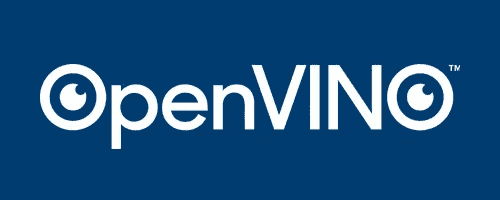

# 使用 OpenVINO 的人脸识别演示创建 Flask API

> 原文：<https://medium.com/analytics-vidhya/creating-a-flask-api-using-openvinos-face-recognition-demo-e793499fbbae?source=collection_archive---------1----------------------->

O penVINO 代表*开放式视觉推理和神经网络优化*是一个全面的工具包，用于快速开发解决各种机器学习和深度学习任务的应用和解决方案，包括模拟人类视觉和自动语音识别、自然语言处理、推荐系统等。基于最新一代的人工神经网络，包括卷积神经网络(CNN)、递归和基于注意力的网络，该工具包在英特尔硬件上扩展了计算机视觉和非视觉工作负载，最大限度地提高了性能。



# OpenVINO 工具包:

*   在边缘实现基于 CNN 的深度学习推理。
*   支持跨英特尔 CPU、英特尔集成显卡、英特尔神经计算棒 2 和采用英特尔 m ovidius VPUs 的英特尔视觉加速器设计的异构执行。
*   通过易于使用的计算机视觉函数库和预先优化的内核加快上市时间。
*   包括针对计算机视觉标准的优化调用，包括 OpenCV*和 OpenCL。

我最近用了一个 OpenVINO 的人脸识别模型。花了一些时间才弄明白。任务是围绕它创建一个 Flask 包装器，并将命令行界面转换为接受 POST 请求的 API。关于这个新的开源工具包的文档非常有限。这个博客将帮助人们简化整个过程，它可以成为希望使用 OpenVINO 的人的一个起点

## OpenVINO 入门

对此，我会推荐使用[**open vino**](https://docs.openvinotoolkit.org/latest/openvino_docs_install_guides_installing_openvino_windows.html)**的官方文档。**

下一步是选择一个演示，并确保它在本地机器上正确运行。对于这个博客，我将使用一个 [**人脸识别演示**](https://docs.openvinotoolkit.org/latest/omz_demos_face_recognition_demo_python.html) **。**

## 运行人脸识别

人脸识别采用三种预训练模型来实现人脸识别。这些是:

*   `face-detection-retail-0004`和`face-detection-adas-0001`，检测人脸并预测其包围盒。
*   `landmarks-regression-retail-0009`，预测人脸关键点。
*   `face-reidentification-retail-0095`、`Sphereface`、`facenet-20180408-102900`或`face-recognition-resnet100-arcface-onnx`识别人物。

这个特定的博客将使用`face-detection-retail-0004`、`landmarks-regression-retail-0009`和`face-reidentification-retail-0095`

## **使用 OPENVINO 的模型下载器下载预训练模型**

OPENVINO 是一个命令行工具，在使用任何功能之前，需要初始化环境变量。为此:

*   打开 CMD。
*   转到 bin 文件夹并运行 setupvars.bat。


环境变量的初始化

完成这些后，我们下载人脸识别所需的所有模型。可以这样做:


使用 OPENVINO 的模型下载器下载模型

同样，其他两个模型也可以下载。

## 创建用于人脸识别的图库

为了识别人脸，该应用程序使用人脸数据库或图库。画廊是一个包含人物图像的文件夹。画廊中的每个图像可以是任意大小的，并且应该包含一个或多个正面朝向的具有良好质量的面。可以使用同一个人的多个图像，但是在这种情况下，命名格式应该是特定的— `{id}-{num_of_instance}.jpg`。例如，可以有图像`Paul-0.jpg`、`Paul-1.jpg`等。它们都将被视为同一个人的图像。如果每人有一张图片，您可以使用格式`{id}.jpg`(例如`Paul.jpg`)。

在可视化期间，图像的文件名被用作人名。使用以下命名约定:`person_N_name.png`或`person_N_name.jpg`。在这个演示中，使用了 Shekhar Gupta(记者)和奥巴马的图像。

## 运行整个应用程序

现在，我们已经在文件夹中准备好了一切。下一步是运行 face_recognition_demo.py 文件。不带任何参数运行这个命令，它将显示一个它可以接受的参数列表。有些是必需的，有些是可选的。下面列出了需要的选项:

```
 python ./face_recognition_demo.py ^
 -i <path_to_video>/input_video.mp4 ^
 -m_fd <path_to_model>/face-detection-retail-0004.xml ^
 -m_lm <path_to_model>/landmarks-regression-retail-0009.xml ^
 -m_reid <path_to_model>/face-reidentification-retail-0095.xml ^
 — verbose ^
 -fg “C:/face_gallery”
```

因为最终结果是一个 flask API。所有依赖项和文件夹都放在一个文件夹中。


结构看起来像这样

现在我们通过传递所有需要的参数来运行整个应用程序

```
python face_recognition_demo.py 
-i input/shekhargupta.mp4 
-m_fd face-detection-retail-0004/FP16/face-detection-retail-0004.xml -m_lm landmarks-regression-retail-0009/FP16/landmarks-regression-retail-0009.xml 
-m_reid face-reidentification-retail-0095/FP16/face-reidentification-retail-0095.xml 
-fg dict
```

输入的是谢哈·古普塔的视频。

输出将是一个实时视频流，以及面部关键点映射和一个围绕面部的框，该框具有模型识别该人的标签和准确性。


## 创建 REST API

为此，我将使用 Flask，并且假设读者已经对它有了基本的了解。我们以支持 POST 请求的方式创建 Flask 应用程序。将通过 API 发送一个视频，应用程序将处理这个视频并返回此人的姓名。

在我们继续之前，我们希望确保模型不需要显式参数，并且我们还希望确保显示的视频输出不会弹出。我们想要 JSON 形式的最终输出，它将显示为请求的输出。

## 处理显式参数

在 face_recognition.py 代码中，有一个函数 build_argparser，我们需要在其中进行更改。使用的参数有

*   -i 或-输入。在函数中，我们通过向函数传递一个路径并使用这个路径作为参数输入的默认输入来处理这个问题。该路径将是通过 POST 请求发送的视频的路径。

```
general.add_argument(‘-i’, ‘ — input’, required=False,default=path,
 help=’Required. An input to process. The input must be a single image, ‘
 ‘a folder of images, video file or camera id.’)
```

*   -fg，这是包含人物图像的文件夹的路径。这可以通过假定一个文件夹的默认路径来更改，任何后续的添加都是通过将图像添加到该文件夹来处理的。
*   我们还需要向函数 main 传递一个参数 path，这将是输入文件的路径，并创建一个全局列表来存储视频中识别的人员。
*   这个列表由 main 函数返回，它将是 POST 请求的输出。

```
gallery.add_argument(‘-fg’, default=’dict’, help=’Optional. Path to the face images directory.’)
```

*   现在，我们通过将链接作为默认参数传递并将所需参数设置为 False 来处理模型参数。

```
models.add_argument(‘-m_fd’, type=Path, required=False,default=’face-detection-retail-0004/FP16/face-detection-retail-0004.xml’,help=’Required. Path to an .xml file with Face Detection model.’)models.add_argument(‘-m_lm’, type=Path, required=False,default=’landmarks-regression-retail 0009/FP16/landmarks-regression-retail-0009.xml’,help=’Required. Path to an .xml file with Facial Landmarks Detection model.’)models.add_argument(‘-m_reid’, type=Path, required=False,default=’face-reidentification-retail-0095/FP16/face-reidentification-retail-0095.xml’,help=’Required. Path to an .xml file with Face Reidentification model.’)
```

*   我们还需要做一个更改，那就是将 no _ show 参数更改为 True，这将确保输出不是输入视频流的形式。

现在，如果我们运行这个，我们只需要运行文件 **face_recognition_demo.py** 而不需要任何参数。

# 创建烧瓶应用程序

要创建一个 Flask 应用程序，我们需要四样东西:

1.创建一个这样的 app = Flask(__name__)。

2.给出一个主机名和一个端口号，用于发出 POST 请求。在本例中，它是 host = ' localhost ', port = 3003。

3.现在，当应用程序运行时，我们希望确保 flask 应用程序运行，我们通过以下方式实现这一点:

```
if __name__ == ‘__main__’:
 app.run(host, port, debug=False)
```

4.现在，我们需要确保如果用户点击主机名和端口，他们会收到服务正在运行的消息，为了实现这一点，我们添加了一个函数。

```
[@app](http://twitter.com/app).route(“/”)
def home():
 return “Service Running”
```

5.现在是 main 函数，用于发送视频并获得所需的输出。我们将使用一个库 **tempfile** ，并将创建一个临时文件，该文件不会保存在任何地方，一旦整个过程完成，将被删除。

现在我们运行整个应用程序


为了测试这一点，我们在链接[http://localhost:3003/face _ recognition](http://localhost:3003/face_recognition)上发送一个 post 请求，并获得以下输出。Talend API tester 用于发送请求，可以从 Chrome 网上商店下载。下面是发送的请求示例。


来自该请求的输出将是实际输出，并且与精度一起逐帧给出。采用一种模式来获得单个值，并从输出中去除精度。


这就是如何运行 OpenVINO 演示并从中创建 REST API。代码可以在 [**这里找到**](https://github.com/shgoyal33/OPENVINO-flask-API) 。希望有帮助！！！！