# 从头开始创建 Google Data Studio 社区连接器

> 原文：<https://medium.com/analytics-vidhya/creating-a-google-data-studio-community-connector-from-scratch-6e6c32624469?source=collection_archive---------0----------------------->

## 本文向您展示了如何编写自己的**data studio community connector，然后创建一个 datasource** ，它将调用一个带有基本身份验证的自定义**API**来为 Google DataStudio 报告检索数据。


作者的照片——没有比非洲子集更好的了，发现山地自行车手；-)

DataStudio 是一个很好的平台，可以可视化机器学习的结果及其免费的**。BigQuery 和其他营销类型的数据集有很好的连接器。**

> **但是如果你想连接到你自己的网络服务呢？**

**除了一些非常基本的例子之外，我到处寻找关于定制连接器的好文章。我希望这篇文章能帮助你一步一步地完成整个过程。**

**本文将涵盖以下主题:**

1.  **调查要调用的 web 服务**
2.  **设置应用程序脚本连接器
    2 . a getConfig
    2 . b get schema
    2 . c getAuthType
    2 . d get data
    2 . e 将所有这些放在一起**
3.  **设置清单文件**
4.  **展开连接器**
5.  **创建新的数据源**
6.  **创建新报告**
7.  **怎么调试？**

# **1.调查要调用的 web 服务**

**正如您从下面的邮递员调用中看到的，我们正在调用一个具有基本身份验证的 web 服务。注意我们得到的 JSON 结构。**

**我们的目标是创建一个社区连接器，然后创建一个 data studio 数据源，调用下面的 web 服务。**

> **如您所见，我们的 web 服务需要一个 **supplierID** 作为参数。**

**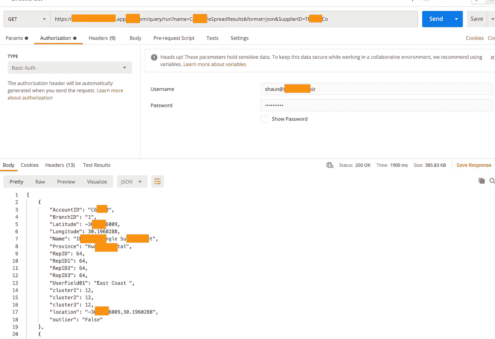**

# **2.设置应用程序脚本连接器**

**这一部分将被分成几个小节。我们将在[https://script.google.com/](https://script.google.com/)创建一个新的脚本，并创建一个新的项目。**

**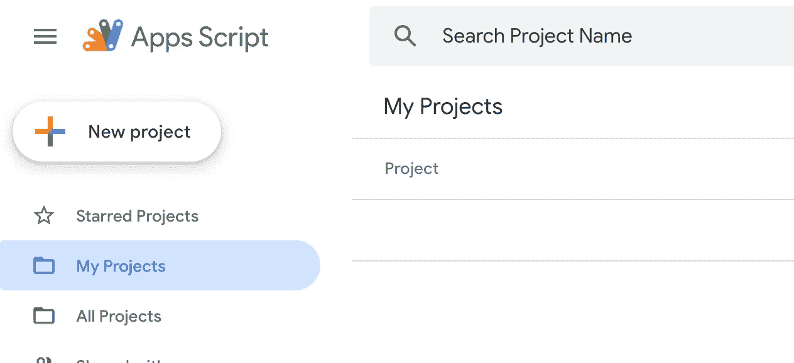**

**现在您已经创建了第一个脚本项目，所以让我们继续添加 DataStudio 数据源需要的函数。**

**下面是我们需要编写的几个函数**

*   **getConfig() —设置数据源的配置**
*   **get schema()-设置字段名称和类型**
*   **getAuthType() —身份验证的类型**
*   **getData() —将调用我们的 web 服务来获取我们的数据**

**编辑 Code.js，删除其内容并继续下面的操作。**

## **2 .一个 getConfig()**

**使用这个函数来设置我们的配置，因为我们需要数据源包含一个 supplierID 参数，所以我们现在就设置它。web 服务将在其 SQL 查询中使用该参数。**

```
function getConfig() {
  var config = cc.getConfig(); config
      .newTextInput()
      .setId("supplierID")
      .setName("supplierID")
      .setAllowOverride(true); return config.build();
}
```

## **2.b getSchema()**

**使用此函数定义模式。注意，我们创建了一个 getFields 函数来设置我们的字段，以及它们相应的类型。当创建数据源来设置字段时，会调用这个函数。**

> **将上面的邮递员截图与下面创建的字段进行比较**

```
function getFields() {
  var fields = cc.getFields();
  var types = cc.FieldType;
  var aggregations = cc.AggregationType;fields
    .newDimension()
    .setId('AccountID')
    .setName('AccountID')
    .setType(types.TEXT);fields
    .newDimension()
    .setId('BranchID')
    .setName('BranchID')
    .setType(types.TEXT);fields
    .newDimension()
    .setId('Name')
    .setName('Name')
    .setType(types.TEXT);fields
    .newDimension()
    .setId('UserField01')
    .setName('UserField01')
    .setType(types.TEXT);fields
    .newDimension()
    .setId('Province')
    .setName('Province')
    .setType(types.TEXT);fields
    .newDimension()
    .setId('Latitude')
    .setName('Latitude')
    .setType(types.NUMBER);fields
    .newDimension()
    .setId('Longitude')
    .setName('Longitude')
    .setType(types.NUMBER);fields
    .newDimension()
    .setId('location')
    .setName('location')
    .setType(types.LATITUDE_LONGITUDE);fields
    .newMetric()
    .setId('RepID')
    .setName('RepID')
    .setType(types.NUMBER)fields
    .newMetric()
    .setId('RepID1')
    .setName('RepID1')
    .setType(types.NUMBER)fields
    .newMetric()
    .setId('cluster1')
    .setName('cluster1')
    .setType(types.NUMBER)fields
    .newMetric()
    .setId('cluster2')
    .setName('cluster2')
    .setType(types.NUMBER)fields
    .newMetric()
    .setId('RepID2')
    .setName('RepID2')
    .setType(types.NUMBER)fields
    .newMetric()
    .setId('outlier')
    .setName('outlier')
    .setType(types.TEXT)

  fields
    .newMetric()
    .setId('cluster3')
    .setName('cluster3')
    .setType(types.NUMBER)fields
    .newMetric()
    .setId('RepID3')
    .setName('RepID3')
    .setType(types.NUMBER)return fields;
}

function getSchema(request) {
  return {schema: getFields().build()};
}
```

## **2.c 授权功能**

**我们需要几个函数来处理授权，让我们总结一下:**

*   ****getAuthType** —设置我们将需要用于基本认证的用户/密码用于基本认证。**
*   ****resetAuth** —如果我们需要在 DataStudio 的数据源中重新输入凭证，重置数据源上的授权。**
*   ****isAuthValid** —从设置中获取用户/密码，并通过调用 validateCredentials 函数来确认凭证是否正确。**

```
/**
 * Called when datasource is setup, we set to user/password
 */
function getAuthType() {
  console.log("message")
  var AuthTypes = cc.AuthType;
  return cc
    .newAuthTypeResponse()
    .setAuthType(AuthTypes.USER_PASS)
    .build();
}/**
 * Resets the auth service.
 */
function resetAuth() {
  var userProperties = PropertiesService.getUserProperties();
  userProperties.deleteProperty('dscc.username');
  userProperties.deleteProperty('dscc.password');
}/**
 * Returns true if the auth service has access.
 */
function isAuthValid() {
  const usernameAndPassword = loadCurrentUsernameAndPassword();
  return usernameAndPassword.username && usernameAndPassword.password && validateCredentials(usernameAndPassword.username, usernameAndPassword.password)
};/**
 * Loads user/password from properties
 */
function loadCurrentUsernameAndPassword() {
  const properties = PropertiesService.getUserProperties();
  return {
    username: properties.getProperty('dscc.username'),
    password: properties.getProperty('dscc.password')
  }
};/**
 * Sets the credentials in properties and checks if valid.
 */
function setCredentials(request) {
  var creds = request.userPass;
  var username = creds.username;
  var password = creds.password;// Optional
  // Check if the provided username and password are valid through a
  // call to your service. You would have to have a `checkForValidCreds`
  // function defined for this to work.
  var validCreds = checkForValidCreds(username, password);
  if (!validCreds) {
    return {
      errorCode: 'INVALID_CREDENTIALS'
    };
  }
  var userProperties = PropertiesService.getUserProperties();
  userProperties.setProperty('dscc.username', username);
  userProperties.setProperty('dscc.password', password);
  return {
    errorCode: 'NONE'
  };
}/**
 * Saves username/password to properties
 */
function storeUsernameAndPassword(username, password) {
  PropertiesService
    .getUserProperties()
    .setProperty('dscc.username', username)
    .setProperty('dscc.password', password);
};// Not used
function checkForValidCreds(username, password) {
  return true;
}/**
 * Call our web service to check if credentials are valid
 */
function validateCredentials(username, password) {
  var rawResponse = UrlFetchApp.fetch('[http://zzzzz.appspot.com/user/get'](http://citric-optics-107909.appspot.com/user/get'), {
    method: 'GET',
    headers: {
      'Authorization': 'Basic ' + Utilities.base64Encode(username + ':' + password)
    },
    muteHttpExceptions: true
  });return rawResponse.getResponseCode() < 205;
}
```

## **2d。getData()**

**我们现在需要 3 个函数来获取数据。如果您愿意，我们可以在一个函数中完成所有这些操作。**

*   ****getData()** —被调用以从我们的 web 服务获取数据**
*   ****fetchDataFromAPI()** —调用实际的 web 服务**
*   ****getFormattedData()** —查找 DataStudio 报告要求的请求字段，并仅返回这些字段。*例如，报告可能只需要 10 个字段中的 2 个。***

```
function getData(request) {  
  try {
    // get list of fields in report
    var requestedFields = request.fields.map(function(row){
      return row.name;
    })// Prepare the schema for the fields requested.
    var dataSchema = [];
    var fixedSchema = getSchema().schema;
    request.fields.forEach(function(field) {
      for (var i = 0; i < fixedSchema.length; i++) {
        if (fixedSchema[i].name == field.name) {
          dataSchema.push(fixedSchema[i]);
          break;
        }
      }
    });// fetch and prepare data
    var apiResponse = fetchDataFromApi(request);
    var data = getFormattedData(JSON.parse(apiResponse), requestedFields);// build result
    var result = {
      schema: dataSchema,
      rows: data
    };
    // throw(JSON.stringify(result))
    return result;
  } catch (e) {
    cc.newUserError()
      .setDebugText('Error fetching data from API. Exception details: ' + e)
      .setText(
        'The connector has encountered an unrecoverable error. Please try again later, or file an issue if this error persists.'
      )
      .throwException();
  }
}function fetchDataFromApi(request) {
  // get credentials
  var userProperties = PropertiesService.getUserProperties();
  var username = userProperties.getProperty('dscc.username');
  var password = userProperties.getProperty('dscc.password');

  var url = [
    '[https://zzzzzzz.appspot.com/query/run?name=CaboodleSpreadResults&format=json&SupplierID='](https://citric-optics-107909.appspot.com/query/run?name=CaboodleSpreadResults&format=json&SupplierID='),
    request.configParams.supplierID
  ].join('');var response = UrlFetchApp.fetch(url, {
    method: 'GET',
    headers: {
      'Authorization': 'Basic ' + Utilities.base64Encode(username + ':' + password)
    },
    muteHttpExceptions: true
  });
  return response;
}function getFormattedData(response, requestedFields) {
  var data = [];

  //loop through to pick up requested fields
  response.forEach(function(row) {
    var values = [];
    requestedFields.forEach(function(field) {
      values.push(row[field])
    });
    data.push({
      values: values
    });
  });
  return data;
}
```

# **2e。把所有的放在一起**

**以下是供您剪切和粘贴的全套代码:**

```
var cc = DataStudioApp.createCommunityConnector();function getAuthType() {
  console.log("message")
  var AuthTypes = cc.AuthType;
  return cc
    .newAuthTypeResponse()
    .setAuthType(AuthTypes.USER_PASS)
    .build();
}/**
 * Resets the auth service.
 */
function resetAuth() {
  var userProperties = PropertiesService.getUserProperties();
  userProperties.deleteProperty('dscc.username');
  userProperties.deleteProperty('dscc.password');
}/**
 * Returns true if the auth service has access.
 */
function isAuthValid() {
  const usernameAndPassword = loadCurrentUsernameAndPassword();
  return usernameAndPassword.username && usernameAndPassword.password && validateCredentials(usernameAndPassword.username, usernameAndPassword.password)
};function loadCurrentUsernameAndPassword() {
  const properties = PropertiesService.getUserProperties();
  return {
    username: properties.getProperty('dscc.username'),
    password: properties.getProperty('dscc.password')
  }
};/**
 * Sets the credentials.
 */
function setCredentials(request) {
  var creds = request.userPass;
  var username = creds.username;
  var password = creds.password;// Optional
  // Check if the provided username and password are valid through a
  // call to your service. You would have to have a `checkForValidCreds`
  // function defined for this to work.
  var validCreds = checkForValidCreds(username, password);
  if (!validCreds) {
    return {
      errorCode: 'INVALID_CREDENTIALS'
    };
  }
  var userProperties = PropertiesService.getUserProperties();
  userProperties.setProperty('dscc.username', username);
  userProperties.setProperty('dscc.password', password);
  return {
    errorCode: 'NONE'
  };
}function storeUsernameAndPassword(username, password) {
  PropertiesService
    .getUserProperties()
    .setProperty('dscc.username', username)
    .setProperty('dscc.password', password);
};// not used
function checkForValidCreds(username, password) {
  return true;
}function validateCredentials(username, password) {
  var rawResponse = UrlFetchApp.fetch('[http://zzzzz.appspot.com/user/get'](http://citric-optics-107909.appspot.com/user/get'), {
    method: 'GET',
    headers: {
      'Authorization': 'Basic ' + Utilities.base64Encode(username + ':' + password)
    },
    muteHttpExceptions: true
  });return rawResponse.getResponseCode() < 205;
}function getConfig() {
  var config = cc.getConfig();config
      .newTextInput()
      .setId("supplierID")
      .setName("supplierID")
      .setAllowOverride(true);return config.build();
}function getFields() {
  var fields = cc.getFields();
  var types = cc.FieldType;
  var aggregations = cc.AggregationType;fields
    .newDimension()
    .setId('AccountID')
    .setName('AccountID')
    .setType(types.TEXT);fields
    .newDimension()
    .setId('BranchID')
    .setName('BranchID')
    .setType(types.TEXT);fields
    .newDimension()
    .setId('Name')
    .setName('Name')
    .setType(types.TEXT);fields
    .newDimension()
    .setId('UserField01')
    .setName('UserField01')
    .setType(types.TEXT);fields
    .newDimension()
    .setId('Province')
    .setName('Province')
    .setType(types.TEXT);fields
    .newDimension()
    .setId('Latitude')
    .setName('Latitude')
    .setType(types.NUMBER);fields
    .newDimension()
    .setId('Longitude')
    .setName('Longitude')
    .setType(types.NUMBER);fields
    .newDimension()
    .setId('location')
    .setName('location')
    .setType(types.LATITUDE_LONGITUDE);fields
    .newMetric()
    .setId('RepID')
    .setName('RepID')
    .setType(types.NUMBER)fields
    .newMetric()
    .setId('RepID1')
    .setName('RepID1')
    .setType(types.NUMBER)fields
    .newMetric()
    .setId('cluster1')
    .setName('cluster1')
    .setType(types.NUMBER)fields
    .newMetric()
    .setId('cluster2')
    .setName('cluster2')
    .setType(types.NUMBER)fields
    .newMetric()
    .setId('RepID2')
    .setName('RepID2')
    .setType(types.NUMBER)fields
    .newMetric()
    .setId('outlier')
    .setName('outlier')
    .setType(types.TEXT)

  fields
    .newMetric()
    .setId('cluster3')
    .setName('cluster3')
    .setType(types.NUMBER)fields
    .newMetric()
    .setId('RepID3')
    .setName('RepID3')
    .setType(types.NUMBER)return fields;
}

function getSchema(request) {
  return {schema: getFields().build()};
}function getData(request) {
  //request.configParams = validateConfig(request.configParams);

  try {
    // get list of fields in report
    var requestedFields = request.fields.map(function(row){
      return row.name;
    })// Prepare the schema for the fields requested.
    var dataSchema = [];
    var fixedSchema = getSchema().schema;
    request.fields.forEach(function(field) {
      for (var i = 0; i < fixedSchema.length; i++) {
        if (fixedSchema[i].name == field.name) {
          dataSchema.push(fixedSchema[i]);
          break;
        }
      }
    });// fetch and prepare data
    var apiResponse = fetchDataFromApi(request);
    var data = getFormattedData(JSON.parse(apiResponse), requestedFields);// build result
    var result = {
      schema: dataSchema,
      rows: data
    };
    // throw(JSON.stringify(result))
    return result;
  } catch (e) {
    cc.newUserError()
      .setDebugText('Error fetching data from API. Exception details: ' + e)
      .setText(
        'The connector has encountered an unrecoverable error. Please try again later, or file an issue if this error persists.'
      )
      .throwException();
  }
}function fetchDataFromApi(request) {
  // get credentials
  var userProperties = PropertiesService.getUserProperties();
  var username = userProperties.getProperty('dscc.username');
  var password = userProperties.getProperty('dscc.password');

  var url = [
    '[https://zz.zzzzz.com/query/run?name=CaboodleSpreadResults&format=json&SupplierID='](https://citric-optics-107909.appspot.com/query/run?name=CaboodleSpreadResults&format=json&SupplierID='),
    request.configParams.supplierID
  ].join('');
  var response = UrlFetchApp.fetch(url, {
    method: 'GET',
    headers: {
      'Authorization': 'Basic ' + Utilities.base64Encode(username + ':' + password)
    },
    muteHttpExceptions: true
  });
  return response;
}function getFormattedData(response, requestedFields) {
  var data = [];

  console.log(response)
  response.forEach(function(row) {
    var values = [];
    requestedFields.forEach(function(field) {
      values.push(row[field])
    });
    data.push({
      values: values
    });
  });
  return data;
}function isAdminUser() {
  return true;
}
```

# **3.设置清单文件**

**在部署之前，我们需要设置一个清单文件。为此，请转到“设置”并在编辑器中显示清单。**

**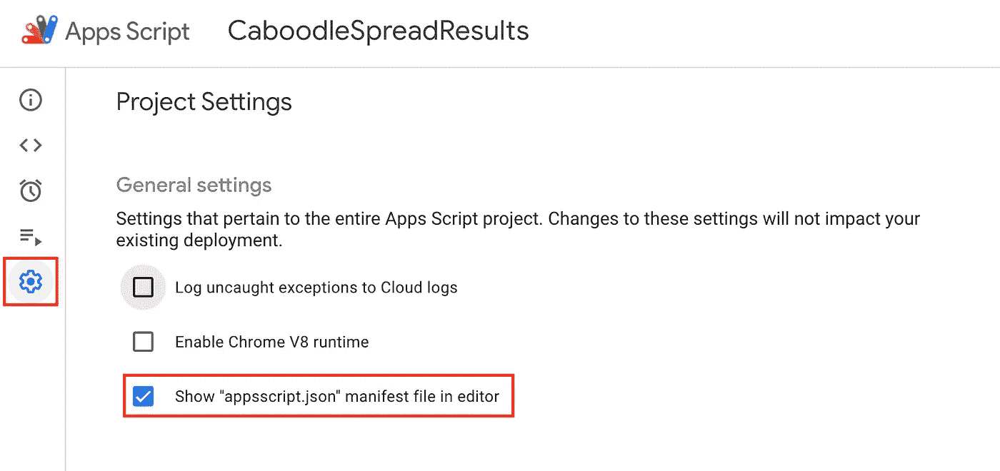**

**现在，您将能够查看和编辑 appscript.json 清单文件**

**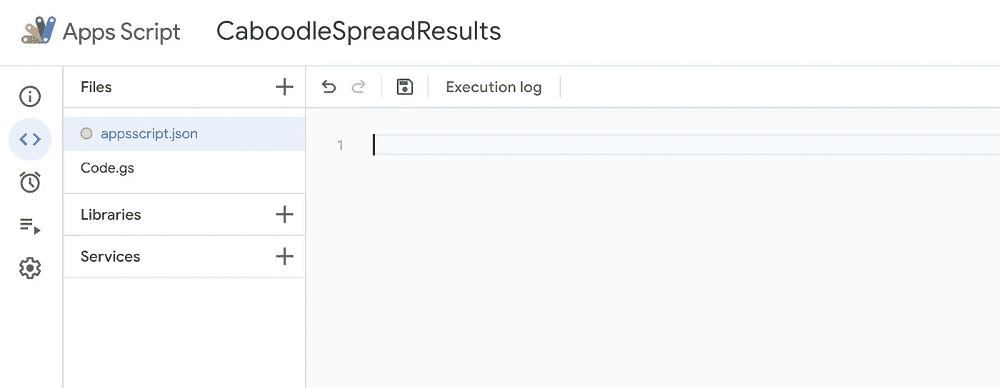**

**你可以在 JSON 下面剪切粘贴，只需改变**你的连接器**，**你的公司** & **你的描述**。**

> **一个很好的选择是通过将 YourDefaultTemplate 更改为使用该数据源的默认报表的 ID 来添加默认模板。**

```
{
"dataStudio": {
"name": "YourConnector",
"logoUrl": "https://raw.githubusercontent.com/npm/logos/master/npm%20square/n-64.png",
"company": "YourCompany",
"companyUrl": "https://caboodledata.com",
"addonUrl": "https://github.com/googledatastudio/community-connectors/tree/master/npm-downloads#readme",
"supportUrl": "https://github.com/googledatastudio/community-connectors/issues",
"description": "Your description",
"sources": ["npm"],
"templates": {
"default1": "YourDefaultTemplate"
}
},
"oauthScopes": [
"https://www.googleapis.com/auth/script.external_request"
]
}
```

# **4.展开连接器**

**这有点奇怪，因为我还没有发现如何在新的编辑器中发布 manifest。一旦我做到了，我会改变这一部分。所以现在，点击“使用传统编辑器”按钮。**

> **不要担心，您现在只需要这样做来部署，然后您可以切换回新的编辑器**

**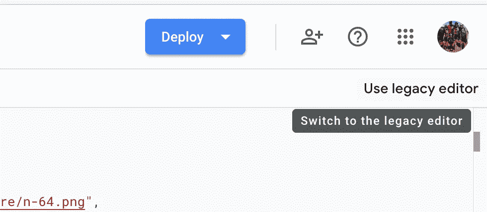**

**您现在可以从 publish 菜单进行部署，如下所示。**

**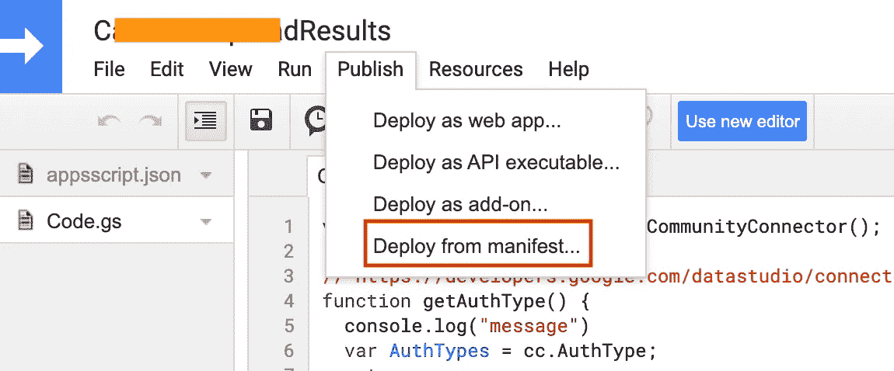**

**现在，您将看到一个弹出窗口，您可以复制该链接。**

> **NB。通过使用此链接，您将创建一个新的数据源。所以每次使用它时，都会创建一个新的数据源。**

**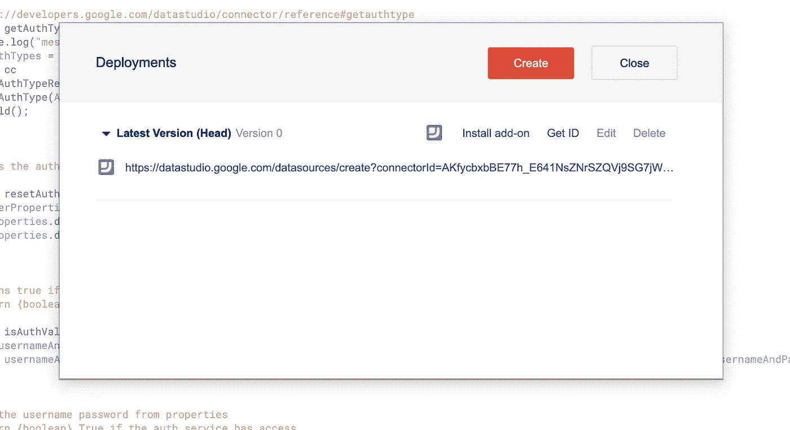**

# **5.创建新的数据源**

**将上一步中的 URL 粘贴到您的浏览器中，现在您将开始创建新数据源的过程。**

1.  **输入 supplierID，在我们的例子中，它来自 getConfig()函数。**
2.  **请记下报告模板以备后用，您现在可以取消单击它。**
3.  **按连接按钮。**

> **NB。您还会被要求输入数据源用户名和密码。这将用于验证使用基本身份验证调用的 web 服务。**
> 
> **NBB。所有使用此数据源的用户将共享这些凭证，因此请确保只与您信任的人共享数据源。**

**输入供应商 ID 并点击连接。**

**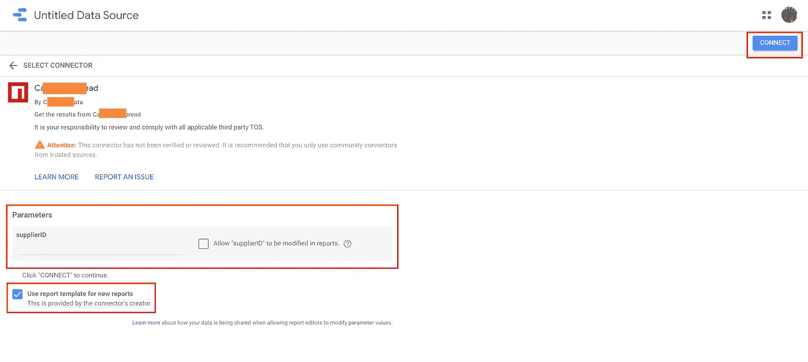**

**现在，您可以输入您的数据源名称并进行任何其他更改，单击 add a report 即可开始。**

**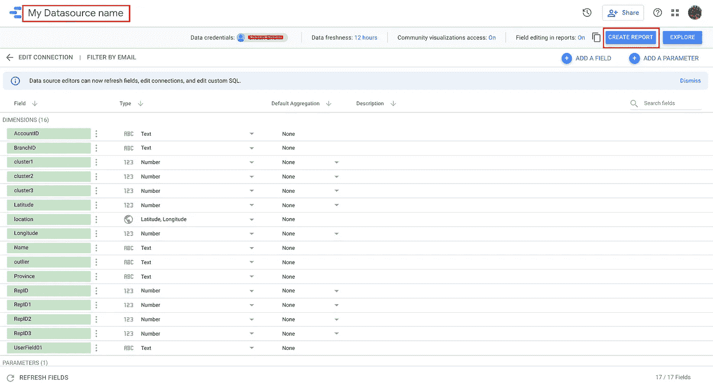**

# **6.创建新报告**

**现在，您可以开始创建您的报告，如下所示:**

**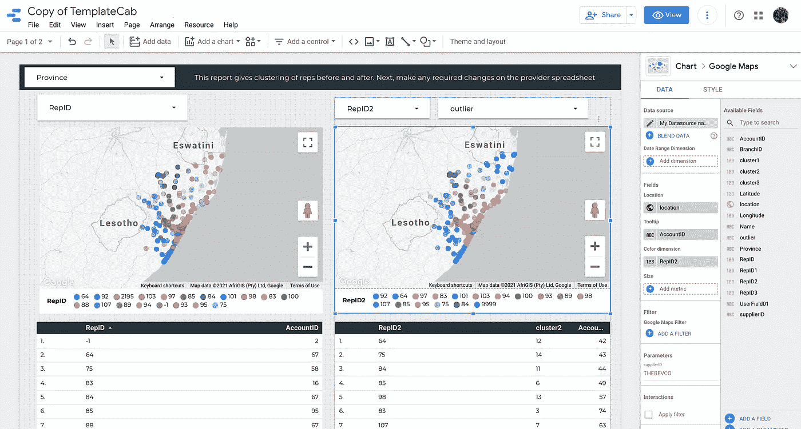**

# **7.怎么调试？**

**因此，调试存在一些问题。第一个是确保将 isAdmin 设置为 true，以便在生成错误时，可以在 DataStudio 中看到它们。**

```
function isAdminUser() {
  return true;
}
```

**现在，一定要处理好你的错误。所以回到 getData()并注意抛出异常的 try/catch。然后，这个异常会在 DataStudio 中显示给管理员用户，因此您可以跟踪错误。下面是一个抛出错误的例子。**

```
try {........} catch (e) {
cc.newUserError()
  .setDebugText('Error fetching data from API. Exception details: ' + e) .setText('The connector has encountered an unrecoverable error. Please try again later, or file an issue if this error persists.') .throwException();
}
```

> **因此，正确的错误处理是你的最佳方法**

**您也可以按如下方式检查日志。如果您没有让它停留太久，那么您将会看到抛出的完整错误消息。**

**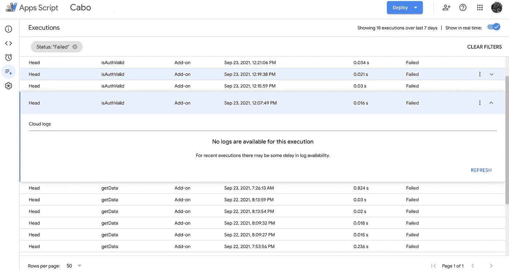**

# **来源**

**在构建我的连接器时，我发现这些非常有用:**

*   **【https://developers.google.com/datastudio/connector/build? hl=en**
*   **[在谷歌数据工作室(kidakaka.com)上构建您的定制连接器](https://kidakaka.com/blog/2020/04/29/building-your-custom-connector-on-google-data-studio/)**