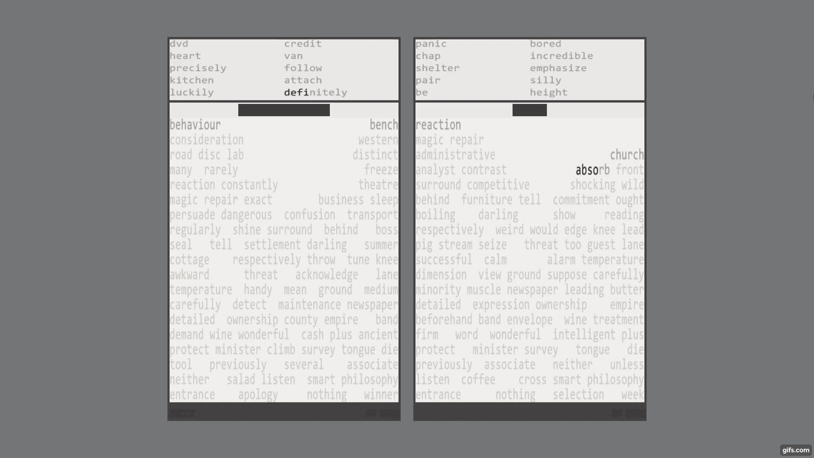
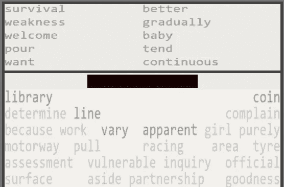

# 创建一个多人快速打字游戏使用烧瓶，SocketIO 和芹菜

> 原文：<https://medium.com/analytics-vidhya/creating-a-multiplayer-speed-typing-game-using-flask-socketio-and-celery-a3269a8f3e99?source=collection_archive---------6----------------------->

类型战斗比赛

最近我一直在玩多种快速打字游戏，但我对它们的通用性感到沮丧，在游戏开始时，你等待其他玩家加入并显示文本，当游戏开始时，你尽可能快地打字，当你完成时，你可以看到自己与其他人相比的情况。虽然尝试获得第一名很有趣，但没有真正的理由在线玩，没有策略，也没有玩家互动，最快的人总是会赢。

六个月前， [typefight](https://typefight.me/) 的想法出现在我的脑海中，从那以后我一直致力于它，一路上犯了很多错误，最终形成了我现在的设置。在这篇文章中，我想展示一下 typefight 是如何构建的。我希望它能帮助任何想用 python 创作在线游戏的人。

## 关于 typefight

[typefight](https://typefight.me/) 是一款竞技速度打字游戏，与大多数打字游戏不同，玩家可以相互互动，并可以选择不同的打字顺序，从而通过不同的策略获得独特的游戏体验。
typefight 的灵感来自俄罗斯方块 99，以及高速打字游戏，如
和 [typeracer](https://play.typeracer.com/) 。

## 怎么玩

播放器视图的一部分

每个玩家视图分为 3 个部分，攻击词，防御格子和
精确栏。为了赢得游戏，对方玩家的网格必须接触到精度栏，其大小根据玩家在过去 100 次击键中犯了多少错误来设置。防御网格将随着时间的推移而增长，新词要么来自游戏推进机制，要么来自对手的攻击。
玩家可以随时选择输入哪个单词(在防御格子中，该单词上面不能有其他单词)，一旦输入第一个字符，玩家就不能切换到另一个单词。

## 游戏循环

每个游戏的核心应该是游戏循环，它处理输入，推进游戏，然后呈现变化。使用游戏循环可以更容易地推进游戏和渲染玩家数据。这是我构建的游戏循环:

由于每场比赛都应该有不同的游戏循环，所以需要使用某种并发性，因为在 python 中不能并行运行多个线程，所以我选择使用带有 R [edis](https://redis.io/) 的 [Celery](https://docs.celeryproject.org/en/stable/getting-started/introduction.html) 作为消息代理，这使得能够在不同的进程中创建游戏循环并与服务器通信。

## 玩家与 SocketIO 通信

Flask-SocketIO 用于服务器和玩家之间的通信。当玩家想要开始一个游戏时，前端代码将他们连接到 SocketIO 服务器，并保存他们的会话 id，该 id 将用于发送输入。一旦与另一个玩家匹配，两个玩家都被放在一个有特定匹配 id 的插槽中，这使得向两个玩家呈现数据变得更加容易。

现在我们有了通信过程的全貌，玩家开始
输入字母“a ”,浏览器使用 SocketIO 发送它，它到达服务器
,服务器在 redis 中发布数据，然后游戏循环获得数据并推进游戏。当服务器想要向播放器呈现改变时，它发布 redis 消息，服务器拾取该消息并使用 SocketIO 将其发送给负责呈现该消息的播放器浏览器。

## 前端

网站本身非常简单，它使用 MVP 设计模式，用 Typescript 编写
，Gulp 用来编译和捆绑代码到一个 JavaScript
文件中。游戏渲染是使用 PixiJS 创建引擎完成的，它允许我轻松地创建视图和动画。

我在编写前端时遇到的一个主要问题是服务器引发的 ping，这是 63 毫秒，就游戏循环而言，这意味着当用户向服务器发送输入时，循环将在获取之前运行两次，此外，糟糕的或远距离的连接将使游戏无法播放。这个问题通过向前端添加一些服务器逻辑来预测接下来应该发生什么来解决，例如，保存可以键入的单词，以便客户端代码可以知道用户输入是否是错误的。

## 一个有用，一个没用

使用 Tkinter 的 typefight 的早期版本

我犯的最大最耗时的错误是没有从一开始就使用游戏循环，这导致我两次对游戏代码设计进行了重大修改。一旦我实现了游戏循环，代码变得更加精简，实现机器人、玩家之间的交互和渲染玩家数据变得更加容易。

对我帮助很大的一件事是，从开发的早期阶段就开始关注产品，记录所有可能出错的地方，或者某个库推荐什么时候出错。除了在大部分游戏逻辑完成时设置生产服务器，这有助于更早地发现问题。