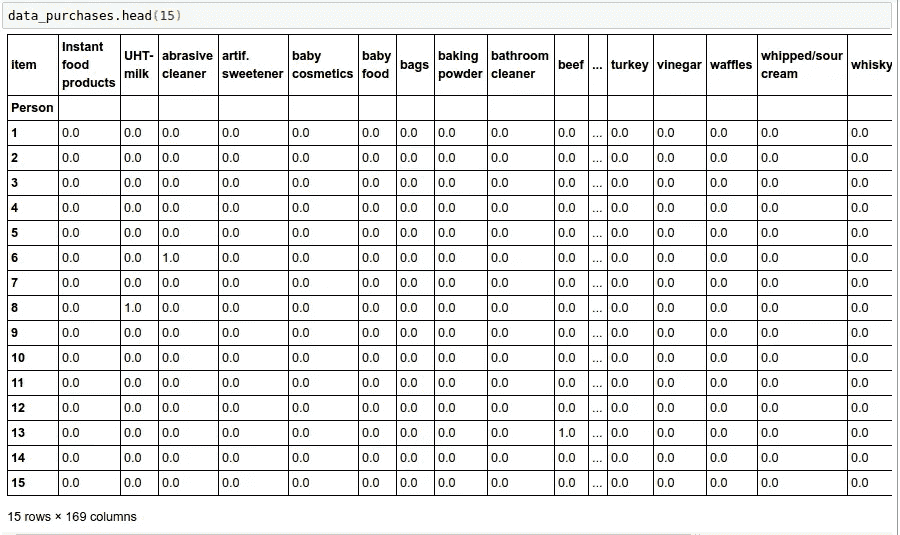
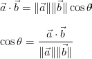
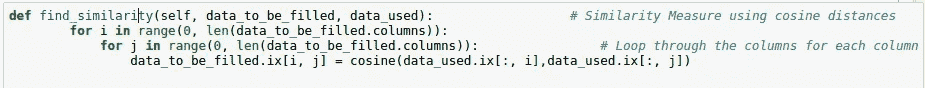
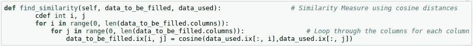

# 使用协同过滤为推荐系统创建 Python 分发模块。

> 原文：<https://medium.com/analytics-vidhya/creating-a-python-distribution-module-for-recommender-systems-using-collaborative-filtering-a61a618d9d9b?source=collection_archive---------15----------------------->

无论是亚马逊上的“推荐给你”部分，还是网飞上的“你可能喜欢的其他电影”类别，我们经常会浏览这些推荐，并惊喜地发现我们正在寻找的商品或电影符合我们的口味。那么，他们是怎么做到的呢？两个词，推荐系统。

通过考虑用户的品味和偏好来自动推荐以确保向他们呈现最相关的项目的系统是推荐系统。换句话说，推荐系统的目标是为用户匹配最有可能被他们使用的产品和服务。

随着我们可以获得的服务和产品的数量呈指数级增长，对定向广告的需求也越来越大。进入推荐系统。由于这些系统的服务会被一次又一次地需要，我认为为推荐者创建一个包将是一个明智的项目。本文介绍了我使用协同过滤构建推荐系统并将其打包到 Python 分发模块中所采用的准则。最后，我还将分享实现这一目标的其他技术。

## 第 1 部分-构建推荐器:

我从理解协同过滤的真正含义开始。

**协同过滤:**

协同过滤算法通常通过搜索一大群用户并找到一个与被推荐的特定用户口味相似的较小集合来工作。它会查看他们喜欢的项目集合，并将它们组合在一起，创建一个经过排序的建议列表。

协作过滤的一个很好的例子是亚马逊。亚马逊跟踪其所有购物者的购买习惯，当我们登录该网站时，它使用这些信息来推荐我们可能喜欢的产品。

两种风格的协同过滤是**基于项目的过滤**和**基于用户的过滤**。基于商品的通过查找挑选了该商品的其他人来列出相似的商品，并建议他们购买的其他商品，而基于用户的通过挑选商品的种类来查找相似的用户，并建议那些用户已经挑选的其他商品。有几种不同的方法可以找到相似性，我会在这篇文章中介绍一些。

> 需要明确的是，
> *基于物品的是“喜欢这个物品的人也喜欢……”
> *基于用户的是“和你相似的人也喜欢……”

我已经尝试在我的推荐器中实现这两种方法。

第二步是找出我想要使用的数据结构。我发现了高性能的 Pandas 库，该库用于 Python 中高效、方便的数据分析和操作。Pandas 易于学习，并且很好地利用了我们的系统所提供的并行性。

要了解更多关于熊猫图书馆的信息，可以看看 YouTube 上的视频讲座系列，名为 Alfred Essa 的 [Python 熊猫食谱](https://www.youtube.com/watch?v=eRpFC2CKvao&list=PLyBBc46Y6aAz54aOUgKXXyTcEmpMisAq3)，或者参考[熊猫 10 分钟](http://pandas.pydata.org/pandas-docs/stable/10min.html)(免责声明:可能会比这个时间长一点)。

我使用 Dataframes(一个熊猫对象)来存储和操作我的数据集(用户和他们购买的各种杂货的定制数据集)。因为我选择了一个简单的数据集，所以我使用了**余弦相似度**来寻找项目间和用户间的相似度。

这是包含我的数据的数据帧的一部分。用户购买的每件商品都有一个 1。

**余弦相似度:**

两个向量之间的余弦相似性是计算它们之间角度的余弦的度量。这个度量是方向的度量，而不是大小，所以我们看向量之间的角度。

结果相似度的范围从 1 表示完全相反，到 1 表示完全相同，0 表示正交(去相关)，中间值表示中间相似或不相似。

除了余弦相似性，还有其他方法来寻找相似性。还有**欧几里德距离**，取向量之差，平方，相加，然后取和的平方根。如果你有一个可能有偏见的数据集，例如一个电影评级数据集，其中一些评论家可能比其他人更严厉，那么你可以选择一个更复杂的相似性，称为**皮尔逊相关分数**，它将你的数据标准化。根据你希望建立什么样的推荐系统，你可以选择你的标准。

在基于项目的过滤中，我使用余弦相似性来寻找项目之间的相似性，将我的数据框架中的每一列作为一个向量(即，哪些消费者购买了特定的项目)。我创建了一个新的 item v.s item 数据帧来存储相似性值。通过按相似性降序排列项目，我可以获得与给定项目最相似的项目。瞧啊。基于项目的推荐器已经可以使用了！

另一方面，在基于用户的过滤中，我通过将数据帧中的每一行作为一个向量(即消费者购买的所有商品)来发现用户之间的相似性。然后，针对每一个用户，我列出了前 5 个相似用户购买的最相似的物品作为推荐。

我的推荐系统已经准备好了！

## 第 2 部分——使用 Cython 进行优化:

在尝试寻找不同的优化技术时，我发现了一个非常强大的工具——cy thon，它可以让我方便地将 Python 的简单性与 Python 的惊人速度结合起来。一些基准测试表明，Cython 甚至被证明优于 c。

要获得关于这种奇妙语言的更多见解，请访问此[页面](http://kilon.blogspot.in/2010/02/cython-probably-best-programming.html)。

当您将 Python 代码转换为 Cython 时，编译器会将您的 Cython 代码转换为极其高效的 C 代码，这是加速的原因。

为了将我的 Python 代码转换成 Cython，首先，我定义了我在 for 循环中使用的变量类型。

在 Cython 之前

赛森之后

添加一行代码来定义我的循环变量导致了令人难以置信的 15 倍加速。这是因为在 Cython 之前，循环中使用的变量仍然是 Python 对象，C 代码必须在 Python 对象和 C 整数之间进行转换。通过使用 cdef 关键字，我明确地告诉 Cython 使用 C 变量类型而不是 Python 对象，从而消除了转换。

## 第 3 部分-包装:

因为我创建了一个包用作分发模块，所以我意识到必须跟上 Python 社区所期望的标准。我将我的代码参数化，并确保它符合 [PEP8 标准](https://www.python.org/dev/peps/pep-0008/)。

我想象了我希望别人如何使用我的模块，并相应地设计了它。数据集的输入格式、想要哪种过滤(基于项目还是基于用户)、他们是想要所有用户的推荐还是一次只想要一个用户的推荐、每个用户需要多少推荐等等，都是我在创建我的模块时记住的一些特性。

一旦我完成了，实际上打包代码是一件轻而易举的事。我使用 Distutils 来创建我的模块。你可以在这里找到使用 Distutils [创建一个包的步骤。](https://docs.python.org/2/distutils/introduction.html#concepts-terminology)

因为我打算真正地“分发”我创建的包，所以我必须将我的包上传到 Python 包索引(PyPi ),这是一个由全世界的开发人员创建的所有这样的分发模块的存储库。我需要在 PyPi 上注册，然后我就可以上传我的包给其他人下载、安装和使用。这里有一个[链接](https://docs.python.org/2/distutils/packageindex.html)，可以让你轻松完成这个任务。

## 第 4 部分-扩展:

在这个项目的基础上，我想尝试扩展我的推荐器，使其能够接受评级(比如电影)，然后使用单值分解进行分解，并使用特征来寻找相似之处。为了进一步优化，我将尝试并实现[交替最小二乘法](http://bugra.github.io/work/notes/2014-04-19/alternating-least-squares-method-for-collaborative-filtering/)方法。

也许我会尝试一种完全不同的方法，使用极其高效的 [ItemtoVec](https://arxiv.org/abs/1603.04259) 技术，类似于 WordtoVec(也称为负采样跳过图-SGNS)。

此外，我将使用 [Python Wheels](http://lucumr.pocoo.org/2014/1/27/python-on-wheels/) 创建一个发行版，而不是我目前使用的 Eggs。