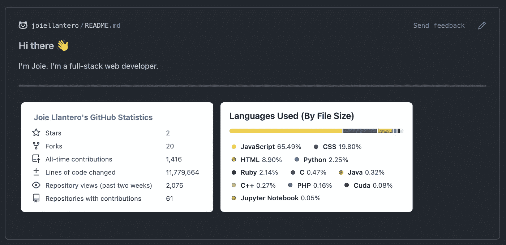
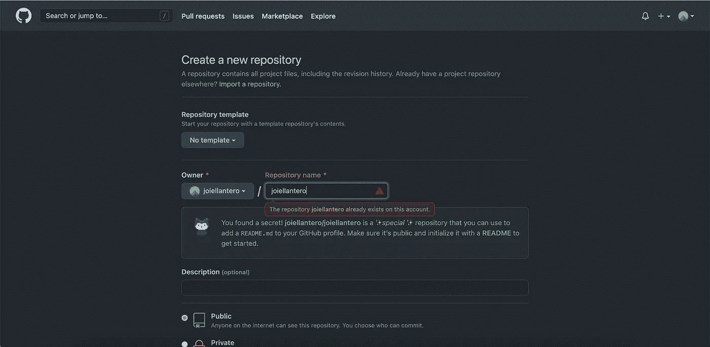
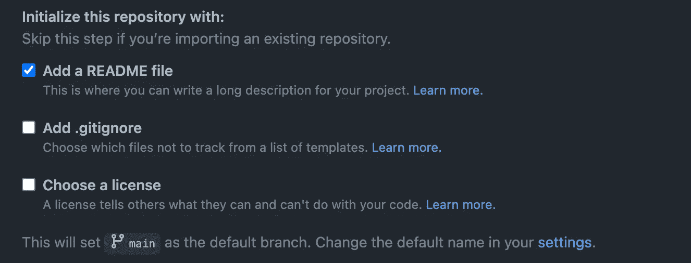
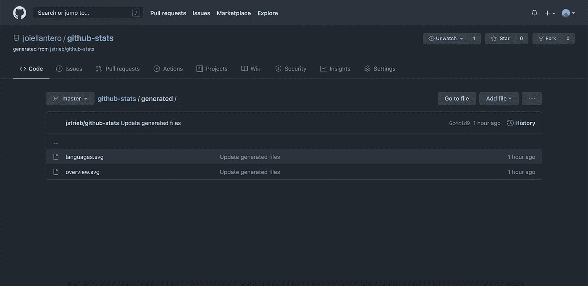
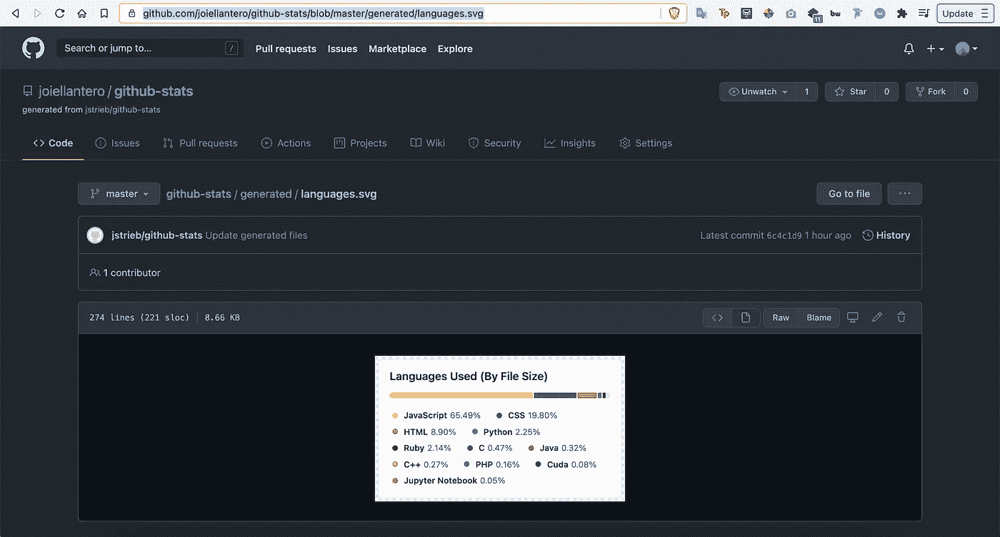

# 如何为你的 GitHub 档案创建一个带有统计数据的自述文件？

> 原文：<https://medium.com/analytics-vidhya/creating-a-readme-with-statistics-for-your-github-profile-dcf1647e978e?source=collection_archive---------8----------------------->


Caleb White 在 Unsplash 上拍摄的照片。

所以你注意到一些 GitHub 帐户在他们的个人资料上有统计数据，并想知道他们是如何做到的。在本文中，您将了解为您自己的个人资料创建一个是多么容易。

2020 年末，GitHub 发布了一项新功能，允许用户为自己的个人资料创建一个自述文件。这份文件非常有用，尤其是在推销自己的时候。你可以介绍你自己、你的工作、技能、经历等等。

有些人还把他们的 GitHub 统计数据，我会在这篇文章中告诉你如何做。

将显示的统计数据将是您的 GitHub 帐户的概览。它应该显示信息，如总星级，叉，仓库的意见，你使用的语言，等等。



GitHub 用户资料的示例 README.md

让我们从学习如何创建一个显示在您的个人资料中的自述文件开始。

# 创建您的 GitHub 配置文件的 README.md

1.  转到这个[链接](https://github.com/new)来创建一个新的 GitHub 库。
2.  使用您的用户名作为这个库的名称，就像我在下图中所做的那样。



请注意，GitHub 正在警告我，因为我已经为自述文件创建了自己的存储库。在您的情况下，文本框的右侧应该有一个绿色的复选标记。

3.使用自述文件初始化新的存储库。



4.GitHub 会自动将这个自述文件的内容生成如下所示的内容。

```
### Hi there 👋<!--
**joiellantero/joiellantero** is a ✨ _special_ ✨ repository because its `README.md` (this file) appears on your GitHub profile.Here are some ideas to get you started:
- 🔭 I’m currently working on ...
- 🌱 I’m currently learning ...
- 👯 I’m looking to collaborate on ...
- 🤔 I’m looking for help with ...
- 💬 Ask me about ...
- 📫 How to reach me: ...
- 😄 Pronouns: ...
- ⚡ Fun fact: ...
-->
```

如果你不熟悉 markdown，这里有一些资源供你参考:

*   [什么是降价销售？](https://www.markdownguide.org/getting-started/)
*   [Markdown 基本语法](https://www.markdownguide.org/basic-syntax)

5.根据你的喜好编辑它，不要忘记提交(如果你没有使用 GitHub 的 web 界面，请推送)你的更改！

# **生成您自己的统计数据**

1.  转到此[链接](https://github.com/joiellantero/github-stats)。
2.  遵循 README.md 上的安装说明。
3.  工作流程完成后，转到“生成”文件夹。您将看到如下所示的两个文件。



4.点击它们，复制图片的网址。切记不要用“生”。这是因为我们想要图像的链接，而不是 SVG 代码本身。



5.转到您之前创建的存储库并打开 README.md 文件，因为我们现在将使用您复制的链接显示 SVG。

```
the link you copied for overview.svg here>)
the link you copied for languages.svg here>)
```

在我的例子中，它看起来像这样。

```
)
)
```

6.提交(如果您没有使用 GitHub 的 web 界面，请推送)您的更改并检查您的新 GitHub 配置文件！

7.如果你喜欢这个教程，请与他人分享！

特别感谢 [jstrieb](https://github.com/jstrieb) 创建了 GitHub 统计生成器。