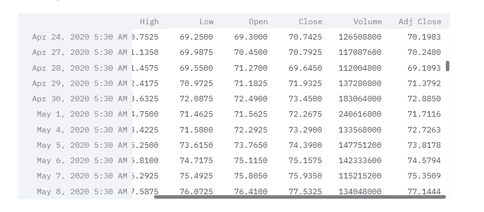
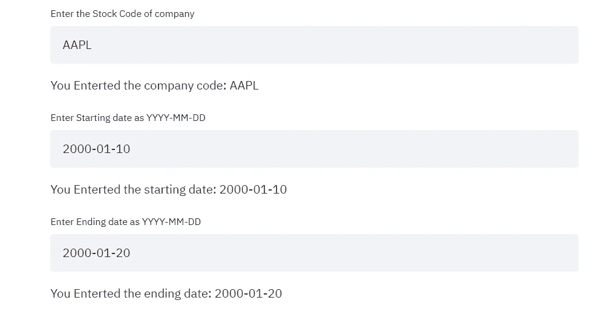
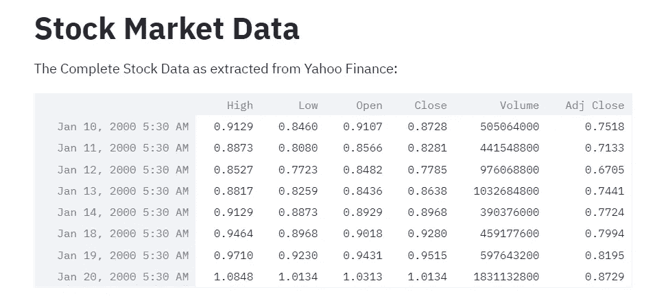
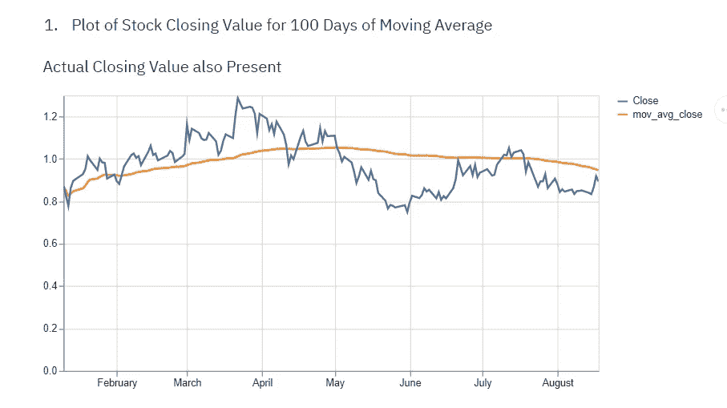

# 用 Python 创建股票市场分析器

> 原文：<https://medium.com/analytics-vidhya/creating-a-stock-market-analyser-in-python-c0284563b197?source=collection_archive---------7----------------------->

## 我们将使用 Streamlit。

Streamlit 可用于用 Python 创建简单易用的 web 应用程序。Streamlit 使 Web 应用程序的开发和部署变得非常容易。查看官方的 streamlit 网站。

[](https://streamlit.io/) [## Streamlit *构建和共享数据应用的最快方式

### Streamlit 可以在几分钟内将数据脚本转化为可共享的 web 应用程序。全部用 Python。全部免费。没有前端经验…

streamlit.io](https://streamlit.io/) 

# 了解一些股票市场术语

在我们开始在 Streamlit 上创建应用程序之前，我们将了解一些股票市场术语。根据 Investopedia 的说法，“股票市场指的是市场和交易所的集合，在这些市场和交易所中，公众持有的公司的股票的购买、出售和发行发生着常规的活动。”

阅读更多-

[](https://www.investopedia.com/terms/s/stockmarket.asp) [## 股票市场|投资媒体

### 股票市场指的是市场和交易所的集合，在这里进行定期的买卖和交易活动

www.investopedia.com](https://www.investopedia.com/terms/s/stockmarket.asp) 

## 股票代码

股票代码定义是股票报价方案中的一个股票项目。每个独特的代码由数字和字母或两者组成。例如，微软在纳斯达克被列为“MSFT”，而国际商业机器公司在纽约证券交易所被列为“IBM”。



股票市场数据示例。

那么，高低指的是给定时间段内的最高价和最低价。开盘价和收盘价是股票在同一时期开始交易和结束交易的价格。成交量是交易活动的总量。调整后的价值是公司行为中的一个因素，如股息、股票分割和新股发行。

[](https://analyzingalpha.com/open-high-low-close-stocks) [## 什么是股票的高开低走？

### 在股票交易中，高点和低点是指给定时间段内的最高价和最低价。打开和关闭是…

analyzingalpha.com](https://analyzingalpha.com/open-high-low-close-stocks) 

# 移动平均线

均线(MA)是技术分析中常用的股票指标。计算股票移动平均线的原因是通过创建一个不断更新的平均价格来帮助平滑特定时间段内的价格数据。

简单移动平均线(SMA)是一种计算方法，采用过去特定天数内一组给定价格的算术平均值；例如，过去 15 天、30 天、100 天或 200 天。

[](https://www.investopedia.com/terms/m/movingaverage.asp) [## 移动平均(MA)定义

### 在统计学中，移动平均线是一种计算方法，用于通过创建一系列平均值来分析数据点

www.investopedia.com](https://www.investopedia.com/terms/m/movingaverage.asp) 

# OHLC 蜡烛棒图

交易者使用蜡烛图来根据过去的模式确定可能的价格变动。烛台在交易时很有用，因为它们在交易者指定的时间内显示四个价格点(开盘价、收盘价、最高价和最低价)。

许多算法都基于蜡烛图中显示的相同价格信息。交易通常受情绪支配，这可以从蜡烛图中看出。

[](https://www.investopedia.com/terms/o/ohlcchart.asp) [## OHLC 海图的定义和用途

### OHLC 图是一种条形图，显示每个时期的开盘价、最高价、最低价和收盘价。OHLC 图表是…

www.investopedia.com](https://www.investopedia.com/terms/o/ohlcchart.asp) 

# 进入代码

首先，我们导入必要的库。一定要在. py 文件中编写代码。

```
import warnings
warnings.filterwarnings('ignore')  # Hide warnings
import datetime as dt
import pandas as pd
pd.core.common.is_list_like = pd.api.types.is_list_like
import pandas_datareader.data as web
import numpy as np
import matplotlib.pyplot as plt
import seaborn as snsfrom PIL import Image
import osfrom mpl_finance import candlestick_ohlc
import matplotlib.dates as mdates
import streamlit as st
```

Pandas datareader 将用于抓取数据。从 mpl_finance，我们将使用蜡烛图。

接下来，我们将获取公司的股票代码，以及股票的开始日期和结束日期。

```
#title
st.title('Stock Market App')
'---------------------------------------------------------'
#text
st.write("Developed by Prateek Majumder")image = Image.open(os.path.join('STOCK.png'))
st.image(image)com = st.text_input("Enter the Stock Code of company","AAPL")'You Enterted the company code: ', comst_date= st.text_input("Enter Starting date as YYYY-MM-DD", "2000-01-10")'You Enterted the starting date: ', st_dateend_date= st.text_input("Enter Ending date as YYYY-MM-DD", "2000-01-20")'You Enterted the ending date: ', end_date
```

接下来，我们将使用 pandas_datareader.data 从 Yahoo Finance 收集股票市场数据。

```
df = web.DataReader(com, 'yahoo', st_date, end_date)  # Collects data
df.reset_index(inplace=True)
df.set_index("Date", inplace=True)
```

接下来，我们将绘制一些从雅虎财经获得的数据。

```
#title
st.title('Stock Market Data')'The Complete Stock Data as extracted from Yahoo Finance: '
df'1\. The Stock Open Values over time: '
st.line_chart(df["Open"])'2\. The Stock Close Values over time: '
st.line_chart(df["Close"])
```

请注意，在代码中，我给出了 AAPL(苹果)和样本日期，这些可以在应用程序 GUI 中修改。



用于数据输入的 GUI。



数据来自雅虎财经。

接下来，我们编码显示移动平均线。

```
mov_avg= st.text_input("Enter number of days Moving Average:", "50")'You Enterted the Moving Average: ', mov_avgdf["mov_avg_close"] = df['Close'].rolling(window=int(mov_avg),min_periods=0).mean()'1\. Plot of Stock Closing Value for '+ mov_avg+ " Days of Moving Average"
'   Actual Closing Value also Present'
st.line_chart(df[["mov_avg_close","Close"]])df["mov_avg_open"] = df['Open'].rolling(window=int(mov_avg),min_periods=0).mean()'2\. Plot of Stock Open Value for '+ mov_avg+ " Days of Moving Average"
'   Actual Opening Value also Present'
st.line_chart(df[["mov_avg_open","Open"]])
```

它看起来有点像这样。



移动平均线。

现在，我们做 OHLC 蜡烛棒图的代码。

```
ohlc_day= st.text_input("Enter number of days for Resampling for OHLC CandleStick Chart", "50")# Resample to get open-high-low-close (OHLC) on every n days of data
df_ohlc = df.Close.resample(ohlc_day+'D').ohlc() 
df_volume = df.Volume.resample(ohlc_day+'D').sum()df_ohlc.reset_index(inplace=True)
df_ohlc.Date = df_ohlc.Date.map(mdates.date2num)# Create and visualize candlestick charts
plt.figure(figsize=(8,6))'OHLC Candle Stick Graph for '+ ohlc_day+ " Days"ax1 = plt.subplot2grid((6,1), (0,0), rowspan=5, colspan=1)
ax1.xaxis_date()
candlestick_ohlc(ax1, df_ohlc.values, width=2, colorup='g')
plt.xlabel('Time')
plt.ylabel('Stock Candle Sticks')
st.pyplot()
```

其他代码和图像可以添加到 webapp 中，以创建更好的体验和更好的理解。

运行 streamlit 应用程序。

```
streamlit run [filename]
```

更多阅读:[https://docs.streamlit.io/en/stable/](https://docs.streamlit.io/en/stable/)

# 在 Heroku 部署的应用程序:

该应用程序也可以部署为 heroku 上的实时应用程序。为此，我们需要添加—

procfile，requirements.txt，runtime.txt，setup.sh。

更多阅读:【https://devcenter.heroku.com/articles/python-pip 

**在我的 Github 页面查看完整项目:**

[](https://github.com/prateekmaj21/Stock-Market-Analyser) [## prateekma 21/股票市场分析器

### 使用流文学制作的项目。输入公司股票代码和开始和结束日期，从雅虎获得股票数据…

github.com](https://github.com/prateekmaj21/Stock-Market-Analyser) 

**请查看实时部署的链接:**

 [## 细流

### 编辑描述

stock-market-analyser.herokuapp.com](https://stock-market-analyser.herokuapp.com/) 

**请务必在 Linkedin 上联系我:**

[](https://www.linkedin.com/in/prateek-majumder/) [## Prateek Majumder -分析师- applex.in | LinkedIn

### IEM 加尔各答大学的本科生。我一直是微软学生合作伙伴计划的一部分，这是一个…

www.linkedin.com](https://www.linkedin.com/in/prateek-majumder/) 

## 谢谢你。