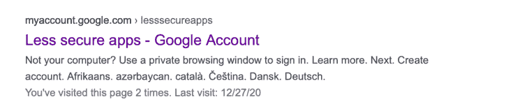
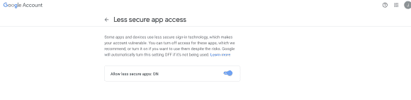
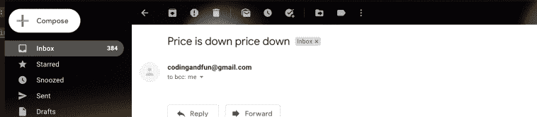

# 用 Python 创建股票价格跟踪器

> 原文：<https://medium.com/analytics-vidhya/creating-a-stock-price-tracker-with-python-6c68035b98bd?source=collection_archive---------7----------------------->

## 构建一个 Python 脚本，在你最喜欢的股票价格下跌时向你发送电子邮件。

在这个故事中，我们将使用 Python 创建一个**股票价格跟踪器。也就是说，每当特定股票的价格低于我们的估价阈值时，Python 脚本就会向我们发送一封电子邮件。**


巴拉克·K 在 Pexels.com[拍摄的照片](https://www.pexels.com/photo/space-grey-ipad-air-with-graph-on-brown-wooden-table-187041/)

# 苹果股票价格跟踪器

为了用 Python 构建**股票价格跟踪器，我们将跟踪苹果的价格。当价格低于预定义的阈值时，脚本会向我们的 Gmail 帐户发送一封电子邮件，让我们知道价格下降。**

这在**我们已经为一只股票**设定了目标价格，并且我们希望在价格跌至该水平时得到通知的情况下特别有用。

我会把下面的代码放在一块。这样做的原因是代码相当简单。我们将使用 *financialmodelingprep* 来请求我们想要跟踪的股票的实时报价。本例中，*苹果*。**请注意**您需要注册 [financialmodelingprep](https://financialmodelingprep.com/developer/docs/pricing/codingAndFun/) 才能获得每月最多 250 个免费 API 请求的 API 密钥。

然后，我们将最新的股票价格与我们的价格阈值进行比较。在本例中，我定义了 140 美元的股票价格阈值。

如果苹果的股价低于 140 美元，我们将触发发送电子邮件功能，向给定的帐户发送电子邮件。在下一节中，我将解释如何构建这样的函数。

# 构建发送电子邮件功能

发送电子邮件功能是我们配置代码向我们发送电子邮件的地方。为了实现这一点，我们将使用库 [smtplib](https://docs.python.org/3/library/smtplib.html) 。

使用 Smtplib，我们将:

*   创建 SMTP 连接
*   定义我们的消息、主题和收件人
*   并发送电子邮件

下面的代码遵循 smtplib 文档创建连接并启动服务器。由于这是一个有点技术性的问题，我不会在这个故事中详细介绍 SMTP 连接是如何工作的。您可以查看文档以了解更多信息。

重要的是**在 object*server . log in(‘你的 Gmail’，‘你的密码’)*内传递你的 Gmail 账户和 Gmail 密码**。在代码中，我的 Gmail 密码存储在*密码*变量中。

在 **server.sendmail 中，**我们传递电子邮件和消息的收件人(即 msg)。

为了让发送电子邮件功能发挥作用，**我们需要去谷歌并激活我们账户中的*不太安全的应用访问*** 。否则，Gmail 不会让 Python 代表你发邮件。要激活不太安全的应用程序访问，谷歌*不太安全的应用程序访问*并打开下面的链接。



然后，确保以下选项被标记为 on:



为了完成 Python 脚本，我们简单地包含了一个 *while 循环*来确保**脚本不间断地运行**(你可以通过按 ctrl/cmd + c 来停止脚本)。这将确保 Python 每 10 分钟检查一次苹果公司的股票价格，看看股票价格是否有变动。这是通过行 *time.sleep(600)* 实现的。

当我们运行代码时，股票价格低于 140 美元，我们将在 Gmail 帐户中收到一封电子邮件:



要查看运行中的代码，请随意观看下面的视频:

# 包扎

只需几行代码，我们就可以构建一个脚本，在我们最喜欢的股票价格下跌到预定水平时向我们发送电子邮件。

您可以进一步改进代码。例如，同时跟踪多只股票的价格。或者，你可以根据退货发送电子邮件，而不是根据价格发送电子邮件。

```
import requests
import smtplib 
import time

api_key = 'asdfadsf adsf af'
password= 'tesasdfdsafads' 

def send_mail(password):
  server = smtplib.SMTP('smtp.gmail.com', 587)
  server.ehlo()
  server.starttls()
  server.login('codingandfun@gmail.com',password)
  subject= 'test'
  body = 'price down'

  msg= f'subject: {subject} {body}'

  server.sendmail(
  'codingandfun@gmail.com',
  'codingandfun@gmail.com',
  msg
  )
  print('email is sent')
  server.quit()

def price_tracker(api_key,password):
  prices = requests.get(f'https://financialmodelingprep.com/api/v3/quote/AAPL?apikey={api_key}').json()
  stockPrice = prices[0]['price']
  print(stockPrice)
  if stockPrice < 140:
    send_mail(password)

#run evrey 10 minutes
while(True):
  price_tracker(api_key,password)
  time.sleep(600)
```

**注意**:所有帖子和视频仅用于教育目的。我们不提供财务建议。此外，我们不建议您买卖任何股票。您有责任在投资或交易任何证券之前进行尽职调查。

*原载于 2021 年 1 月 2 日 https://codingandfun.com*[](https://codingandfun.com/creating-a-stock-price-alert-with-python/)**。**