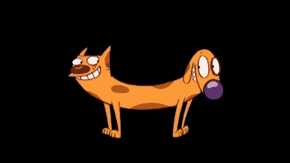
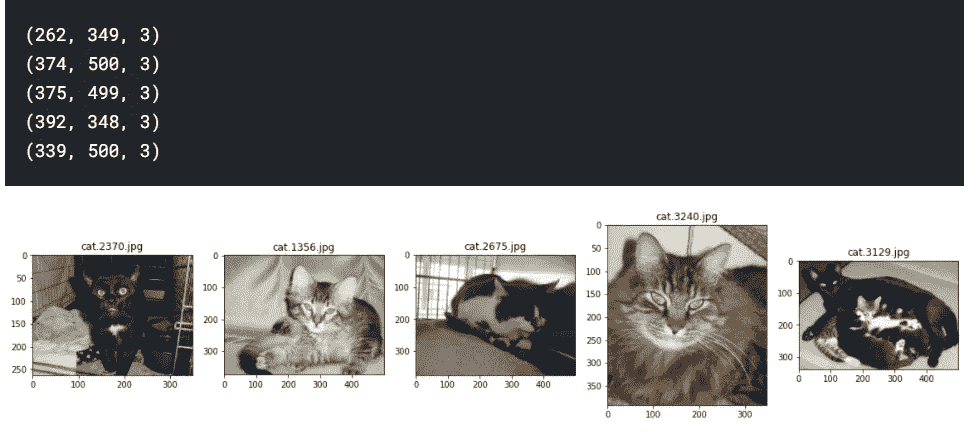
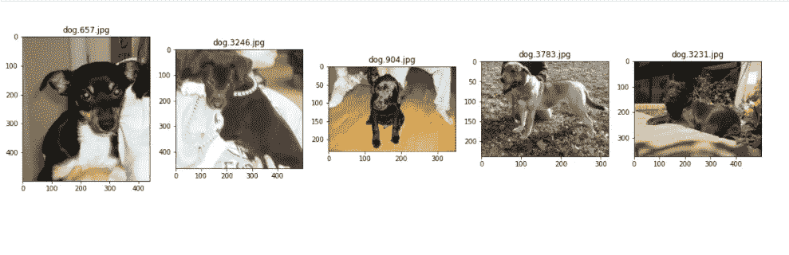
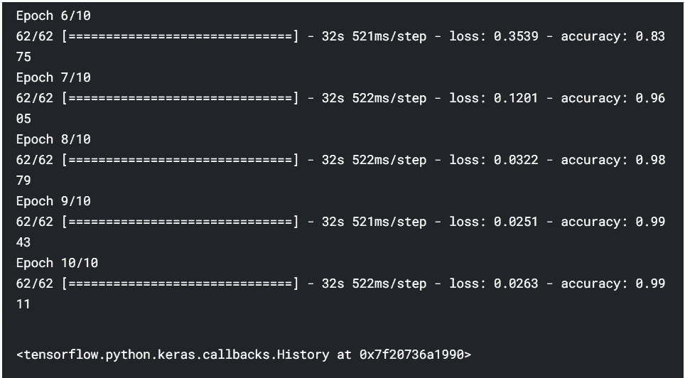
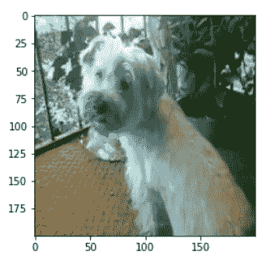

# 使用 TensorFlow 和 Streamlit 创建和部署猫狗图像分类器-第 1 部分

> 原文：<https://medium.com/analytics-vidhya/creating-and-deploying-a-cat-dog-image-classifier-using-tensorflow-and-streamlit-part-1-2672fc184601?source=collection_archive---------1----------------------->

一切都是从一个天真的问题开始的。我是看着很多卡通片长大的，包括 Nickelodeon 的喜剧节目《猫狗》。这个节目是基于一对双胞胎，他们分别是一只猫和一只狗(当我解释的时候听起来很傻，但是嘿，那时候我还是个孩子！)

[](https://www.imdb.com/title/tt0154061/) [## 《猫狗》(电视剧 1998-2005)——IMDb

### 一只猫和一只狗的生活和时代有一个独特的转折:它们是联系在一起的。他们和狗共用一个身体…

www.imdb.com](https://www.imdb.com/title/tt0154061/) 

我试图回答的问题是:“如果我构建一个图像分类器，它会将我心爱的卡通人物分类为猫还是狗？”。在本文中，我们将回顾这个有趣项目的一些步骤，并回答我的问题:它是一只猫还是一只狗？

**入门:**

假设——本博客涵盖的材料假设读者对 python 有中级理解，并对 ML 概念有基本了解。

[](https://www.kaggle.com/tongpython/cat-and-dog) [## 猫和狗

### 训练 DL 模型的猫狗数据集

www.kaggle.com](https://www.kaggle.com/tongpython/cat-and-dog) 

我从 Kaggle 上的一个数据集开始，它允许我在猫和狗的多个图像上训练我的模型。这是一个中等大小的数据集，分别有 4000 幅猫和狗的图像用于提供训练。尽管考虑到训练我们网络的样本量较小，这不是最好的数据集，但它是一个很好的起点。更多关于我后来如何处理较小的尺寸…

让我们从观察一些图像开始，以便对这个项目有一个概念。这项练习不仅能让我们查看图像数据，还能让我们在举重前热身

**基本库在**前加载-

```
import pandas as pd
import numpy as np
import os
import tensorflow as tf
import cv2
from tensorflow import keras
from tensorflow.keras.models import Sequential, Model
from  matplotlib import pyplot as plt
import matplotlib.image as mpimg
import random
%matplotlib inline
from matplotlib import image
from matplotlib import pyplotimport PIL
print('Pillow Version:', PIL.__version__)

from PIL import Image
```

**开始接触一些猫狗-**

```
plt.figure(figsize=(20,20))
test_folder=r'/kaggle/input/cat-and-dog/training_set/training_set/cats'
for i **in** range(5):
    file = random.choice(os.listdir(test_folder))
    image_path= os.path.join(test_folder, file)
    img=mpimg.imread(image_path)
    print(img.shape)
    ax=plt.subplot(1,5,i+1)
    ax.title.set_text(file)
    plt.imshow(img)
```



同样，对于狗，结果如下-



这里需要注意的一点是，每个图像都有自己的维度。从这个观察中得到的一点是，我们需要固定图像的维度，以便我们可以在 CNN 中建立一个流线型的连续张量(矩阵的矩阵)。在这个例子中，我将尺寸固定为(200，200)

**数据摄取和处理**

```
IMG_WIDTH=200
IMG_HEIGHT=200
img_folder='/kaggle/input/cat-and-dog/training_set/training_set/'

def create_dataset(img_folder):

    img_data_array=[]
    class_name=[]

    for dir1 **in** os.listdir(img_folder):
        print("Collecting images for: ",dir1)
        for file **in** os.listdir(os.path.join(img_folder, dir1)):

            image_path= os.path.join(img_folder, dir1,  file)
            image= cv2.imread( image_path, cv2.COLOR_BGR2RGB)
            try:
                image=cv2.resize(image, (IMG_HEIGHT, IMG_WIDTH),interpolation = cv2.INTER_AREA)
            except:
                break
            image=np.array(image)
            image = image.astype('float32')
            image /= 255 
            img_data_array.append(image)
            class_name.append(dir1)
    return img_data_array, class_name
*# extract the image array and class name*
img_data, class_name =create_dataset('/kaggle/input/cat-and-dog/training_set/training_set/')
```

这里有很多东西要讲。让我们从基础开始:我们需要确保图像被作为数据处理，每个图像都有相同的高度和宽度，并且在调整大小的过程中图像质量没有被放弃。最后，我们需要整理那些图像(收集像素数据，咄！)放入一个大数组中，供我们的神经网络使用！

我会讲一些可能会引起你注意的事情-

```
CV- OpenCV; an open source library for computer vision operations and algorithmscv2.imread-This method loads an image from a destinationcv2.COLOR_BGR2RGB- OpenCV reads images in BGR (Blue Green Red) colorspace ordering and we have to convert it back to RGB (Red Green Blue)cv2.INTER_AREA- This method resizes the image. We need to ensure that the aspect ratio is maintained while image manipulations. Ene quick thumbrule to follow is this-
If you are **enlarging** the image, you should prefer to use *INTER_LINEAR* or *INTER_CUBIC* interpolation. If you are **shrinking** the image, you should prefer to use *INTER_AREA* interpolation.image.astype('float32') - For all weights and neuron activations, if you are using a method based on backpropagation for training updates, then you need a data type that approximates real numbers, so that you can apply fractional updates based on differentiation. Best weight values are often going to be fractional, non-whole numbers. Non-linearities such as sigmoid are also going to output floats. So after the input layer you have matrices of float values anyway. Hence, We need to ensure here that the tensors are read as floats valuesimage /= 255 - normalizing our input so that images are scaled between 0 and 1 (max pixel value is 255).
```

有一次，我为猫和狗准备了数组，是时候准备输出变量 0 和 1 了。我给狗选 1，给猫选 0(我只是更喜欢狗，仅此而已)

```
def dog_cat_mapping(a):
    if a=="dogs":
        return 1
    else:return 0
class_name=list(map(dog_cat_mapping,class_name))
class_name=np.array(class_name)
```

**模型构建**

最后，我建立了模型。我不会详细讨论卷积层是如何工作的，因为它需要几(千)页以上的内容！

```
def model():
    from tensorflow.keras.models import Sequential
    from tensorflow.keras.layers import Dense, Conv2D, Dropout, Flatten, MaxPooling2D
    model=Sequential()
    model.add(Conv2D(28, kernel_size=(3,3), input_shape=input_shape,activation='relu'))
    model.add(Conv2D(64, kernel_size=(3,3),activation='relu'))
    model.add(MaxPooling2D(pool_size=(2,2)))
    model.add(Conv2D(128, kernel_size=(2,2),activation='relu'))
    model.add(Conv2D(128, kernel_size=(2,2),activation='relu'))
    model.add(Flatten())
    model.add(Dense(256,activation='relu'))
    model.add(Dropout(0.2))
    model.add(Dense(1,activation='sigmoid'))
    return model
```

这里需要注意的重要一点是，你可以在图层上设置任意数量的滤镜。我选择了 28、64、128 和 256，因为这些都是标准配置。此外，我决定使用 3*3 和 2*2 大小的特征地图。这些只是我们提取输入图像特征的过滤器。

一旦卷积操作完成，我们就可以开始并展平该层，以将数据输入到我们的神经网络中。我选择了 0.2 的 dropout，这意味着一些数量(20%)的层输出被随机忽略或者“*被丢弃*”这可以防止过度拟合。

最后，使用 sigmoid 函数来判断输入是猫(0)还是狗(1)。

**模型编译和评估**

模型编译花了很长时间。为了加快这个过程，我强烈建议切换到 Kaggle 的 GPU 模式。

```
model=model()
model.compile(optimizer='adam', 
              loss='binary_crossentropy', 
              metrics=['accuracy'])
model.fit(x=img_data,y=class_name, epochs=10)
```

仅仅用了 10 个纪元，我就能够达到 99%的训练准确率。请注意，这里没有什么可变通的，在 8000 个样本大小的数据集上达到 99%的准确率只是表明我们的模型过度拟合了数据。



这种准确性也应该有所保留，因为训练准确性取决于我们神经网络中的初始权重分配(这是完全随机的)。如果我重新开始这个过程，我可以达到 80%的准确率，而不是 99%(因为初始权重很低)

**结束的想法和进一步的步骤**

测试准确度不是很高(这并不奇怪)。我能够在一个测试数据集上达到大约 61%的准确率。至少这是个好的开始。我们的模型可以对猫和狗进行基本分类。然而，当它遇到这样的品种时，它就会遇到麻烦



模型将其归类为“猫”

> 接下来，我们将尝试将“迁移学习”纳入我们的模型。此外，我们将能够得到我们最初的问题的答案，“我心爱的卡通人物是一只猫还是一只狗？”

在这里找到本系列[的**第二部**。请在下面留下你的想法和评论。只有好心情！](https://sakshamgulati123.medium.com/creating-and-deploying-a-cat-dog-image-classifier-using-tensorflow-and-streamlit-part-2-90159563e1e9)

请在我的笔记本下面找到-

[Kaggle 链接](https://www.kaggle.com/sakshamgulati/catdog/edit/run/66891234)

[GitHub 代码](https://github.com/sakshamgulati/Kaggle/blob/master/CatDog.ipynb)