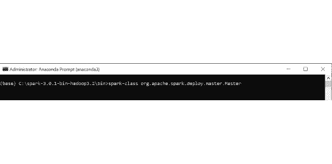
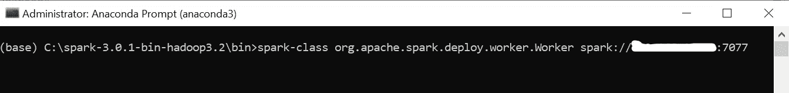

# 在 Windows 上使用创建 Apache Spark 独立集群

> 原文：<https://medium.com/analytics-vidhya/creating-apache-spark-standalone-cluster-with-on-windows-95e66e00a2d8?source=collection_archive---------4----------------------->

Apache Spark 是一个强大、快速且经济高效的工具，用于解决大数据问题，具有 Spark Streaming、Spark SQL 和 Spark MLlib 等组件。因此，Spark 就像大数据世界的瑞士军刀。

此外，Spark 还有另一个非常重要的特性，即水平缩放。换句话说，Spark 支持独立(部署)集群模式。单个 Spark 集群有一个主节点和任意数量的从节点或工作节点。工人可以在独立机器上的水平 Spark 集群上运行他们自己的单个流程，也可以在同一台机器上进行垂直扩展。


我们可以手动启动一个独立的集群，也可以使用 Spark 提供的启动脚本(sbin 文件夹)。此外，我们还可以在一台机器上创建和运行集群，用于测试目的。

今天，我将尝试向您展示如何创建一个包含 1 个主节点和 2 个从节点的 single Spark 独立集群。我将为此集群使用 2 台不同的机器。我将使用第一个创建我的主节点和 1 个从节点，第二个创建另一个从节点。因此我们将有一个独立的集群和一个单一的机器集群。

# 先决条件

要创建 Spark 独立集群，我们必须在集群的每个节点上安装编译版本的 Apache Spark 和 Python，还必须在每台机器上安装 Java JDK。在每台机器上安装相同的版本也非常重要。

安装完成后，我们需要在主机中编辑 spark-env.sh.template 和 slaves.template 文件。首先打开 spark *conf* 文件夹，创建 spark-env.sh.template 的副本，重命名为“spark-env.sh”。然后编辑以下参数；

```
 export SPARK_MASTER_HOST=<MASTER-IP>
 export JAVA_HOME=<Path_of_JAVA_installation>
 export PYSPARK_PYTHON=python3
```

然后打开 spark *conf* 文件夹，创建 slaves.template 的副本，重命名为“slaves”。然后编辑以下参数；

```
<SLAVE01-IP>
<SLAVE02-IP>
```

最后，我们需要创建一个数据文件夹，我们将在 Spark 中使用它来保存我们的数据，在两台机器上使用相同的路径(例如 C:\data)。如果我们的集群上没有 Hadoop HDFS 或者我们没有使用 AWS 实例，我们需要为每个节点创建一个数据文件夹。否则，群集将找不到数据，并会出错。通常情况下，像 HDFS 或 S3 这样的数据库将用于真实世界中的 Spark 集群，但由于我们创建它是为了了解 Spark 独立集群的基础，我们将通过在每台机器中创建一个数据文件夹来演示它。

# 启动集群

完成安装和编辑步骤后，我们现在准备创建我们可爱的😀Spark 独立集群。首先在主机中打开一个终端，移入 Spark 的 bin 文件夹中进行写入；

“spark-class org . Apache . spark . deploy . master . master”命令。



从上面的截图可以看出，我们师傅在“spark:// <master-ip>:7077”成功启动。我们还可以在端口 8080 从 Spark 独立的基于 web 的用户界面监控我们的集群。</master-ip>


你可以很容易地看到，我们仍然没有任何工人，所以现在是时候通过在主机中打开另一个终端来提高我们的第一个工人节点，并写入；

“spark-class org . Apache . spark . deploy . worker . worker spark://<master-ip>:7077”命令。</master-ip>



到目前为止，我们在同一台机器上启动了主节点和一个工作节点。现在让我们从第二台机器启动我们的第二个 Worker 节点。我们将再次打开一个终端，编写与第一个 Worker 相同的命令。

在我们启动第二个 Worker 之后，我们可以从 Spark Standalone 集群的 web ui 监视我们集群的最后情况；


我们设法创建了带有 2 个工作节点的 Spark 独立集群。如你所见，我们的员工有不同大小的内存(6.9 和 14.8 gib)。这是因为两台机器的配置不同。主机有 16 gb 内存，一台有 8 gb 内存。另外，Spark 为每个 Worker 节点使用默认的 1 gb 内存，我们可以稍后在 Pyspark 脚本中更改这一内存。

# 在集群中运行应用程序

我们的 Spark 独立集群已经可以使用了。让我们用一个带有 Jupyter Notebook 的示例 Pyspark 脚本来测试它。我将使用我在上一篇关于 AWS 的文章中使用的同一个例子。唯一的区别是关于创建 Spark 会话。这次我们将在 master method 中写“spark:// <master-ip>:7077”而不是“local”。正如我之前提到的，我将更改 Workers 的内存使用(每个 Worker 和驱动程序 4gb ),并为它们分配核心数。您还可以使用其他选项调整配置，这些选项可以在 [Spark 文档](https://spark.apache.org/docs/latest/configuration.html)中找到。</master-ip>


我们成功地用新的集群运行了我们的查询。最后，我们可以从 Spark UI 网页查看我们的集群，以监控正在运行的应用程序。


我们的 Spark 应用程序(spark-standalone-cluster)在运行时没有任何问题，我们的两个 Workers 按照我们在 SparkSession 中指定的那样为每个 Workers 使用 4 gb 内存。

# 结论

在本文中，我尝试简要介绍了如何使用 Jupyter Notebook 创建和运行 Apache Spark 独立集群。在这个例子中，我们使用了两个工人，您可以使用我在文章中提到的相同方法将其增加到任意数量。您还可以借助 [Spark 文档](https://spark.apache.org/docs/latest/spark-standalone.html)提高对 Spark 独立集群的了解。

我希望这篇文章对你有所帮助。在下一篇文章中，我将讲述如何将 Spark 应用程序与著名的 NoSQL 数据库“MongoDB”集成。

我将很高兴听到您的任何意见或问题。愿数据伴随你！