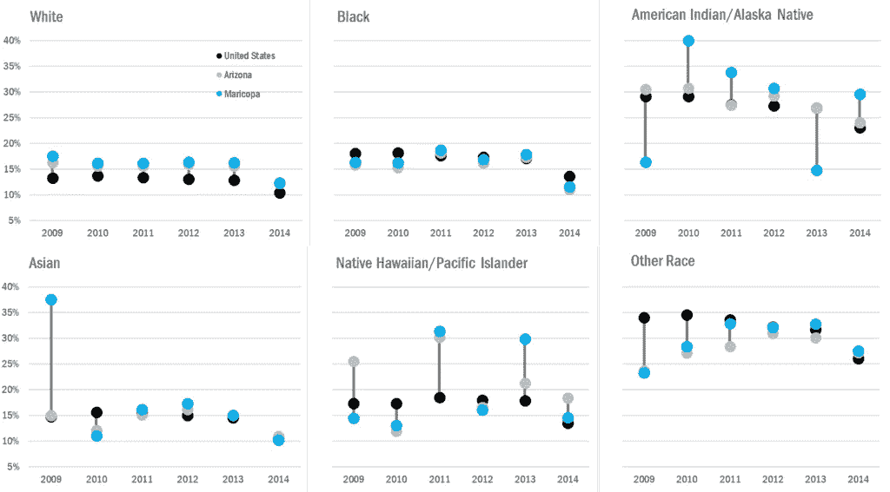
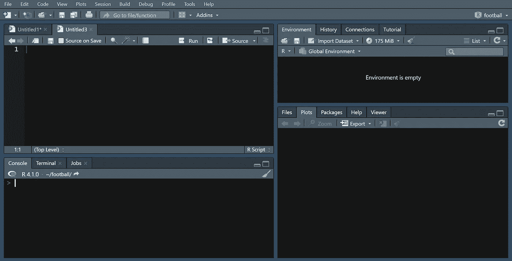
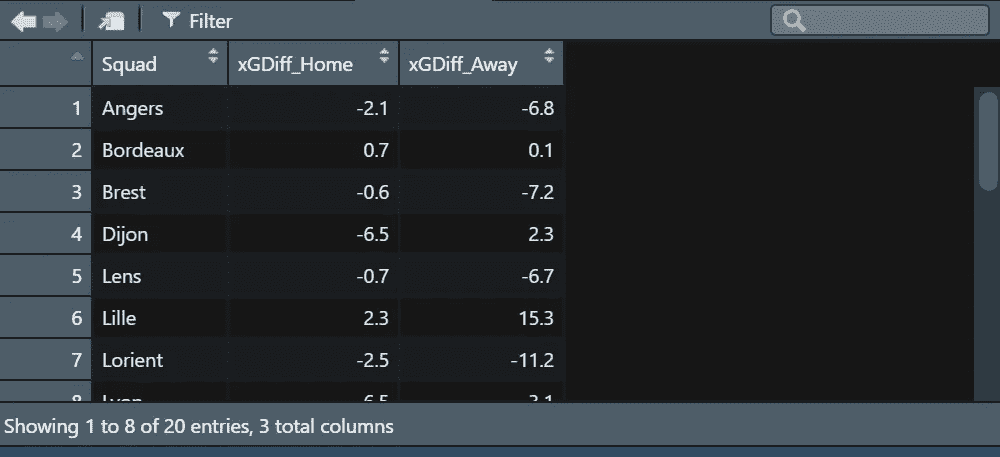
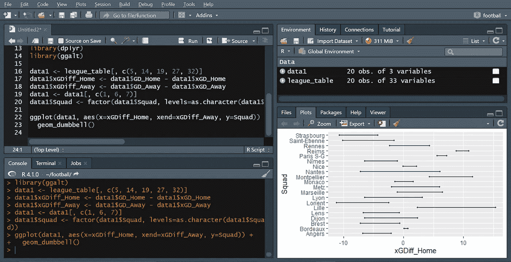
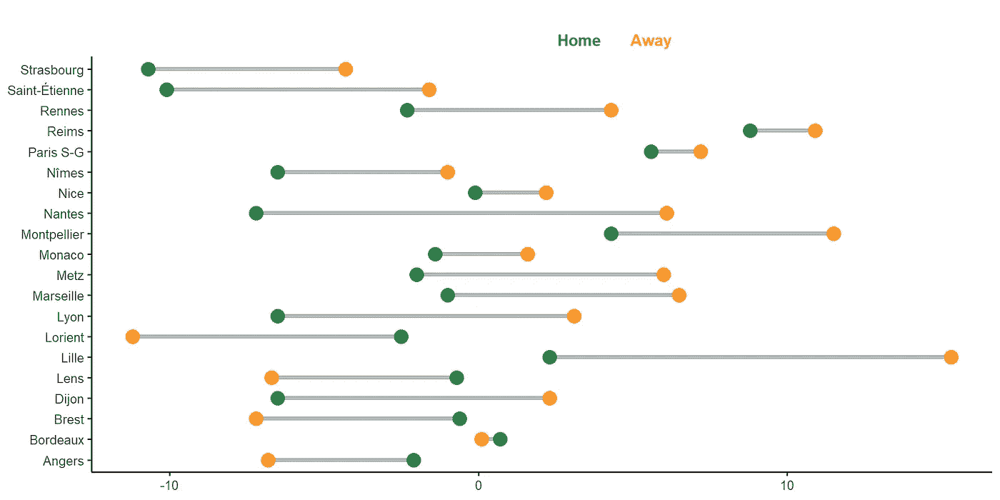
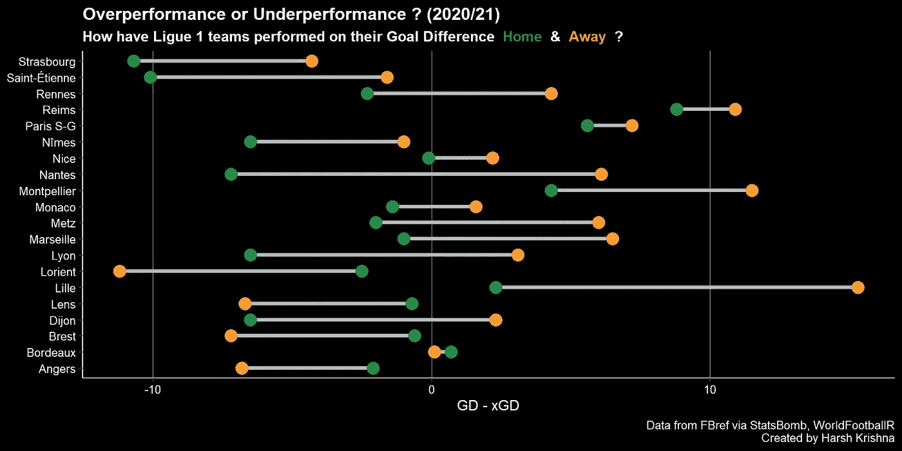
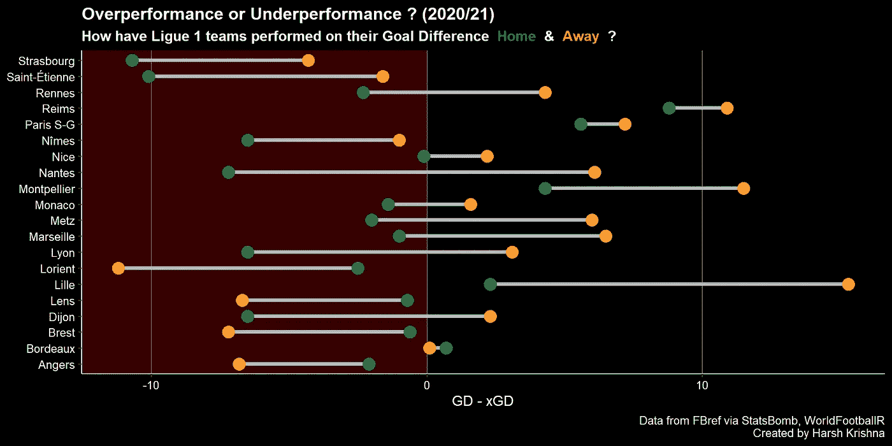

# 在 R 中创建哑铃图

> 原文：<https://medium.com/analytics-vidhya/creating-dumbbell-charts-in-r-547ab863c86b?source=collection_archive---------4----------------------->


剧情看起来有点不同。

## 和其他东西

这是我为 R 编写的第一个教程，我希望在其中处理各种主题，包括创建“哑铃图表”和 R 中的其他内容，这些内容可用于您希望使用 ggplot2 进行的任何可视化。

# R 是什么？

r 是一种编程语言，主要由统计学家用于统计(duh)和图形目的。它可以创建强大的高度可定制的情节。要开始使用 R，[从互联网上下载它的基础版本](https://cran.r-project.org/bin/windows/base/)。现在，基础版本 R 的使用相当麻烦和乏味，因此大多数人使用 IDE(集成开发环境),它是基础 R 的包装，使语言的使用更容易。RStudio 是目前最流行的 IDE，你可以在这里下载。

# 什么是哑铃图？

接下来，让我们来谈谈什么是“哑铃图”以及它们的用处。哑铃图(也可以称为杠铃图)非常适合用来说明变化和比较两组数据点之间的距离。它看起来像一个哑铃，因此得名。



在足球分析领域，它有各种用途，包括显示球队主场和客场表现的差异，这就是我们在本教程中将使用的示例。

既然我们已经有了基本的方法，让我们开始制作图表。

# 获取数据

一旦你打开 RStudio，你会看到类似这样的东西



> 酷提示:如果你想改变你的 RStudio 窗口的外观(像我一样)，你可以通过工具>全局选项>外观。你可以根据自己的喜好改变布局。

现在，图表的数据来自 [FBref](https://fbref.com/en/) 。在将数据读入 R 之前，您可以直接从网站上以 excel 表格的形式提取数据，但这有点繁琐，也没有必要。相反，我们可以使用特定的包将数据导入 RStudio。我们需要做的就是写代码。本例中的包是由 [Jason Zivkovic](https://twitter.com/jaseziv) 创建的 [WorldFootballR](https://jaseziv.github.io/worldfootballR/) 。让我们进入编码部分(pew pew！！)(对不起，我不会再犯了。

Rscript(编写代码的地方)是在右上方的窗格中完成的。

```
install.packages("devtools")
remotes::install_github("JaseZiv/worldfootballR")
library(worldfootballR)
```

> 用 R 写代码时，“”的用法很重要。引号内的部分将与代码的其他部分不同地突出显示。确保不要错过写任何东西(或者甚至不要写任何多余的东西)(是的，我知道，那样会让人困惑)。

接下来，为了从 FBref 中提取数据，我们开始

```
league_table <- get_season_team_stats(country = "FRA", gender = "M", season_end_year = "2021", tier = "1st", stat_type = "league_table_home_away")
```

现在，这一部分已经很清楚了。“

您还可以检查这个包，看看如何获得其他指标的数据。这一切都很好地说明，易于使用。

# 其他包

现在，WorldFootballR 包用于获取数据，但是还有其他几个包用于在 r 中创建绘图。它们如下所示

```
install.packages("ggplot2")
install.packages("tidyverse")
installed.packages("ggtext")library(tidyverse)
library(ggplot2)
library(ggtext)
library(dplyr)
library(ggalt)
```

让我来看一下这些产品包的内容和作用

1.  ggplot2 :-创建图形。
2.  tidyverse :-包含设计和语法的包的集合。
3.  dplyr :-数据集的操作。包含在 tidyverse 中。
4.  ggtext :-文本内容。
5.  ggalt :-包括不同的函数，如 geom()函数集。包含在 ggplot2 包中。

# 数据操作

好了，现在我们已经得到了数据，让我们稍微操作一下。

```
data1 <- league_table[, c(5, 14, 19, 27, 32)]data1$xGDiff_Home <- data1$GD_Home - data1$xGD_Home
data1$xGDiff_Away <- data1$GD_Away - data1$xGD_Away
```

因此，我在这里所做的是从数据集“league_table”中选择特定的列和行，并将其命名为“data1”。在接下来的两行中，我创建了两个新列(我们将使用这两个列来创建哑铃图)。您还可以添加另一行，只包含我们需要的列。

```
data1 <- data1[, c(1, 6, 7)]
```

为了避免混淆，我将数据集“data1”过滤为相同的名称。您的数据集现在应该如下所示



> 以后使用提示:在选择具体的行和列时，要注意代码是以:- dataset[rows，columns]的形式编写的。
> 
> 例如，要选择数据集的前两行和所有列，我们使用

```
dataset[c(1, 2),] #example
```

> 另一个使用技巧:在 R 中的任何内容前加一个' # '意味着 R 不会将它作为代码的一部分来读取。因此，它可以用来解释脚本本身的东西，这样你就不会忘记步骤。

最后，让我们添加另一行代码，将列出俱乐部名称的列转换为字符

```
data1$Squad <- factor(data1$Squad, levels=as.character(data1$Squad))
```

# 测绘

主要事件。我们开始吧。输入此代码。

```
ggplot(data1, aes(x=xGDiff_Home, xend=xGDiff_Away, y=Squad)) + 
  geom_dumbbell()
```

你瞧！这是一个哑铃图表！



但实际上，这只是图表的骨架，还有很多工作要做。下一部分代码很长，它适用于创建带有任何数据集的哑铃形图表。让我们一步一步来。

```
p1 <- ggplot(data1, aes(x=xGDiff_Home, xend=xGDiff_Away, y=Squad))
```

这和以前是一条线。它关注的是构成我们大部分情节的东西。现在，如果你想知道为什么我把它定义为 p1，我们很快就会知道。接下来，我们处理给我们的图命名的条和圆。

```
p2 <- geom_segment(aes(x=xGDiff_Home, 
                   xend=xGDiff_Away, 
                   y=Squad, 
                   yend=Squad), 
               color="#b2b2b2", size=3)p3 <- geom_dumbbell(color="light blue",         
                size_x=10,                  #size of circle1
                size_xend =10,              #size of circle2
                colour_x="#238b45",         #colour of circle1
                colour_xend = "#fe9929")    #colour of cirlce2
```

接下来，标题和副标题。

```
TS <- labs(x=NULL, y=NULL, 
       title="<b style='color:#ffffff'>Overperformance or Underperformance ? (2020/21)</b>", 
       subtitle="<b style='color:#ffffff'>How have Ligue 1 teams performed on their Goal Difference</b> 
<b style='color:#238b45'>Home</b> <b style='color:#ffffff'>&</b> 
<b style='color:#fe9929'>Away</b> <b style='color:#ffffff'>?</b>")TS1 <- theme_classic(base_size = 24) +
  theme(plot.title = element_markdown(lineheight = 1.1),
        plot.subtitle = element_markdown(lineheight = 1.1))
```

让我们也给图表添加一个标题。

```
TS2 <- labs(fill="",                                                                       
       caption = "Data from FBref via StatsBomb, WorldFootballR
       Created by Harsh Krishna")
```

让我们把目前所有的资料汇总起来。

```
plotlight <- p1 + p2 + p3 + TS + TS1
plotlight
```

让我们拿出它的图像。点击上方面板上的“导出”,将尺寸设置为 2000x1000。



看看这张图片。您可能会注意到标题根本不可见。那是因为我更喜欢黑暗主题的情节。我已经将该情节的标题和副标题编码为白色。让我们更详细地看一下代码的特定部分。

```
labs(x=NULL, y=NULL, 
       title="<b style='color:#ffffff'>Overperformance or Underperformance ? (2020/21)</b>", 
       subtitle="<b style='color:#ffffff'>How have Ligue 1 teams performed on their Goal Difference</b> 
<b style='color:#238b45'>Home</b> <b style='color:#ffffff'>&</b> 
<b style='color:#fe9929'>Away</b> <b style='color:#ffffff'>?</b>") +
  theme_classic(base_size = 24) +
  theme(plot.title = element_markdown(lineheight = 1.1),
        plot.subtitle = element_markdown(lineheight = 1.1)) +
  labs(fill="",                                                                       
       caption = "Data from FBref via StatsBomb, WorldFootballR
       Created by Harsh Krishna")
```

任何文本都可以通过将其置于“**”和“**”之间来改变其颜色。如果您喜欢白色背景的绘图，您可以只删除特定部分的代码(除了“Home”和“Away”)。

如果你想知道如何找到 R 的十六进制颜色，[这里有一个方便的工具可以做到这一点](https://colorbrewer2.org/#type=sequential&scheme=BuGn&n=3)。

对于那些喜欢黑暗背景的情节的人，让我们继续吧。为了改变绘图和面板的背景颜色，以及改变标题文本的颜色，我们这样做

```
themes1 <- theme(plot.background = element_rect(fill = "#000000", colour = "#000000")) +
          theme(panel.background = element_rect(fill = "#000000", colour = "#000000")) +
          theme(plot.caption = element_text(color = "white"))
```

让我们为斧头做一些东西。

```
themes2 <- labs(x = "GD - xGD")themes3 <- theme(axis.title.x = element_text(colour = "#ffffff")) 

themes4 <- theme(axis.text.x = element_text(colour = "#ffffff"),
                 axis.text.y = element_text(colour = "#ffffff"))
```

最后，让我们添加一些网格线和轴线。

```
themes5 <- theme(panel.grid.major = element_line(colour="grey", size = (0.1)), panel.grid.minor = element_blank()) +
          theme(panel.grid.major.y = element_blank()) + 
          theme(axis.line = element_line(size = 0.8, colour = "#ffffff"))
```

让我们再次聚在一起。

```
DBplot <- p1 + p2 + p3 + TS + TS1 + TS2 + themes1 + themes2 + themes3 + themes4 + themes5
DBplot
```

现在，我们的计划看起来完成了。



但是，也许最后再加一点点东西。我们可以突出显示面板的一个部分(小于 0 ),作为表现不佳的团队所在的部分。我们希望它是红色的(有些人可能会认为表现不佳可能是好的，但无论如何伙计)，我们还希望它有点透明。让我们使用一个名为 geom_rect()的函数来实现这一点。

```
DBplot + geom_rect(aes(xmin = 0, xmax = -Inf, ymin = -Inf, ymax = Inf), 
fill = "red", alpha = 0.01)
```

> 你可以试试这个，看看什么样子适合你的情节。“alpha”用于设置透明度。“Inf”代表无穷大，小心使用它前面的减号。

唷！看起来不错，除了(真不好意思，就差最后一程了，速度与激情特许经营对我偷了他们的流量很生气，嗯？)矩形出现在图的上方。现在，我肯定有一些奇特的功能来解决这个问题，但我不知道，说实话，我不在乎。要解决这个问题，只需添加除 p1 之外的所有预先定义的内容。(现在你明白为什么我们之前定义了所有这些东西，这只是为了让我们的代码更干净)。

```
DBplot + geom_rect(aes(xmin = 0, xmax = -Inf, ymin = -Inf, ymax = Inf),
fill = "red", alpha = 0.01) + 
  p2 + p3 + TS + TS1 + TS2 + themes1 + themes2 + themes3 + themes4 + themes5
```

信不信由你，我们完了！

所有这些都会导致这个最后的情节。



要查看完整的代码，你可以点击[这里](https://github.com/harshkrishna7/R-Code/blob/main/Dumbell%20chart%20R)。

这个灵感来自 RPubs 的一个指南，可以在这里找到。

感谢 Ninad Barbadikar 对本教程的贡献。

如果您有任何疑问或问题，可以在这里联系我[。](https://twitter.com/ftblhk)

希望这对你有帮助！！

苛刻。