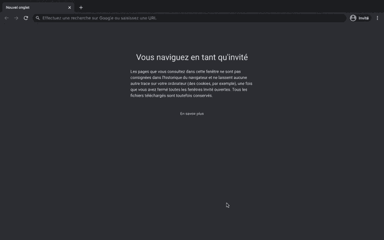

# 在 Flask 上创建登录页面

> 原文：<https://medium.com/analytics-vidhya/creating-login-page-on-flask-9d20738d9f42?source=collection_archive---------0----------------------->

允许用户连接到他们的个人空间是 web 应用程序最重要的特性之一。在本文中，我将向您解释如何通过使用 Flask-Login python 包添加登录页面来添加身份验证。

所有脚本都可以在我的[GitHub](https://github.com/Faouzizi/Create_LoginPage)T2 这里获得。

登录页面烧瓶示例

因此，在这里，我们将创建一个注册、登录和注销页面，允许用户连接到他们的…