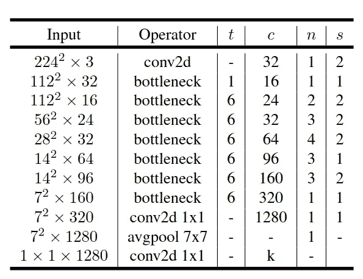

# 使用 TensorFlow 从头开始创建 MobileNetsV2

> 原文：<https://medium.com/analytics-vidhya/creating-mobilenetsv2-with-tensorflow-from-scratch-c85eb8605342?source=collection_archive---------2----------------------->

MobileNet 模型非常小，延迟很低。MobileNet 模型可以轻松地部署在移动和嵌入式边缘设备上。

在这篇博客中，我们将看看 MobileNet 的改进版本，即版本 2- MobileNetV2。第一个版本 [MobileNet 解释和用 Tensorflow](/@sumeet.bb/creating-mobilenets-with-tensorflow-from-scratch-c34ec79a59d2) 创建在我以前的帖子中解释过。在版本 1 中，作者使用深度方向可分离卷积来减少计算。在版本 2 中，作者通过减少可训练参数进一步减少了计算时间，而没有任何显著或没有降低精度。

MobileNetV2 论文链接:【http://export.arxiv.org/pdf/1801.04381 T2

**好，那 V2 有什么变化？**

一个新的卷积块称为反向残差和线性瓶颈。在该块中，来自较低维度表示的特征被放大。然后应用深度方向的卷积，然后将特征压缩回先前的低维表示。

这里有一张积木的图片，让你更容易理解积木结构背后的直觉。


图 1:块的表示。

> 层的扩展由标量变量 **t** 决定。这个变量是过滤器大小的倍数，以获得所需的扩展。压缩率取决于我们想要的输出层，即滤波器大小。

现在让我们用 Python 创建这些层。这次我们将使用 Relu(6)作为激活函数。Relu(6)是在许多模型和论文中使用的事实上的激活函数。怎么做，为什么？那是另一个时间的讨论。

```
**def** expansion_block(x,t,filters,block_id): prefix = 'block_{}_'.format(block_id)
    total_filters = t*filters
    x = Conv2D(total_filters,1,padding='same',use_bias=False, name =    prefix +'expand')(x) x = BatchNormalization(name=prefix +'expand_bn')(x)
    x = ReLU(6,name = prefix +'expand_relu')(x)
    **return** x**def** depthwise_block(x,stride,block_id): prefix = 'block_{}_'.format(block_id)
    x = DepthwiseConv2D(3,strides=(stride,stride),padding ='same', use_bias = False, name = prefix + 'depthwise_conv')(x) x = BatchNormalization(name=prefix +'dw_bn')(x)
    x = ReLU(6,name = prefix +'dw_relu')(x)
    **return** x**def** projection_block(x,out_channels,block_id): prefix = 'block_{}_'.format(block_id)
    x = Conv2D(filters=out_channels,kernel_size = 1,   padding='same',use_bias=False,name= prefix + 'compress')(x) x = BatchNormalization(name=prefix +'compress_bn')(x)
    **return** x
```

因为它是一个剩余块，意味着应该有一个添加，所以添加的层是块的输入和输出。残差背后的直觉是，它在第一层和最后一层之间创建了一条高速公路，使数据流(即梯度)更容易。

下面是 MobileNetV2 中使用的残差块的图片。


图 2:瓶颈剩余块

您可能会注意到，在投影图层中的批处理规范化图层之后没有激活图层。这是因为作者发现，由于它将数据压缩到低维，对其应用非线性会破坏有用的信息。

使用低维张量是减少计算量的关键。毕竟，张量越小，卷积层需要做的乘法就越少。

只有当通道尺寸相同时，才能添加层。为此，我们将实现一个 **if** 函数来检查通道大小。现在是它的 Python 代码。让我们看看。

```
**def** Bottleneck(x,t,filters, out_channels,stride,block_id):
    y = expansion_block(x,t,filters,block_id)
    y = depthwise_block(y,stride,block_id)
    y = projection_block(y, out_channels,block_id)
    **if** y.shape[-1]==x.shape[-1]:
       y = add([x,y])
    **return** y
```

接下来，我们看看所有这些块和层是什么样子，以及如何用 python 实现它们。

**MobileNetV2 的架构:**



图 3:MobileNetV2 架构(来源:最初的 MobileNetV2 论文)

MobileNetV2 从基本的 2D 卷积层开始。然后是一系列的瓶颈层一个接一个的附着，有膨胀率( **t** ，不同的步幅( **s** ，输出通道( **c** ，重复的次数( **n** )。

**定义卷积块** —输入后的每个卷积块有如下顺序:BatchNormalization，后跟 ReLU activation，然后传递给下一个块。

第一卷积块具有 32 个内核大小(3×3)的滤波器，步长为 2。如前所述，随后是批处理标准化层和 ReLU 激活。这三行可以用下面的代码表示。

```
input = Input (input_shape)
x = Conv2D(32,3,strides=(2,2),padding='same', use_bias=False)(input)
x = BatchNormalization(name='conv1_bn')(x)
x = ReLU(6, name='conv1_relu')(x)
```

接下来是一连串的 17 个瓶颈。瓶颈的称呼如下。x =瓶颈(x，t = 6，过滤器= x.shape[-1]，out_channels = 24，stride = 2，block_id = 2)

```
x = Bottleneck(x, t = 6, filters = x.shape[-1], out_channels = 24, stride = 2,block_id = 2)
```

最后还有步幅 1 的 1x1 卷积层。接着是一层 GlobalAveragePooling，最后是输出层。输出层是一个密集层，在这里类将被提及。如果类是 3，那么它应该是密集的(3)。使用的激活函数是 Softmax。

```
x = Conv2D(filters = 1280,kernel_size = 1,padding='same',use_bias=False, name = 'last_conv')(x)x = BatchNormalization(name='last_bn')(x)
x = ReLU(6,name='last_relu')(x)x = GlobalAveragePooling2D(name='global_average_pool')(x)output = Dense(n_classes,activation='softmax')(x)
```

现在我们已经把所有的模块都放在一起了，让我们把它们合并起来，看看整个 MobileNet 架构。

**完整的 MobileNet 架构:**

```
**def** MobileNetV2(input_image = (224,224,3), n_classes=1000): input = Input (input_shape)
    x = Conv2D(32,3,strides=(2,2),padding='same', use_bias=False)(input)
    x = BatchNormalization(name='conv1_bn')(x)
    x = ReLU(6, name='conv1_relu')(x) # 17 Bottlenecks x = depthwise_block(x,stride=1,block_id=1)
    x = projection_block(x, out_channels=16,block_id=1) x = Bottleneck(x, t = 6, filters = x.shape[-1], out_channels = 24, stride = 2,block_id = 2) x = Bottleneck(x, t = 6, filters = x.shape[-1], out_channels = 24, stride = 1,block_id = 3) x = Bottleneck(x, t = 6, filters = x.shape[-1], out_channels = 32, stride = 2,block_id = 4) x = Bottleneck(x, t = 6, filters = x.shape[-1], out_channels = 32, stride = 1,block_id = 5) x = Bottleneck(x, t = 6, filters = x.shape[-1], out_channels = 32, stride = 1,block_id = 6) x = Bottleneck(x, t = 6, filters = x.shape[-1], out_channels = 64, stride = 2,block_id = 7) x = Bottleneck(x, t = 6, filters = x.shape[-1], out_channels = 64, stride = 1,block_id = 8) x = Bottleneck(x, t = 6, filters = x.shape[-1], out_channels = 64, stride = 1,block_id = 9) x = Bottleneck(x, t = 6, filters = x.shape[-1], out_channels = 64, stride = 1,block_id = 10) x = Bottleneck(x, t = 6, filters = x.shape[-1], out_channels = 96, stride = 1,block_id = 11) x = Bottleneck(x, t = 6, filters = x.shape[-1], out_channels = 96, stride = 1,block_id = 12) x = Bottleneck(x, t = 6, filters = x.shape[-1], out_channels = 96, stride = 1,block_id = 13) x = Bottleneck(x, t = 6, filters = x.shape[-1], out_channels = 160, stride = 2,block_id = 14) x = Bottleneck(x, t = 6, filters = x.shape[-1], out_channels = 160, stride = 1,block_id = 15) x = Bottleneck(x, t = 6, filters = x.shape[-1], out_channels = 160, stride = 1,block_id = 16) x = Bottleneck(x, t = 6, filters = x.shape[-1], out_channels = 320, stride = 1,block_id = 17) x = Conv2D(filters = 1280,kernel_size = 1,padding='same',use_bias=False, name = 'last_conv')(x)
    x = BatchNormalization(name='last_bn')(x)
    x = ReLU(6,name='last_relu')(x) x = GlobalAveragePooling2D(name='global_average_pool')(x)
    output = Dense(n_classes,activation='softmax')(x) model = Model(input, output)
    **return** model
```


图 4:模型总结最后几层

这就是我们实现 MobileNetV2 架构的方式。

要以更好的方式查看代码，请查看 github 上的 jupyter [笔记本](https://github.com/Haikoitoh/paper-implementation/blob/main/MobileNetV2.ipynb)。

**参考文献:**

@ article { Sandler 2018 mobilenetv2ir，title={MobileNetV2:反向残差和线性瓶颈}，作者= { m . Sandler and Andrew g . Howard and Meng long Zhu and a . Zhmoginov and Liang-Chieh Chen }，期刊={2018 IEEE/CVF 计算机视觉和模式识别会议}，年份={2018}，页数= { 4510–4520 } }