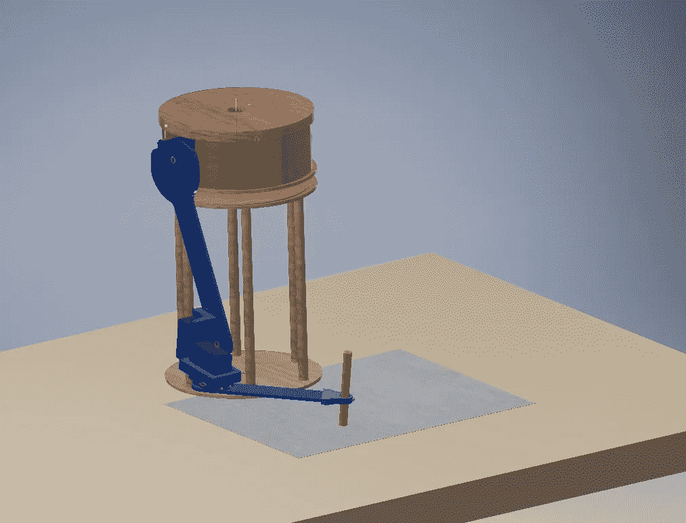
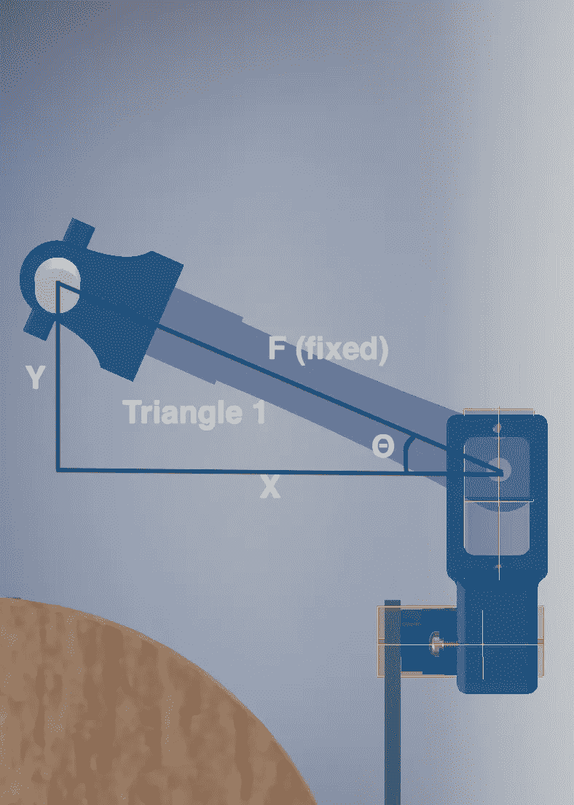
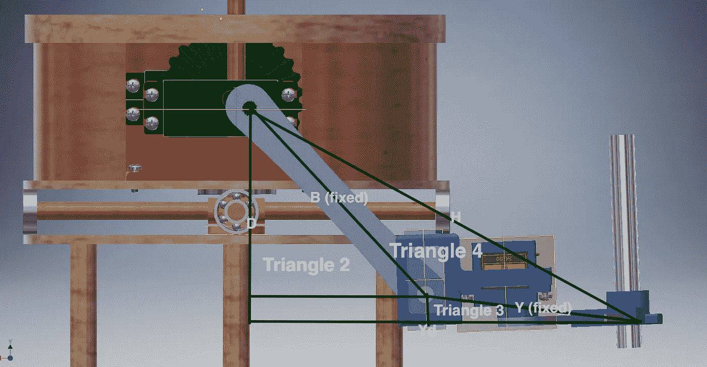
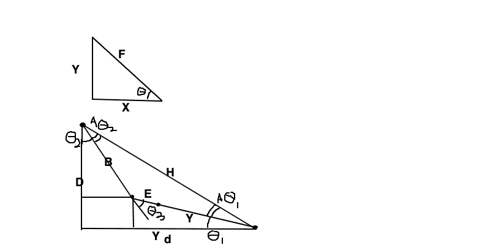
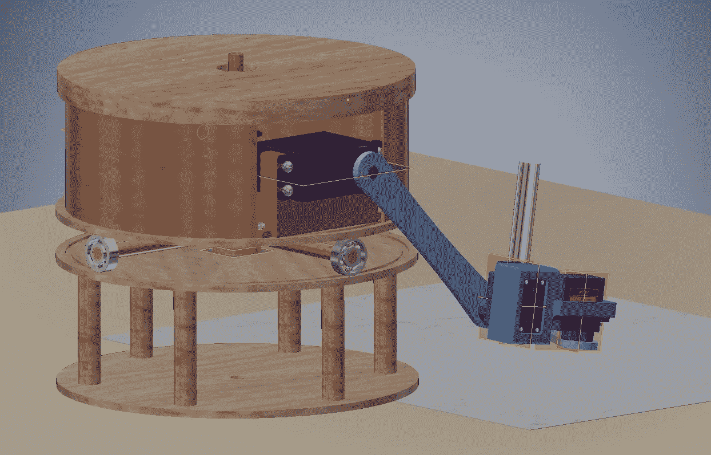
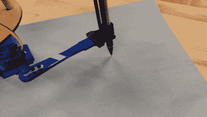
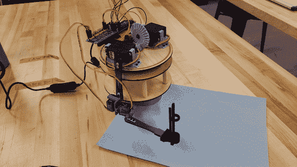

# 用简单的三角学为我们的机械臂创建了我自己的反向运动学方程

> 原文：<https://medium.com/analytics-vidhya/creating-my-own-inverse-kinematics-equations-for-our-robotic-arm-using-simple-trigonometry-51ef5ab40967?source=collection_archive---------9----------------------->

几个月前，我正在做一个项目，用我的 Raspberry Pi 0 和便宜的伺服系统制造一个机器人手臂。在一次活跃的虚拟头脑风暴会议后，我们提出了一个雄心勃勃的想法:一个书法机器人。我们有一周的时间来设计、CAD、编程、建造、调试和测试机器人。在电话中，我们提出了一个初步的设计，然后开始制造我们各自的机器人部件。

## 创建灵活的代码

由于我是团队中指定的软件工程师，我决定尽快开始编写代码，这样一旦我们将机器人组装起来，我们就可以开始调试。我们已经计划好了伺服系统的布局，但是还没有确定手臂的尺寸，所以我必须设计一个可以在任何尺寸下工作的系统。

代码的系统设计很简单，我会硬编码机器人的尺寸，然后计算一个 2d 网格，我们可以根据系统的限制在手臂下面的纸上绘制。使用这个网格，我们应该能够将一个(x，y)坐标传递给一个函数，并运行反向运动学来确定每个伺服需要的角度。这样，代码中的所有内容都可以是动态的，除了硬编码的维度。

所有这些的关键是写出反向运动学方程。有几个很好的方法可以做到这一点(我最推荐的是[德纳维特-哈滕伯格会议](https://robotacademy.net.au/lesson/denavit-hartenberg-notation/))，但我看到我们设计机器人的方式，我将能够为我们的手臂提出自己的反向运动学方程，这似乎是一个有趣和令人兴奋的几何问题，可以挑战自己。

## 用初等三角学求解逆运动学

在直接进入我的图之前，让我们看一下 Cad。



我们机械臂的 Cad 图

你可以在这里看到我们简单的机械臂设计。我们给它起了个绰号叫“水塔”，因为它的设计类似于水塔。笔(显示为黄色圆柱体)由机器人松散地握住，因此高度的微小变化不会将铅笔从页面上移开。个人伺服我将提到如下:肩，肘关节，肘关节，从顶部向下移动手臂。

经过观察，我确定了手臂设计中的 4 个重要三角形。使用固定长度和两个参数(X 和 Y 距离原点的距离，以英寸为单位，我已经确定为肩部伺服。)，我应该能够计算出三个角度(θ、θ1 和θ2)，它们对应于每个伺服机构的角度。



前臂的三角形，平行于手臂所在的平面绘制

第一个三角形是直角三角形，存在于平行于手臂的平面上。重要的是要注意，这个三角形并不总是在平行于纸面的 XY 平面上，而是会受到肘形伺服角度的影响，然而我们不需要知道这个角度来求解这个三角形。我们的第一个输入参数在这里用 X 标记:这是从肩部伺服机构的横向距离，单位为厘米。从这里我们需要找到角度θ和前臂 Y 距离(这里标记为 Y ),这将用于我们下一步的计算。

下面是我为找到这些测量值而编写的 python 代码:

```
forearmYLengthRelative = math.sqrt(ForearmLength**2 - xdis**2) elbowXAngle = math.degrees(math.acos(xdis / ForearmLength))
```

这只是基于勾股定理和基本的三角学。(*如果你不熟悉的话，python 是指数吗)

到目前为止，这是简单的，但是当我们移动到垂直于地面的平面时，它变得更加复杂。



要求解的其他角度

当我第一次看这个手臂时，我看到了最初的 2 个三角形(这里标记为 2 和 3)，并且不知道如何计算伺服系统的角度。然后我意识到这里还有两个隐含的三角形。有一个大三角形，它是三角形 2、3 和 4 的组合，底部有一个小矩形，然后是隐含的三角形 4。

现在我们已经可视化了手臂上的图表，让我们将它们移动到白色背景，并标记要求解的边和未知角度。



手臂在任意点形成的三个三角形

这里我们有以下已知变量:变量 B、D 和 E，以及值 Yd。b、D、E 是固定变量；二头肌长度、肩部伺服到地面的距离以及肘关节的长度。值 Yd 是输入参数；与肩部伺服机构的距离，单位为厘米。利用 Yd 和 D，我可以找到大三角形的斜边，在图上标为 H。

```
hypoteneuseLength = math.sqrt(DrawHeight**2 + ydis**2)
```

但是仅仅这样是没有用的，直到我从第一个三角形中引入计算出来的前臂 Y 变量。将 E 和 Y 相加，用 B，我可以得到三角形 4 的角度。然后我们可以用余弦的 T4 定律得到三角形 4 的θ1 和θ2。

```
additionalTriangleTheta1 = math.degrees(math.acos(((ElbowLength + forearmYLengthRelative)**2 + hypoteneuseLength**2 - BicepLength**2)/(2 * hypoteneuseLength*(ElbowLength + forearmYLengthRelative))))additionalTriangleTheta2 = math.degrees(math.acos((hypoteneuseLength**2 + BicepLength**2 - (ElbowLength + forearmYLengthRelative)**2)/(2 * BicepLength * hypoteneuseLength)))
```

现在，如果我们得到大三角形的角度(代码中称为`bigTheta1`和`bigTheta2`)，我们也有所有的边，我们可以通过减去三角形 4 的θ2 得到三角形 2 的θ1(`shoulderAngle`)。

```
bigTheta1 = math.degrees(math.asin(DrawHeight/hypoteneuseLength))bigTheta2 = math.degrees(math.asin(ydis/hypoteneuseLength))shoulderAngle = bigTheta2 - additionalTriangleTheta2
```

我们需要的最后一个角度是三角形 3 的θ3(`elbowYAngle`)。这不是三角形的三个角中的一个，所以为了得到它，我们可以使用从 B 延伸的线来想象三角形 2 的θ1 存在于三角形 3 中。因为我们知道三角形 3 中所有其他的角(一个是直角，一个是θ2)，我们可以得到三角形 3 的θ3。

```
elbowYAngle = (90 - (bigTheta1 - additionalTriangleTheta1)) - shoulderAngle
```

现在我们有了平面上任意点的伺服角度方程。

## 种种限制打断了这个计划

在这一点上有一些延误，延误了我们的进展。我们的第一个问题是，设计、打印和构建这个机器人花费的时间比预期的要多。然后，我们意识到最初的设计会导致相当有限的绘图空间，所以我们改变了设计，不得不重新打印和构建一切。最终，我们完成了所有的最终尺寸和设计。



改进后的新设计

以下是最终的固定尺寸:

```
Dimensions (in cm)
BicepLength = 9
ElbowHeight = 1.25
ElbowLength = 3.3
ForearmLength = 10
ShoulderHeight = 14.25
hoverHeight = 4.0 (the height that the "hand" will hover above the paper)
```

不幸的是，即使在重新设计之后，我们的系统仍然保留了一些严格的物理限制。我们的限制之一是手臂与底部的交互，另一个是手臂实际接触页面的有限范围。不幸的是，我们的一些设计局限来自于沟通不畅，这在疫情时代是意料之中的，那时我们的设计会议是通过视频会议技术进行的。

我们也在有限的预算下工作，基本上使用最便宜的材料，所以我们的伺服系统的最小分辨率只有 1 度。使用我们手工测量的物理范围，我们的 2d 绘图网格具有以下分辨率:

```
X Range
0, 145
Y Range
0, 58
```

这个分辨率不足以实现我们的书法理念。在这一点上，我们只是满足于书写清晰。

## 结果

在项目到期的前一天通宵工作后，我们完成了我们的手臂。当到达一个点时，手臂会振动和超调，我们花了太多时间试图校准手臂，以至于我们不得不将我们的首字母硬编码到手臂上。



原始的，乏味的视频是如此之慢，这是 3 倍快

总的来说，我们对我们在限制范围内的设计很满意。我们在时间和金钱上受到严重限制，并且被研究生院的课程所拖累。虽然我们可以做很多改变来提高精确度，但另一个主要的改变是使用弹簧来加重笔的重量。如果给我更多的时间，我还可以实现一个能够将任何文本转换成手臂指令的系统。

## 结论

如果你决定做你自己的机器人项目，我推荐使用一种更成熟的反向运动学形式，比如我前面提到的 Denavit-Hartenberg 协定。但是如果你想要挑战，你可以提出你自己的反向运动学。重要的是要记住，对于许多系统来说，有[多个反向运动学解](https://www.researchgate.net/figure/Inverse-kinematics-often-has-multiple-solutions_fig2_259234959)，所以你应该决定一个伺服范围，以便更容易开发一个工作系统，强制一个解决方案。还有，有些系统有无穷多个解，这些很难手工计算，但是如果你强迫一个伺服系统有一个固定的角度，这就容易多了。

感谢您的阅读！



我们还教会了机器人挥手

*所有与此项目相关的代码，* [*转到我的 github*](https://github.com/Wilhite-r/AnthropoArmP1) *。*