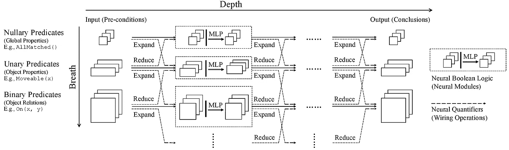
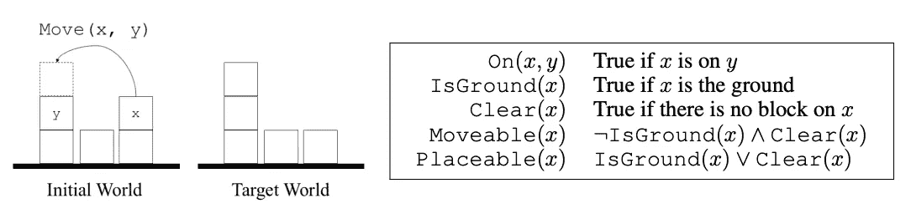
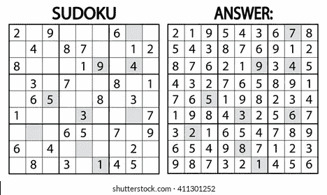
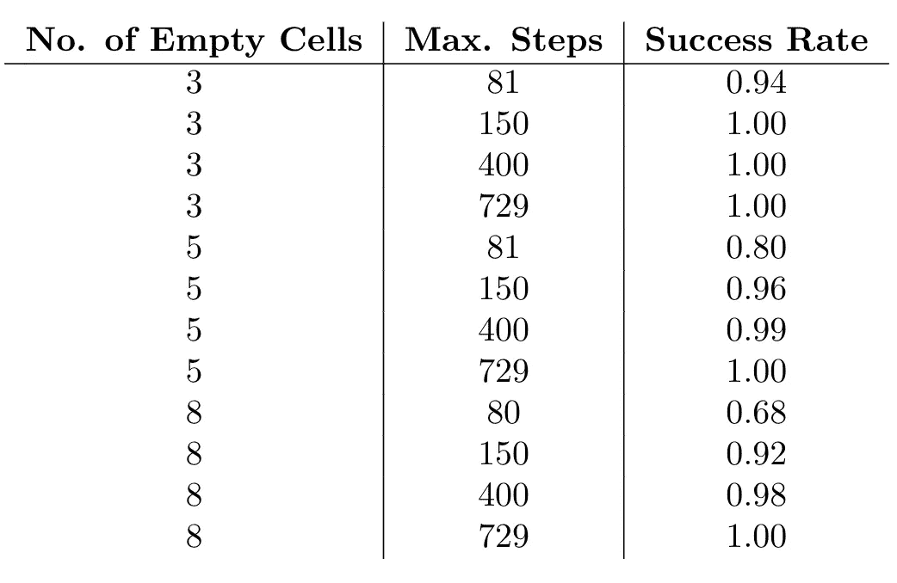
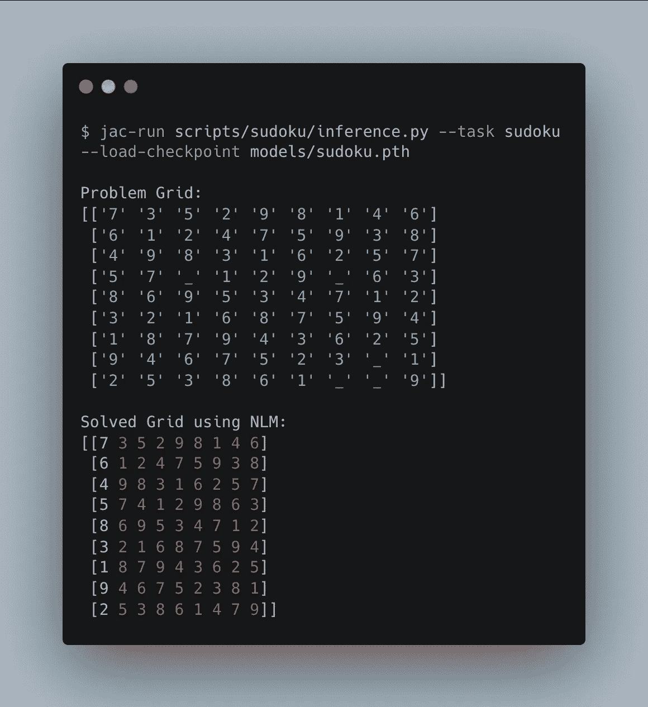

# 创建神经符号数独解算器

> 原文：<https://medium.com/analytics-vidhya/creating-neuro-symbolic-sudoku-solver-cc94c431d10b?source=collection_archive---------1----------------------->

神经逻辑机器体系结构(参考:NLM 论文)

使用深度学习和符号人工智能的结合来解决数独网格是一个非常奇特的想法。我们在这里使用了这样一种方法。这个模型的代码是开源的，可以在 [GitHub 库](https://github.com/ashutosh1919/neuro-symbolic-sudoku-solver)中获得。

深度学习模型在语音识别、图像分类、机器翻译等任务中取得了巨大成功。但是深度学习的一个缺点就是缺乏系统性。它不能理解解决问题的基本规则。它试图找到能逼近解的函数。

如果说另一面的话，[归纳逻辑编程](https://arxiv.org/abs/2008.07912)是在自然语言理解和推理中，能够自然处理符号规则的逻辑系统。它是为从例子中学习逻辑规则而开发的。它创造了一个符号模型，满足正面的例子，并反驳负面的例子。但是由于指数级的大搜索空间，ILP 无法处理复杂的问题。

结合上述两种方法可以减少缺点并创建非常健壮的模型。这就是为什么它在人工智能中被称为神经符号域。我们已经使用了一种叫做[的神经逻辑机器](https://arxiv.org/pdf/1904.11694.pdf)的神经符号架构来解决一个数独难题。

# 神经逻辑机器

NLM 是逻辑机器的神经实现。给定一组基于一组对象(前提)的基本谓词，NLMs 依次应用一阶规则来得出结论，例如关于对象的属性。它是一种深度强化学习架构，使用在符号张量上计算的布尔谓词。 [NLM 论文](https://arxiv.org/pdf/1904.11694.pdf)展示了解决基本系统问题的多种应用，如排序数组、寻找图中最短路径、解决积木世界难题等。

有人可能认为创造一个 RNN 可以解决这些问题。是的，可以。但是用长度为 10 的数组(排序)训练的 RNN 不能排序长度为 15 的数组。这就是深度学习失败的地方。神经逻辑机器使用提升的规则，这些规则利用一阶逻辑的能力来表示系统，然后这些基于一组对象的一阶逻辑谓词可以被输入到神经网络中。

例如，如果我们考虑一个积木世界的难题，我们可以提取一组规则来定义难题的核心系统性，如下图所示。

图 1 积木世界拼图规则示例(参考:NLM 论文)

我们首先计算系统中所有对象的布尔谓词规则，然后将它们输入到 NLM 网络中。

为了更好地理解，作为先决条件，我们强烈建议在阅读下一节之前通读一下 [NLM 论文](https://arxiv.org/pdf/1904.11694.pdf)。它不仅会使主题清晰，还会引入一个与神经网络相结合的完全不同的符号域。

# 为数独创建布尔谓词

正如规则所描述的，我们需要用没有出现在同一行、列和 3x3 子网格中的数字来填充数独网格中的所有空白单元格，以解决这个难题。

图 2 数独拼图

我们可以推导出三个基本规则来解决这个难题。假设我们想将数字 ***x*** 放入单元格 ***(r，c)*** 。下面是一组规则，必须满足这些规则才能得到一个有效的数独网格。

1.  ***isRow(r，x)*** :行 ***r*** 是否包含数字 ***x*** ？
2.  ***isColumn(c，x)*** :列 ***c*** 是否包含数字 ***x*** ？
3.  ***isSubMatrix(r，c，x)*** :以行 ***r*** 和列 ***c*** 开头的子矩阵是否包含数字 ***x*** ？

谓词 ***isRow(r，x)*** 和 ***isColumn(c，x)*** 是二元谓词，而 ***isSubMatrix(r，c，x)*** 是三元谓词。对于数独难题，我们没有任何一元和一元谓词。我们为数独网格的每个单元计算上述三个谓词。

# 深度强化学习和培训

我们使用带有策略梯度计算的[增强算法](https://proceedings.neurips.cc/paper/1999/file/464d828b85b0bed98e80ade0a5c43b0f-Paper.pdf)来训练模型。NLM 需要计算上述布尔谓词作为输入。

我们使用了深度为 5 和宽度为 3 的 NLM。NLM 的输入层有 4 个节点(第一个输入空谓词，第二个输入一元谓词，第三个输入二元谓词，第四个输入三元谓词)。我们将 ***isRow(r，x)*** 和 ***isColumn(c，x)*** 的结果进行堆栈，作为二元谓词输入。同样，我们输入 ***isSubMatrix(r，c，x)*** 的结果作为三元谓词。对于这个问题，我们没有空谓词和一元谓词。所以，我们只为那些节点传递 *None* 。

一旦我们将这些数据传递给 NLM，最后一层计算 softmax 并执行动作来生成网格的下一个状态。这些操作是使用操作参数执行的，操作参数由空单元格的位置和要放入单元格的目标值组成。在将数字放入特定的单元格后，我们通过检查该数字是否产生有效的网格来执行操作。基于此，我们执行一个动作并返回一个奖励。我们使用的奖励方案与最初的 NLM 项目中使用的相同。

我们已经使用了一个课程培训方案来对模型进行端到端的培训。我们首先使用较少的空单元来训练网格模型，然后逐渐增加空单元的数量。

同样，选择动作和执行动作步骤也不是没有限制的。它们受到有限代理步骤的限制。这意味着我们已经使用超参数作为模型可以用来解决数独网格的最大步骤数。

# 评估和结果

我们用不同数量的有限代理步骤训练了模型，下面是我们获得的结果。

图 3 模型评估结果

从上面的评估，我们得出结论，我们已经实现了使用 NLM 数独难题的可解性。

我们构建了自己的代码，以便从训练好的模型中获得推论。下面是推断结果的样子。

图 4 推理结果

此外，该模型不仅仅给出一个求解的网格，它还给出求解它的步骤(轨迹),这可以导致解释。

# 未来的工作

基于我们当前工作的结果和性能，NLM 模型解决了数独网格，但是它没有以最优的步骤数解决数独网格。我们计划改进和开发更健壮的谓词，帮助模型以最佳的步骤数求解网格。

这个模型的代码是开源的，可以在 [GitHub 仓库](https://github.com/ashutosh1919/neuro-symbolic-sudoku-solver)中获得。

# 参考

1.  董、毛、林、王、李、周。神经逻辑机器。2019.
2.  萨顿麦卡勒斯特辛格曼苏尔。函数逼近强化学习的策略梯度方法。1999.
3.  王，唐蒂，怀尔德，科特。SATNet:使用可微分可满足性求解器桥接深度学习和逻辑推理。2019.