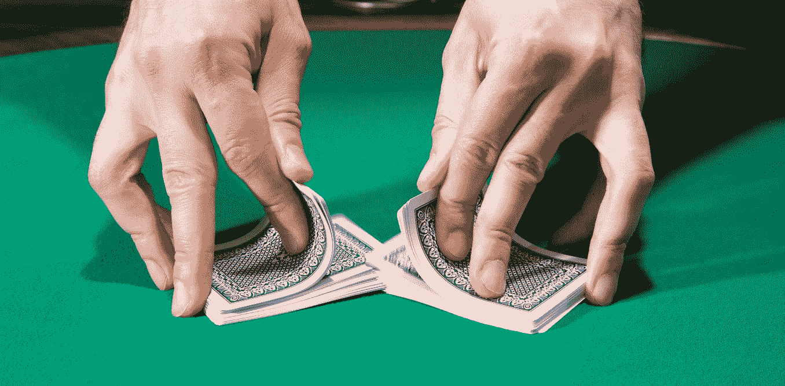
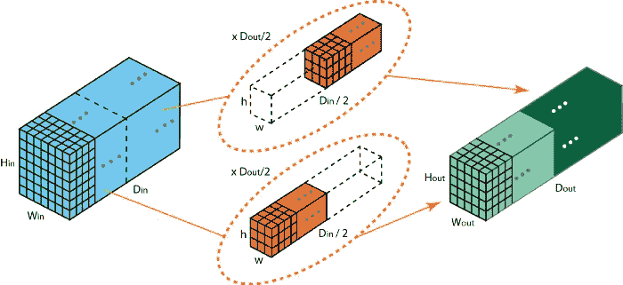
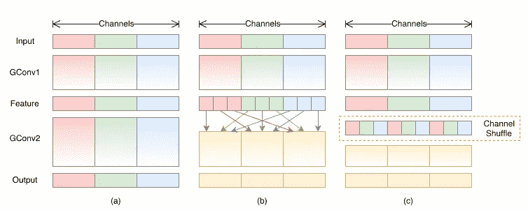
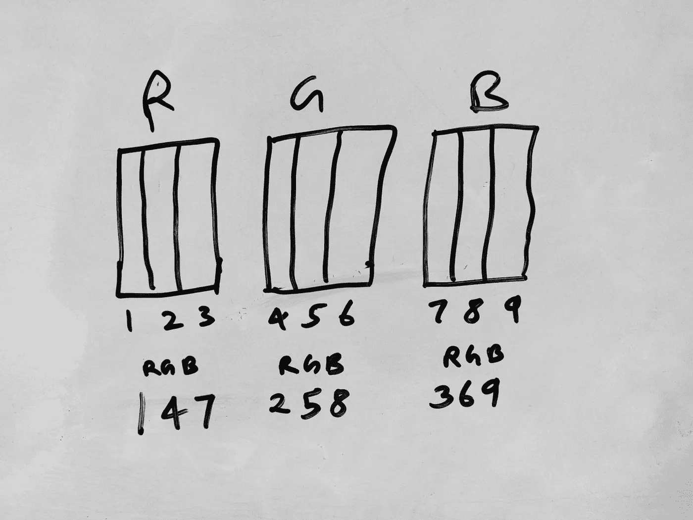
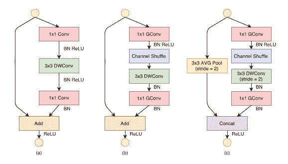
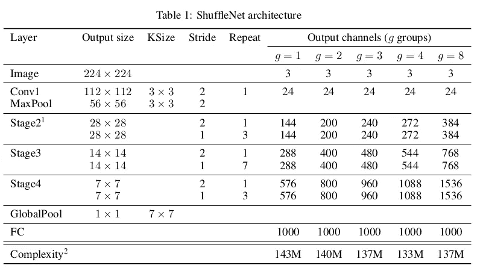
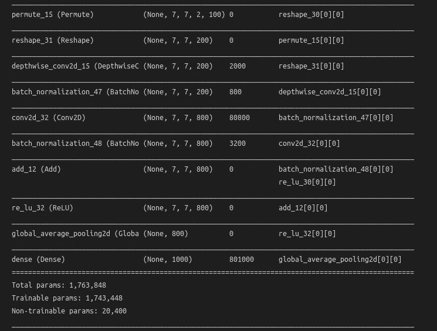
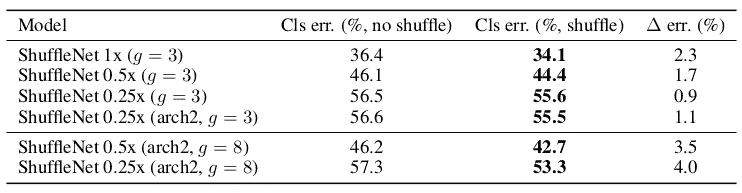

# 在 Tensorflow 中创建 ShuffleNet

> 原文：<https://medium.com/analytics-vidhya/creating-shufflenet-in-tensorflow-f59123bd555b?source=collection_archive---------1----------------------->



Magvi 公司(Face++)推出的 ShuffleNet 是一种计算效率极高的 CNN 架构，专门为计算能力非常有限(即 10-150m flops)的移动设备设计。新的体系结构利用两种操作来实现降低的计算成本，并保持或提高相同的精度——逐点组卷积和信道混洗。ShuffleNet 设法在 ImageNet 分类上获得比 MobileNet 更低的 top-1 错误(6.7%)。

通道混洗是本文的主要亮点，一种新的操作被应用于努力产生更多的特征映射通道，这有助于编码更多的信息并使特征检测更加鲁棒。

ShuffleNet 论文链接—[https://arxiv.org/pdf/1707.01083v1.pdf](https://arxiv.org/pdf/1707.01083v1.pdf)

现在让我们来看看 ShuffleNet 的构建模块。

## 点态群卷积

在微型网络中，昂贵的逐点卷积导致有限数量的信道来满足复杂性约束，这可能会显著损害准确性。为了解决这个问题，一个简单的解决方案是在 1 × 1 层上应用通道稀疏连接，例如组卷积。通过确保每个卷积仅在
对应的输入通道组上操作，组卷积显著降低了计算成本。

但是什么是群卷积呢？

AlexNet 中引入的组卷积是一种卷积类型，用于将通道分成组，然后在每个组上单独卷积核，然后级联回来。此操作有助于稀疏连接并减少连接数。

这里有一个直观的图片，便于理解。



图 3 —具有两个滤波器组的分组卷积

但是它有一个缺点——某个组的输出只与该组内的
输入相关。这种特性阻碍了频道组之间的信息流，削弱了代表性。

如果我们在应用组卷积之前混合不同组的输入，以便完全表示从输入到输出的信息流，会怎么样？从而洗牌。

## **频道洗牌**



图 3—使用组卷积的信道混洗(来源:ShuffleNet 论文)

假设一个卷积层有 g 个群，其输出有 g × n 个信道；我们首先将输出通道的维数整形为(g，n)，
转置，然后将其展平，作为下一层的输入。

如何理解渠道洗牌？这是一张图表。



图 4 —频道随机播放

对于组=3，对于 3 个通道，RGB 以这样的方式被分割，即原始 RGB 被表示为更小的 3 个代表性 RGB 通道。红色通道的第一次分离将是第一组的红色通道，第二次分离将是第二组的红色通道，第三次分离将是第三组的红色通道。

## 洗牌网单元



图 5-ShuffleNet 装置(来源:原始 shuffle net 文件)

**a)** 部分是具有深度方向卷积的原始瓶颈单元。 **b)** 部分是具有逐点组卷积和通道混洗的 ShuffleNet 的新瓶颈单元。 **c)** 部分是跨距=2 的 ShuffleNet 单元。

现在让我们看看 python 代码

对于频道洗牌。首先，我们将信道维度整形为(g，n)，使用置换来形成较小的表示，然后将其整形为原始格式。

```
**def** channel_shuffle(x, groups): _, width, height, channels = x.get_shape().as_list() group_ch = channels // groups x = Reshape([width, height, group_ch, groups])(x) x = Permute([1, 2, 4, 3])(x) x = Reshape([width, height, channels])(x) **return** x
```

现在洗牌机的代码。如果跨距= 2，则瓶颈单元输入和输出被连接，如果跨距= 1，则使用加法功能。

```
**def** shuffle_unit(x, groups, channels,strides): y = x x = Conv2D(channels//4, kernel_size = 1, strides = (1,1),padding = 'same', groups=groups)(x)
    x = BatchNormalization()(x)
    x = ReLU()(x) x = channel_shuffle(x, groups) x = DepthwiseConv2D(kernel_size = (3,3), strides = strides, padding = 'same')(x)
    x = BatchNormalization()(x) **if** strides == (2,2):
       channels = channels - y.shape[-1]
    x = Conv2D(channels, kernel_size = 1, strides = (1,1),padding = 'same', groups=groups)(x)
    x = BatchNormalization()(x)

    **if** strides ==(1,1):
        x = Add()([x,y]) **if** strides == (2,2):  
        y = AvgPool2D((3,3), strides = (2,2), padding = 'same')(y)
        x = concatenate([x,y]) x = ReLU()(x) **return** x
```

# 洗牌网架构



图 6 — ShuffleNet 架构(来源:原始 ShuffleNet 论文)

四个洗牌网单元被放置在架构中。每个单元的输出通道加倍，每个单元的尺寸减半。

这是 groups = 2 的完整代码—

```
**def** Shuffle_Net(nclasses, start_channels ,input_shape = (224,224,3)): groups = 2
    input = Input (input_shape) x =  Conv2D (24,kernel_size=3,strides = (2,2), padding = 'same', use_bias = True)(input)
    x =  BatchNormalization()(x)
    x =  ReLU()(x) x = MaxPool2D (pool_size=(3,3), strides = 2, padding='same')(x) repetitions = [3,7,3] **for** i,repetition in enumerate(repetitions): channels = start_channels * (2**i) x  = shuffle_unit(x, groups, channels,strides = (2,2)) **for** i in range(repetition):
            x = shuffle_unit(x, groups, channels,strides=(1,1)) x = GlobalAveragePooling2D()(x) output = Dense(n_classes,activation='softmax')(x) model = Model(input, output) **return** model
```



图 7 —模型总结

这就是我们如何在 TensorFlow 中实现 ShuffleNet。

**但是渠道洗牌的效果如何呢？**

论文作者做了有/无频道洗牌的比较。



图 8 —对比

该表比较了具有/不具有信道混洗的混洗网络结构(例如组号被设置为 3 或 8)的性能。评估是在三种不同的复杂程度下进行的。很明显，频道混洗持续提升不同设置的分类分数。

在 [github 上检查代码。](https://github.com/Haikoitoh/paper-implementation)