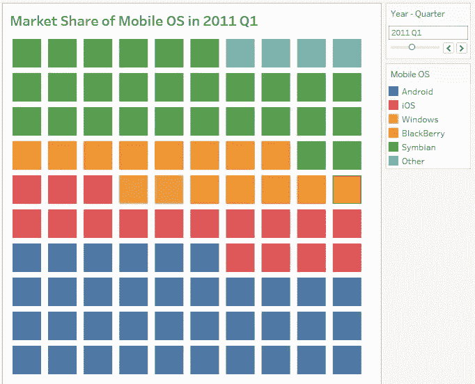
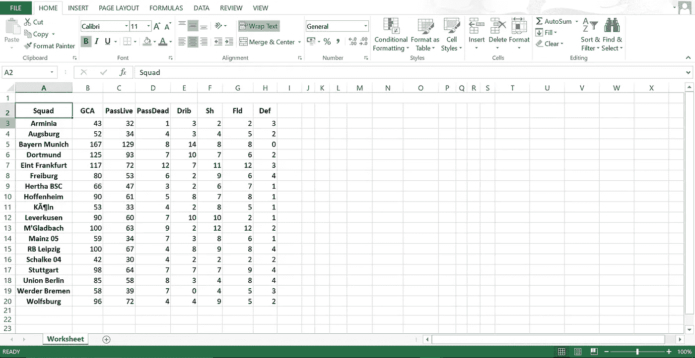
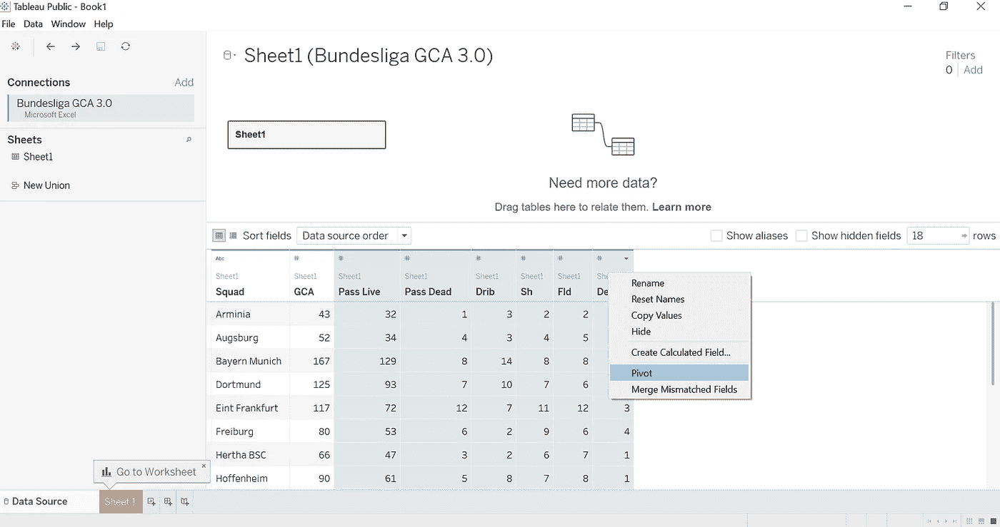
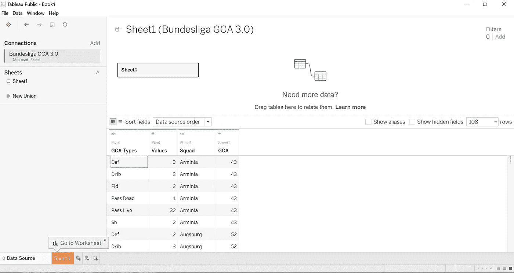
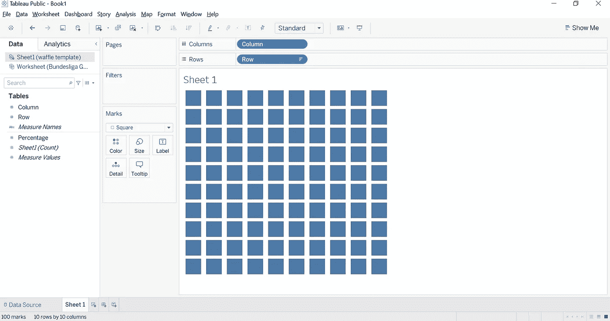
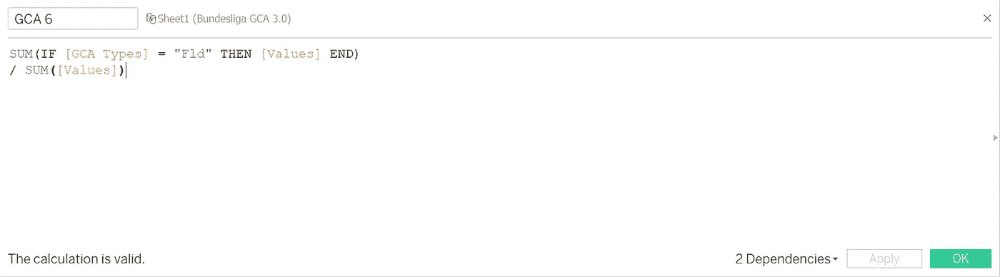
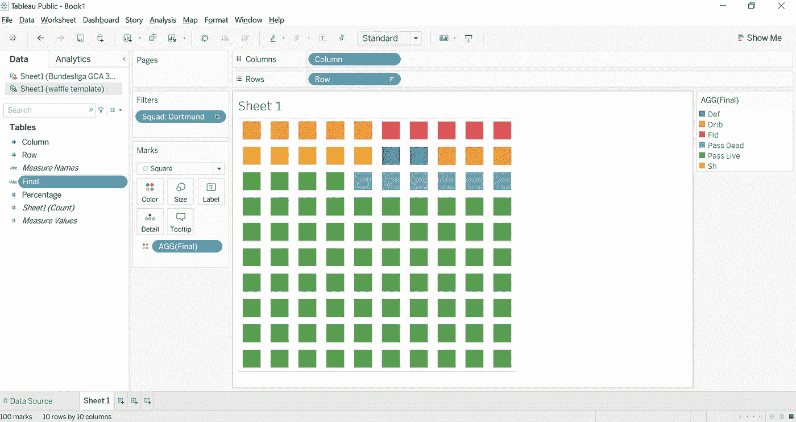
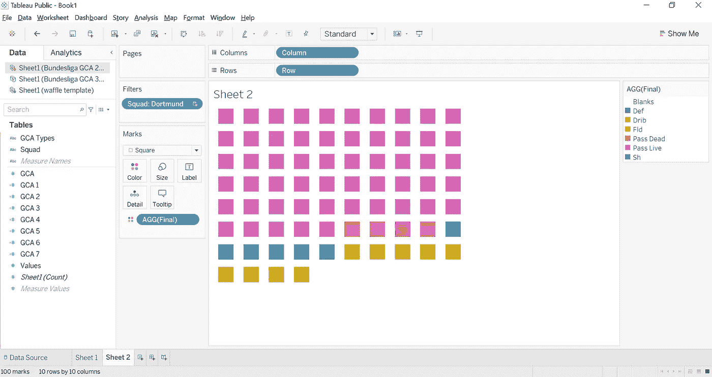
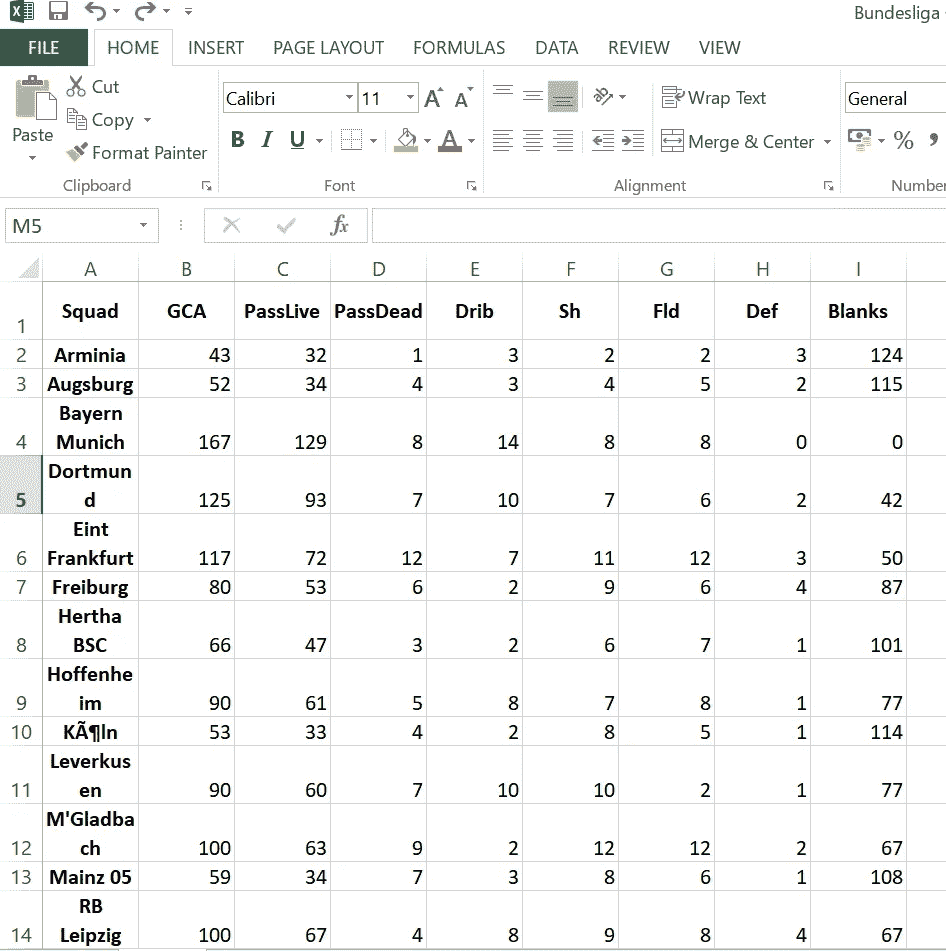

# 在 Tableau 中创建华夫饼图表

> 原文：<https://medium.com/analytics-vidhya/creating-waffle-charts-in-tableau-a6a8f9e31898?source=collection_archive---------3----------------------->


好吃！！

## 我真诚地说，事实上，我不是在胡扯。

你好。本教程试图带领读者通过使用足球数据在 tableau 中创建华夫饼图表的过程中的每一步。如果你熟悉体育分析领域，你可能会经常看到这些。

它是做什么的？

华夫格图以%的形式显示完成百分比或整体的组成部分。它基本上是一个更漂亮的饼图，只是不那么杂乱。



现在，你们中的一些人可能会问我，哈什，这看起来一点也不像华夫饼。更像是一个里面有小方块的大方块。以上帝的名义，为什么它被称为华夫饼图表？

嗯，是的，但也不是。事实证明，你每天都会学到新的东西，我今天学到的是方形华夫饼干是一种非常真实的东西。你可以认为这个名字有双重用途，它看起来有点像华夫饼，但在某些方面不是华夫饼。华夫格图的名字本身就是华夫格。

(好吧，我已经意识到我在浪费你的时间，所以我将直接进入教程)

让我们开始闲聊吧！！

# 获取数据

这个可视化的数据来自足球参考。在本教程中，我将使用德国德甲球队的**目标创造行动(GCA)** 。你可以在[网站](https://fbref.com/en/comps/20/Bundesliga-Stats)找到数据集。

一旦在 Excel 中打开了数据，您就可以删除所有多余的和(对于本教程来说)不必要的数据。您的数据现在应该如下所示。



(注意:在保存之前，我已经将该工作表复制粘贴到一个新的工作表中，因为我没有以 CSV 格式提取数据。数据集以名为**“德甲 GCA 3.0”**的 excel 工作簿的形式保存

# Tableau 数据准备

打开 Tableau 并加载您的数据。你现在要做的是选择除了“小队”和“GCA”之外的所有列。如果您使用的是 Windows，只需按住 ctrl 键并选择列即可。



您将看到我已经右键单击并选择了 **pivot** 选项。Tableau 现在将为您提供制作华夫饼图表所需的透视字段。您的表现在将看起来像这样。



将“透视字段名称”重命名为“GCA 类型”，将“透视字段值”重命名为“值”。

酷吗？酷毙了。现在打开工作表。现在，您想在同一工作表上打开一个新的数据源。您将要输入的新数据集是您的华夫饼图表的模板。点击下面的链接下载。

[华夫饼模板](https://docs.google.com/spreadsheets/d/e/2PACX-1vThwvmaCKGZy4OlhLNFwRYYL_3yMM-95h2M_zWVgFeL9h8WgGK-_I8gLimltuBnt-NRAQeQL4ol0ark/pub?output=ods)

您可以自己设置(很容易做到)，或者将这些值复制粘贴到一个新的 Excel 工作表中并保存。

好吧。将“行”和“列”转换为维度，并将它们拖放到各自的下拉框中。建议您右键单击“行”并按降序排序。将标记类型更改为“方形”,并从底部和右侧拖动到桌面上以放大标记。通过大小滑块调整正方形的大小。隐藏两个标题。你也应该点击“格式”下的“边框”,将“行分隔线”下的“窗格”改为“无”。总而言之，它应该是这样的。



# 计算字段

点击原始数据源(德甲 GCA 3.0)并开始创建计算字段。

我已经将我的计算字段命名为 GCA 1 到 6(总共 6 个字段)。

```
SUM(IF [GCA Types] = "Pass Live" THEN [Values] END)/ SUM([Values])
```

我们在这里所做的是创造我们可以利用的所有类别的价值比率。

以此为例，创建其他 6 个计算字段，除了引号内的部分之外，其他部分都保持不变，引号内的部分包括**、【Sh】、【Def】、【Drib】、【Fld】、**和**、【空白】。**

参考照片。



太好了。现在切换到**“华夫饼模板”**数据集，并创建一个新的计算字段。我将这个字段命名为**“Final”**。把这个复制粘贴到那里。

```
IF AVG([Percentage]) <= [Sheet1 (Bundesliga GCA 3.0)].[GCA 1] THEN "Pass Live"ELSEIF AVG([Percentage]) <= [Sheet1 (Bundesliga GCA 3.0)].[GCA 1] + [Sheet1 (Bundesliga GCA 3.0)].[GCA 2] THEN "Pass Dead"ELSEIF AVG([Percentage]) <= [Sheet1 (Bundesliga GCA 3.0)].[GCA 1] + [Sheet1 (Bundesliga GCA 3.0)].[GCA 2] + [Sheet1 (Bundesliga GCA 3.0)].[GCA 3] THEN "Sh"ELSEIF AVG([Percentage]) <= [Sheet1 (Bundesliga GCA 3.0)].[GCA 1] + [Sheet1 (Bundesliga GCA 3.0)].[GCA 2] + [Sheet1 (Bundesliga GCA 3.0)].[GCA 3] + [Sheet1 (Bundesliga GCA 3.0)].[GCA 4] THEN "Def"ELSEIF AVG([Percentage]) <= [Sheet1 (Bundesliga GCA 3.0)].[GCA 1] + [Sheet1 (Bundesliga GCA 3.0)].[GCA 2] + [Sheet1 (Bundesliga GCA 3.0)].[GCA 3] + [Sheet1 (Bundesliga GCA 3.0)].[GCA 4] + [Sheet1 (Bundesliga GCA 3.0)].[GCA 5] THEN "Drib"ELSEIF AVG([Percentage]) <= [Sheet1 (Bundesliga GCA 3.0)].[GCA 1] + [Sheet1 (Bundesliga GCA 3.0)].[GCA 2] + [Sheet1 (Bundesliga GCA 3.0)].[GCA 3] + [Sheet1 (Bundesliga GCA 3.0)].[GCA 4] + [Sheet1 (Bundesliga GCA 3.0)].[GCA 5] + [Sheet1 (Bundesliga GCA 3.0)].[GCA 6] THEN "Fld"ELSE "Fld" END
```

现在，拖动**最终**到“颜色”下的标记和拖动班底到过滤器。选择你喜欢的队伍，就是这样！！



根据你的喜好调整颜色和背景，你的华夫饼图表就可以用了。

# 版本 2.0

现在，这些图表很好地显示了每个类别的比例。但是，如果您想不成比例地显示数据呢？也许我没有尽我所能表达得更好，但我想说的是，如果你想展示顶级的 GCA 球队，那么你可能需要一个不同类型的图表。类似这样的。



要做到这一点，您需要在这个过程的早期步骤中做一个小的修改。这使我们回到我们的 Excel 表。创建一个名为 **Blanks 的新列。**在这一栏中，你需要计算最高的 GCA——每一个其他队伍的 GCA。



我们看到拜仁慕尼黑的 GCA 是联赛最高的。因此，我们从中减去其他球队的总积分。

然后，我们执行之前所做的所有相同步骤，直到创建计算字段的部分，我们现在将创建一个额外的字段，即 **"GCA 7"** ，它引用类别空白，使用我们之前使用的相同公式。

然后，在下一个公式中，我们添加另一行，具有相同的累积模式，一直到 GCA 7，现在以

```
ELSE “Blanks” END
```

然后，我们编辑图表的颜色，使图例“空白”的颜色与背景相同，隐藏它，并使它完全空白。

这就是全部。

*本教程参考了“Recnac”编写的指南。你可以在这里找到*[](https://www.pluralsight.com/guides/tableau-playbook-waffle-chart)**。**

*感谢 Swaminathan Nanda Kishore 对我理解 2.0 版的帮助。*