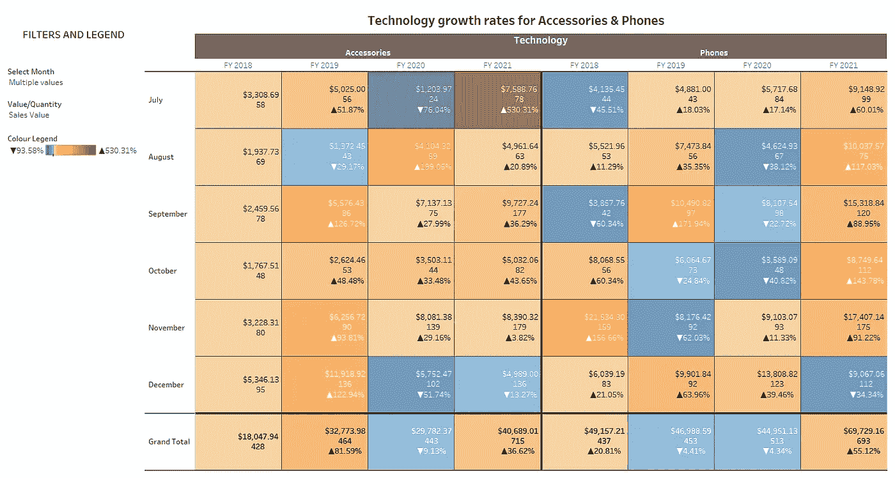

# 创建您的第一个动态 Tableau 仪表板

> 原文：<https://medium.com/analytics-vidhya/creating-your-first-dynamic-tableau-dashboard-c373adacd026?source=collection_archive---------6----------------------->

充满了增长率计算，参数，动态过滤器，符号，条件格式，自定义财政年度，它是色盲友好。

[从 Tableau Public 下载](https://public.tableau.com/profile/nikki.smit1659#!/vizhome/GrowthRatesforTechnology/Dashboard1?publish=yes)

*在这篇文章中，你将学习如何:*

*   创建您自己的增长率计算
*   将条件格式应用到您的计算中，使用颜色和…