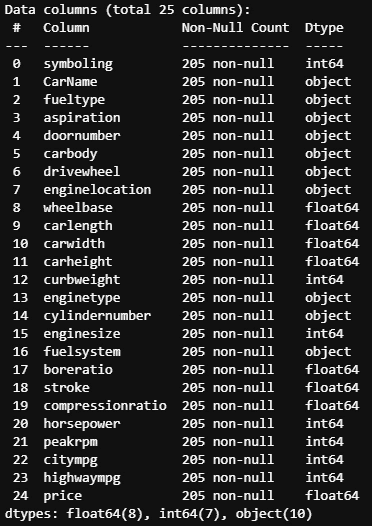
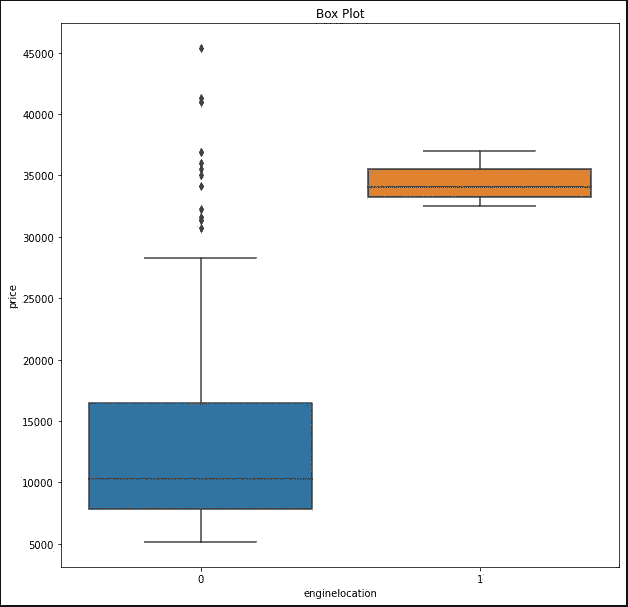
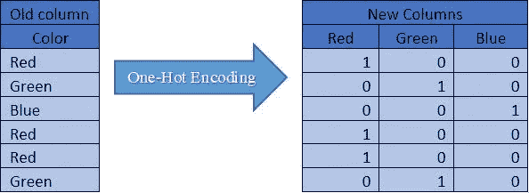
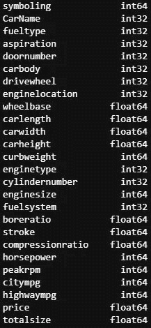
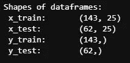

# 创建您的第一个回归模型

> 原文：<https://medium.com/analytics-vidhya/creating-your-first-regression-model-a7eed16943e5?source=collection_archive---------2----------------------->

## 机器学习入门指南


马克·弗莱彻·布朗在 [Unsplash](https://unsplash.com/) 上拍摄的图片

> 如果你想访问这里的所有代码，你可以在这里找到它[。](https://github.com/RoBan1994/Projects/blob/main/Creating%20your%20first%20Regression%20Model/Car%20Price%20Regression%20Analysis.ipynb)

开始学习数据科学可能是一项艰巨的任务。这个领域很广阔，有大量的东西需要学习。当我最初对这个领域产生兴趣时，我不知道从哪里开始。在无数的在线课程、各种文章和许多充满焦虑的失败之后，我已经确定最好的开始方式是简单地创建你的第一个项目。下面的文章将帮助你做到这一点。

如果你不知道什么是机器学习，并且想要一个关于这个主题的介绍，请查看我的文章“[日常人的机器学习介绍](/analytics-vidhya/intro-to-machine-learning-for-the-everyday-person-1d4f09b6b754?source=friends_link&sk=2c66368929eb6df0e8aa2f0002a6f249)”。此外，本文假设您对 [Python](https://www.python.org/downloads/) 和 [Jupyter 笔记本](https://jupyter.org/try)都有基本的了解。

此外，需要注意的是，本文并不是创建回归模型的全面指南。其目的是向读者介绍预处理数据和实现回归模型的过程。因此，它将侧重于所涉及概念的广度，而不是深度。到本文结束时，您将对如何准备数据、创建三种不同的回归模型、将数据输入模型以生成见解以及评估这些见解的准确性有一个实用的理解。

我们将要使用的[数据集](https://www.kaggle.com/hellbuoy/car-price-prediction?select=CarPrice_Assignment.csv)包含关于汽车的信息。我们的目标是使用该数据集中的数据创建一个回归模型来预测汽车价格。我们将使用三种不同的模型，决策树回归器、线性回归和 XGBoost 回归器，并对它们进行评估，以确定哪个模型最适合我们的目的。

# 导入库和加载数据

我们要用的数据可以在这里下载[。数据的收集和汇编归功于数据集的作者。](https://www.kaggle.com/hellbuoy/car-price-prediction?select=CarPrice_Assignment.csv)

最常见的情况是，当你在做一个关于预编译数据的项目时，你会发现这些数据是以逗号分隔值的形式提供给你的。csv)格式。在我们使用和操作这些数据之前，我们需要以数据帧的形式将其导入到我们的 Jupyter 笔记本中。

数据帧是 Python 中的数据结构，看起来很像 excel 表格。它们包含可以用代码操作的信息行和列。通常，数据帧中的每一行代表一个项目，而每一列代表关于该项目的信息。在我们的例子中，我们的数据帧有 205 行，每行代表一辆汽车，25 列，每列代表汽车的一个特征。

要导入。csv 文件转换成数据帧，我们使用“熊猫”库。对于那些不熟悉库的人来说，库本质上是我们可以导入和使用的预写代码的集合。pandas 等库包含有用的函数，数据科学家使用这些函数来操作数据帧。我们使用的一些其他有用的库是“Numpy”，用于数学函数，“Matplotlib”，用于创建图形和饼状图等视觉效果，以及“sklearn”，其中包含我们将要使用的机器学习算法。库的使用对于任何使用 Python 的人来说都是必不可少的。它们非常方便，易于使用，让你不必自己写几个小时的代码。

我们以下列方式导入库和加载数据:

```
#Install Libraries#Uncomment (remove ‘#’) from the following 6 lines if you have never installed these libraries before
# !pip install numpy
# !pip install pandas
# !pip install matplotlib
# !pip install seaborn
# !pip install sklearn
# !pip install xgboost#Import Libraries
#Data Manipulation
import numpy as np
import pandas as pd#Visualization
import matplotlib.pyplot as plt
import seaborn as sns#Preprocessing
from sklearn.preprocessing import LabelEncoder
from sklearn.model_selection import train_test_split#Models
from sklearn.tree import DecisionTreeRegressor
from sklearn.linear_model import LinearRegression
from xgboost import XGBRegressor#Metrics
from sklearn.metrics import r2_score#Load Data
cars_data = pd.read_csv(‘CarPrice_Assignment.csv’, index_col = ‘car_ID’)
cars_data.head()
```


作者图片

现在，我们已经从一个. csv 文件中加载了数据，并将其保存为名为“cars_data”的数据帧形式。`cars_data.head()`方法给出了数据帧的前 5 行。从中，我们可以了解我们的数据是什么样的。另外，`cars_data.shape`告诉我们，我们的数据帧由 205 行和 25 列组成，每一行代表一辆汽车，每一列代表汽车的一个特性。

注意:您必须拥有。csv 数据文件，并将其命名为“CarPrice_Assignment.csv ”,以便上面的代码能够工作。

# 数据清理和探索

既然我们已经以数据帧的形式导入了数据，我们需要“清理”它。现实世界中发现的数据通常包含一些缺陷，如缺少值、格式错误和拼写错误。机器学习模型很少能很好地处理不干净的数据，因此，在我们开始处理数据之前，我们需要清理它。

清理数据通常是数据科学项目中最耗时的部分。幸运的是，我们正在使用的数据集已经非常干净了。它没有缺失值，也没有错别字。现实世界的数据几乎不会出现这种情况。您将用于清理数据集的技术会因数据集本身而异。拼写错误必须得到纠正，日期时间错误必须得到纠正，缺失的值必须被填充。随着您做更多的项目，您将不可避免地了解到更多这方面的知识，但是现在，只要记住需要清理数据就足够了。

若要获取有关数据集的信息，并检查它是否有任何需要清理的缺失值，可以使用以下方法:

```
#Getting Information about the dataset
cars_data.info()
```



作者图片

这个有用的功能一眼就能给我们很多信息。第一列是列号。第二列给出了数据集中所有的列名。第三列告诉我们每一列是否有任何缺失值。正如我们所看到的，我们所有的列都有 205 个非空条目，所以没有丢失值。第四列告诉我们每个列中包含的数据类型。

在我们的数据框架中有各种数据类型。它们可以分为两种类型:数值型和类别型。每个具有数据类型“object”的列都是分类列，而每隔一个数据类型都是数字列。机器学习模型通常只处理数字数据，不知道如何处理分类数据，因此，这是一个重要的区别。稍后我们将学习如何处理分类数据。

熟悉您的数据是创建良好模型的重要前提。为此，收集尽可能多的数据信息对我们有好处。收集有关数字列的数据的一种有用方法如下:

```
#Acquiring information about the numeric data in the dataframe
cars_data.describe()
```


作者图片

该表为我们提供了大量关于数据中数字列的信息。使用这些数据，我们可以对数据进行有用的观察，包括使用数据的最大值、最小值、标准偏差和平均值来观察数据的分布情况。然而，除了数字分析之外，将我们的数据和其中的关系可视化也是非常有用的。下面介绍几个有用的方法。

```
#Creating a boxplot
sns.boxplot(x = ‘enginelocation’, y = ‘price’,data = cars_data)
```



作者图片

```
#Creating a linear model plot
sns.lmplot(x = ‘horsepower’, y = ‘price’, hue = ‘fueltype’, data = cars_data)
```


作者图片

```
#Creating a scatter plot
sns.scatterplot(x = ‘citympg’, y = ‘price’, data = cars_data)
```


作者图片

使用上面的图表，我们可以很容易地看出:

*   发动机位于后部的汽车通常比发动机位于前部的汽车贵得多，
*   与汽油车相比，随着里程数的增加，柴油车的价格涨幅更大
*   昂贵的汽车通常比便宜的汽车行驶里程少

使用这种可视化分析是非常有益的，因为它可以让你更好地理解你所拥有的数据，并且在你进行“特征工程”时非常有用。

# 特征工程

特征工程将优秀的数据科学家与真正伟大的科学家区分开来。要素工程是使用现有要素为我们的数据创建新的有用要素的过程。拥有数据领域知识的人将比这里的其他人拥有巨大的优势，因为他们可能知道隐藏数据集所没有的信息的方法。

例如，如果你试图预测房价，那么你可能知道你的整个房子的面积在很大程度上决定了房子的价格。如果您的数据集只提供了每个房间的面积，您可以结合这些信息创建一个新的要素来提供整个房子的面积。这样，您的数据集信息更加丰富，可能会优于其他数据集。

没有一种方法可以对数据集进行特征工程，但是诸如“主成分分析”之类的方法在这里会很有用。随着你获得更多的经验，这可能是你想要关注的事情。

为了在我们的示例中说明特征工程，我们将组合数据集中的“carlength”、“carwidth”和“carheight”列，以获得汽车的总体积。我们将把这个新特性称为“总大小”。我们这样做的方法如下:

```
#Creating new features
cars_data[‘totalsize’] = cars_data[‘carlength’] * cars_data[‘carwidth’] * cars_data[‘carheight’]#Creating plot
plt.subplots(figsize = (17,3))
sns.boxplot(cars_data[‘totalsize’])
plt.xlabel(‘Total Size of Car’, size = 15) 
```


作者图片

# 编码

还记得我们的数据集中有分类值，我提到过机器学习模型只接受数字数据吗？编码是这个问题的答案。编码是将分类数据转换成数字数据的过程。有多种方法可以做到这一点。两种最流行的方法是“一键编码”和“标签编码”。

标签编码是两种方法中较容易的一种。它为我们的列中的每个类别分配一个编号，并用该编号替换该类别。例如，在我们的数据集中，“燃料类型”列有两个类别:天然气和柴油。标签编码用“0”代替柴油，用“1”代替天然气。简单吧？然而，这种方法有其缺点。当我们的列中有两个以上的类别时，每个类别都有一个数字(1，2，3，4…)。不幸的是，机器学习模型将此解释为数字较高的类别在某种程度上比数字较低的类别更重要。这可能根本不是真的，最终可能会影响性能。这就是我们第二种编码方法的用武之地。

一键编码是两种方法中较为复杂的一种。它包括根据每个列中类别的数量创建许多新列。这些列中的每一列都代表原始分类列中的一个类别。如果原始列中的行包含它所代表的类别，则它包含 1，否则包含 0。下图让这一点更加清晰。



作者图片

为了简单起见，我们不打算在我们的例子中使用一键编码。相反，我们将从头到尾使用标签编码。这并不理想，但它仍然可以工作，同时给我们一个不太复杂的视图，显示我们的数据帧发生了什么。我们实现标签编码如下:

```
#Encoding the categorical data
categorical_columns = cars_data.select_dtypes(‘object’).columns #Extract all the column names with categorical data
label_encoder = LabelEncoder() #Instantiate Label Encoder#Go through all columns in the dataframe with categorical data and replace categories with numeric datafor column in categorical_columns:
    temp = label_encoder.fit_transform(cars_data[column])
    cars_data[column] = temp
    cars_data[categorical_columns] #Image1#Checking to see if all the data is in a numeric format
cars_data.dtypes #Image2
```


作者图片



作者图片

我们所有的数据现在都已经使用标签编码进行了编码，并且是数字格式。

# 回归模型

在我们实际将数据输入回归模型之前，标准的做法是首先将数据分成训练数据和测试数据。顾名思义，我们在训练数据上训练我们的模型，并在测试数据上评估它的性能。我们这样做是为了评估我们的模型在看不见的数据上的表现。

如果我们在评估数据的基础上训练我们的模型，我们的模型可能会过度拟合我们的数据，导致它在看不见的真实数据上表现不佳。我们的目标是能够预测不在我们的数据集中的汽车价格，因此，我们的模型能够很好地概括而不是过度拟合我们现有的数据是很重要的。因此，我们在未经训练的数据上评估模型的性能。我们按照以下方式分割数据:

```
#Spliting data into features and label
x = cars_data.drop(columns = [‘price’]) #Features
y = cars_data[‘price’] #Label#Splitting the data into Training and Testing data
x_train, x_test, y_train, y_test = train_test_split(x, y, test_size = 0.3, random_state = 32)print(“Shapes of dataframes: \n”,
f’x_train:\t{x_train.shape} \n’,
f’x_test:\t{x_test.shape} \n’,
f’y_train:\t{y_train.shape} \n’,
f’y_test:\t{y_test.shape}’)
```



作者图片

“x”变量包含我们的数据框架的所有特征，也就是说，我们将用来预测汽车价格的所有信息。“y”包含数据帧中汽车的价格，也称为“标签”或“目标”。在将我们的数据集分成训练和测试数据之后，我们可以看到测试数据包含了总数据的大约 30%。

# 决策树回归器

现在，我们终于准备好创建我们的第一个回归模型——DecisionTreeRegressor。我们的做法如下:

```
#Fitting the data to a Decision Tree Model
dtr = DecisionTreeRegressor()
dtr.fit(x_train,y_train) #Fitting the data
y_pred = dtr.predict(x_test) #Creating a prediction
print(f”{r2_score(y_pred, y_test):.4f}”) #Evaluating results
```


作者图片

仅用四行代码，我们就初始化、拟合、预测和评估了我们的回归模型。创建机器学习模型通常是整个过程中最容易的部分。挑战在于优化模型，并知道在什么情况下使用什么模型。如果你有兴趣知道调用上述函数时幕后发生了什么，我推荐你阅读[这篇](https://towardsdatascience.com/linear-regression-using-gradient-descent-97a6c8700931)文章。它很好地解释了回归模型背后的数学原理。对于不关心数学而只关心模型执行的人来说，这就是你所需要的。

我们用来评估模型的指标称为“r2_score”。您可以使用许多指标。根据手头的问题，有些更有意义。我选择“r2_score”是因为它易于解释。您的分数越接近 1，您的模型表现越好。

# 线性回归

现在，让我们运行一个名为“线性回归”的不同模型，看看它的表现如何。

```
#Fitting the data to the linear regression model and evaluating the prediction
lr = LinearRegression() #Instantiating the model
lr.fit(x_train, y_train) #Fitting the data
y_pred = lr.predict(x_test) #Creating a prediction
print(f”{r2_score(y_pred, y_test):.4f}”) #Evaluating results
```


作者图片

我们的线性回归模型比我们的决策树模型表现稍差。根据手头的数据集，情况可能并不总是如此。因此，使用和评估多元回归模型以找到最适合您的数据是很重要的。

# XGBoost 回归器

我们的第三个模型叫做 XGBoostRegressor。XGBoost 是一个非常强大的模型，在最近几年里，它已经被用来赢得了许多数据科学竞赛。它经常胜过其他模型。让我们看看它在数据集上的表现。

```
#Fitting the data to the XGBoost model and evaluating the prediction
xgbr = XGBRegressor()
xgbr.fit(x_train, y_train) #Fiting the data
y_pred = xgbr.predict(x_test) #Creating a prediction
print(f”{r2_score(y_pred, y_test):.4f}”) #Evaluating results
```


作者图片

正如所料，我们的 XGBoostRegressor 模型比我们的其他两个模型都要好。然而，需要注意的是，我们使用的模型没有经过任何优化。改进我们模型的下一步是了解“超参数”,并在我们的模型中优化它们。然而，我将留待下次再谈。

# 结论

创建您的第一个机器学习模型可能是一项艰巨的任务。希望我已经设法让你初步了解了创建机器学习模型的步骤。

这篇文章绝非详尽无遗。上面的每一步都可以扩展成他们自己的文章。应该特别注意数据清理步骤，因为这是最耗时的步骤，也是最重要的步骤。一个模型的表现只能和提供给它的数据一样好，而不干净的数据几乎永远不会有好的表现。

现在，您已经熟悉了创建机器学习模型的步骤，我鼓励您尽可能多地实践您所学的内容。一个真正好的起点是使用 [titanic 数据集](https://www.kaggle.com/c/titanic)，这是一个初学者友好的数据集。这比我们在本文中使用的数据集更具挑战性，但是遵循本文中列出的步骤应该可以帮助您完成它。

如果您有任何问题/意见/建议，请随时通过 [LinkedIn](https://www.linkedin.com/in/roban1994/) 联系我。如果你想访问整个代码笔记本，你可以在我的 [GitHub](https://github.com/RoBan1994/Projects/blob/main/Creating%20your%20first%20Regression%20Model/Car%20Price%20Regression%20Analysis.ipynb) 上找到它。

感谢您的阅读，祝您的数据科学之旅好运！