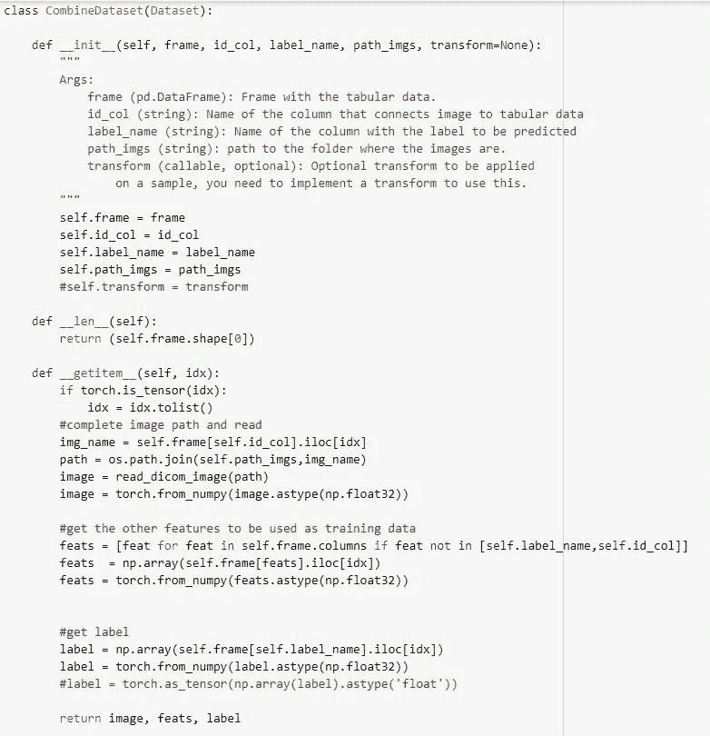
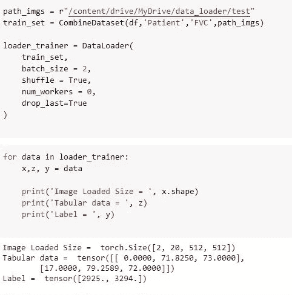

# 在 PyTorch 中创建自己的数据加载器，用于组合图像和表格数据

> 原文：<https://medium.com/analytics-vidhya/creating-your-own-dataloader-in-pytorch-for-combining-images-and-tabular-data-cc2231119939?source=collection_archive---------7----------------------->

这篇文章的主要目的是展示如何使用 Pytorch 中的数据加载器加载图像和元数据/表格，创建批处理并将它们一起提供给网络。当我们想要在网络中的某个点将元数据组合到图像中时，通常需要这样做。

这是一个很好的例子，说明这在临床数据的情况下是有用的。临床数据通常由患者信息(这里称为元数据)组成，如年龄和性别，但也包括其他信息，如患者接受的检查。这些检查通常会生成包含大量有用信息的图像。

这两种数据源生成的数据都是唯一的，可以为多个预测任务增加很多内容。为了最大限度地利用所有可用信息，卷积神经网络可以在成像数据上进行训练，元数据可以添加到密集层中，以便在预测过程中提供额外的信息。

在 Pytorch 中有很多创建自己的数据加载器的教程。其中最好的一个在 Pytorch 文档中可以找到，你可以点击[这里](https://pytorch.org/tutorials/beginner/data_loading_tutorial.html)来查看。下面我将解释数据加载器的每个部分是如何工作的，以及如何根据自己的需要进行调整。

# 数据集

对于一个简单明了的数据加载器来说，最重要的事情之一就是**很好地组织**你的数据。

我所说的结构是指:确保你的图片和表格数据之间有清晰的联系。这可以是一个数字，一个带有图像 id、名称、路径的列，这都没关系，只要你在表中的变量和一个或多个图像之间有明确的联系。

在我们的案例中，我们使用来自 OSIC 肺纤维化进展数据集的测试集，可在[这里](https://www.kaggle.com/c/osic-pulmonary-fibrosis-progression/data?select=test.csv)获得。我们将使用图像名称作为到临床表的连接。

这是我们的表格数据的样子:

表列数据

最重要的列是**患者**列和 **FVC** ，前者包含图像名称，是图像数据的链接，后者是我们的标签。其余变量将用作额外数据，并与网络中的图像相结合。

你可以点击下面找到完整的代码。我将在下面进一步描述每个函数内部发生的事情。

# **如何运作？**

数据加载器将每次加载一个样本，但它将返回一个批量大小的张量。这是一件神奇的事情，可以让训练更快，让你的代码更有条理。

下面是 DataLoader 类的定义和完整代码的链接(如果需要，可以复制粘贴)。

完全码

数据加载器类

在上面的类中，我们有一个 Init 方法，它初始化我们将在数据加载器中使用的变量。方法 *__getitem__* 负责加载我们数据的一个实例。数据加载器将多次自动调用该函数，直到达到批量大小。这里的美妙之处在于，您不必担心调用该函数或控制批量大小以及何时停止，数据加载器会为您完成所有这些工作。

在 *__getitem__* 方法中，我们使用由数据加载器控制并自动递增的 *idx* ，从 *idx* 位置读取样本。我们读取由将图像连接到表格数据的列给出的 dicom 图像，并继续读取表格数据本身和标签。

一旦 DataLoader 到达一个批处理的末尾，它将返回该批处理，以便可以用它来训练模型。数据加载器使用 *__len__* 来标记一个时期的结束。

最后，您只需要创建我们定义的 CombineDataset 类的一个实例，并将其提供给 DataLoader 实例。在这种情况下，我们只为训练集这样做，但是您可以创建多个数据加载器，一个用于训练集、验证集和测试集。

定义 DataLoader 实例时，您可以选择批次大小，如果您想要打乱数据或按顺序使用批次，多进程的数量以加快数据加载，以及如果您想要在最后有一个较小的批次，以防留下一些样本，不足以生成整个批次。

运行中的数据加载器

就这样，您有了一个可以读取和连接表格和图像数据的工作数据加载器。下一步是将这些数据输入网络。为了篇幅和简单起见，我将在下面的文章中介绍这一点。