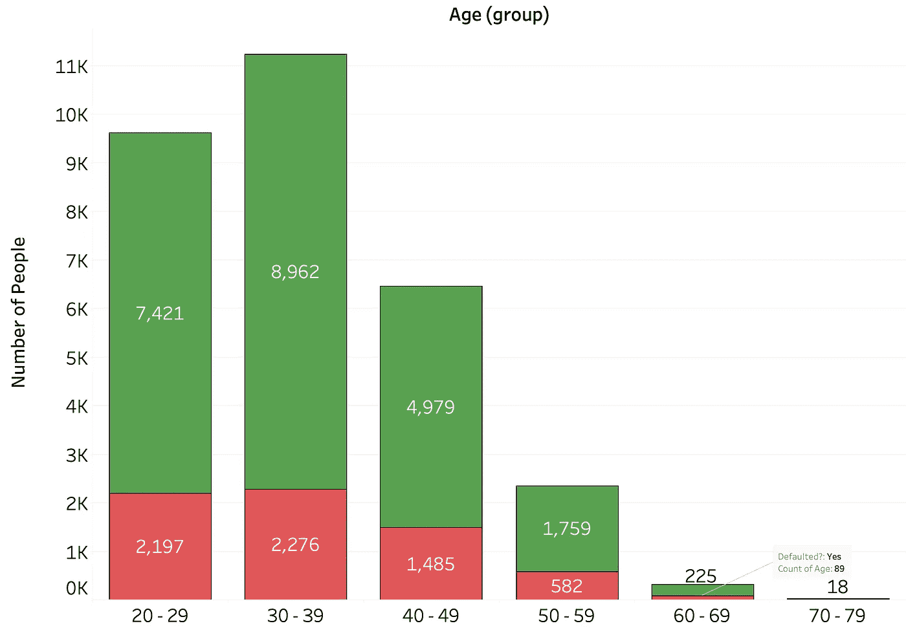

# 信用和使用信用的人。

> 原文：<https://medium.com/analytics-vidhya/credit-and-those-who-use-it-809c431ef40e?source=collection_archive---------34----------------------->

照片由 [Unsplash](https://unsplash.com/s/photos/money?utm_source=unsplash&utm_medium=referral&utm_content=creditCopyText) 上的 [Jp Valery](https://unsplash.com/@jpvalery?utm_source=unsplash&utm_medium=referral&utm_content=creditCopyText)

信贷，一种经常被误解的工具，被视为一种只对债权人有利的工具。它可以被视为将人们锁定在“老鼠赛跑”中的一种手段，或者是年轻人为自己的生活融资的一种方法。然而，它的真正定义更令人清醒:

> "银行信贷是个人或企业可以从金融机构借入的资金总额."— [投资媒体](https://www.investopedia.com/terms/b/bank-credit.asp)

一般来说，对信用卡的看法是正面或反面——“永远不要使用信用卡”或“如果你能还，为什么不呢？”，真理可能介于两者之间，当然这取决于个人。这正是我想知道的。从字面意义和金融意义上讲，谁有能力使用信贷？谁最有可能在利益的压力下倒下？他们能处理多少信贷？为了做到这一点，我冒险进入 UCI 数据库，找到了一个[数据集](https://archive.ics.uci.edu/ml/datasets/default+of+credit+card+clients)，它跟踪了 3 万名不同年龄、性别、教育背景、账单和还款信息的台湾人。

## **年龄不是一切……**

当逐个检查年龄时，我想知道两件事:

1.  年轻人是不是乱借？
2.  年轻人拖欠还款的比例更高吗？

我发现，根据这些数据，第一点是正确的，然而第二点却不正确。相反，数据显示，各年龄组拖欠还款的比例基本相同，30-39 岁的人没有拖欠还款与拖欠还款的比例最低。

显示每个年龄组的人数的条形图，红色表示拖欠利息的人，绿色表示没有拖欠利息的人。

至于第一点:似乎 20 多岁到 30 出头的年轻人更有可能使用信用卡。所以，总而言之，我们年轻人确实借了更多的钱，但这并不一定会让我们更有可能违约或陷入支付利息的怪圈；要看谁是，我们需要看得更远。

## 我有学位，所以我不会拖欠付款。对吗？

正规教育通常与金融教育联系在一起，然而，在这里我们发现它并不总是那么简单。这可能是因为这个数据集只有 30，000 个人，但是当我们画出无违约与违约的比率，并按教育程度划分时，我们得到以下结果:

按教育背景显示拖欠还款者与未拖欠还款者比率的图表。

这可能很难接受。对我来说当然是。违约比例最小的群体是文盲。下一个最小的是那些学习专业课程的人。但与完全跳过高等教育相比，攻读学位并不会降低你违约的可能性。你很可能会问:“每个小组借了多少钱？”。因为如果那些还钱的人比那些不还钱的人借得少得多，那么它可能会使任何结论无效，但在这种情况下，你可以放心这些结论是有效的。为了检查它们，我们将比率形象化为气泡，并标注给定的平均分数。

一种气泡图，其大小由(未违约人数)/(违约人数)决定。每个泡泡上都标有平均学分和教育背景。

看上面的图表，我们可以看到，平均而言，文盲群体借了最多的钱，但仍然能够维持利息支付！而那些在高中停止贷款的人借得最少，但却很难支付利息。在这种情况下，我们甚至可以考虑那些只进行基础 4 年学习的人。他们平均借了新台币 21.7 万元，所有参与的人都没有违约。

## **该收工了。**

我们现在知道不同年龄组和教育背景的表现。我们注意到，参与研究的人和受教育程度不高的人，借款更多，但违约也更少。更重要的是，没有任何群体比继续支付利息更有可能违约。

由于使用的数据仅包含 3 万人，因此正规教育似乎不利于你的金融知识。可能会发生许多事情，阻碍人们支付利息的能力。这项研究中被追踪的台湾人并不能代表地球上的所有人！

我很想知道每个人都把信贷花在了什么地方，因为这可以让我们更清楚地了解人们违约的原因。不管怎样:我希望你喜欢阅读！

参考资料:

https://www.investopedia.com/terms/b/bank-credit.asp

数据集—[https://archive . ics . UCI . edu/ml/datasets/default+of+信用卡+信用卡+客户](https://archive.ics.uci.edu/ml/datasets/default+of+credit+card+clients)