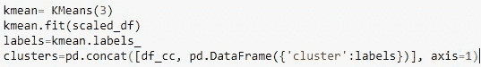

# 信用卡客户细分

> 原文：<https://medium.com/analytics-vidhya/credit-card-customers-segmentation-bc3c5c87ddc?source=collection_archive---------1----------------------->

[客户细分示意图。](https://www.intercom.com/blog/customer-segmentation/)

我创建了一个评估信用卡客户细分的模型，以帮助公司确定其营销策略。我使用了 K-means 算法，K 值由剪影得分确定。我还使用主成分分析进行降维和更好的可视化。

数据来源:[用于聚类的信用卡数据集](https://www.kaggle.com/arjunbhasin2013/ccdata)

内容:

*   商业理解
*   数据理解
*   预处理数据
*   数据标准化
*   使用主成分分析进行降维
*   使聚集
*   形象化
*   建议

*   **业务理解**

这种情况需要开发一个**客户细分**来定义营销策略。样本数据集总结了过去 6 个月中约 9000 名活跃信用卡持卡人的使用行为。该文件是一个具有 18 个行为变量的客户级文件。

但首先，什么是客户细分？

**细分**是制定营销目标和战略的一个组成部分，其中定义这些目标通常包括[1，2]:

(a)根据对当前客户群的分析，分析产品应如何销售或开发

(b)将新的细分市场确定为现有产品或新产品开发的目标。

细分至关重要，因为公司资源有限，必须专注于如何最好地识别和服务客户。

有效的细分使公司能够确定他们应该服务于哪些客户群体，以及如何为每个群体最好地定位他们的产品和服务[3]。

*   **数据理解**

为了更好地理解数据的每个特性，这里有一个数据字典。

*   **数据预处理**

该步骤包括导入所需的包和数据集、检查数据汇总、处理缺失值、检查数据类型以及选择要素。

稍微浏览一下数据:

数据由 8950 行和 18 列组成。这是数据汇总。

有许多异常值(看最大值)，但我没有丢弃它们，因为它们可能包含重要信息，所以我将异常值视为极值。

检查缺失值:

在处理丢失的值之前。

`CREDIT_LIMIT`和`MINIMUM_PAYMENT`包含一些空值。我通过用 means 替换它们来处理这些丢失的值。

处理缺失值后。

没有更多的空值。然后，检查数据类型:

`CUST_ID`有一个数据类型对象，所以我放弃了它。

*   **数据标准化**

[标准化](/@urvashilluniya/why-data-normalization-is-necessary-for-machine-learning-models-681b65a05029)是一种经常应用于机器学习数据准备的技术。规范化的目标是将数据集中数值列的值更改为一个通用的比例，而不会扭曲值范围的差异。对于机器学习来说，并不是每个数据集都需要归一化。仅当要素具有不同的范围时才需要。

*   **使用主成分分析进行降维**

我应用主成分分析(PCA)将数据转换为 2 维进行可视化，因为我们无法可视化 17 维的数据。PCA 将一个大的变量集转换成一个较小的变量集，该变量集仍然包含大集合中的大部分信息。减少数据变量的数量。

应用 PCA。

*   **聚类**

[聚类](https://towardsdatascience.com/k-means-clustering-algorithm-applications-evaluation-methods-and-drawbacks-aa03e644b48a)是最常见的探索性数据分析技术之一，用于获得关于数据结构的直觉。它可以被定义为识别数据中的子组的任务，使得同一子组(聚类)中的数据点非常相似，而不同聚类中的数据点非常不同。

这里我使用了 K-means 算法。K-means 算法是一种迭代算法，试图将数据集划分为 *K* 个预定义的不同非重叠子组(聚类)，其中每个数据点仅属于**一个组**。

为此，我们必须首先指定集群的数量 *K* 。这里我用肘法指定了最佳的 *K* 。肘是一个非常简单的方法，它给出了类似肘形的图形。而我们从图中也很容易猜出 *K* 的最佳个数。

使用弯头方法指定 K。

但是很难找到曲线的肘点，所以决定用**剪影评分**。剪影法可以计算剪影系数，轻松找到 *K* 的准确数字。

使用轮廓分数指定 K。

轮廓系数的值介于-1 和 1 之间。分数 1 表示最好的含义，即数据点在其所属的聚类内非常紧凑，并且远离其他聚类**。**最差值为-1。接近 0 的值表示重叠的簇。

而最高的剪影分数在 **k = 3** 。It 表示最佳的聚类数，在本例中为 3。然后，我将 3 分配给 KMeans 模型。

获得集群后，我使用 FacetGrid 在可视化中解释它们。

使用 FacetGrid 的聚类可视化。

这是简单的结果:

集群的简单解释。

**Cluster 0 :** 该客户群表示一小组余额低、消费少(购买量低)且信用额度最低的客户。

**聚类 1 :** 该客户群表示一大群具有中等余额的客户，具有最高信用限额的消费者(高购买量)。

**聚类 2 :** 该客户群表示具有高余额和现金垫款、低购买频率和高信用限额的小客户群。我们可以假设这个客户群使用他们的信用卡作为贷款。

*   **可视化**

最后，我在散点图中可视化了这些集群。

基于主成分分析的聚类可视化。

*   **推荐:**

对于集群 0，我推荐一张 [**银质信用卡**](http://blog.billie.id/2017/07/01/jenis-kartu-kredit-dan-keuntungannya/) ，因为它是拥有最广泛的信用卡。一般来说，新的信用卡持卡人会收到一张银卡，他们可以在以后升级。银卡的信用额度最低，在 400 万到 700 万印尼盾左右。持卡人必须有至少 300 万印尼盾的月薪。这张卡的好处是限额不算太高。

对于集群 1，我推荐了一张 [**黄金信用卡**](http://blog.billie.id/2017/07/01/jenis-kartu-kredit-dan-keuntungannya/) 。持卡人的月收入必须在 500 万到 1000 万印尼盾之间。根据信用卡发行银行的不同，信贷限额从 1000 万到 4000 万印尼盾不等。这种卡的优点是限额足够大。所以，它可以让你更快地购买/拥有昂贵的物品。你可以用它来偿还大额项目，如摩托车或智能手机。但是，信用卡额度越高，你要交的年费就越高。

最后，针对集群 2，我推荐一张级别最高的****白金信用卡。白金信用卡之所以只被少数人拥有，是因为严格的手续导致办卡不容易。白金信用卡的最高限额为 4000 万至 10 亿印度卢比。持卡人必须每年至少有 1 . 8 亿印尼盾的收入，并有良好的信用记录。****

****访问 [my github](https://github.com/FeniRahmi/CC_segmentation/blob/main/C2G6%20CC%20(3%20clusters)%20updated.ipynb) 查看完整的笔记本。****

****参考资料:****

****[1]安索夫，H.I. (1957 年)。多样化战略。《哈佛商业评论》, 9 月-10 月:113-124 页。****

****[2]m .麦克唐纳和邓巴(2004 年)。*市场细分:如何做，如何从中获利*。伦敦:爱思唯尔。****

****[3] Bruce Cooil，Lerzan Aksoy 和 Timothy L. Keiningham (2008)客户细分方法，关系营销杂志，6:3–4，9–39****