# 信用卡欺诈检测

> 原文：<https://medium.com/analytics-vidhya/credit-card-fraud-detection-fd634f70327d?source=collection_archive---------4----------------------->


[来源](https://dataaspirant.com/credit-card-fraud-detection-classification-algorithms-python/)

在本文中，我们将使用各种机器学习算法来解决信用卡欺诈检测问题，我们还将比较所有这些算法，并找到哪一个最适合这个问题。

文章分为几个部分

1.  问题理解
2.  数据审查
3.  数据处理
4.  特征选择
5.  模型构建
6.  欠采样
7.  过采样
8.  摘要

所以让我们开始吧。

# 1.问题理解

我们先来了解一下什么是信用卡诈骗

> 信用欺诈是指犯罪分子利用他人的个人凭据以及他们的信用状况来借钱或使用信用卡购买商品或服务，而无意偿还债务。

因此，信用卡公司能够识别欺诈性的信用卡交易非常重要，这样客户就不会为他们没有购买的商品付费。

# 2.数据审查

数据集包含欧洲持卡人通过信用卡进行的交易。你可以在这里 找到 Kaggle 信用卡欺诈检测竞赛数据集 [*的全部数据。该数据集显示了两天内发生的交易，其中 284，807 笔交易中有 492 笔欺诈。*](https://www.kaggle.com/mlg-ulb/creditcardfraud)

它们是数据集中的 31 列，其中特征 V1、V2…v 28 是用 PCA 获得的主要成分，唯一没有用 PCA 转换的特征是“时间”和“数量”。它们是一个名为 class 的列，如果交易是合法的(非欺诈)，则该列的值为 0，如果是欺诈，则该列的值为 1。

# 3.数据处理

首先，让我们将数据可视化

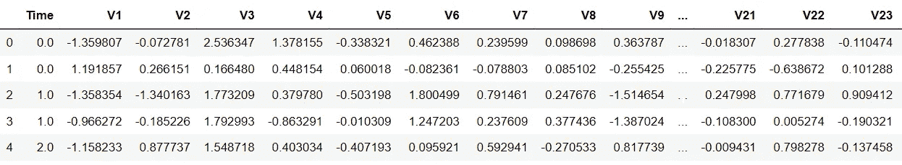

数据

通过观察，特征量的数据值位于 0 到 25691.16 的范围内，这显然是非常宽的范围。因此，我们需要通过应用标准化技术在(-1，1)之间调整它的值。

所以我们正在做的是

```
from sklearn.preprocessing import StandardScalerdata['scaled_Amount'] = StandardScaler().fit_transform(data['Amount'].values.reshape(-1,1))data = data.drop(['Amount'],axis=1)
```

因此，通过使用 sklearn 预处理模块中的 StandardScaler 函数，我们可以对数据集中的 Amount 列进行转换。

## 什么是 StandardScaler？

标准缩放器将要素缩放为平均值为 0，标准差为 1。它输出非常接近正态分布。

请注意，我们正在进行整形(-1，1)以将数组序列转换为 2D 数组。

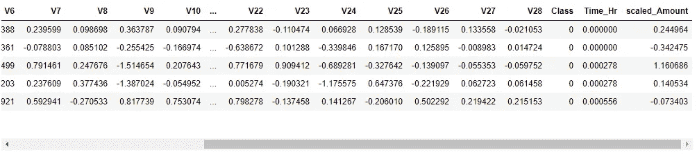

比例金额

在上图中，你可以看到输出。

# 4.特征选择

## 时间

让我们绘制图表，显示合法交易和欺诈交易在时间变量方面的相似性。

```
data["Time_Hr"] = data["Time"]/3600 # convert to hours
print(data["Time_Hr"].tail(5))
fig, (ax1, ax2) = plt.subplots(2, 1, sharex = True, figsize=(10,6))
ax1.hist(data.Time_Hr[data.Class==0],bins=48,color='g',alpha=0.5)
ax1.set_title('Genuine')
ax2.hist(data.Time_Hr[data.Class==1],bins=48,color='r',alpha=0.5)
ax2.set_title('Fraud')
plt.xlabel('Time (hrs)')
plt.ylabel('# Transactions')
```

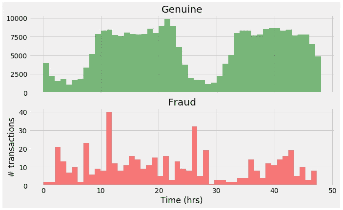

时间变量

通过看图表，我们可以说，他们没有太多的信息来证明交易是欺诈。所以它没有任何预测能力，因为我们可以简单地从数据集中删除时间变量。

现在让我们检查变量数量

```
fig, (ax3,ax4) = plt.subplots(2,1, figsize = (10,6), sharex = True)
ax3.hist(data.Amount[data.Class==0],bins=50,color='g',alpha=0.5)
ax3.set_yscale('log') # to see the tails
ax3.set_title('Genuine') # to see the tails
ax3.set_ylabel('# transactions')
ax4.hist(data.Amount[data.Class==1],bins=50,color='r',alpha=0.5)
ax4.set_yscale('log') # to see the tails
ax4.set_title('Fraud') # to see the tails
ax4.set_xlabel('Amount ($)')
ax4.set_ylabel('# transactions')
```

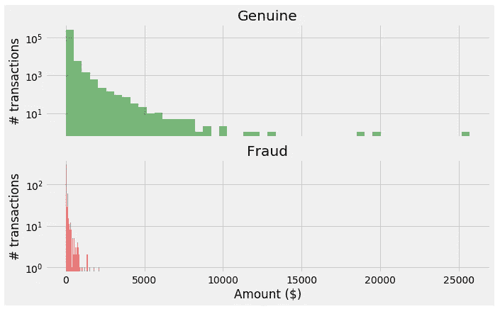

数量变量

因此，你可以清楚地看到两个图表中的巨大差异，即真实和欺诈。同样重要的一点是，在真正的(合法交易)中，超过 1 万英镑的交易已经完成，但在欺诈案件中，没有交易超过 1 万英镑。

所以我们可以说它有预测能力。

同样，我们需要检查 V1 到 V28 的所有功能，以便如果任何变量在合法和欺诈交易中没有差异，那么我们可以放弃该功能。你可以在我的 [github repo](https://github.com/kamlesh11/Credit-Card-Fraud-Detection) 看到每个变量的分析。

现在，我们已经选择了所有可训练的特征，因此我们可以将数据分成训练集和测试集。

## 分割数据

我们将把数据分成 80%的训练集和 20%的测试集

```
def split_data(df,drop_list):
    df=df.drop(drop_list,axis=1)
    X=df[df['Class']==1]
    Y=df[df['Class']==0]
    X=df.drop(['Class'], axis = 1) 
    Y=df["Class"] 
    xData = X.values 
    yData = Y.values 
    xTrain, xTest, yTrain, yTest = train_test_split( 
            xData, yData, test_size = 0.2, random_state = 42)
    return xTrain, xTest, yTrain, yTestdrop_list = ['V13','V15','V22','V26','V25','V23']
x_Train,x_Test,y_Train,y_Test=split_data(data,dropList)
```

我们正在创建 helper 函数 print_scores，它将接受 y_Test、y_preds 和 y_pred_probs(预测概率),并将为我们打印所有测量值，即 precision、recall、f1_score、AUC_score、ROC_AUC score 和 kappa score(cohen kappa score)。

```
# print_scores function for printing scores
def print_scores(y_test,y_pred,y_pred_prob):
    precision,recall,_ =      precision_recall_curve(y_test,y_pred_prob[:,1])
    print('precision_score : ',precision_score(y_test,y_pred))
    print('recall_score : ',recall_score(y_test,y_pred))
    print('f1 score : ', f1_score(y_test,y_pred))
    print('AUC score : ', auc(recall,precision))
    print('ROC_AUC score : ', roc_auc_score(y_test, 
y_pred_prob[:,1]))
    print('kappa : ', cohen_kappa_score(y_test,y_pred))
```

# 5.模型结构

具体来说，我已经建立了 7 个不同的模型

## 1.朴素贝叶斯

*   它是一种基于贝叶斯定理的分类技术，假设预测因子之间是独立的。简而言之，朴素贝叶斯分类器假设一个类中特定特征的存在与任何其他特征的存在无关。

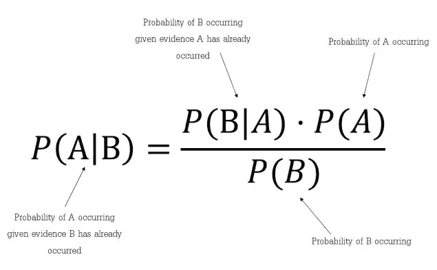

*   具体来说，它直接从概率的角度使用贝叶斯定理的概念。
*   假设交易是合法的，我们正在计算交易被欺诈的概率。同样的道理，最终的预测是两者的最大值。
*   更多信息可以访问 [*这里*](https://www.analyticsvidhya.com/blog/2017/09/naive-bayes-explained/) *。*

```
from sklearn.naive_bayes import GaussianNB
NBclf=GaussianNB()
NBclf.fit(x_Train,y_Train)
NB_pred,NB_pred_prob=NBclf.predict(x_Test),NBclf.predict_proba(x_Test)
print_scores(y_Test,NB_pred,NB_pred_prob)
```

## 2.逻辑回归

*   **逻辑回归**是因变量为二分变量(二元)时进行的适当回归分析。像所有回归分析一样，逻辑回归是一种预测分析。逻辑回归用于描述数据，并解释一个因变量与一个或多个名义变量、序数变量、区间变量或比率水平自变量之间的关系。
*   简单地说，它使用逻辑函数(Sigmoid 函数)进行预测。
*   点击可以了解更多关于 [*的逻辑回归知识。*](https://towardsdatascience.com/logistic-regression-detailed-overview-46c4da4303bc)

```
from sklearn.linear_model import LogisticRegression
lr = LogisticRegression(C = 0.01, penalty = 'l2',max_iter=1000)
lr.fit(x_Train, y_Train)
lr_pred,lr_prob=lr.predict(x_Test),lr.predict_proba(x_Test)
print_scores(y_Test,lr_pred,lr_prob)
```

## 3.线性判别分析

*   [*线性判别分析*](https://towardsdatascience.com/linear-discriminant-analysis-in-python-76b8b17817c2#:~:text=Linear%20Discriminant%20Analysis%20(LDA)%20is,as%20much%20information%20as%20possible.) ，正态判别分析，或称判别函数分析是 Fisher 线性判别的推广，是统计学等领域使用的一种方法，寻找表征或区分两类或两类以上对象或事件的特征的线性组合。

```
from sklearn.discriminant_analysis import LinearDiscriminantAnalysis
lda_clf=LinearDiscriminantAnalysis()
lda_clf.fit(x_Train,y_Train)
lda_pred, lda_prob = lda_clf.predict(x_Test),lda_clf.predict_proba(x_Test)
lda_precision,lda_recall,_ = precision_recall_curve(y_Test,lda_prob[:,1])
print_scores(y_Test,lda_pred,lda_prob)
```

## 4.决策图表

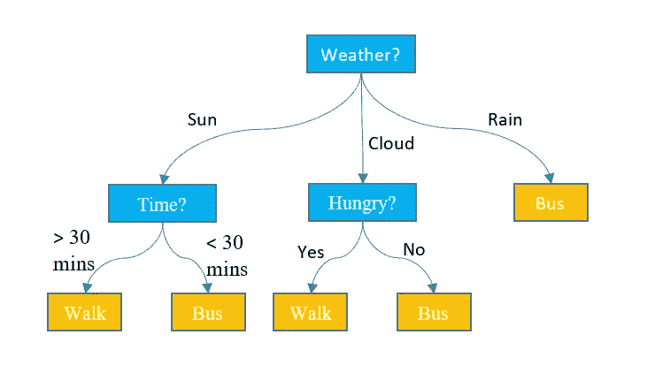

决策图表

*   我希望你能从上面的图片中了解什么是决策树。

```
from sklearn.tree import DecisionTreeClassifier
Dtree = DecisionTreeClassifier()
Dtree.fit(x_Train,y_Train)
DT_preds,DT_probs = Dtree.predict(x_Test),Dtree.predict_proba(x_Test)
print_scores(y_Test,DT_preds,DT_probs)
```

## 5.随机森林

随机森林(随机森林分类器)是许多这样的决策树的集合和许多决策树的组合。

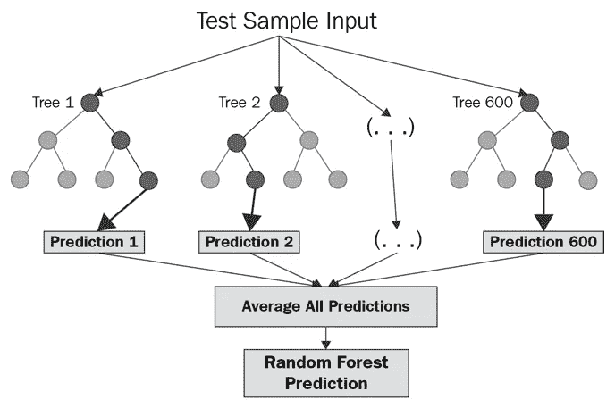

[谷歌](https://www.google.com/url?sa=i&url=https%3A%2F%2Fcorporatefinanceinstitute.com%2Fresources%2Fknowledge%2Fother%2Frandom-forest%2F&psig=AOvVaw0VQzHvQ5OoUbL9QUouLd2A&ust=1616169824690000&source=images&cd=vfe&ved=0CA0QjhxqFwoTCPCsvPmbuu8CFQAAAAAdAAAAABAx)

```
from sklearn.ensemble import RandomForestClassifier
RF_clf = RandomForestClassifier()
RF_clf.fit(x_Train, y_Train)
RF_pred,RF_prob = RF_clf.predict(x_Test),RF_clf.predict_proba(x_Test)
print_scores(y_Test,RF_pred,RF_prob)
```

## 6.支持向量机

支持向量机算法的目标是在 N 维空间(N-特征的数量)中找到一个超平面，该超平面清楚地分类数据点。

它的概念是取 N 维输入并将其扩展到第 N+1 维，找到超平面，然后将其降低到第 N 维。我们得到了决策边界。

```
from sklearn.svm import SVC
clf = SVC(probability=True)
SVM_pred,SVM_prob=SVMclf.predict(x_Test),SVMclf.predict_proba(x_Test)
print_scores(y_Test,SVM_pred,SVM_prob)
```

## 7.深度神经网络

我已经建立了一个 5 层的神经网络，通过它我得到了非常好的结果。

但是您可以微调以获得更好的性能。

我使用 4 个密集层和 1 个丢弃层，阈值为 0.5，优化器为 adam，损失为 binary_crossentropy，因为这是一个分类问题，特别是 2 个二进制分类问题。

```
import keras
from keras import layers
from keras.models import load_model# Deep Neural Network

model = keras.Sequential([
layers.Dense(input_dim = 23,units= 23, activation = 'relu'),
layers.Dense(units = 20,activation = 'relu'),
layers.Dropout(0.5),
layers.Dense(units = 16,activation = 'relu'),
layers.Dense(units =1, activation = 'sigmoid')])model.compile(optimizer = 'adam', loss = 'binary_crossentropy', metrics = ['accuracy'])
model.fit(x_Train, y_Train, batch_size = 16, epochs = 5)Dnn_preds,Dnn_prob= model.predict(x_Test),model.predict_proba(x_Test)print_scores(y_Test ,DNN_preds)print('precision_score :',precision_score(y_Test,Dnn_preds.round()))
print('recall_score : ',recall_score(y_Test,Dnn_preds.round()))
print('f1_score : ',
f1_score(y_Test,Dnn_preds.round()))
print('AUC_score : ', auc(DNN_recall,DNN_precision))
print('ROC_AUC_score : ', roc_auc_score(y_Test, Dnn_prob))
print('kappa : ', cohen_kappa_score(y_Test,Dnn_preds.round()))
```

通过将数据拟合到所有模型，我们得到了以下结果。

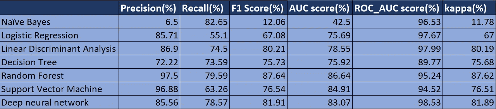

表演

通过查看上面的性能表，你可以肯定地说，随机森林正在赢得这场比赛。

让我们看看我们的赢家随机森林的精度与召回分数

```
plt.figure(figsize=(8,6))
plt.title('Precision Recall Curve of Random Forest Classifier')
plt.plot(RF_recall, RF_precision, label='Random Forest',color='violet')
plt.xlabel('Recall')
plt.ylabel('Precision')
plt.legend(loc='lower left')
plt.show()
```

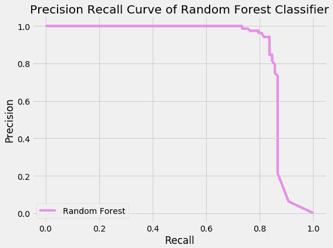

精确召回图

同样，您可以绘制任何分类器的图形。我只是给你看其中最好的一个。

你可以从 [*这里*得到完整的代码。](https://github.com/kamlesh11/Credit-Card-Fraud-Detection/blob/main/Credit%20card%20fraud%20detection%20Oversampling.ipynb)

## 但是在我们的数据集中有一个问题

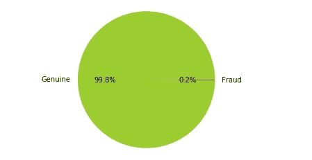

数据饼图

在这里，您可以看到数据高度偏向于真实负值，即真实(合法)交易。

我们稍后会看到我们能做些什么来克服这个问题。

我们知道该数据高度偏向于负成交，即合法交易，因此我们需要采取一些措施来平衡数据分布。

有两种技术我们可以应用欠采样和过采样

先来看欠采样。

# 6.欠采样

> [](https://machinelearningmastery.com/undersampling-algorithms-for-imbalanced-classification/)**欠采样，包括通过消除属于多数类的样本来减少数据，目的是均衡每个类的样本数量。**

*因此，我们将从合法交易中删除一些数据，以平衡数据。*

*让我们看看欠采样的代码。请注意，我们选择随机选项并删除它们以获得相同的分布。我们这样做是以一些有用的信息为代价的。😢*

```
*df=data
fraud_ind = np.array(df[df.Class == 1].index)
gen_ind = df[df.Class == 0].index
n_fraud = len(df[df.Class == 1])
# random selection from genuine class
random_gen_ind = np.random.choice(gen_ind, n_fraud, replace = False)
random_gen_ind = np.array(random_gen_ind)
# merge two class indices: random genuine + original fraud
under_sample_ind = np.concatenate([fraud_ind,random_gen_ind])
# Under sample dataset
undersample_df = df.iloc[under_sample_ind,:]
y_undersample  = undersample_df['Class'].values #target
X_undersample = undersample_df.drop(['Class'],axis=1).values #featuresprint("# transactions in undersampled data: ", len(undersample_df))
print("% genuine transactions: ",len(undersample_df[undersample_df.Class == 0])/len(undersample_df))
print("% fraud transactions: ", sum(y_undersample)/len(undersample_df))*
```

*通过应用非抽样，我们只剩下 984 个观察值。*

*好了，现在让我们看看算法的性能。*

*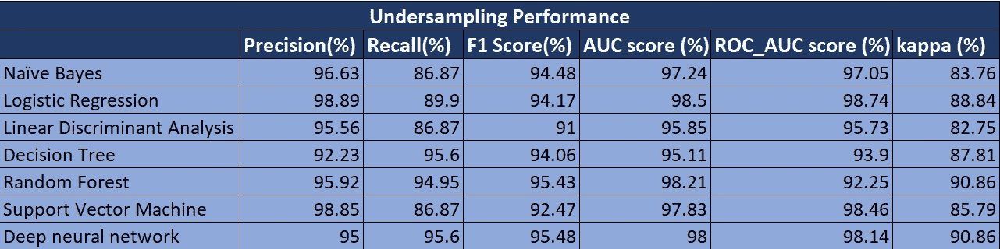*

*欠采样性能*

*通过使用欠采样，我们得到了一些好的结果。但现在，兰登森林和 DNN 之间展开了激烈的竞争。尽管如此，兰登森林仍然在所有公司中表现良好。*

*现在让我们看看它的精确回忆图*

*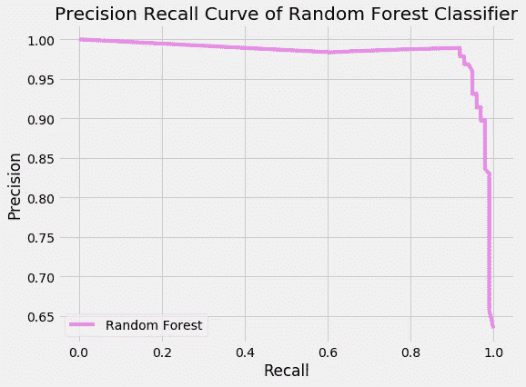*

*应用欠采样后随机森林的精确召回图*

*你可以看到它现在做得好多了。*

*让我们看看过采样的性能如何。*

# *7.过采样*

> *[*SMOTE*](https://machinelearningmastery.com/smote-oversampling-for-imbalanced-classification/) *首先随机选择一个少数类实例 a，找到其 k 个最近的少数类邻居。然后，通过随机选择 k 个最近邻居 b 中的一个并连接 a 和 b 以在特征空间中形成线段，来创建合成实例。合成实例生成为两个选定实例 a 和 b 的凸组合。**

*在这里，我们将一些样本添加到欺诈交易中，以均衡数据。*

```
*drop_list = ['V13','V15','V22','V26','V25','V23']
Y = data['Class']
X=data.drop(['Class']+drop_list, axis = 1)
X_resample, y_resample = SMOTE().fit_resample(X, Y)
print(X_resample.shape)*
```

*就这样，我们的数据现在被过度采样了。过采样后的样本总数为 568630。现在数据的分布是 50-50。*

*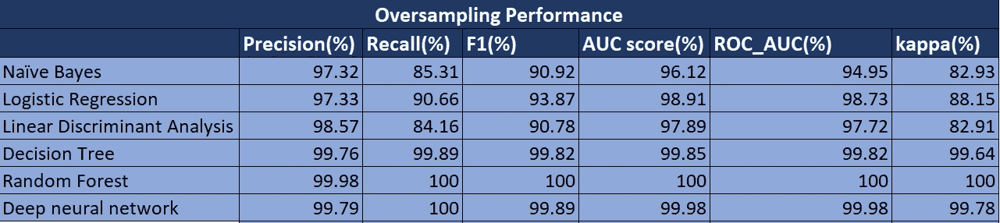*

*过采样性能*

*上述性能肯定是令人满意的，因为在它所有的算法都做得非常好，但这里值得注意的是，我们在随机森林的测量中获得了大约 100%的准确性。*

*另一个需要注意的重要事项是，在过采样中，我没有使用 SVM，因为我们的数据大小增加到 568630 个样本，如果我们对其应用随机森林，它将无休止地运行。*

*现在让我们看看精确回忆曲线。*

*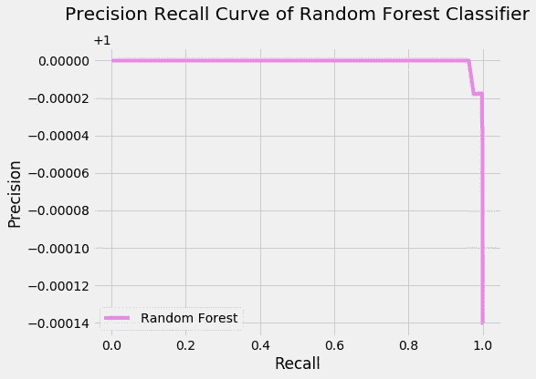*

*应用过采样后随机森林的精确召回曲线*

*对于我们的问题来说，它是一个近乎完美的分类器。*

> *结论声明是，在应用所有技术后，我们在过采样中获得了最佳结果，在分析上述结果后，该问题的最佳算法是**随机森林。***

# *8.摘要*

*我们创建了 7 个模型来解决这个问题，并对其进行了分析，根据我们得到的结果，发现随机森林是迄今为止最好的。这就是信用卡欺诈检测之旅。🍻*

*你可以在我的 github 库[这里](https://github.com/kamlesh11/Credit-Card-Fraud-Detection)获得完整的代码。*