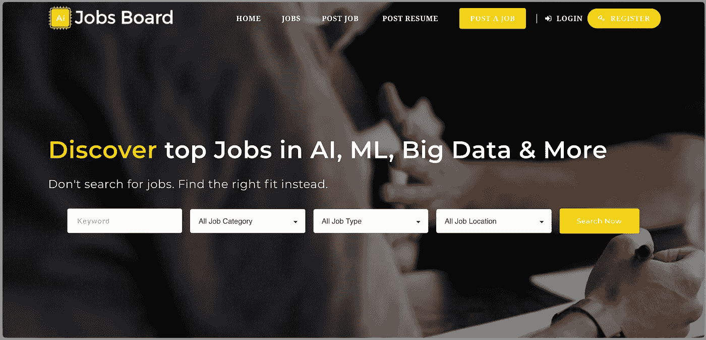
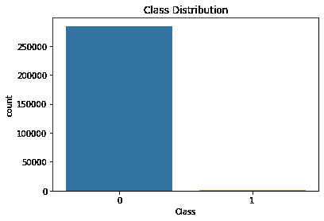
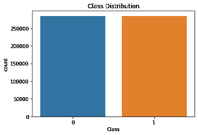
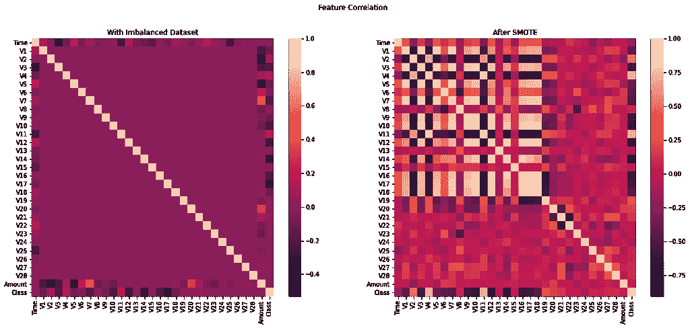
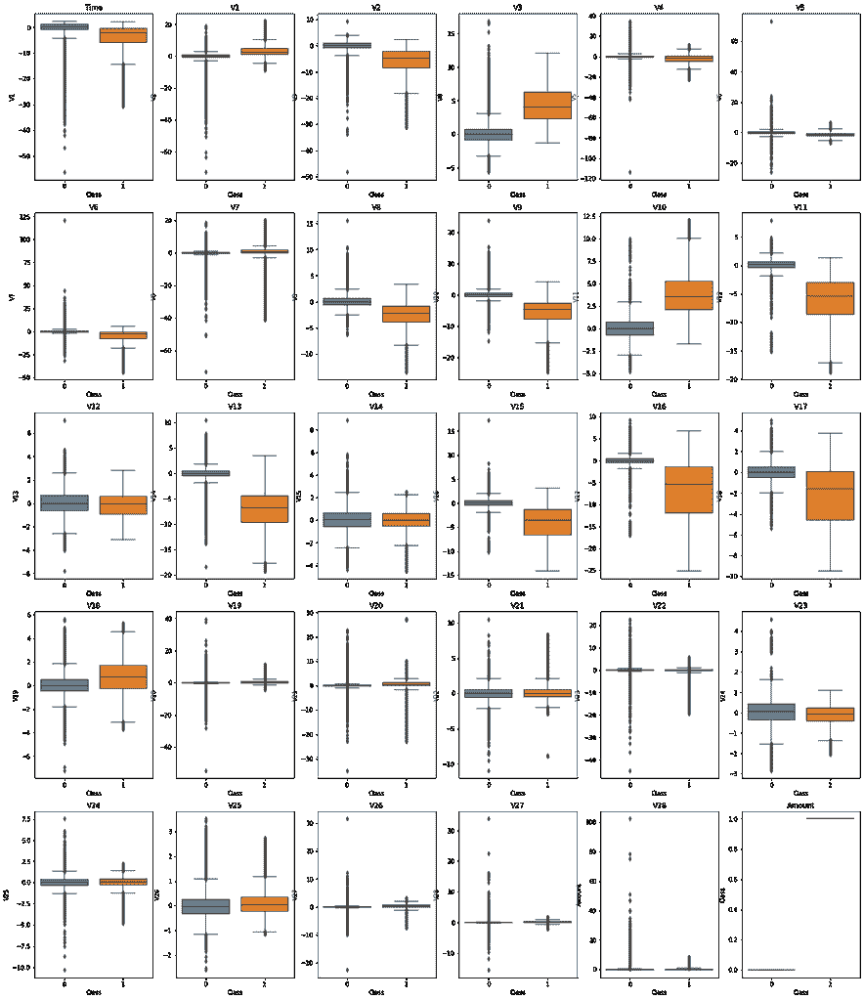
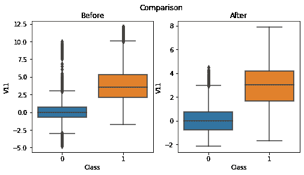
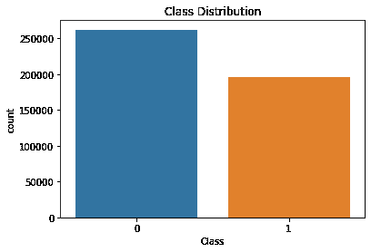
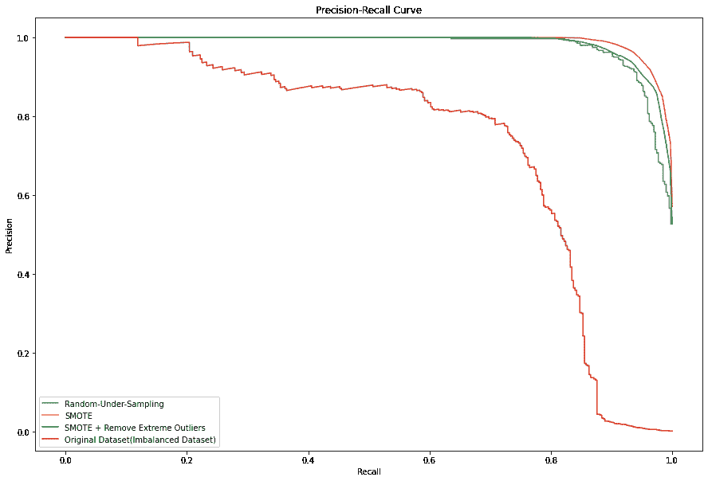
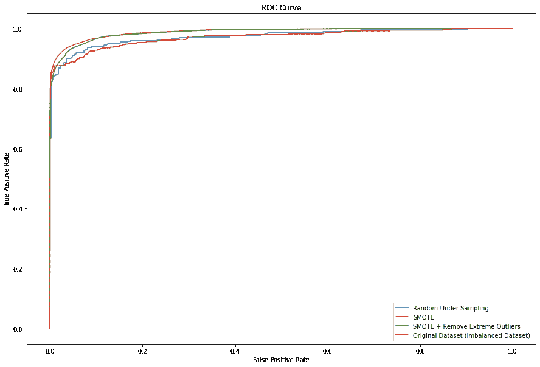

# 信用卡欺诈检测:如何处理不平衡数据集

> 原文：<https://medium.com/analytics-vidhya/credit-card-fraud-detection-how-to-handle-imbalanced-dataset-1f18b6f881?source=collection_archive---------4----------------------->

本帖将**聚焦于一步一步的项目** **和结果**，你可以在我的 [Github 中查看我的代码。](https://github.com/leoniemwindari/credit-card_fraud-detection)

***标签:*** [*机器学习*](https://becominghuman.ai/digital-processes-inspiring-analog-paintings-a358eb7801a0) *(* ***逻辑回归*** *)，python，jupyter 笔记本，不平衡数据集(***，****smote****)**

# *介绍*

*信用卡欺诈是使用信用卡或借记卡等支付卡实施的欺诈的总称。目的可能是获取商品或服务，或者向罪犯控制的另一个账户付款。([维基百科](https://en.wikipedia.org/wiki/Credit_card_fraud))*

*这对受害者和信用卡公司本身都是一个大问题，因为它给双方都造成了经济损失。对于信用卡公司来说，检测哪些交易是欺诈，哪些不是非常重要。*

*通过[机器学习](https://becominghuman.ai/digital-processes-inspiring-analog-paintings-a358eb7801a0)，我们可以从历史数据中检测出欺诈交易，并拒绝交易，这样公司和个人都不会有损失。*

*

大数据工作* 

# *目的*

*我们有很多方法可以处理不平衡的数据集，在这个项目中，我们将比较每种技术(**随机欠采样**和 **SMOTE** )，看看哪种技术最适合这个不平衡的数据集。*

*要检测一个欺诈检测，我们可以使用[机器学习](https://becominghuman.ai/ai-machine-learning-deep-learning-explained-in-5-minutes-b88b6ee65846)，其中有很多机器学习算法。在这个项目中，我们还将看到哪些[机器学习](https://becominghuman.ai/visual-music-machine-learning-workshop-for-kids-a90c957dab33)模型最适合**逻辑回归、K-最近邻、支持向量机、**和**随机森林。***

# *数据*

*数据集包含由**欧洲持卡人**于 2013 年 9 月**日**用信用卡进行的交易，它呈现了两天内发生的**交易。它只包含作为 PCA 变换结果的数字输入变量。唯一没有用 PCA 变换的特征是 ***时间*** 和 ***数量*** 特征。***

****Time*** 特性包含数据集中每个事务与第一个事务之间经过的秒数。当 ***金额*** 为交易金额时，此功能可用于依赖示例的成本感知学习。特征 ***类*** 为响应变量，在欺诈的情况下取值 1，否则取值 0。*

***数据来源** : [Kaggle](https://www.kaggle.com/mlg-ulb/creditcardfraud)*

# *热门人工智能文章:*

> *[1。在 15 分钟内写出你的第一个人工智能项目](https://becominghuman.ai/write-your-first-ai-project-in-15-minutes-a287ed348e7c)*
> 
> *[2。使用 xVASynth](https://becominghuman.ai/generating-neural-speech-synthesis-voice-acting-using-xvasynth-fc978fdf24c1) 生成神经语音合成声音动作*
> 
> *[3。2021 年五大人工智能趋势](https://becominghuman.ai/top-5-artificial-intelligence-ai-trends-for-2021-a3075fea6658)*
> 
> *[4。为什么你用错了 Spotify](https://becominghuman.ai/why-youre-using-spotify-wrong-b827eb47c249)*

# *方法*

*使用的[机器学习](https://becominghuman.ai/know-the-biggest-notable-difference-between-ai-vs-machine-learning-cc1d7d18976a)方法是**分类，**这个项目的目的是将每个交易分类为欺诈和非欺诈，并比较哪个分类算法最适合这个数据集。*

*用于比较的分类算法是逻辑回归、K-最近邻、支持向量机和决策树。*

# *分析*

*信用卡交易的数据集显示这个数据集是不平衡的，从上图我们可以看到。*

**

***图一。**类别分布显示不平衡数据集*

*当我们处理一个不平衡的数据集时，我们不能简单地使用它，并将其处理成机器学习。这可能会导致对班级大多数人的偏见，从而导致糟糕的机器学习模型。*

*因此，我们必须首先处理不平衡的数据集。*

*我们可以使用许多技术来处理不平衡数据集，比如随机欠采样和随机过采样。在这个项目中，我将使用随机欠采样和 SMOTE 来处理不平衡的数据集，并比较哪一个最适合这个数据集。*

*SMOTE 是一种技术，通过填充每个值之间的间隙对少数类进行过采样，然后对多数类进行欠采样，使其在中间相遇。*

**

***图二。**执行 SMOTE 后的等级分布*

*我们可以从图 2 中看到，执行 SMOTE 后，类分布变得相等。*

*这个数据集没有丢失值，所以我们不必处理它。*

*通过执行此技术，我们还可以看到在执行 SMOTE 之前和之后，查看特征之间的相关性有多么不同。*

**

***图三。**特征关联*

*我们可以看到，在执行 SMOTE 之前，我们看不到每个特征之间的相关性，但是当数据平衡时，我们可以清楚地看到相关性。*

**

***图 4。**按类别分类的每个特征的箱线图*

*在这里我们可以看到，一些功能类之间有一个明确的范围。我们还可以看到有很多异常值。因此，我们将从与类高度相关的特征中移除极端离群值。*

*从箱线图中，我们可以看到与类有负相关和正相关的数据集:*

***负相关:**时间 V2 V6 V8 V9 V11 V13 V15 V16 V17*

***正相关:** V1 V3 V10 V18*

*我们可以看到与该类高度相关的功能是 V2 V3 V8 V10 V11 V13 V15 V16 V17 V18，因此我们将从该数据集中删除异常值。*

*以下是移除其中一个特征上的异常值前后的比较。*

**

***图 5。**剔除异常值前后*

*用于去除极端异常值的阈值是 1.5 IQR。截止值将用于确定范围，范围下限从 Q25 —截止值开始，直到范围上限 Q75 +截止值。*

*超出这些范围值将被删除。*

*移除异常值后，我们可以看到欺诈案例(类别 1)数据集中的数据略有减少。虽然数据看起来不平衡，但认为这个数据集不平衡并没有很大的不同。*

*通常，如果比率在 8 : 2 左右，您会认为数据是不平衡的。*

**

***图 6。**剔除异常值后的类分布*

*最后，我们将进行随机抽样，我们可以通过使用 imblearn 库来完成。我们将比较所有 4 个现有数据集，它们是:*

1.  *原始/原始数据集*
2.  *SMOTE 后的数据集*
3.  *SMOTE 和去除极端异常值后的数据集*
4.  *随机欠采样后的数据集*

*如果您正在处理不平衡的数据集，将精度作为参数并不好，因为精度会给出很高的值，但这只是因为它们成功预测了多数类(这称为有偏)。所以这就是为什么我使用精度和召回作为一个参数来决定哪一个有最好的性能。*

*Precision 和 Recall 只查看类，不受其他类的影响，所以即使我们的数据不平衡，我们也不必担心结果会有偏差。*

*我将对上述数据集的 4 个数据进行逻辑回归，然后对它们进行比较。*

# *结果*

**

*图 7。精确回忆曲线*

*这里我们可以看到，经过 SMOTE 处理的数据集给出了最佳的精度-召回曲线。这里我们可以看到，删除离群值实际上会丢弃有用的信息，随机欠采样也是如此，我们会丢失许多可以帮助我们分类的有用信息。但是这两个数据集仍然比未经适当处理的原始数据集具有更高的查准率。*

**

***图 8。** ROC 曲线*

*我们还可以从 ROC 曲线中看到，使用 SMOTE 可以得到最好的结果。有了 ROC 曲线，它可以帮助你决定哪种方法更好。*

# *结论*

1.  *对于这种信用卡欺诈检测，处理不平衡数据集的最佳技术是 SMOTE(合成少数过采样技术)。*

## *页（page 的缩写）S*

*我实际上正在比较哪种机器学习算法最适合，但结果有点奇怪，所以我决定不把它放在这里，再试一次。有些理论我还没有完全掌握，我正在研究。*

*大概过几天我会加进去，用 GridSearchCV(我还没完全理解)。我还可以分析哪些与类别高度相关(不是手动的，因为我在这里就是这么做的，技术上我可以使用散点图)，或者哪些特征可以帮助我们区分类别。*

*如果你发现有问题，请给我你的意见和建议。这对我帮助很大。我是这方面的新手，所以请对我手下留情！*

***评论:***

*这不是一个大项目，但我通过这个项目学到了很多东西，它帮助我了解了许多机器学习参数，我们可以用这些参数来评估我们的模型，以及我们可以用来处理不平衡数据集的不同方法。*

# *别忘了给我们你的👏！*

********