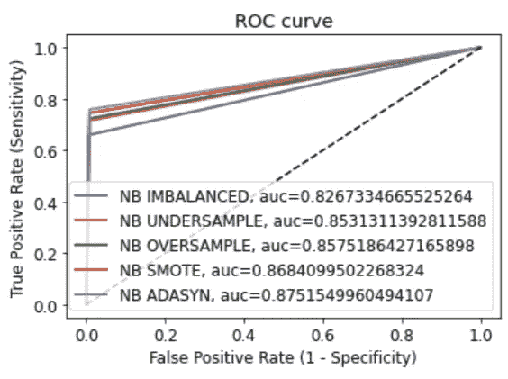

# 信用卡欺诈检测—第 2 部分

> 原文：<https://medium.com/analytics-vidhya/credit-card-fraud-detection-part-2-3e75d0022b9b?source=collection_archive---------11----------------------->

在这一部分中，我们将更深入地研究我们将要使用的模型和数据不平衡技术。

我们首先删除数据框中添加的所有其他数量(仅保留对数比例数量),并将所有要素放入“X”中。我们必须预测' Class ',所以我们将它从' X '中删除，并存储在标签' y '中。

正如我们在 EDA 部分 [(Part-1)](https://vasudhatapriya2.medium.com/credit-card-fraud-detection-part-i-1061d4c0bd68) 中看到的，这个数据集存在巨大的类不平衡。

# **为什么阶级不平衡是一个问题？**

当在高度不平衡的数据集上训练统计分类器时，它倾向于挑选最流行的类中的模式，而忽略其余的。

例如，在这个数据集中，99.9%的数据被标记为“非欺诈”，其余的为“欺诈”。因此，即使一个模型将它看到的一切都归类为“非欺诈”，准确率也将达到 99.9%，这似乎非常好。

但是模式好吗？**否**，因为它没有将任何交易归类为‘欺诈’。所以，即使模型有 99.9%的准确率，也完全没用！

我们需要一些*策略*来处理这样的数据集，或者我们需要在这样的场景中使用一些其他的*指标*(除了准确性)。

# 处理阶级不平衡

在这篇博客中，我们将使用 4 种技巧来处理班级失衡问题。

## 1.欠样本多数类

在欠采样中，多数类中的样本数被下采样(通过随机消除它们)以使它们与少数类中的样本数对齐。

这可能导致*数据低效*，因为有用数据的丢失可能使基于规则的分类器更难学习少数和多数样本之间的决策边界。

尽管受到严重不平衡的影响，这种技术仅在少数类具有足够的数据时有效。

## 2.过样本少数类

这与欠采样正好相反。少数类中的样本数被随机复制，以使它们与多数类中的样本数一致。

这可能导致*过度拟合*，因为它制作了少数类样本的精确副本(它没有向模型添加任何新信息，而只是复制了数据样本)。

## 3.合成少数过采样技术(SMOTE)

SMOTE 是一种过采样技术，它在少数类中创建新的*合成*示例，这些示例与已经存在的示例*相似*，而不是简单地复制它们。

> SMOTE 首先随机选择一个少数类实例 a，并找到其 k 个最近的少数类邻居。然后，通过随机选择 k 个最近邻居 b 中的一个并连接 a 和 b 以在特征空间中形成线段，来创建合成实例。合成实例被生成为两个所选实例 a 和 b 的凸组合。
> 
> *第 47 页，* [*《不平衡学习:基础、算法、应用》*](https://amzn.to/32K9K6d) *，2013 年。*

SMOTE 流程包括以下内容:

1.  识别特征向量及其最近邻。
2.  取两者之差。
3.  将差值乘以 0 到 1 之间的随机数。
4.  通过将随机数添加到特征向量来识别线段上的新点。
5.  对识别的特征向量重复该过程。

这种方法的局限性在于，当在不考虑多数类的情况下创建合成示例时，如果类之间有很强的重叠，则会导致创建不明确的样本。

## 4.自适应合成样本(ADASYN)

ADASYN 背后的基本思想是根据不同少数类示例的学习难度级别对它们使用加权分布(为更容易学习的少数类示例生成更多合成数据)。

ADASYN 方法以两种方式改进了关于数据分布的学习:

1.  它减少了阶级不平衡带来的偏见。
2.  它自适应地将分类决策边界移向困难的例子。

**注:**在应用 过采样技术之前，重要的是分成测试和训练集 ***。分割数据之前的过采样会导致在测试和训练集中出现相同的观察结果，这只会让我们的模型记住这些数据点(并导致过拟合)。***

导入依赖项:

让我们为所有这些类不平衡方法准备数据集。

**随机下采样数据集**


欠采样数据集的输出

**随机过采样器数据集**


过采样数据集的输出

**SMOTE 数据集**


SMOTE 数据集的输出

**ADASYN 数据集**


ADASYN 数据集的输出

# 韵律学

**混淆矩阵**(误差矩阵)，允许算法性能的可视化。


**真阳性(TP) :** 欺诈被正确识别为欺诈

**真阴性(TN) :** 非欺诈被正确识别为非欺诈

**误报(FP) :** 欺诈被错误地识别为非欺诈

**假阴性(FN) :** 非欺诈被错误地识别为欺诈

## **精度**

**(TP +TN) / (TP + TN + FP +FN)**

如前所述，我们需要一些其他的度量来评估我们的模型(除了准确性)。

## **精度**

**TP / (TP + FP)**

Precision 告诉我们有多少正确预测的案例实际上变成了阳性(*阳性类别的预测正确的可能性有多大*)。

## **回忆**

**TP / (TP + FN)**

回忆告诉我们有多少实际的阳性案例我们能够用我们的模型*正确预测(模型识别阳性类别的能力有多强)。*

## **F1 得分**

当我们试图提高精确度时，召回率会下降，反之亦然。F1 分数在一个值中捕捉了这两种趋势。这是回忆和精确的调和平均值。

**F1 得分:2 x((精度 x 召回)/(精度+召回)**

当精确度和召回率相等时，F1 得分最高。

对于这个数据集，我们将使用 F1 分数来比较各种模型的结果。

## **ROC 曲线**

ROC 曲线是在不同阈值设置下真阳性率(TPR)对假阳性率(FPR)的曲线图。

为了计算每个分类模型的性能(使用所有五个数据集)，创建一个函数来评估上面提到的所有度量并存储它们，以便以后可以比较它们，这将是非常有益的。

# 分类算法

在这里，我们将在应用这些算法之前简要地讨论它们。

> 对于这些分类算法中的每一个，我们将检查所有的类别不平衡技术(对于上面制作的数据集),并最终使用前面提到的度量来比较结果。所以，让我们开始吧！

## 1.逻辑回归分类器

```
Model Name : LR IMBALANCED
Test Accuracy :0.99826
Test AUC : 0.50000
Test Precision : 0.00000
Test Recall : 0.00000
Test F1 : 0.00000
Confusion Matrix : 
 [[84970     0]
 [  148     0]]

Model Name : LR UNDERSAMPLE
Test Accuracy :0.99826
Test AUC : 0.50000
Test Precision : 0.00000
Test Recall : 0.00000
Test F1 : 0.00000
Confusion Matrix : 
 [[84970     0]
 [  148     0]]

Model Name : LR OVERSAMPLE
Test Accuracy :0.99659
Test AUC : 0.79594
Test Precision : 0.27673
Test Recall : 0.59459
Test F1 : 0.37768
Confusion Matrix : 
 [[84740   230]
 [   60    88]]

Model Name : LR SMOTE
Test Accuracy :0.99659
Test AUC : 0.79594
Test Precision : 0.27673
Test Recall : 0.59459
Test F1 : 0.37768
Confusion Matrix : 
 [[84740   230]
 [   60    88]]

Model Name : LR ADASYN 
Test Accuracy :0.99633
Test AUC : 0.82279
Test Precision : 0.26966
Test Recall : 0.64865
Test F1 : 0.38095
Confusion Matrix : 
 [[84710   260]
 [   52    96]]
```


逻辑回归分类器的 ROC 曲线

## 2.随机森林分类器

```
Model Name : RF IMABALANCED
Test Accuracy :0.99952
Test AUC : 0.88847
Test Precision : 0.93496
Test Recall : 0.77703
Test F1 : 0.84871
Confusion Matrix : 
 [[84962     8]
 [   33   115]]

Model Name : RF UNDERSAMPLE
Test Accuracy :0.96343
Test AUC : 0.93784
Test Precision : 0.04173
Test Recall : 0.91216
Test F1 : 0.07981
Confusion Matrix : 
 [[81870  3100]
 [   13   135]]

Model Name : RF OVERSAMPLE
Test Accuracy :0.99952
Test AUC : 0.87835
Test Precision : 0.95726
Test Recall : 0.75676
Test F1 : 0.84528
Confusion Matrix : 
 [[84965     5]
 [   36   112]]

Model Name : RF SMOTE
Test Accuracy :0.99947
Test AUC : 0.91542
Test Precision : 0.86014
Test Recall : 0.83108
Test F1 : 0.84536
Confusion Matrix : 
 [[84950    20]
 [   25   123]]

Model Name : RF ADASYN
Test Accuracy :0.99947
Test AUC : 0.91542
Test Precision : 0.86014
Test Recall : 0.83108
Test F1 : 0.84536
Confusion Matrix : 
 [[84950    20]
 [   25   123]] 
```


随机森林分类器的 ROC 曲线

## 3.高斯朴素贝叶斯分类器

```
Model Name : NB IMBALANCED
Test Accuracy :0.99316
Test AUC : 0.80097
Test Precision : 0.14658
Test Recall : 0.60811
Test F1 : 0.23622
Confusion Matrix : 
 [[84446   524]
 [   58    90]]

Model Name : NB UNDERSAMPLE
Test Accuracy :0.99026
Test AUC : 0.88046
Test Precision : 0.12541
Test Recall : 0.77027
Test F1 : 0.21570
Confusion Matrix : 
 [[84175   795]
 [   34   114]]

Model Name : NB OVERSAMPLE
Test Accuracy :0.99119
Test AUC : 0.87418
Test Precision : 0.13559
Test Recall : 0.75676
Test F1 : 0.22998
Confusion Matrix : 
 [[84256   714]
 [   36   112]]

Model Name : NB SMOTE
Test Accuracy :0.99161
Test AUC : 0.88113
Test Precision : 0.14358
Test Recall : 0.77027
Test F1 : 0.24204
Confusion Matrix : 
 [[84290   680]
 [   34   114]]

Model Name : NB ADASYN
Test Accuracy :0.99118
Test AUC : 0.89103
Test Precision : 0.13978
Test Recall : 0.79054
Test F1 : 0.23756
Confusion Matrix : 
 [[84250   720]
 [   31   117]]
```



朴素贝叶斯分类器的 ROC 曲线

## 4.决策树分类器

```
Model Name : DT IMBALANCED
Test Accuracy :0.99915
Test AUC : 0.86805
Test Precision : 0.76761
Test Recall : 0.73649
Test F1 : 0.75172
Confusion Matrix : 
 [[84937    33]
 [   39   109]]

Model Name : DT UNDERSAMPLE
Test Accuracy :0.90412
Test AUC : 0.91151
Test Precision : 0.01642
Test Recall : 0.91892
Test F1 : 0.03225
Confusion Matrix : 
 [[76821  8149]
 [   12   136]]

Model Name : DT OVERSAMPLE
Test Accuracy :0.99887
Test AUC : 0.84767
Test Precision : 0.66883
Test Recall : 0.69595
Test F1 : 0.68212
Confusion Matrix : 
 [[84919    51]
 [   45   103]]

Model Name : DT SMOTE
Test Accuracy :0.99807
Test AUC : 0.90461
Test Precision : 0.46875
Test Recall : 0.81081
Test F1 : 0.59406
Confusion Matrix : 
 [[84834   136]
 [   28   120]]

Model Name : DT ADASYN
Test Accuracy :0.99769
Test AUC : 0.89092
Test Precision : 0.41281
Test Recall : 0.78378Test F1 : 0.54079
Confusion Matrix : 
 [[84805   165]
 [   32   116]]
```


决策树分类器的 ROC 曲线

## 5.k 近邻分类器

```
Model Name : KNN IMBALANCE
Test Accuracy :0.99834
Test AUC : 0.52365
Test Precision : 1.00000
Test Recall : 0.04730
Test F1 : 0.09032
Confusion Matrix : 
 [[84970     0]
 [  141     7]]

Model Name : KNN UNDERSAMPLE
Test Accuracy :0.64224
Test AUC : 0.61171
Test Precision : 0.00282
Test Recall : 0.58108
Test F1 : 0.00562
Confusion Matrix : 
 [[54580 30390]
 [   62    86]]

Model Name : KNN OVERSAMPLE
Test Accuracy :0.99823
Test AUC : 0.61802
Test Precision : 0.47945
Test Recall : 0.23649
Test F1 : 0.31674
Confusion Matrix : 
 [[84932    38]
 [  113    35]]

Model Name : KNN SMOTE
Test Accuracy :0.98089
Test AUC : 0.82180
Test Precision : 0.05851
Test Recall : 0.66216
Test F1 : 0.10752
Confusion Matrix : 
 [[83393  1577]
 [   50    98]]

Model Name : KNN ADASYN
Test Accuracy :0.98032
Test AUC : 0.83164
Test Precision : 0.05842
Test Recall : 0.68243
Test F1 : 0.10762
Confusion Matrix : 
 [[83342  1628]
 [   47   101]]
```


KNNs 分类器的 ROC 曲线

## 6.XG 增强分类器

```
Model Name : XGBOOST IMBALANCED
Test Accuracy :0.99954
Test AUC : 0.90871
Test Precision : 0.90977
Test Recall : 0.81757
Test F1 : 0.86121
Confusion Matrix : 
 [[84958    12]
 [   27   121]]

Model Name : XGBOOST UNDERSAMPLE
Test Accuracy :0.91485
Test AUC : 0.92025
Test Precision : 0.01858
Test Recall : 0.92568
Test F1 : 0.03643
Confusion Matrix : 
 [[77733  7237]
 [   11   137]]

Model Name : XGBOOST OVERSAMPLE
Test Accuracy :0.99948
Test AUC : 0.91206
Test Precision : 0.87143
Test Recall : 0.82432
Test F1 : 0.84722
Confusion Matrix : 
 [[84952    18]
 [   26   122]]

Model Name : XGBOOST SMOTE
Test Accuracy :0.99935
Test AUC : 0.91874
Test Precision : 0.80000
Test Recall : 0.83784
Test F1 : 0.81848
Confusion Matrix : 
 [[84939    31]
 [   24   124]]

Model Name : XGBOOST ADASYN 
Test Accuracy :0.99928
Test AUC : 0.91533
Test Precision : 0.77358
Test Recall : 0.83108
Test F1 : 0.80130
Confusion Matrix : 
 [[84934    36]
 [   25   123]]
```


XGBOOST 分类器的 ROC 曲线

## 7.MLP 分类器


XGBOOST 分类器的 ROC 曲线

现在，我们将比较测试数据集的所有 F1 分数(因为对于不平衡的数据集来说，准确性不是一个好的指标)，并将比较所有模型(和所有数据集)的 F1 分数。

为此，我们将创建一个字典“comparision”，其中键是标签，值是包含我们之前添加的所有模型的分数的列表。


描述各种分类器比较的图像(应用了数据不平衡技术)

XGBoost(超过样本)的 F1 值最高，与 XGBoost(不平衡)的 F1 值相同。接下来是随机森林(过采样)。

# 结论

在这篇博客中，我们了解到在构建模型的过程中，数据不平衡是一个需要处理的主要挑战。我们比较了不同分类算法处理数据不平衡的不同技术。

# 参考

[](https://ieeexplore.ieee.org/document/4633969) [## ADASYN:用于不平衡学习的自适应合成采样方法

### 提出了一种新的自适应合成(ADASYN)采样方法，用于不平衡数据集的学习。的…

ieeexplore.ieee.org](https://ieeexplore.ieee.org/document/4633969) [](https://towardsdatascience.com/how-to-deal-with-imbalanced-data-34ab7db9b100) [## 如何处理不平衡数据

### Python 中处理不平衡数据集的分步指南

towardsdatascience.com](https://towardsdatascience.com/how-to-deal-with-imbalanced-data-34ab7db9b100) [](https://www.guru99.com/confusion-matrix-machine-learning-example.html) [## 机器学习中的混淆矩阵及实例

### 什么是混淆矩阵？混淆矩阵是一种机器学习的性能测量技术…

www.guru99.com](https://www.guru99.com/confusion-matrix-machine-learning-example.html) [](https://www.kaggle.com/drscarlat/fraud-detection-under-oversampling-smote-adasyn) [## 过采样、SMOTE、ADASYN 下的欺诈检测

### 使用 Kaggle 笔记本探索和运行机器学习代码|使用信用卡欺诈检测数据

www.kaggle.com](https://www.kaggle.com/drscarlat/fraud-detection-under-oversampling-smote-adasyn) [](https://www.kaggle.com/mlg-ulb/creditcardfraud) [## 信用卡欺诈检测

### 标记为欺诈或真实的匿名信用卡交易

www.kaggle.com](https://www.kaggle.com/mlg-ulb/creditcardfraud)