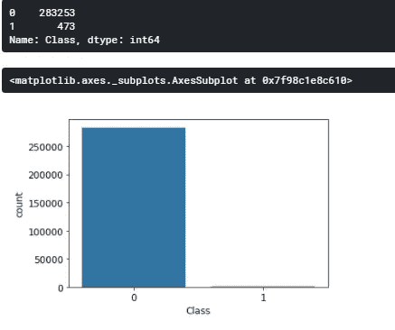

# 信用卡欺诈检测—第一部分

> 原文：<https://medium.com/analytics-vidhya/credit-card-fraud-detection-part-i-1061d4c0bd68?source=collection_archive---------7----------------------->

信用卡欺诈检测是 Kaggle 上的一个在线挑战，我们的目标是发现交易是否欺诈。我将本文分为两个部分，其中第 1 部分包含关于数据集的信息并进行探索性数据分析，第 2 部分处理数据不平衡和各种分类模型的比较。

# ***关于数据集***

我们得到了 V1、V2、… V28 的特征，这些是用 PCA 得到的主要成分。唯一没有被 PCA 转换的特征是“时间”和“数量”。特征“时间”包含数据集中每个事务和第一个事务之间经过的秒数。特征“金额”是交易金额，该特征可用于依赖于示例的成本敏感学习。特征“类别”是一个二元变量，在欺诈交易的情况下取值 1，否则取值 0。相同的竞争链接如下所示。

 [## 信用卡欺诈检测

### 标记为欺诈或真实的匿名信用卡交易

www.kaggle.com](https://www.kaggle.com/mlg-ulb/creditcardfraud) 

# 探索性数据分析

首先，我们将从导入探索性数据分析所需的所有依赖项开始，我们将分析数据集以找到一些重要的模式，处理缺失数据和重复数据、热图、分布等。

使用 pandas 读取给定数据集:

图数据集前 5 行的输出。

现在，我们将查看数据集中是否有任何缺失的数据。

数据集中没有缺失值

正如我们所看到的，在数据集中没有空值，我们继续前进。

数据集可能包含一些重复项，我们将检查并移除这些重复项。为此，我们将看到删除重复项前后的数据形状。

**输出:** (284807，31)

**输出** :(283726，31)

我们可以看到，删除重复项后数据的形状发生了变化，我们推断有 1081 行重复数据被删除。

数据集的事务时间分布

图中有两个峰值。该数据集为期 2 天。我们可以将此关联为两个峰值对应于每天发生最大数量交易的两个时间(深度对应于人们不进行任何交易的夜间时间)。

两个阶级之间的巨大不平衡。

我们可以看到这里有巨大的阶级不平衡。我们将在这个博客系列的第 2 部分讨论与之相关的问题以及我们将如何处理它们。

现在我们将绘制欺诈和非欺诈交易的时间分布图，并观察我们是否发现任何模式。

欺诈和非欺诈交易的分布

我们没有观察到任何重要的模式，所以我们将继续前进。

欺诈和非欺诈交易的热图

最好在使用数据集之前缩放要素，以便所有值都在相似的范围内。这一点很重要，这样重要性较低的特性就不会因为其范围较大而超过重要性较高的特性。

例如，在一些数据集中，列薪金可能是 10 万卢比，但列年龄将低于 100。这将导致 salary 列在特征预测中占主导地位，即使它可能不太重要。为此，使用了不同类型的标度-对数、标准化和规范化。我们将根据我们的数据集决定从中选择哪一个。

***Log*** 是一种当变量跨越几个数量级时进行的缩放技术。

***标准化*** 是一种缩放技术是以平均值为中心，以单位标准差为单位的技术。这意味着属性的平均值变为零，结果分布有一个单位标准偏差。

***标准化(最小-最大缩放)*** 是一种缩放技术，其中值被移动，然后被重新缩放，使得它们最终的范围在 0 和 1 之间。

我们将比较哪种缩放技术最适合我们的数据集，因此，我们将制作一个箱线图进行比较。

类别与比例金额的箱线图

在对数标度中可以看到最小的差异。其余 0 类和 1 类在数量上有巨大差异。因此，我们将进一步使用对数标度。

第二部分的链接:[https://vasudhatapriya 2 . medium . com/信用卡欺诈检测-第二部分-3e75d0022b9b](https://vasudhatapriya2.medium.com/credit-card-fraud-detection-part-2-3e75d0022b9b)