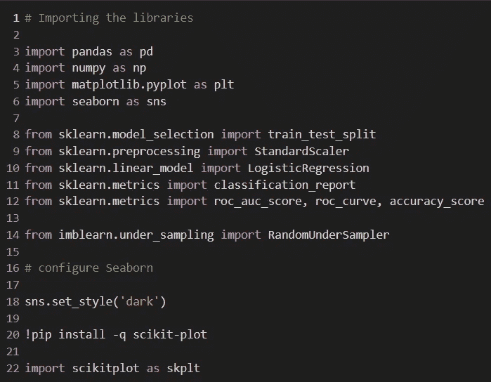

# 信用卡欺诈检测(包括 Python 代码)

> 原文：<https://medium.com/analytics-vidhya/credit-card-fraud-detection-python-codes-included-15501a3111bd?source=collection_archive---------6----------------------->

如果这种事从未发生在你身上，你可能知道有人的信用卡被克隆了。欺诈交易给银行和普通公民带来了数十亿美元的损失。应对网络欺诈绝非易事，而机器学习是一个合适的解决方案。这个项目的目标是训练两个模型来预测欺诈交易。来自 Kaggle 的[数据集被用于该分析。该数据集包含 29 万笔交易，其中 492 笔是欺诈性的。该数据集的另一个特征是，由于安全性和隐私性，所有特征(列)都是数字的。这些列被命名为 V1、V2、V3 等。在这个数据集中，唯一有实际名称的特征是“时间”、“数量”和“类别”。最后一个问题与交易是正常的还是欺诈性的有关。本项目分为 5 个部分:探索性数据分析、数据准备、机器学习模型、评估模型性能和用测试数据预测。好吧，让我们开始吧。](https://www.kaggle.com/mlg-ulb/creditcardfraud)

该数据集的一些信息:

1.  它包含欧洲持卡人在 2013 年 9 月通过信用卡进行的交易。
2.  它只包含作为 PCA 变换结果的数字输入变量。V1、V2……v 28 是通过五氯苯甲醚获得的主要成分，唯一没有通过五氯苯甲醚转化的特征是“时间”和“数量”。
3.  特征“时间”包含数据集中每个事务和第一个事务之间经过的秒数。
4.  特征“金额”是交易金额，该特征可用于依赖于示例的成本敏感学习。
5.  特征“类别”是响应变量，在欺诈的情况下取值 1，否则取值 0。

# 1 -探索性数据分析

在机器学习项目中要做的第一件事就是更好地理解数据集。诸如“有离群值吗？”，“有空值吗？”或者“数据集的平衡程度如何”需要在继续之前回答。

首先要做的当然是导入必要的库。顺便说一下，这个项目只使用 Python。

图 1 —要使用的库

那么数据集与变量`df`相关。然而在这一部分中，使用。示例()方法。该数据框将被用作训练模型的最终验证。

图 2 —导入数据集并创建测试数据框。

很好……现在有了我们定义的数据框架`df`,就可以分析数据了。通过方法 **df.head()** 可以首先查看数据，而方法 **df.describe()** 可以给我们一些统计信息。例如，通过最后一项分析，可以检测出“数量”变量中的异常值。另一个重要的分析是计算每一列上 null 值的数量。这可以通过一个简单的命令 **df.isnull()来实现。sum()。**没有丢失的值。

下一步是检查数据集的平衡程度。`Seaborn`是这种分析的一个很好的选择。

图 3 —检查数据集的平衡程度。

一个很好的问题是“欺诈发生有特定的时间段吗？”我们通过一个班级和时间的柱状图来回答一下。没有...的关系

图 4 —一段时间内常规交易和欺诈的条形图。

这个项目的重点当然是欺诈。因此，让我们应用。**描述()**了解更多欺诈行为的方法。

图 5 —欺诈统计。

# 2-数据准备

数据集的标准化是许多机器学习估计器的常见要求:如果单个特征或多或少看起来不像标准的正态分布数据(例如，均值和单位方差为 0 的高斯数据)，它们可能表现不佳。在这个数据集中，变量“时间”和“数量”是标准化的，如图 6 所示。对于这一步，使用库 Scikit-Learn。

图 6 —特性的标准化。

下一步是在训练和验证中分离数据集。再次使用 Scikit-Learn。

图 7——在训练和验证中分离数据集。

以前可以看出，这个数据集是绝对不平衡的。为了解决这个问题，对数据集应用了欠采样方法，该方法从主类中随机提取子类。

图 8 —不平衡数据集中的欠采样方法。

现在数据集平衡了。

图 9 —欠采样方法后的新分布。

# 3 -机器学习模型

现在数据准备训练一个模型。这个项目的目标是训练一个模型来预测信用卡欺诈。这样，为此选择的模型是逻辑回归，用于预测分类变量(是或否，真或假，恶性或良性，猫或狗等)。这个模型使用了 **Sigmoid 函数**来预测类。

图 10 — Sigmoid 函数。

选择模型后，训练模型和预测的步骤如下:

1.  实例化模型

2.训练模型

3.使用模型进行预测

图 11 —使用逻辑回归模型进行实例化和预测。

# 4-评估机器模型性能。

太好了！我们现在有一个机器学习模型，可以根据一些银行信息告诉我们，一笔交易是否更有可能是欺诈。但是，模型预测得好吗？我们通过一个混淆矩阵，分类报告，准确率和曲线下面积得分来回答一下。

图 12 —评估逻辑回归模型。

图 13 —模型评估。

结果表明，训练后的模型性能良好。该模型具有高精度和曲线下面积数。

# 5-对测试数据集的预测

下一步是在测试数据集中使用这个模型。在本文的最开始，我们已经创建了这个数据集(称为 test)。相同的训练模型用于预测“测试”数据集。预测评估如图 14 所示。

图 14——测试数据集中模型的评估。

# 6-结论

这可以被认为是一个简单的数据科学项目，但是，正如可以看到的，获得结果并不容易。经过训练的模型在测试数据集上工作得相当好，但肯定还有改进的空间。测试其他模型或调整参数可能会导致更好的预测。

这个项目包含更多的分析，可以在我的 Github 库中找到。查看更多项目。感谢阅读！