# 基于机器学习的信用卡欺诈检测

> 原文：<https://medium.com/analytics-vidhya/credit-card-fraud-detection-with-machine-learning-fd2223c23648?source=collection_archive---------7----------------------->


保罗·费尔伯鲍尔在[未刷](https://unsplash.com/photos/idNOBU5k_80)的照片

尽管有了新的支付方式，信用卡仍然占据着货币交易的主要部分。由于网上购物的增长，使用信用卡的交易越来越频繁。这反过来有助于提高支付的实用性和速度，但也会引起犯罪分子的注意。我们可以将这些事件总结为不当使用信用卡/借记卡进行欺诈性交易，获取金钱和货物。其中号码被没有保护的网站、恶意的信用机器以及使用社交媒体应用程序共享的号码获取。

为了避免损失和保护他们的客户，信用卡公司已经投资于避免和减少这种情况发生的技术，一旦使用过去收集的大量数据来实时验证和分类新的交易，使用机器学习模型已经被证明是欺诈检测的强大工具。

在本文中，我们将使用 [python](https://www.python.org/) 、 [pandas](https://pandas.pydata.org/) 和 [scikit-learn](https://scikit-learn.org/stable/) 来实现一个机器学习模型，以获取交易数据库并训练该模型能够将新交易分类为欺诈性或非欺诈性交易。

# 关于数据集

为了进行分析，我们将使用欧洲持卡人在 2013 年 9 月实现的两天银行交易的数据库。该数据集可在[下载 Kaggle](https://www.kaggle.com/mlg-ulb/creditcardfraud) 拥有约 28.5 万笔交易，其中 492 笔交易被归类为骗局或欺诈。由于保密问题，客户的个人数据已被匿名化，变量从 V1 重命名为 V28，数据使用(*主成分分析* — PCA)进行转换，在这种情况下已用于降低数值的维度，下面描述了唯一没有变化的变量。

*   `Time` -包含每笔交易之间经过的秒数；
*   `Amount` -交易总金额；
*   `Class`——交易给出的标签，其中`0`代表正常交易，`1`指欺诈交易。

使用的库

# 探索性分析

在本节中，我们将进行初步的数据分析，以验证数据集中的变量、空值、异常值以及合法和非法交易的直方图。

数据帧头

**空值检查:**

```
print('Total of Null Values:', df.isnull().sum().max())Total of Null Values: 0
```

**合法与非法交易的平衡:**

```
fig, ax = plt.subplots(figsize=(5,5))
sns.countplot(x='Class',data=df);
print(pd.Series(df.Class).value_counts())
plt.show()0    284315
1       492
```

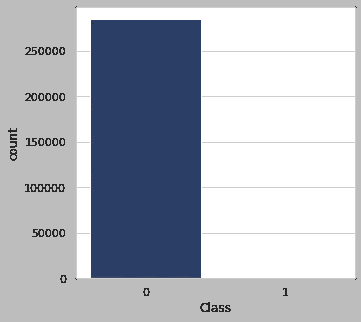

合法和非法交易，作者图片

合法的`[0]`交易和非法的`[1]`事件之间有相当大的差异。因此，在建立机器学习模型之前，数据集将被平衡。

**检查“金额”值中的异常值:**

```
fig, ax = plt.subplots(figsize=(15, 3))
sns.boxplot(x='Amount', data=df)
plt.show()
```

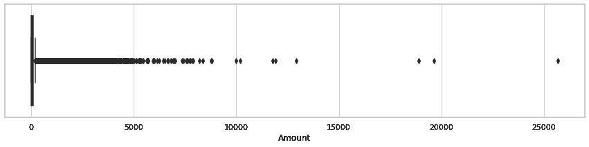

“金额”值的箱线图，按作者排序的图像

正如我们在前面的图像中所看到的，在`Amount`列中有许多异常值，我们将对这些值进行清理，并重新绘制以检查情况。

```
# checking outlier values 
q1_amount = df.Amount.quantile(.25)
q3_amount = df.Amount.quantile(.75)
IQR_amount = q3_amount - q1_amount
print('IQR: ', IQR_amount)# defining limits                                       
sup_amount = q3_amount + 1.5 * IQR_amount
inf_amount = q1_amount - 1.5 * IQR_amountprint('Upper limit: ', sup_amount)
print('Lower limit: ', inf_amount)IQR:  71.565
Upper limit:  184.5125
Lower limit:  -101.7475
```

在定义了“数量”列的限制后，我们将清除异常值并重新绘制箱线图。

```
# cleaning the outliers in `Amount` values
df_clean = df.copy()
df_clean.drop(df_clean[df_clean.Amount>184.49].index, axis=0, inplace=True)# new boxplot for `Amount` values
fig, ax = plt.subplots(figsize=(15, 3))
sns.boxplot(x='Amount', data=df_clean)
plt.show()
```

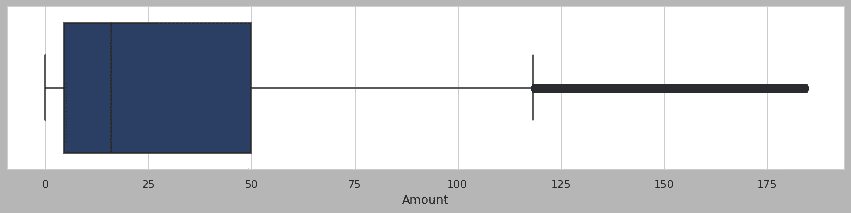

“数量”值的新箱线图，按作者排序的图像

清除数据集中的异常值后，`Amount`列中的值差异较小，箱线图更容易阅读。

**交易直方图**

```
# legal transactions by time
fig, ax = plt.subplots(figsize=(10, 5))
sns.histplot(x=(df_clean.Time[df_clean.Class==0]), bins=50);
ax.set_title('Legal Transactions by Time')
plt.show()
```

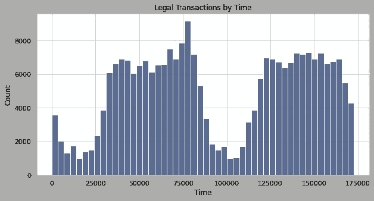

作者图片

```
# legal transactions by amount
fig, ax = plt.subplots(figsize=(10, 5))
sns.histplot(x=(df_clean.Amount[df_clean.Class==0]), bins=50)
ax.set_title('Legal Transactions by Amount')
plt.show()
```

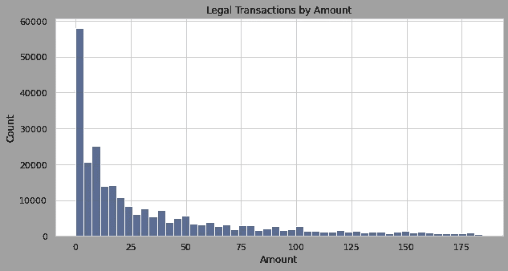

作者图片

```
# illegal transactions by time
fig, ax = plt.subplots(figsize=(10, 5))
sns.histplot(x=(df_clean.Time[df_clean.Class==1]), bins=50)
ax.set_title('Illegal Transactions by Time')
plt.show()
```

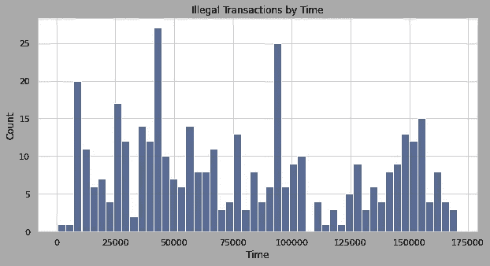

作者图片

```
# illegal transactions by amount
fig, ax = plt.subplots(figsize=(10, 5))
sns.histplot(x=(df_clean.Amount[df_clean.Class==1]), bins=50)
ax.set_title('Illegal Transactions by Amount')
plt.show()
```

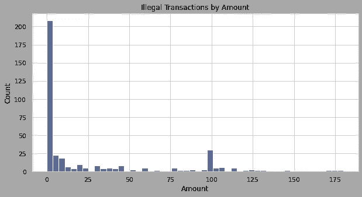

作者图片

# 预处理数据

在我们创建机器学习模型之前，我们需要对数据集值进行一些调整。下面列出了这些步骤:

*   标准化`Time`和`Amount`值；
*   将数据集分为训练集和测试集；
*   平衡价值观。

```
# importing scikit-learn modulesimport scikitplot as skplt
from sklearn.model_selection import train_test_split
from sklearn.preprocessing import StandardScaler
from sklearn.linear_model import LogisticRegression
from sklearn.metrics import classification_report
from sklearn.metrics import accuracy_score
from imblearn.under_sampling import RandomUnderSampler
```

**标准化流程**

标准化过程包括在数据结构中进行转换，最大限度地减少冗余值，并删除平均值和单位方差。

```
# creating a copy of the original dataset
df_new = df_clean.copy()# standardize data
scaler = StandardScaler()
df_new['Amount'] = scaler.fit_transform(df_new.Amount.values.reshape(-1, 1))
df_new['Time'] = scaler.fit_transform(df_new.Time.values.reshape(-1, 1))# check the standardized data
df_new.head()
```

标准化流程后的数据集

**在训练和测试中划分数据集**

训练/测试分离是机器学习过程中的一个重要步骤。其中模型被分成两组:训练集和测试集。通常，数据集的主要部分保留用于训练，小部分用于测试。训练数据将用于创建机器学习模型，测试数据用于检查模型的准确性。

```
# train and test data
X = df_new.drop('Class', axis=1)
y = df_new['Class']
X_train, X_test, y_train, y_test = train_test_split(X, y, shuffle=True, stratify=y)
```

**平衡数据集**

正如我们在探索性分析中看到的，我们在合法交易和欺诈的数量之间存在差异。不偏不倚地输入机器学习模型。我们将执行数据集的平衡，以使值尽可能接近。

```
# instantiating the random undersampler
rus = RandomUnderSampler()# resampling X, y
X_rus, y_rus = rus.fit_sample(X_train, y_train)# new class distribution
print(pd.Series(y_rus).value_counts())
sns.countplot(y_rus)
plt.show()1    301
0    301
```

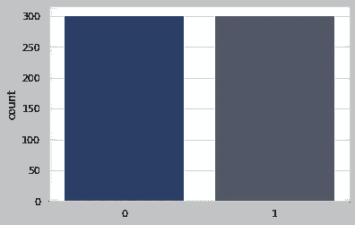

平衡后的“类”列值，按作者排序的图像

现在，有了平衡的数据集，我们可以继续设置机器学习模型。

# 机器学习模型

在预处理数据后，我们可以创建机器学习模型，因为我们正在处理一个二元问题，我们将使用逻辑回归来检查交易是否可以被标记为合法或欺诈。

```
# setup the machine learning model:
np.random.seed(2)
model = LogisticRegression(C=0.01)
model.fit(X_rus, y_rus, sample_weight=True)
```

准备好机器学习模型后，我们可以使用测试数据来检查模型预测。

```
# model predictions:
y_pred = model.predict(X_test)
y_proba = model.predict_proba(X_test)
```

# 模型性能

在下面的报告中，我们有一些指标来检查模型性能，让我们简要解释一下如何理解这些值，并评估机器学习模型。在解释数学公式之前，我们将解释一些术语以及它所代表的含义。

*   **TN —真阴性:**当一个病例为阴性且预测为阴性时；
*   **TP —真阳性:**当一个病例为阳性且预测为阳性时；
*   **FN —假阴性:**当一个病例为阳性但预测为阴性时；
*   **FP —假阳性:**当病例为阴性但预测为阳性时。

**准确性** —模型的预测正确率是多少？

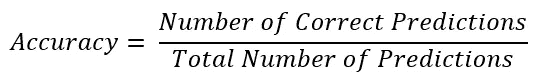

**精度** —预测正确的百分比是多少？

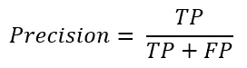

**回忆一下** —模型捕捉到的阳性案例的百分比是多少？

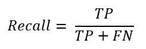

**F1-得分** —多少百分比的正面预测是正确的？

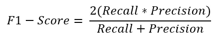

```
# classification report
skplt.metrics.plot_confusion_matrix(y_test, y_pred, normalize=True, text_fontsize='small', title_fontsize='medium', cmap='Blues');
print("Classification Report:\n", classification_report(y_test, y_pred, digits=3))Classification Report:
               precision    recall  f1-score   support

           0      1.000     0.990     0.995     63123
           1      0.130     0.920     0.228       100

    accuracy                          0.990     63223
   macro avg      0.565     0.955     0.611     63223
weighted avg      0.998     0.990     0.994     63223
```

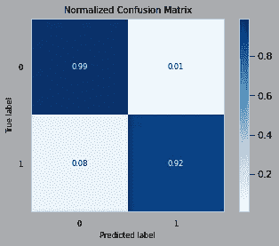

作者图片

# **结论**

一旦模型每天接收到大量新数据，使用机器学习模型的信用卡欺诈检测技术的使用就显示了一种强大的工具。虽然我们在模型中取得了很好的结果，但是在新的数据库中进行测试，观察和改进模型的性能是很重要的。

# 感谢阅读！

感谢阅读。把你的想法和主意发给我。你可以写信只是为了问好。如果你真的需要告诉我是怎么错的，我期待着尽快和你聊天。完整的文章可以通过下面的[链接](https://bit.ly/3v8Tv15)访问

LinkedIn: [法比奥·罗德里格兹](https://www.linkedin.com/in/f-rodrigues/) |Github: [法比奥多克姆](https://github.com/fabiodotcom)