# 基于机器学习模型的信用违约预测

> 原文：<https://medium.com/analytics-vidhya/credit-default-prediction-based-on-machine-learning-models-1717601600c9?source=collection_archive---------2----------------------->

**本文使用的所有代码的链接:**

 [## 信用违约检测。ipynb

### 合作笔记本

drive.google.com](https://drive.google.com/file/d/1MU9c2oL_u5dEerlR8H7js2XLF3ey3YKQ/view?usp=sharing) 

世界各地的银行每天都会收到无数的贷款申请。其中一些是好的，将得到偿还，但仍有很高的风险，一个债权人拖欠他/她的贷款。我们如何防止这个问题发生？或者，换句话说，我们如何事先知道哪些债权人是值得信任的？在下面的文章中，我将提供一个机器学习解决方案来解决这个问题

**数据集介绍**

我使用了由 [UCI 机器学习](https://www.kaggle.com/uciml/default-of-credit-card-clients-dataset)提供的名为信用卡客户数据集默认的数据集。这个数据集包括大约 3 万名债权人的 24 个特征，从性别等基本信息到账单和还款报表。下面列出了这些特性及其描述(具有不同索引的相似名称用括号缩写)

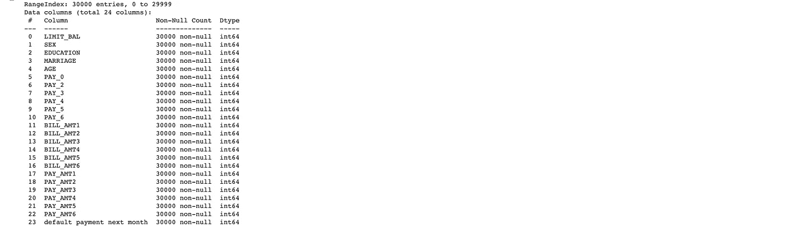

*   ID:每个客户端的 ID
*   LIMIT_BAL:以新台币为单位的信用额度(包括个人和家庭/补充信用额度
*   性别:性别(1 =男性，2 =女性)
*   教育程度:(1 =研究生院，2 =大学，3 =高中，4 =其他，5 =未知，6 =未知)
*   婚姻:婚姻状况(1 =已婚，2 =单身，3 =其他)
*   年龄:以年为单位的年龄
*   PAY _(0-6):2005 年(9-4 月)还款情况(-1 =按时还款，1 =延迟一个月还款，2 =延迟两个月还款，…8 =延迟八个月还款，9 =延迟九个月及以上还款)
*   BILL _ AMT(1-6):2005 年(9-4 月)账单金额(新台币)
*   PAY _ AMT(1–6):2005 年(9-4 月)前一次付款金额(新台币)
*   default.payment.next.month:默认付款(1 =是，0 =否)

**数据探索和准备**

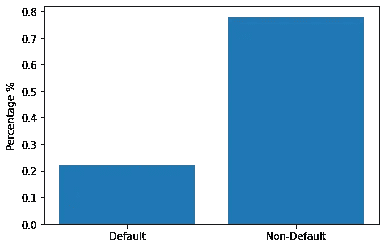

图 1:按默认和非默认分类的数据百分比

如果我们只按默认和非默认对数据进行分类，我们会发现数据非常不平衡，如图 1 所示。将近 77%的数据是非违约数据，而只有大约 22%的数据被归类为违约数据。这将导致非常高的基线准确性，并可能误导其他预测模型(如果一个无意义的虚拟分类器将所有数据分类为非默认，则其准确性将为 77%)。因此，为了避免这个问题，我们需要对数据集进行欠采样，以确保违约和非违约债权人采用大致相同的权重，这可以确保我们预测模型的效力。如图 2 所示，我采用了 NearMiss 算法来获得具有相同数量的默认债权人和非默认债权人的训练和测试分区。

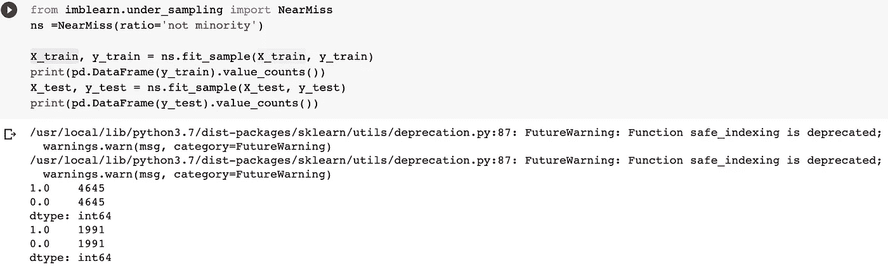

图 2:欠采样代码

在讨论了关于数据集的一般观点之后，让我们更深入地研究不同特征和目标变量之间的关系。

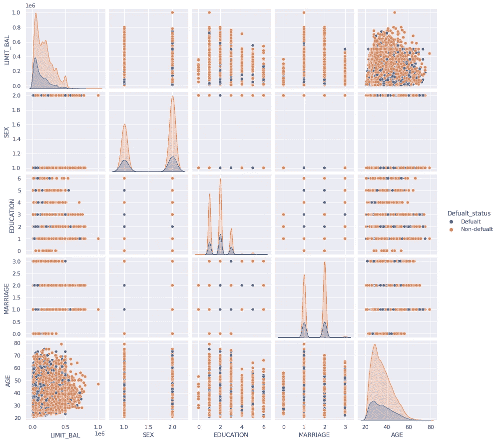

图 3 默认和非默认色调的特征对图

从这张图中，我们可以粗略地看到，那些非违约债权人及其家庭往往有更高的给定信用，而非违约债权人往往年龄更大。但是因为图 3 的比例，效果不是很明显。因此，为了有一个清晰的视图，我放大了按违约和非违约分类的有限余额的分布，如图 4 所示。我们可以估算出，与违约债权人相比，非违约债权人的信用额度大约高出 5 万英镑。

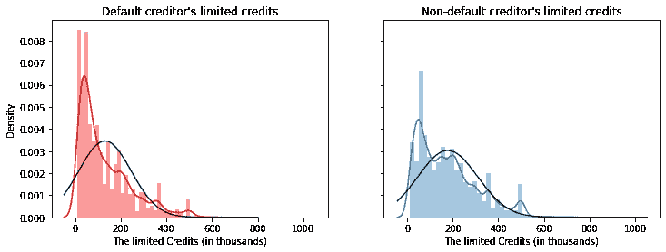

图 4

为了对不同特征和目标变量之间的关系进行更精确的数学测量，我决定使用相关矩阵来测量存在的线性关系。图 5 是我对数据集中的所有列运行相关矩阵后得到的结果。有两个部分值得注意:1。2 .高度相关的 BILL _ ATM(1–6)和 PAY _(0–6)s

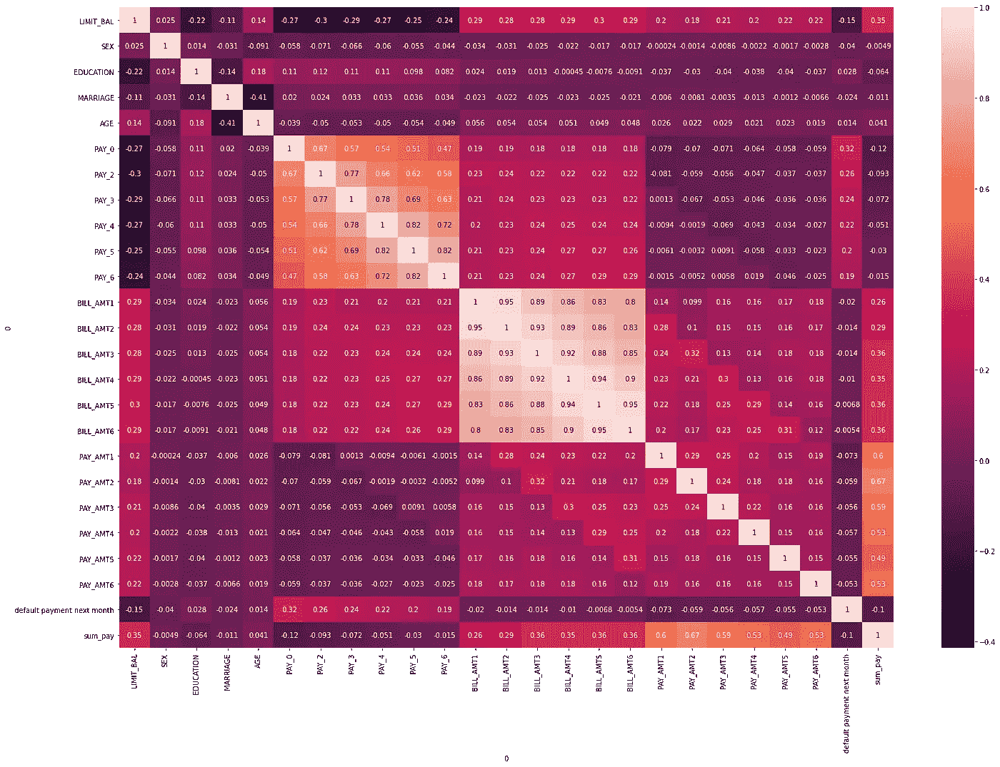

图 5

先说第 1 点。对于目标变量“下个月违约付款”，没有特征似乎与目标变量具有非常高的相关性。这意味着数据集中嵌入的大多数关系将是非线性的，我们需要使用非线性模型来捕捉它们。

其次，我们应该总是尽量避免高度相关的变量共存于一个模型中。这是因为高度相关的变量会用冗余信息淹没模型，模糊场景背后的真实模式。因此，我们需要改变和改进那些高度相关的 BILL _ ATM(1–6)和 PAY _(0–6)。我采用的策略是创建新的变量，其中包含每两个连续的高度相关变量之间的差异(代码如下面图 6 所示)。通过这种方式，冗余信息将被消除，新的变化将被保留以供分析。

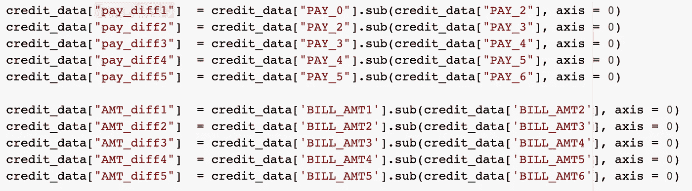

图 6

在我创建了这些新变量之后，我重新运行了相关矩阵，给出了下面的图表，在图表中，我们可以确认问题已经得到了纠正。

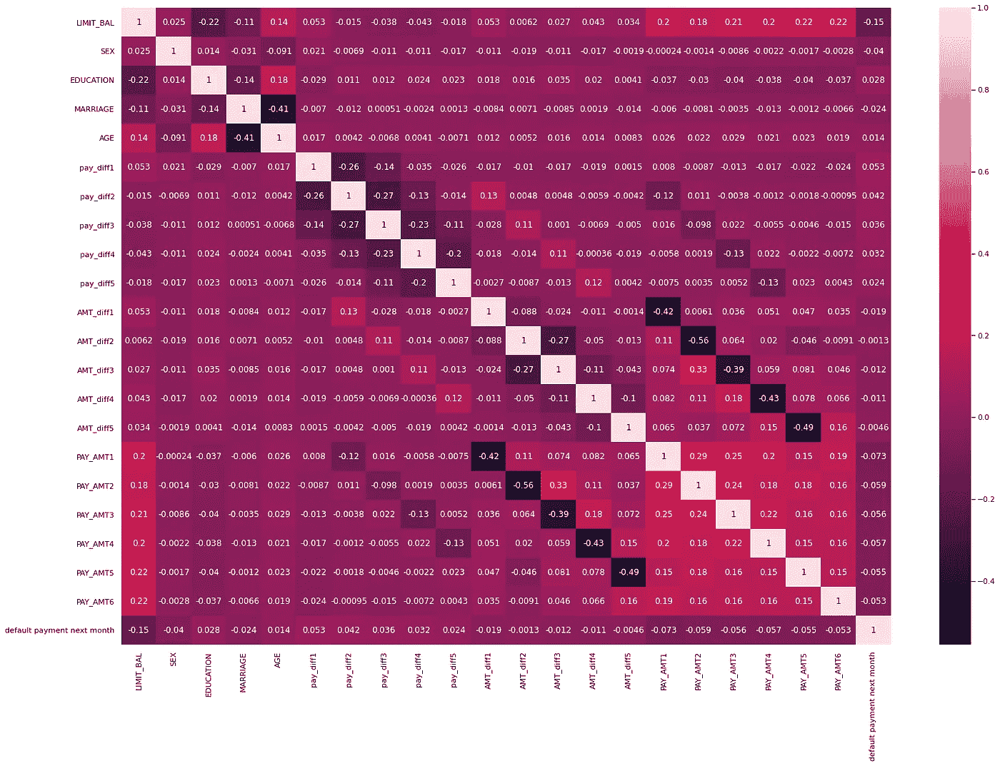

图 7

**建模:**

从上面的描述中，我们可以知道我们的问题是一个具有许多非线性关系的二元分类问题。因此，我相信下面的模型可以回答我们的问题:1)逻辑回归，2)决策树，3)随机森林，4) AdaBoosting。

我还为每个模型开发了下面的过程来遵循 1。模型初始化，2。超参数调谐，3。测试和训练分区模型的交叉验证，4 .检查并修复过度配合。让我们以 random forest 作为这个过程的例子(我会把其他模型的代码放在文档的最后)。

首先，我用一些基本的随机参数设置启动一个随机森林分类器

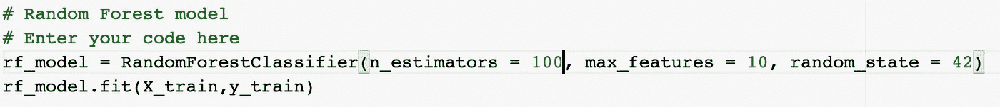

然后，我使用网格搜索，它可以帮助我们从一大组超参数中找到最佳的超参数组合。在这个过程中，我实际上试图使用非常大的超参数。因为我希望模型最初尽可能适合训练集，然后我可以简化它以提高它对测试集的泛化能力。然而，当我试图扩大超参数参数时，例如，随机森林分类器的 n_estimators，模型的性能根本没有改善，实际上开始逐渐下降。

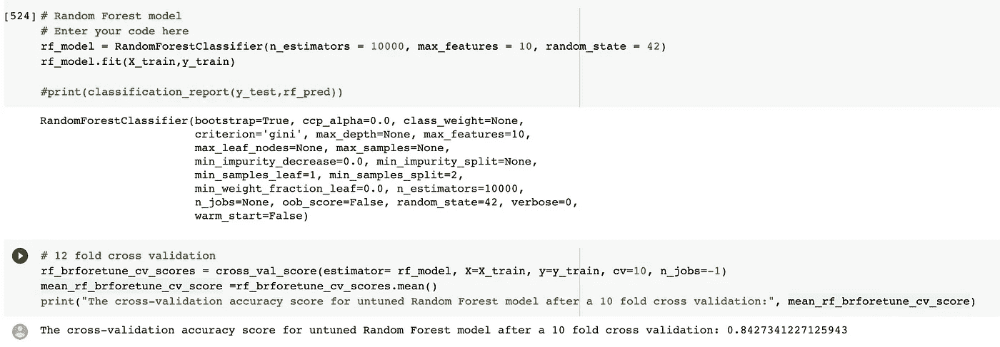

我尝试了 n_estimators= 10000，但是训练集的交叉验证准确度分数低于使用 n _ estimator = 500 的模型

因此，我没有试图拟合大型超参数，而是决定遵循我从超参数调整试验中学到的趋势，并最终将其缩小到最佳参数集。

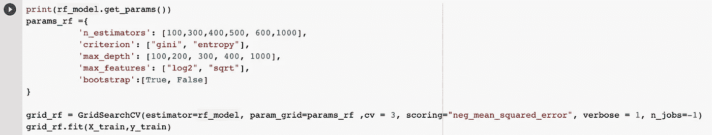

超参数调谐

这是随机森林模型的最佳参数集。

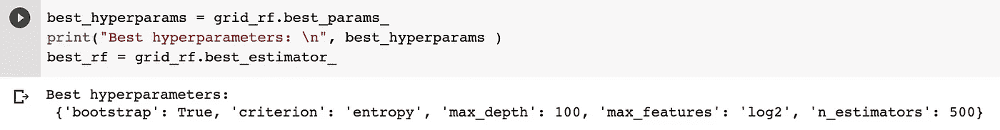

随机森林模型的最佳参数集

最后，我使用交叉验证来避免数据选择偏差，并获得我们的模型与训练和测试分区匹配程度的“真实”准确性分数。我还想看看我们的模型符合训练分区的准确程度的原因是，我将使用它来检测模型是否过度拟合。如果一个模型过度拟合训练数据，它在训练数据集中的表现会很好，但在测试数据中表现很差。因此，两个准确度分数的较大差异将指示模型过度拟合，否则，它不是。如果我们将这个测试应用于随机森林模型的结果，我们会发现两个准确度分数之间的差异相当小，只有 0.006 左右。因此，我们可以得出结论，随机森林模型没有过度拟合。

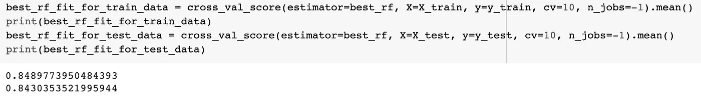

随机森林的准确度分数

因为随机森林模型没有显示出过度拟合的迹象，所以我想用决策树模型作为一个例子来说明我如何修复过度拟合问题。在下面的两个图表中，我们可以看到，决策树模型的训练和测试数据集的精确度之间的初始差异约为 3%。这表明初始决策树可能会过度拟合训练数据。为了减少这种差异，我开始尝试更小的超参数的不同组合，如 max_depth，min_samples_leaf。经过多次试验，找到了一组更好的超参数，并将准确度分数之间的差异减少到 1%左右。这意味着过度拟合的问题已经解决。

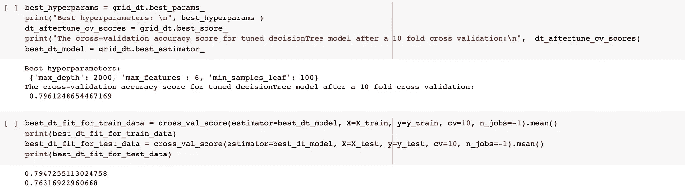

修复过度拟合问题之前决策树的准确度分数

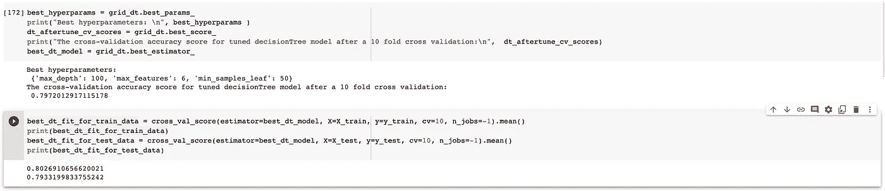

修复过拟合问题后决策树的准确度分数

对于其他模型，可能有更好的选择来解决过度拟合的问题，而不是尝试不同的超参数集。例如，逻辑回归可以使用 L1 正则化或 L2 正则化，通过简单地改变其“惩罚”超参数来减少过拟合问题。然而，因为在我们的例子中，逻辑模型不会过度拟合，所以我不打算讨论这样的过程。

**建模对比**

为了比较我们开发的所有五个模型，我制作了一个表来显示图 8 中所有五个模型的训练和测试数据集的准确性分数。该表使用“测试数据的准确性”进行排序。与基线分类器的准确度分数相比，我们可以看到我们的模型将准确度至少提高了 14%，最多提高了 35%。我们还可以了解到随机森林模型是我们得到的最准确的模型。因此，这是我们的最终模型。然而，这并不是我们选择随机森林作为最终模型的唯一原因。

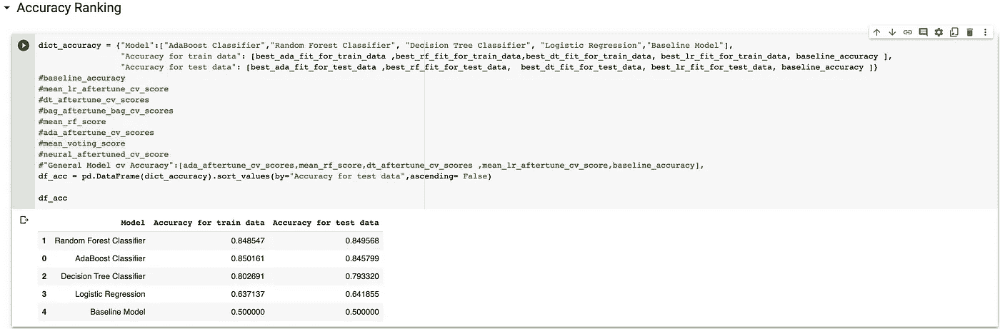

图 8

我们选择随机森林作为最终模型的另一个原因是，与我们现有的其他模型相比，它产生的假阴性错误更少。在这种情况下，假阴性意味着未能发现违约，这是非常昂贵的，也是我们最想避免的问题。Adaboost 模型是我们拥有的第二好的模型，但是，通过比较两者之间的混淆矩阵，我们可以看到随机森林对假阴性情况更敏感，因此更好。

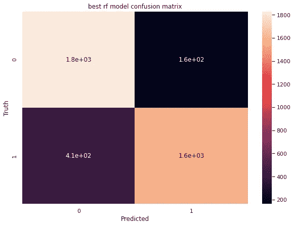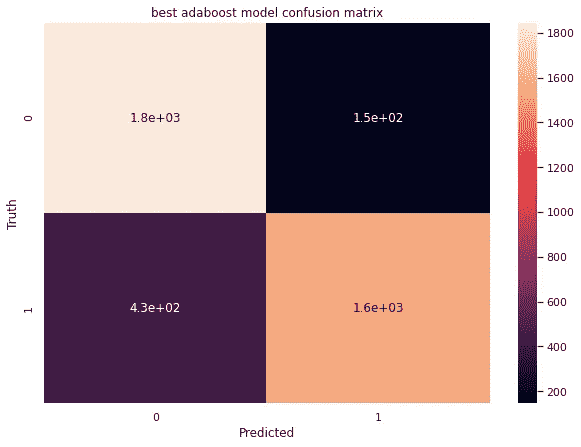

图 9

为了尝试随机森林模型是如何工作的，我找到了一个拖欠还款的债权人的数据(目标变量= 1)。我把债权人的数据输入到我们的模型中。预测值为[1.0]，与事实相符。

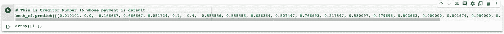

图 10

**建模感悟**

从随机森林模型中，我们还可以推导出该模型最重要的特征。从这些统计数据中我们可以看出，从 8 月到 9 月以及从 7 月到 8 月的还款状况变化是非常重要的预测因素。这是有意义的，因为如果债权人的 pay_diff1 和 pay_diff2 变大，这意味着债权人继续推迟还款，债权人更有可能违约，反之亦然。而这个年龄和 limit_bal 是我们在数据准备部分讨论的另外两个重要的预测因子。这也是有道理的，因为随着年龄的增长，一个人更有可能积累更多的资源，更关心自己的声誉，这使得信用违约的可能性降低。此外，如果一个人和他的家人获得更多的信用，这个人更有可能生活在一个更富裕的环境中，这也使得信用违约的可能性更小。我们通过分析数据看到的这些见解可以直接帮助银行家判断债权人是否值得信任。

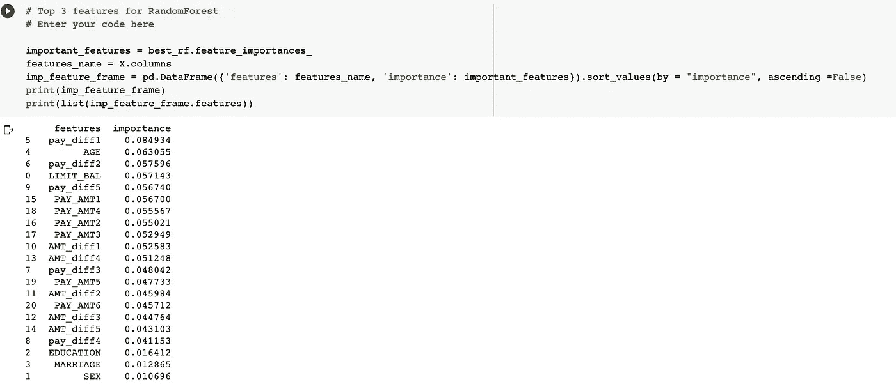

**倒影**

我认为可以改进预测模型的一个重要方法是增强数据源。仍然有很多数据没有涵盖的信息。例如，一个人的当前经济状况，如收入和工作，债权人；债权人拥有的非流动资产的数量，等等。数据集的这一缺陷决定了模型将失去一些预测能力，并面临更多的不确定性。

**其他型号的代码**

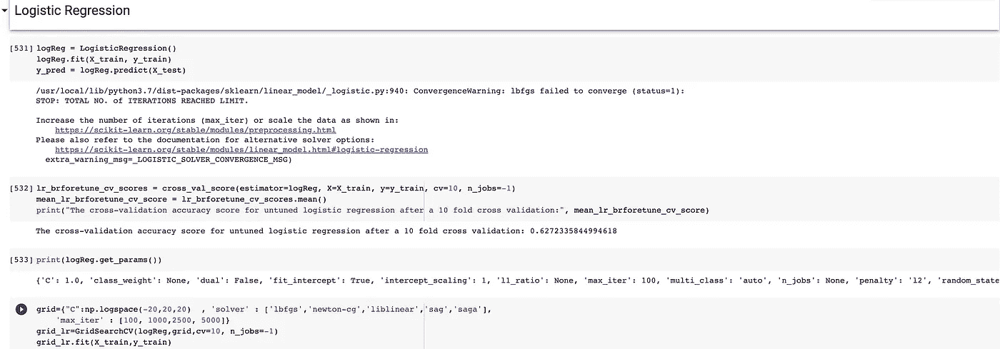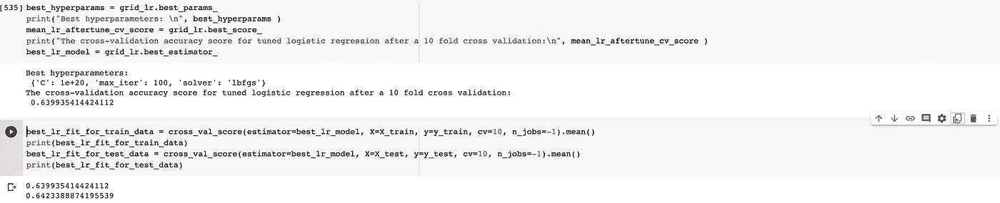

逻辑回归

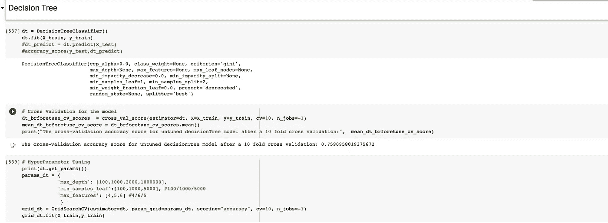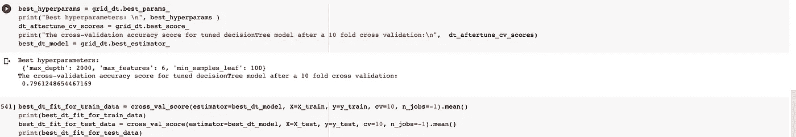

决策图表

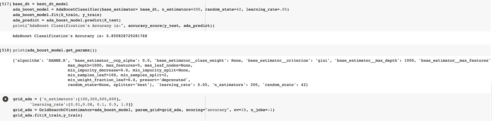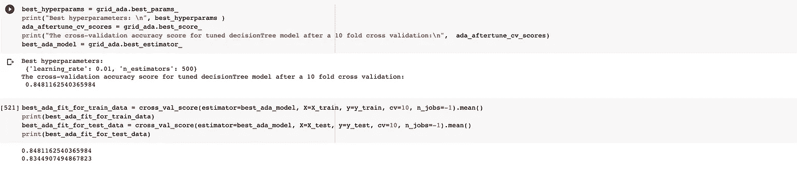

AdaBoost 分类器