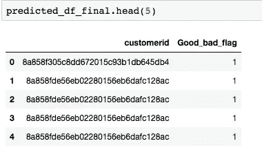

# 使用具有交叉验证的随机森林的信用评分

> 原文：<https://medium.com/analytics-vidhya/credit-scoring-using-random-forest-with-cross-validation-1a70c45c1f31?source=collection_archive---------3----------------------->

图片由 Truddi Finnis Pixabay 提供

**简介**

信用风险是任何贷款机构最紧迫的问题之一。这类机构的最终目标是降低信贷风险，即使利润率很低。这种需求推动了机器学习技术在改善信用评分方法中的应用。此外，由于无形客户的涌入，依靠传统的信用评分方法变得越来越困难，这些客户几乎不符合传统的消费者群体，很容易被传统的评分方法错误分类。

鉴于这些挑战，这是一篇基于知识的文章，展示了贷款机构如何利用机器学习的力量来预测客户的信用评分。

在本文中，我们将使用几个分类模型来预测基于过去数据的客户拖欠贷款的可能性。结果变量是一个二元变量，有好的和坏的可能结果。所使用的特征包括纬度、经度、银行分行、就业状况、教育水平和与客户过去贷款历史相关的变量。

使用的数据来自 Zindi 挑战组合的知识黑客马拉松(保留所有权利)。你可以在这里看一下[的完整代码。](https://github.com/wanyangajnr/eda/blob/main/credit_scoring_final.ipynb)

**数据探索**

数据探索是指使用可视化技术来更好地理解数据的过程。这个过程可以包括任何东西，从使用箱线图识别极值到使用热图检查完美相关的情况。使用箱线图快速查看数据可以发现，经度和纬度变量受极值的影响很大，而其余的连续变量基本上没有问题。

多个直方图用于显示不同变量相对于结果变量的分布；

良好贷款的数量多于不良贷款，贷款的分布是正偏的，大多数客户总共有 10 笔以下的贷款。

超过 2500 个客户的到期贷款金额为正偏差，大约有 10，000 个客户的到期贷款金额。

**特色工程**

在这一步中，日期对象被转换，年龄等新变量从“出生日期”中导出。还款期也是从“首次到期日”和“首次还款日”推导而来。分类变量被编码。

最后，对纬度和经度数据进行对数转换，以处理极端的异常值。

**交叉验证**

交叉验证用于比较和选择最佳模型。交叉验证使用三种模型，即随机森林、逻辑回归和决策树。Random Forest 的平均得分最高，为 0.92，被选择用于构建最终模型。

**特征重要性**

选择了随机森林作为选择模型后，进行特征重要性分析以选择最相关的特征包括在模型中。得分为 0 或更低的任何内容都将被删除。

**随机福里斯特与交叉验证**

通过丢弃不相关的变量，交叉验证被用于测量随机森林模型的最佳性能。平均得分为 0.923。

**最终型号**

我们使用 Gridsearch 交叉验证来获得最佳随机森林模型，并使用它对测试数据进行预测。

使用产生的最佳模型，我们使用新的测试数据集来预测客户端状态。

最终预测数据被转换为. csv 文件。

**结论**

这是一个快速浏览如何信用评分项目看起来像。这个项目并非没有挑战，但随之而来的是机遇。例如，使用交叉验证的决定是在模型过度拟合之后采用的。

**来源**

 [## 教程:使用分类变量的探索性数据分析(EDA)

### 超越散点图，进行更好的探索性数据分析

medium.com](/analytics-vidhya/tutorial-exploratory-data-analysis-eda-with-categorical-variables-6a569a3aea55) 

超参数调谐

 [## k 折叠交叉验证

### 有多种方法来分割模型训练和测试的数据，在本文中，我们将涵盖 K 倍…

satishgunjal.com](https://satishgunjal.com/kfold/#19) 

使用 K-fold 验证的随机森林

 [## 使用 Python 的端到端项目

### 使用 Kaggle 笔记本探索和运行机器学习代码|使用来自 Titanic 的数据-灾难中的机器学习

www.kaggle.com](https://www.kaggle.com/niklasdonges/end-to-end-project-with-python) 

论特征重要性

 [## 以随机森林为例解释特征的重要性

### 了解 Python 中最流行的确定要素重要性的方法

towardsdatascience.com](https://towardsdatascience.com/explaining-feature-importance-by-example-of-a-random-forest-d9166011959e) 

利用 gridsearchCV 获得交叉验证后的最佳模型

 [## 使用 Python 进行机器学习的嵌套交叉验证-机器学习掌握

### k-fold 交叉验证程序用于评估机器学习模型的性能。

machinelearningmastery.com](https://machinelearningmastery.com/nested-cross-validation-for-machine-learning-with-python/)