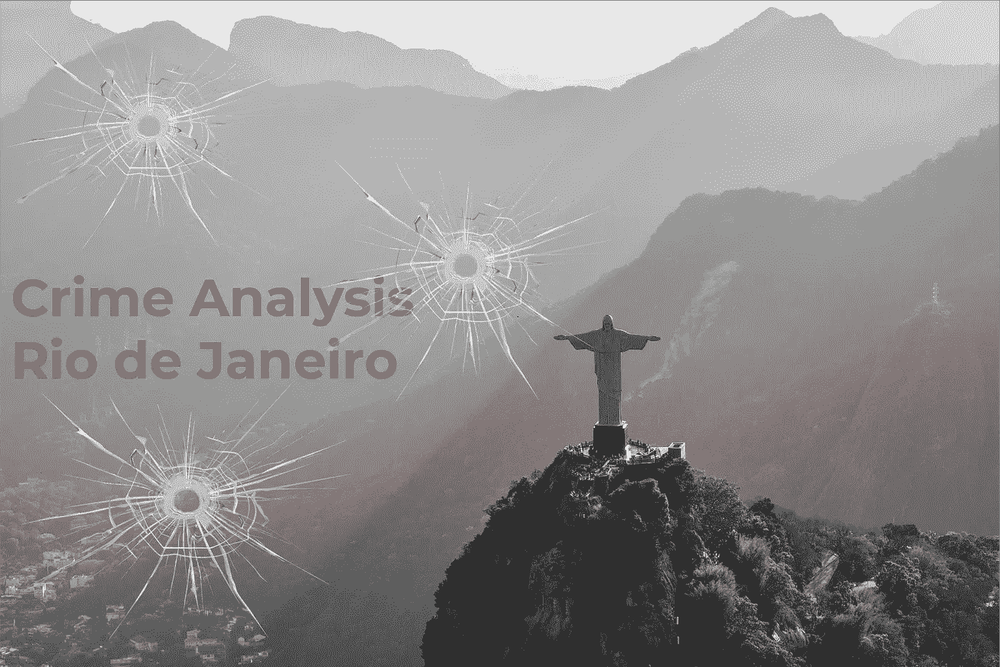
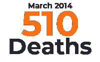
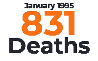
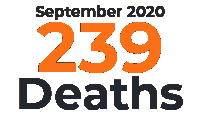
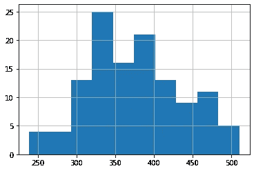
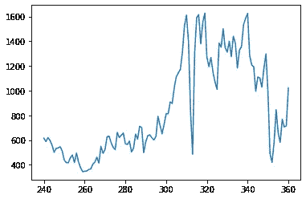

# 里约热内卢的犯罪分析

> 原文：<https://medium.com/analytics-vidhya/crime-analysis-in-rio-de-janeiro-b0d6f9027072?source=collection_archive---------4----------------------->

众所周知，里约热内卢被称为全国最大的旅游中心之一。

尽管有里约热内卢的奇迹，这个州的暴力******发生率很高，警察很难克服这些问题。根据摘要[violência no Rio de Janeiro-DESA fio do Estadoévencer o tráFico](https://vestibular.uol.com.br/resumo-das-disciplinas/atualidades/violencia-no-rio-de-janeiro-desafio-do-estado-e-vencer-o-trafico.htm)，仅仅贩卖人口并不能成为高犯罪率的理由。******

******实际上，世界上每个大都市都有非法毒品交易。例如，据估计纽约的可卡因消费市场是里约的两倍大。******

******然而，里约是世界上少数几个几乎每天都能在街头目睹战争场面的城市之一。原因是**武装派别**争夺领土控制权，得益于腐败网络和历史上对里约山区贫民窟公共权力的忽视。******

# ****里约热内卢****

****里约热内卢是巴西海边的一个大城市，以科帕卡巴纳海滩和伊帕内玛海滩、科尔科瓦多山顶上 38 米高的救世主耶稣雕像和 T21 花岗岩山峰而闻名。****

************************

****安德里亚·莱奥帕尔迪、若昂·卢卡斯·奥利维拉、莱昂纳多·马里尼奥和安斯普什的照片****

****这座城市还因其激动人心的狂欢节而闻名，有彩车、华丽的服装和桑巴舞者，它被认为是世界上最大的狂欢节。在卡里奥卡的风景中，贫民窟遍布里约的群山，就像基督或汽车一样引人注目。根据 2010 年人口普查的数据，T21 有 160 个城市化地区和 763 个贫民窟，居住着 130 多万人，几乎占该市人口的四分之一。****

# ****获取数据****

****使用的数据来自 [ISP Dados。RJ](http://www.ispdados.rj.gov.br/estatistica.html) (里约热内卢公共安全学院)网站。因此，要分析的数据集是一个文件**。CSV**(domensalestadosine 1991 . CSV)-**安全统计:自 1991 年 1 月以来该州的每月历史系列******

# ****初始数据分析****

****了解数据****

****在这里，我们将确保读者获得关于数据是如何构成的知识，以便他或她在分析过程中感到轻松，因为他们将能够理解他们正在阅读的内容。****

****一个很好的开始是检查我们的数据帧是如何分布的，这样我们就知道我们需要处理多少输入和变量。****

****有可能识别出 **361 个条目**和 **56 个变量**，因为我们将使用数字数据，变量被分类为 floats 和 int。****

# ****变量字典****

****让我们来看看将在整篇文章中出现的变量名，并整理出一个字典，以便消除任何可能的疑问。****

*   ****`ano` —发生年份报告****
*   ****`mes` —发生月份报告****
*   ****`hom_doloso`—恶意杀人记录****
*   ****`lesao_corp_morte` —身体伤害死亡记录****
*   ****`latrocinio` —抢劫记录****
*   ****`cvli`——故意致死性暴力犯罪(身体伤害后死亡)****
*   ****`hom_por_interv_policial` —警方介入的命案记录****
*   ****`letalidade_violenta` —包括故意杀人、抢劫、导致死亡的身体伤害以及因国家工作人员干预而死亡的案件****
*   ****`tentat_hom` —杀人未遂****
*   ****`lesao_corp_dolosa`—故意伤害他人身体****
*   ****`estupro`——强奸案****
*   ****`roubo_veiculo` —车辆抢劫****
*   ****`roubo_em_coletivo` —集体抢劫****
*   ****`furto_veiculos`—车辆盗窃****
*   ****`recuperacao_veiculos` —找回被盗或被盗车辆****
*   ****`apf`——公然逮捕行为****

******所有**变量的字典，你可以在分析笔记本中找到，呈现在文章的最后。****

# ****第一个条目****

****接下来，我们将最后看一下数据帧的前 5 个条目。****

****第一个条目****

****检查第一个条目后，可能会注意到缺少一些值，这可能会影响数据的可视化和解释，因为它们会以不符合实际的方式呈现。****

# ****缺少值****

****寻找丢失的值？是啊，我也是！****

****我们可以看到，`roubo_bicicleta`和`apf`的缺失值百分比最高，分别约为 **76%** 和**50%**。****

****我们不知道为什么这些数据会丢失。这可能是由于错误、多年来的数据丢失、未被考虑或其他原因。****

# ****复制数据帧(2011–2021)****

****由于缺少数值，并且需要进行尽可能符合实际的分析，我们将只分析最近 **10 年**，并且将对这一时期和前几年进行一些比较。****

****为此，我们将创建一个 DataFrame 的副本，并使用 2011 年**至 2021 年**期间的数据，关于 2021 年，我们只有一月份的数据，因为我们还没有到达它的末尾(到文章发表时)。****

## ****检查缺失的剩余数据****

****然后，我们将再次检查每一列中缺失值的百分比。****

****可以看出，缺失数据的数量急剧减少，只有两个变量有缺失值。****

*   ****`roubo_bicicleta e furto_bicicleta` —仍有约 30%的价值缺失。****

****让我们检查一下我们的 DataFrame 在获取更多最近的数据后是什么样子的。****

****2011 年至 2021 年的第一批参赛作品****

****有了这些价值，就有可能进行相关的分析，并将其与今天发生的事情联系起来，我们也可以有一个更具教学意义的可视化。****

# ****里约热内卢暴力事件的统计信息****

****让我们来看看统计数据！！！****

****为了获得数据集中统计信息的一般摘要，我们将使用函数`df.describe()`，该函数返回每个变量的平均值、标准偏差、最大值和最小值、每个变量的条目数以及一些百分点。****

****忽略`ano`和`mes`列的值。****

# ****平均水平****

****检查一些变量的平均值是可能的，因此我们可以更好地了解里约热内卢的情况。让我们来看看:****

## ****车辆抢劫****

********

****在查看统计数据后，我们能够提取出大约每月 **2880 辆**被盗！因此，平均每天 **96 辆**被盗，每年约**35000 辆**。****

## ****车辆盗窃****

********

****我们能够获得的另一项数据是车辆失窃的数量，大约每月 1340 辆。虽然许多人没有意识到，盗窃和抢劫是不同的罪行，因为在盗窃中没有暴力，但在抢劫中有暴力。****

# ****车辆回收****

********

****然而，收回的车辆数量平均只有 **2072** 。这个数值，代表了每月 **4220 起车辆抢劫**和**盗窃**的大约 **50%** 。****

# ****最大值和最小值****

****我们还可以找到某个犯罪案件最多和最少的月份和年份，我们将查看**故意杀人**的案件。****

## ****最大值 2011–2021****

********

****2014 年 3 月*的病例数是有记录以来最高的，总共有 **510 例**。这比月平均数字 **375 例**多出 **135 例**。*****

## *****最大值 1991–2021*****

**********

*****为了便于比较，我们整个数据集中出现的最大数量的病例发生在 1995 年 1 月**。在此期间，登记了 **831 例**病例。*******

## *****最小值*****

**********

*****2020 年 9 月，记录了 **239 起**案件，这是公布的最低数量。这是谋杀案的最低记录。在此期间，Sars-CoV-2 病例的高数量证明了发生率低的原因。*****

# *****数据可视化*****

*****在处理和分析数据之后，我们能够理解里约热内卢所处的情况。因此，我们可以绘制图表，帮助我们以不同的方式可视化数据。*****

## *******“hom _ doloso”直方图*******

**********

*****绘制的直方图可以告诉我们，当涉及到犯罪数量时，存在极端情况。您可以看到，虽然有些月份会有超过 **500 个案例**，有些月份会少于 **250 个**，但在大多数情况下，我们会有介于 **300 个**和 **400 个**之间的事件。*****

## *****变量"`roubo_em_coletivo`"的线图*****

**********

*****线形图显示，自 2012 年以来，公交车上的盗窃事件一直在增加，当时的数字接近 **345** 。然而，自 2015 年以来，发生率增加了约 **372%** ，因为公交车上的抢劫案数量在 2017 年 8 月**超过了 **1600 起**。*******

*****对这种事件的增加印象深刻吗？*****

# *****结论*****

*****经过分析，可以发现在 **10 年**中，一些数据发生了变化，但不幸的是，有些部门仍然令人担忧，因为它们的数量仍然很高。也有数据显示，病例有所减少，但在一段时间后，病例又回升了，仍然令人担忧。*****

*****然而，里约热内卢的政府和警察有责任让这个城市变得更加安全，让救世主耶稣雕像的所在地变得越来越有吸引力，甚至对那些知道这个城市是一个暴力之地的人来说也是如此。因此，增加巡逻、增加现场警察和打击武装派别的特遣部队可能是一个解决办法。毕竟，人民需要安全感，国家需要“Cidade Maravilhosa”变得真正精彩。*****

*****这样国家只会从中受益，因为它在过去几年里经历了困难。因此，解决安全问题会导致多米诺骨牌效应，不仅这个部门会改善，所有其他部门也会改善。*****

*****如果您想访问该项目，[请点击此处！](http://bit.ly/3c7XToL)在 [LinkedIn](https://www.linkedin.com/in/jo%C3%A3o-gustavo-borges-e-souza-6700451b8/) 上关注我，关注我的 [GitHub](https://github.com/JoaoGustavo29/Portfolio_DataScience) ，在那里你可以找到更多未来的项目。*****