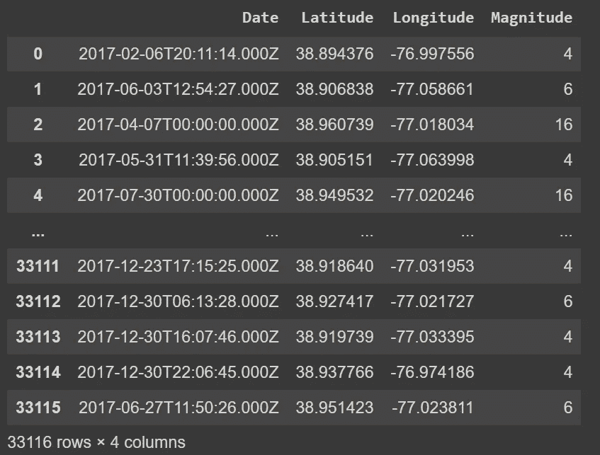
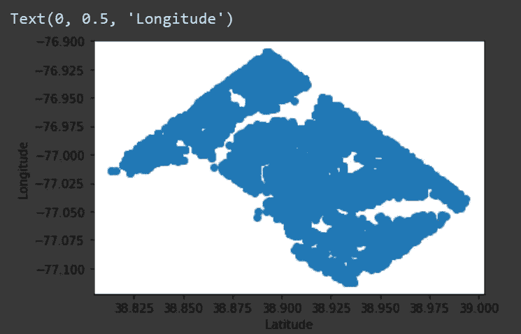
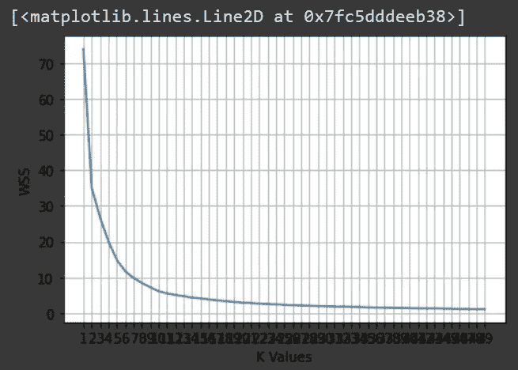
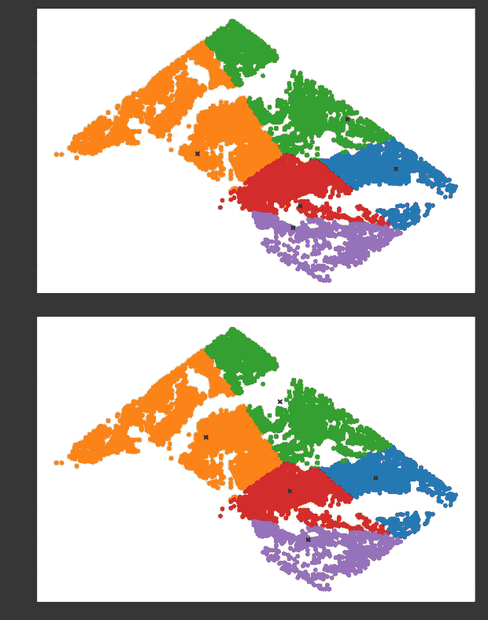
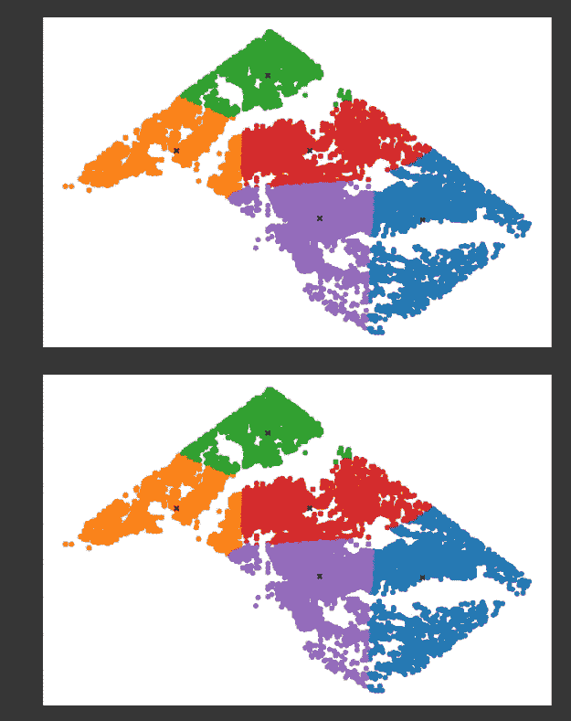
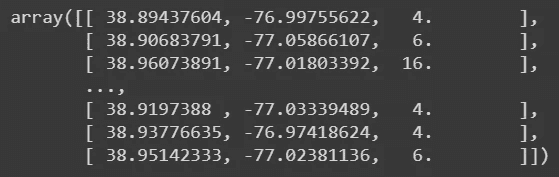
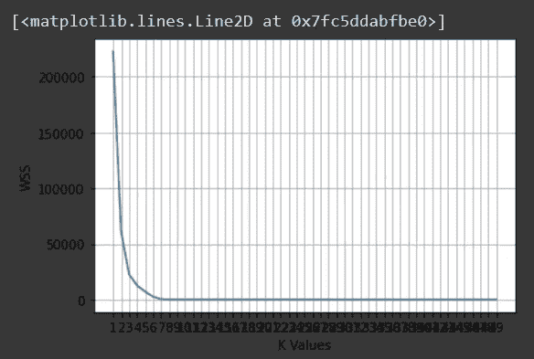
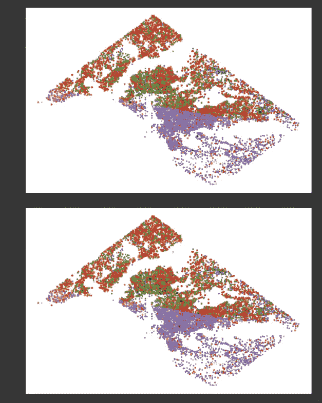
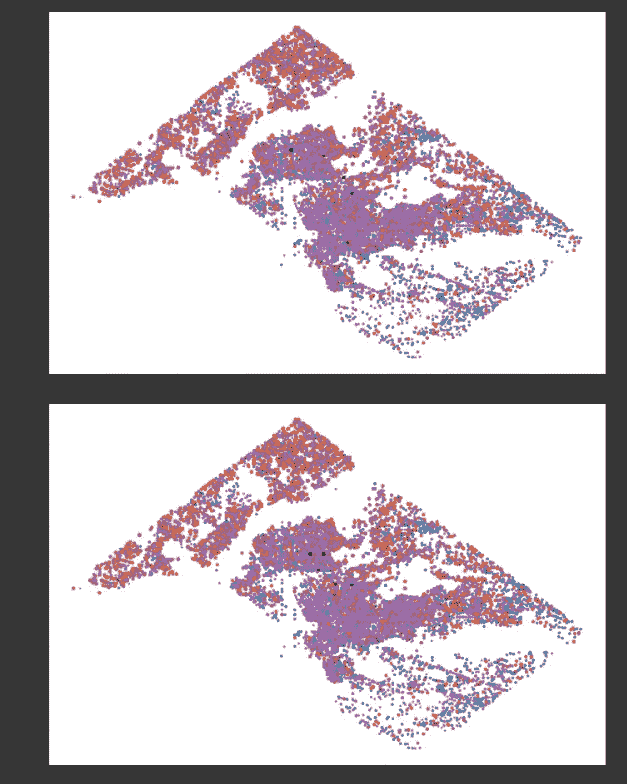
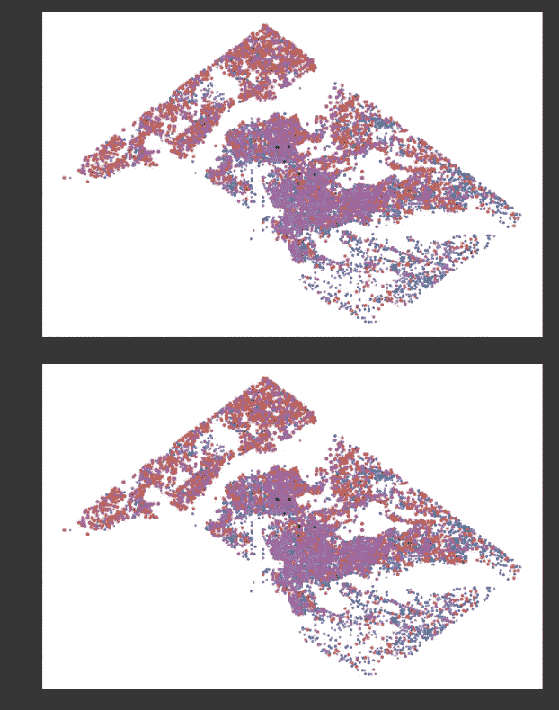

# 基于 K 均值聚类的犯罪数据模式分析与可视化

> 原文：<https://medium.com/analytics-vidhya/crime-data-pattern-analysis-and-visualization-using-k-means-clustering-ceeb963a2b47?source=collection_archive---------9----------------------->

***犯罪模式分析*** *通过发现特定犯罪可能发生的地点、时间和原因，揭示犯罪事件之间潜在的交互过程。这些结果提高了我们对非法活动动态的理解，并可以增强预测性警务。*

> 关于 K-均值聚类的更多信息: [**关于 K-均值聚类你需要知道的一切**](/analytics-vidhya/everything-you-need-to-know-about-k-means-clustering-88ad4058cce0)

*Wget 所需数据* [***此链接***](https://raw.githubusercontent.com/namanvashistha/doctor_strange/master/crime.csv)***:***

```
!wget https://raw.githubusercontent.com/namanvashistha/doctor_strange/master/crime.csv
```

*导入库:*

```
import pandas as pd
import numpy as np
from matplotlib import pyplot as plt
```

*读取并显示数据:*

```
data = pd.read_csv("crime.csv")
data
```



*K——从头开始的意思:*

```
np.random.seed(42)

def euclidean_distance(x1, x2):
    return np.sqrt(np.sum((x1 - x2)**2))

class KMeans():

    def __init__(self, K=5, max_iters=100, plot_steps=False):
        self.K = K
        self.max_iters = max_iters
        self.plot_steps = plot_steps

        *# list of sample indices for each cluster*
        self.clusters = [[] for _ in range(self.K)]
        *# the centers (mean feature vector) for each cluster*
        self.centroids = []

    def predict(self, X):
        self.X = X
        self.n_samples, self.n_features = X.shape

        *# initialize* 
        random_sample_idxs = np.random.choice(self.n_samples, self.K, replace=False)
        self.centroids = [self.X[idx] for idx in random_sample_idxs]

        *# Optimize clusters*
        for _ in range(self.max_iters):
            *# Assign samples to closest centroids (create clusters)*
            self.clusters = self._create_clusters(self.centroids)
            if self.plot_steps:
                self.plot()

            *# Calculate new centroids from the clusters*
            centroids_old = self.centroids
            self.centroids = self._get_centroids(self.clusters)

            *# check if clusters have changed*
            if self._is_converged(centroids_old, self.centroids):
                break

            if self.plot_steps:
                self.plot()

        *# Classify samples as the index of their clusters*
        return self._get_cluster_labels(self.clusters)

    def _get_cluster_labels(self, clusters):
        *# each sample will get the label of the cluster it was assigned to*
        labels = np.empty(self.n_samples)

        for cluster_idx, cluster in enumerate(clusters):
            for sample_index in cluster:
                labels[sample_index] = cluster_idx
        return labels

    def _create_clusters(self, centroids):
        *# Assign the samples to the closest centroids to create clusters*
        clusters = [[] for _ in range(self.K)]
        for idx, sample in enumerate(self.X):
            centroid_idx = self._closest_centroid(sample, centroids)
            clusters[centroid_idx].append(idx)
        return clusters

    def _closest_centroid(self, sample, centroids):
        *# distance of the current sample to each centroid*
        distances = [euclidean_distance(sample, point) for point in centroids]
        closest_index = np.argmin(distances)
        return closest_index

    def _get_centroids(self, clusters):
        *# assign mean value of clusters to centroids*
        centroids = np.zeros((self.K, self.n_features))
        for cluster_idx, cluster in enumerate(clusters):
            cluster_mean = np.mean(self.X[cluster], axis=0)
            centroids[cluster_idx] = cluster_mean
        return centroids

    def _is_converged(self, centroids_old, centroids):
        *# distances between each old and new centroids, fol all centroids*
        distances = [euclidean_distance(centroids_old[i], centroids[i]) for i in range(self.K)]
        return sum(distances) == 0

    def plot(self):
        fig, ax = plt.subplots(figsize=(12, 8))

        for i, index in enumerate(self.clusters):
            point = self.X[index].T
            ax.scatter(*point)

        for point in self.centroids:
            ax.scatter(*point, marker="x", color='black', linewidth=2)

        plt.show()
    def cent(self):
        return self.centroids
```

*检查我们唯一的量值列:*

```
data.Magnitude.unique()**Out:** array(['4', '6', '16', '12', '8', '10', '2', 'ARSON', '14'], dtype=object)
```

*我们有一个未知值叫做“纵火”*

> **放火罪**是指故意、恶意放火或者焚烧财物的犯罪行为。来源: [**维基百科**](https://en.wikipedia.org/wiki/Arson)

我们将只考虑纬度和经度来绘图:

```
plt.scatter(data.Latitude,data.Longitude)
plt.xlabel('Latitude')
plt.ylabel('Longitude')
```



*检查 Nan 值:*

```
data.isna().sum()**Out:**
Date         0 
Latitude     0 
Longitude    0 
Magnitude    0 
dtype: int64
```

*给出我们的 X 值:*

```
X = data[['Latitude', 'Longitude']]
X = np.array(X)
```

*导入内置的 sklearn.cluster 模块计算 WSS:*

```
from sklearn.cluster import KMeans
import plotly.graph_objects as go
```

*计算范围(1，50)内 K 值的 WSS:*

```
wss = []
K = []
k_rng = range(1,50)
for k in k_rng:
    km = KMeans(n_clusters=k)
    km.fit(X)
    wss.append(km.inertia_)
    K.append(k)
plt.xlabel('K Values')
plt.ylabel('WSS')
axes= plt.axes()
axes.set_xticks(K)
plt.grid()
plt.plot(k_rng,wss)
```



*根据 Elbow 技术，K 的最佳值是 5，因此我们将为相同的 K 值实现 K means:*

```
k = KMeans(K=5, max_iters=150, plot_steps=True)
y_pred = k.predict(X)
k.plot()
```



……………..



*现在，我们将未知值“纵火”替换为其他震级值的平均值:*

```
arr = data.Magnitude.unique()
arr = np.delete(arr, 7)
arr = arr.astype(int)
avg = np.average(arr)
avg**Out:** 9.0data.Magnitude = data.Magnitude.replace(to_replace ="ARSON",value ="9")
data.Magnitude.unique()**Out:** array(['4', '6', '16', '12', '8', '10', '2', '9', '14'], dtype=object)data['Magnitude'] = data['Magnitude'].astype(int)
data.Magnitude.unique()**Out:** array([ 4,  6, 16, 12,  8, 10,  2,  9, 14])X = data[['Latitude', 'Longitude', 'Magnitude']]
X = np.array(X)
X
```



```
wss = []
K = []
k_rng = range(1,50)
for k in k_rng:
    km = KMeans(n_clusters=k)
    km.fit(X)
    wss.append(km.inertia_)
    K.append(k)
plt.xlabel('K Values')
plt.ylabel('WSS')
axes= plt.axes()
axes.set_xticks(K)
plt.grid()
plt.plot(k_rng,wss)
```



> 看起来 K=5 又是我们的最佳 K 值

```
k = KMeans(K=5, max_iters=150, plot_steps=True)
y_pred = k.predict(X)
k.plot()
```



> 我知道一下子很难接受。但是你坚持到了最后！恭喜你。不要忘记看看我即将发表的文章！

# 其他资源和参考

[](/analytics-vidhya/everything-you-need-to-know-about-k-means-clustering-88ad4058cce0) [## 关于 K-均值聚类你需要知道的一切

### 如果您想知道 K-means 聚类是怎么一回事，那么您就来对地方了！让我们快速开始，不要…

medium.com](/analytics-vidhya/everything-you-need-to-know-about-k-means-clustering-88ad4058cce0) [](/analytics-vidhya/extracting-dominant-colours-in-an-image-using-k-means-clustering-from-scratch-2ce79a3eea5d) [## 从零开始使用 K-均值聚类提取图像中的主色

### 从头开始，在不到 5 分钟的时间内从您选择的任何图像中提取主色！

medium.com](/analytics-vidhya/extracting-dominant-colours-in-an-image-using-k-means-clustering-from-scratch-2ce79a3eea5d) [](/analytics-vidhya/image-segmentation-using-k-means-clustering-from-scratch-1545c896e38e) [## 从头开始使用 K-均值聚类的图像分割

### 在数字图像处理和计算机视觉中，图像分割是将一幅数字图像分割成几个部分的过程

medium.com](/analytics-vidhya/image-segmentation-using-k-means-clustering-from-scratch-1545c896e38e) 

***完整代码实现:***

[](https://github.com/tanvipenumudy/Winter-Internship-Internity/blob/main/Day%2011/Day-11%20Notebook-3%20%28Crime%20Data%20Analysis%29.ipynb) [## tanvipenumudy/Winter-实习-实习

### 存储库跟踪每天分配的工作-tanvipenumudy/Winter-实习-实习

github.com](https://github.com/tanvipenumudy/Winter-Internship-Internity/blob/main/Day%2011/Day-11%20Notebook-3%20%28Crime%20Data%20Analysis%29.ipynb) 

> 希望你喜欢并充分利用这篇文章！敬请关注我即将发布的博客！如果你觉得我的内容有帮助/有帮助，请确保**鼓掌**和**跟着**！