# 针对妇女的犯罪——地理数据分析

> 原文：<https://medium.com/analytics-vidhya/crimes-against-women-geo-data-analysis-7bcb558c99f4?source=collection_archive---------8----------------------->

在这篇文章中，我们将看到对 2001 年至 2014 年发生在印度的“针对女性的犯罪”的完整分析。


照片由 [Stefano Pollio](https://unsplash.com/@stefanopollio?utm_source=medium&utm_medium=referral) 在 [Unsplash](https://unsplash.com?utm_source=medium&utm_medium=referral) 上拍摄

# 介绍

本文的主要目的是通过遵循数据分析所需的所有步骤来分析犯罪数据。步骤包括**数据准备**、**数据清理**、**数据扯皮**、**特征选择**、**数据可视化&对比**。

这些数据是关于在印度对妇女犯下的罪行。数据是从 2001 年到 2014 年记录的。它包括像这样的罪行-

*   强奸
*   绑架和诱拐
*   嫁妆死亡
*   意图侮辱女性尊严而对其进行攻击
*   对女性尊严的侮辱
*   丈夫或其亲属的虐待
*   女孩的进口

**数据来源** →针对妇女的犯罪——kaggle.com

在整篇文章中，我们将试图分析和确定随着时间的增加，犯罪率是否有所下降。我们将可视化每一列数据(如上所述)的状态和年份，从而以更好的方式进行探索。

如果你想直接查看我在 Kaggle 的作品，欢迎访问下面的链接。

**我的工作** →我的 Kaggle [笔记本](https://www.kaggle.com/mohammedsameeruddin/geo-data-analysis-crimes-against-women)

# 必要的

像往常一样，从导入所有必要的包开始，这对整个分析过程是有帮助的。

```
**import** warnings
warnings.filterwarnings('ignore')**import** requests
**import** pandas as pd
**import** numpy as np
**import** plotly.graph_objects **as** go
```

# 数据读取

我已经在我的本地系统中用文件名`caw_2001-2014.csv`保存了`CSV`数据。

```
df = pd.read_csv('caw_2001-2014.csv', index_col=0)
```

# 数据准备

*   我们将重命名所有列，确保列名简短而精确，以便于访问列数据。

```
df.columns = [
    'state_unit', 
    'district', 
    'year', 
    'rape', 
    'kidnap_abduction', 
    'dowry_deaths', 
    'women_assault', 
    'women_insult', 
    'husband_relative_cruelty', 
    'girl_importation'
]df.index = **list**(**range**(df.shape[0]))
```

*   有很多`string`数据，所有的值都是大写的。为了保持唯一性和灵活性，我们将把所有的`string`值转换成标题大小写。

```
**for** col **in** df.columns:
    df[col] = df[col].apply(
        **lambda** x : x.title() **if** **isinstance**(x, str) **else** x
    )
```

*   如果我们观察列— `state_unit`，很少有值需要替换。有些值(意思)是重复的，意思是它表示相同的意思，但有不同的名称。我们将替换所有这些值，以获得一个唯一的名称。这个过程非常有助于在地理上可视化数据。

```
replacements = {
    'A & N Islands' : 'Andaman and Nicobar',
    'A&N Islands' : 'Andaman and Nicobar',
    'Daman & Diu' : 'Daman and Diu',
    'Delhi Ut' : 'Delhi',
    'D & N Haveli' : 'Dadra and Nagar Haveli',
    'D&N Haveli' : 'Dadra and Nagar Haveli',
    'Odisha' : 'Orissa',
    'Jammu & Kashmir' : 'Jammu and Kashmir'
}**for** (o, r) **in** replacements.items():
    df['state_unit'].replace(to_replace=o, value=r, inplace=**True**)
```

# 数据探索和分类

*   因为数据是从`2001`到`2014`收集的。我们将按年划分数据，并将其保存在字典中。这只是一种组织数据的有效方式。下面的函数有助于实现数据拆分。

*   要知道数据的维度(以年为单位)，我们可以遍历每个键并打印形状。

```
**for** (y, d) **in** data_splits.items():
    **print**(y, '\t→', d.shape)# --------------
'''
2001     → (716, 10)
2002     → (719, 10)
2003     → (728, 10)
2004     → (729, 10)
...
2014     → (837, 10)
'''
```

*   在列`district`中，有一个唯一的行值，它包含与每个犯罪列相关的犯罪总数。基于`state_unit`列，这也是不同的。

上述函数`categorize_crimes()`采用两个参数，例如-

*   `data_source` →指按年份拆分的全部数据。
*   `state_unit` →如果值为`None`，则考虑以全国为基础的全年犯罪总数。否则，它会根据特定的州来考虑全年的犯罪总数。

# 数据可视化和分析

既然我们已经对数据进行了分类，我们可以尝试对其进行可视化，以识别和观察模式。

通过包括所有的犯罪来可视化整个国家的犯罪数量。

1.  为此，我们将创建一个函数，以州或国家为单位计算犯罪总数。我们只需要提供`data_source`和`state_unit`是可选的。
2.  一旦它获得了每一列的总数，再对所有列求和，得到每年发生的犯罪总数。
3.  如果指定了`state_unit`，它会执行相同的过程，但仅限于该特定状态。

*   **1 函数调用** →全国基础可视化。

```
**plot_overall_crimes_by_year**(data_source=data_splits)
```

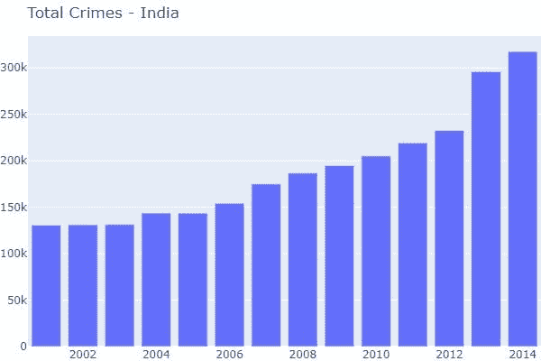

作者图片

*   **2 函数调用** →基于特定状态的可视化。

```
**plot_overall_crimes_by_year**(
    data_source=data_splits, 
    state_unit='Andhra Pradesh'
)
```

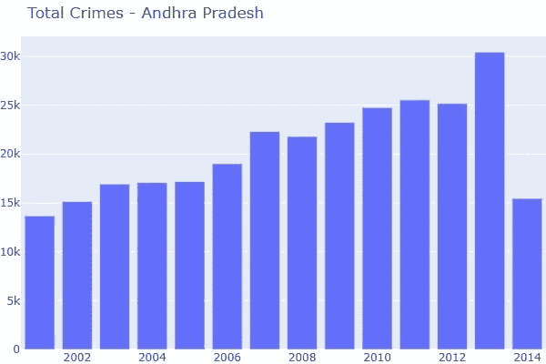

作者图片

通过包括所有犯罪和犯罪发生的具体年份，可视化整个国家的犯罪数量。

1.  为此，我们将创建一个函数，该函数按年份获取州或国家的犯罪总数。我们只需要提供`data_source`、`year`、`state_unit`是可选的。
2.  如果指定了`state_unit`，它会执行相同的过程，但仅限于该特定状态。

*   **1 函数调用** →特定时间段(年)全国基础上的可视化。

```
**plot_crimes_by_year**(data_source=data_splits, year=2001)
```

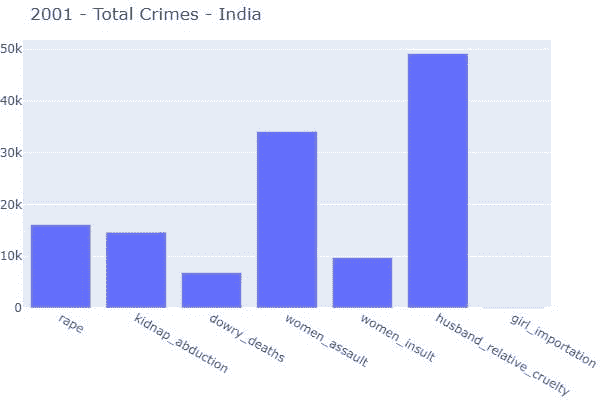

作者图片

*   **2 函数调用** →基于特定时间段(年份)特定状态的可视化。

```
**plot_crimes_by_year**(
    data_source=data_splits, 
    year=2001, 
    state_unit='Andhra Pradesh'
)
```

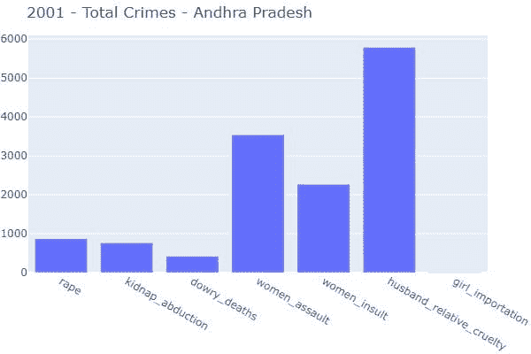

作者图片

考虑两个不同的时间段(年)，通过国家和特定的州来直观地比较发生率的差异。

1.  为此，我们将创建一个函数，以不同年份的州或国家的犯罪总数为基准。我们只需要提供`data_source`、`ideal_year`、`cwith_year`、`state_unit`即可，可选。
2.  如果指定了`state_unit`，它会执行相同的过程，但仅限于该特定状态。

*   **1 函数调用** →两个不同时间段(年)全国基础上的可视化。

```
**plot_overall_difference**(
    data_source=data_splits, 
    ideal_year=2001, 
    cwith_year=2014
)
```

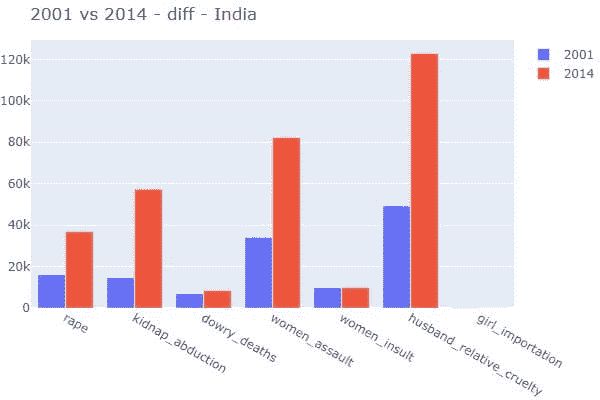

作者图片

*   **2 函数调用** →基于两个不同时间段(年)的特定状态的可视化。

```
**plot_overall_difference**(
    data_source=data_splits, 
    ideal_year=2001, 
    cwith_year=2012, 
    state_unit='Andhra Pradesh'
)
```

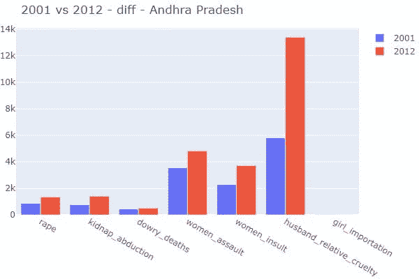

作者图片

绘制全国和州的特定犯罪图，以确定逐年上升或下降的模式。

1.  为此，我们将创建一个函数，考虑所有年份的州或国家的任何单个犯罪。我们只需要提供`data_source`、`crime`，而`state_unit`是可选的。
2.  如果指定了`state_unit`，它会执行相同的过程，但仅限于该特定状态。

*   **1 函数调用** →在全国的基础上可视化任意单个犯罪。

```
**plot_crime_overall_diff**(data_source=data_splits, crime='rape')
```

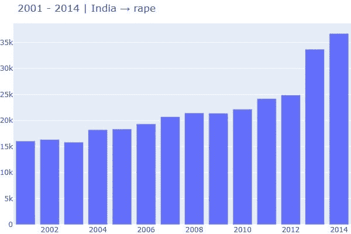

作者图片

*   **2 函数调用** →基于特定状态的任意单个犯罪的可视化。

```
**plot_crime_overall_diff**(
    data_source=data_splits, 
    crime='rape', 
    state_unit='Andhra Pradesh'
)
```

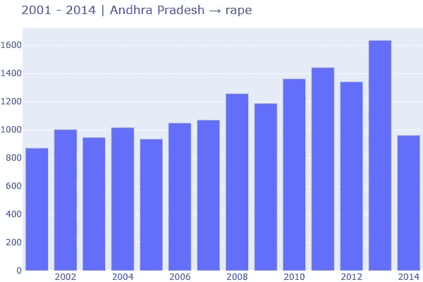

作者图片

在上述方法中，我们只考虑了`rape`列。如果我们想要识别任何其他列的模式，我们可以通过更改参数值来实现。

以特定犯罪(列)为目标，按州和年度绘制数据。

1.  为此，我们将创建一个函数，以某个州或国家为单位，在某个特定时间段内的任何单个犯罪。我们只需要提供`data_source`、`crime`、`year`、`state_unit`是可选的。
2.  如果指定了`state_unit`，它会执行相同的过程，但仅限于该特定状态。

*   **1 函数调用** →以特定时期全国为基础的任意单个犯罪的可视化。

```
**plot_column**(
    data_source=data_splits, 
    year=2001, 
    crime='kidnap_abduction'
)
```

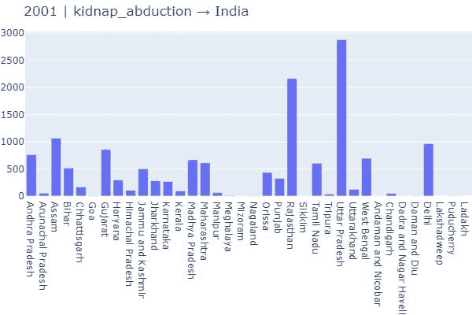

作者图片

*   **2 函数调用** →基于特定时期特定状态的任意单个犯罪的可视化。

```
**plot_column**(
    data_source=data_splits, 
    year=2001, 
    crime='kidnap_abduction', 
    state_unit='Andhra Pradesh'
)
```

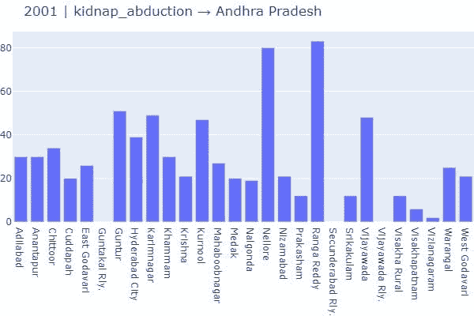

作者图片

# 结论

1.  据观察，随着年龄的增长，犯罪的发生率急剧上升。观察这一点是相当辛苦的，我们都被告知国家的发展(从各个角度来看)需要时间和耐心。随着年龄的增长，这种情况应该会减少。但事实恰恰相反。
2.  无论采取什么措施，针对妇女的犯罪都在增加。
3.  此外，该数据集包括 2014 年之前发生的活动，我们不知道在此日期之前还发生了多少活动。
4.  当我们考虑任何单个状态并运行我们的分析时，观察到相同的模式。

# 地理情节——国家层面的犯罪活动

为了在地理上绘制数据，需要有一个地图布局，因此，数据可以可视化。此外，我们需要注意年份参数，因为**安得拉邦**在这一年被分成两个独立的邦，`2014`即 1 -安得拉邦，2 -特伦甘纳邦。

**下载 GeoJSON 数据** —州级

**获取地区地理信息**

**可视化 Choropleth 图**

*   **1 个函数调用** —基于特定年份可视化`dowry_deaths`数据状态。

```
**plot_state_wise**(
    data_source=data_splits, 
    year=2001, 
    crime='dowry_deaths'
)
```

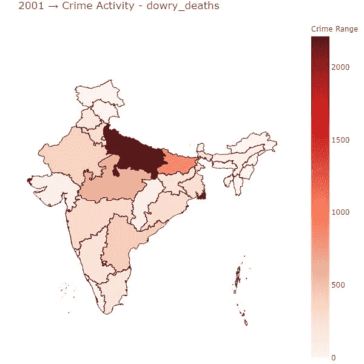

作者图片

```
**plot_state_wise**(
    data_source=data_splits, 
    year=2014, 
    crime='dowry_deaths'
)
```

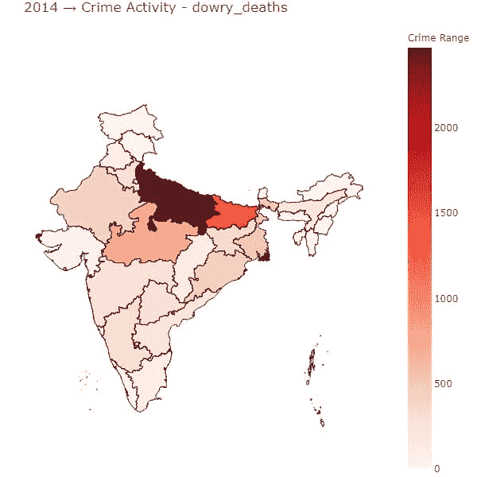

作者图片

请我喝咖啡

如果你喜欢我的文章，你可以买些咖啡，在这里支持我。这将激励我去写作和学习更多我所知道的东西。

好了，暂时就这些了。这篇文章包含在**探索性数据分析**系列文章中，在这里我分享了一些有助于入门的技巧和教程。我们将逐步学习如何探索和分析数据。作为先决条件，了解编程的基础知识会有所帮助。这个系列的链接可以在这里找到[。](https://msameeruddin.hashnode.dev/series/explore-da)