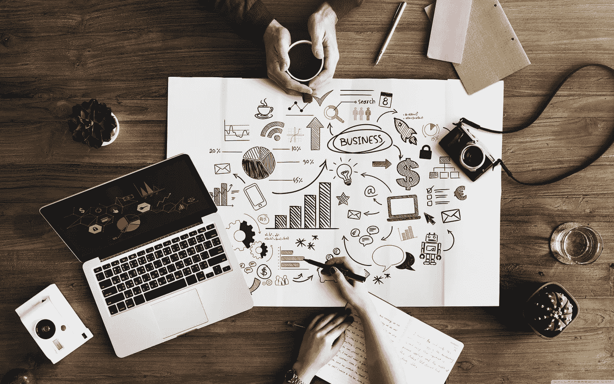
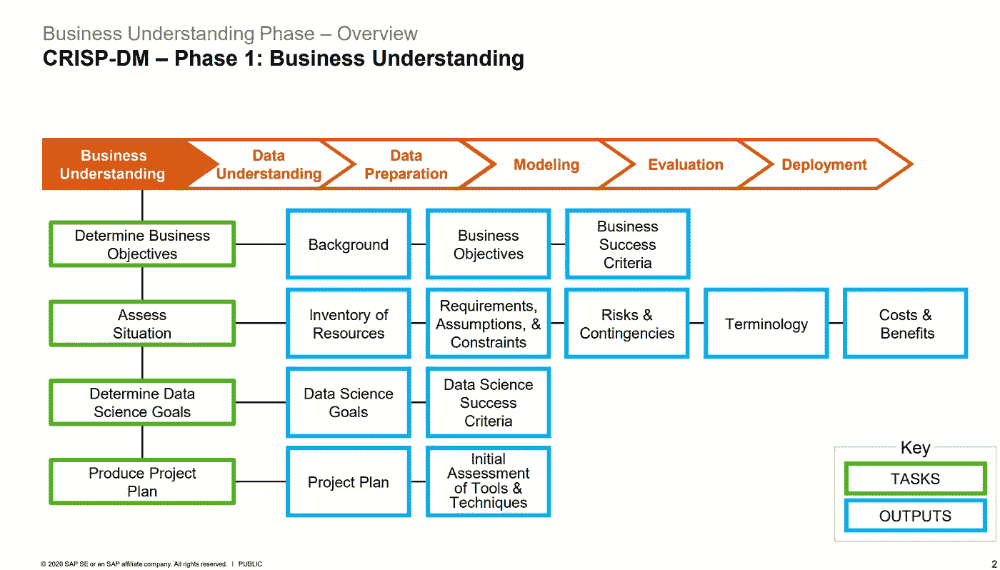

# CRISP-DM 阶段 1:业务理解

> 原文：<https://medium.com/analytics-vidhya/crisp-dm-phase-1-business-understanding-255b47adf90a?source=collection_archive---------3----------------------->

图片来自[壁纸洞穴](https://wallpapercave.com/w/wp5315781)

*这是由*[*Stuart Clarke*](https://www.linkedin.com/in/stuartclarkeanalytics/?originalSubdomain=uk)*主讲的* [*openSAP 为期 6 周的数据科学入门(2021 版)*](https://open.sap.com/courses/ds3) *课程的第 2 部分。第 1 部分是* [*这里的*](https://zluna.medium.com/understanding-crisp-dm-and-its-importance-in-data-science-projects-91c8742c9f9b) *。*

# **第一部分回顾**

在本系列的 [*第一部分*](https://zluna.medium.com/understanding-crisp-dm-and-its-importance-in-data-science-projects-91c8742c9f9b) 中，我简单解释了 CRISP-DM 是什么，为什么重要，CRISP-DM 的六个阶段是什么。

**六期酥-DM** :

1.  商业理解
2.  数据理解
3.  数据准备
4.  建模
5.  估价
6.  部署

之前，我提到过这六个阶段有特定的任务和产出。在本系列的第二部分中，我们将关注第一阶段，即 ***业务理解*** 。我将解释为什么在开始一个数据科学项目、任务以及每个任务的输出之前有一个业务理解是重要的。

# **了解业务的重要性**

作为一名数据科学家，了解贵公司的业务类型、行业、运营方式以及基本上与业务相关的一切非常重要，因为对业务的透彻了解将有助于您准确确定当前的挑战，如何评估这些挑战并提出一个或多个解决方案，以及确定实现业务目标的策略。

一些数据科学家可能倾向于忘记从业务角度了解业务的这一部分或这一重要步骤，因为他们倾向于关注这是什么问题，使用什么模型，只是开始从数据集获得尽可能多的信息，却意识到这不是业务部门想要的。永远记住，不知道如何框定业务问题本身就是一个问题。

> "不知道如何构建业务问题本身就是一个问题."

# 崩溃

在课程中，Stuart 分解了第一阶段的任务和输出，以便在开始数据科学项目之前更好地理解和覆盖业务需求。**见下文*

图片来自[数据科学入门](https://open.sap.com/courses/ds3)

在上面的流程中，业务理解被分解为四个任务，以及详细的预期结果或输出。

简而言之，业务理解阶段的目标是:

*   ***确定业务目标*** 从业务角度理解*客户或公司真正想要完成什么*并确定衡量业务成功或项目成功的标准
*   ***评估情况*** 通过检查在资源清单、需求、假设甚至项目的约束条件、风险和意外情况、使用和将要使用的术语以及项目的成本和收益方面需要做的事情
*   ***确定数据科学目标*** 用技术术语描述您的数据科学团队或数据科学家的项目目标，并定义数据科学成功标准
*   ***通过描述实现数据科学目标的计划意图来制定项目计划*** 以便能够实现业务目标，创建包含具体项目阶段、持续时间、所需资源甚至成本的项目计划，并对要使用的工具和技术进行初步评估

在第三部分，我们将讨论第二阶段，即 ***数据理解*** *。*如果您正在为您的公司甚至个人项目进行数据科学项目，请尝试应用上述步骤(如果适用)。同样，不同的数据科学项目有不同的需求。CRISP-DM 方法只是作为一个模板，确保您已经考虑了项目的所有不同方面。

***参考文献:***

 [## 数据科学入门(2021 版)

### 加入这个免费的在线课程，了解数据科学。本课程将向您介绍数据的基本原理…

open.sap.com](https://open.sap.com/courses/ds3)  [## 团队数据科学过程中的业务理解- Azure 架构中心

### 这篇文章概述了与团队的业务理解阶段相关的目标、任务和可交付成果…

docs.microsoft.com](https://docs.microsoft.com/en-us/azure/architecture/data-science-process/lifecycle-business-understanding)