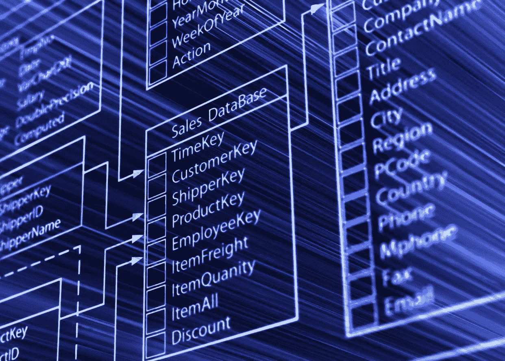
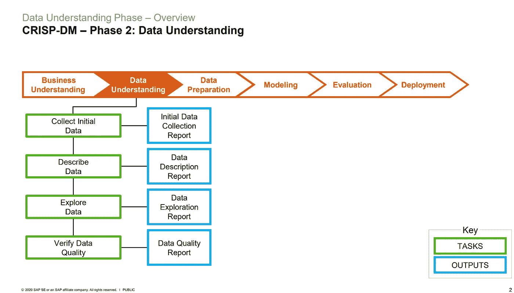

# CRISP-DM 阶段 2:数据理解

> 原文：<https://medium.com/analytics-vidhya/crisp-dm-phase-2-data-understanding-b4d627ba6b45?source=collection_archive---------0----------------------->

*这是由*[*Stuart Clarke*](https://www.linkedin.com/in/stuartclarkeanalytics/?originalSubdomain=uk)*主持的* [*openSAP 为期 6 周的数据科学入门(2021 版)*](https://open.sap.com/courses/ds3) *课程的第 3 部分。第二部分是* [*这里的*](/analytics-vidhya/crisp-dm-phase-1-business-understanding-255b47adf90a) *。*

# 第 2 部分概述

在本系列的 [*第二部分*](/analytics-vidhya/crisp-dm-phase-1-business-understanding-255b47adf90a) 中，我解释了为什么在开始数据科学项目之前了解业务非常重要，因为这将是构建项目的主要驱动因素之一。

CRISP-DM 有六个阶段，具有特定的任务和输出:

**六期酥-DM** :

1.  商业理解
2.  数据理解
3.  数据准备
4.  建模
5.  估价
6.  部署

在本系列的第三部分中，我们将重点关注第二阶段，即 ***数据理解*** 。有了业务了解之后，你需要了解你有什么数据，从哪里获取数据，你的数据里有什么，你的数据是否有质量。

# 为什么需要了解你的数据？

在业务理解阶段，第四个任务是*生产项目计划*包括描述所需的资源。在这个阶段，您需要确定您已经拥有哪些数据，从哪里获取数据，使用什么工具获取数据，以及有多少数据是至关重要的。从初始阶段了解您的数据将使您的数据科学项目更有意义。

假设你的任务是预测房价，但你不知道从哪里获取数据，你会采取什么方法？如果数据只有 50 条记录，且记录多为商业空间怎么办？用起来会不会合适，够不够用？

永远记住，在潜入一个数据科学项目之前，永远要先知道和了解*要采集什么数据， ***在哪里*** 要采集，*如何采集，以及 ***要采集多少*** 数据。**

# **崩溃**

**在课程中，Stuart 详细分解了第二阶段的任务和产出。**见下文***

****

**图片来自[数据科学入门](https://open.sap.com/courses/ds3)**

**在上面的流程中，数据理解被分解为四个任务及其详细的预计结果或输出。**

**简而言之，数据理解阶段的目标是:**

*   *****收集初始数据*** 或获取项目资源中列出的数据及其访问权限。收集初始数据还意味着您需要有一份已获取数据集的清单、数据集位置、获取数据集的方法，并记录遇到的任何问题和问题的任何解决方案，以便其他用户或项目成员了解。**
*   *****描述数据*** 通过检查采集到的数据的属性，提供关于数据的格式、数据的数量甚至每个表或数据集中的记录和字段的描述报告。**
*   *****利用数据科学问题探索数据*** ，这些问题可以通过查询、可视化、报告或汇总报告快速回答。在这个阶段，你将能够找到你的第一个或最初的假设，以及它们对项目的影响。**
*   *****通过检查数据是否完整来验证数据质量*** 。如果数据有错误或有缺失值，如果有，缺失值占获得的总数据的百分比是多少。**

**在下一部分，我们将讨论第三个阶段，即 ***数据准备*** *。*如果你正在为你的公司甚至是个人项目做一个数据科学项目，如果可行的话，试着应用上面的步骤。同样，不同的数据科学项目有不同的需求。CRISP-DM 方法只是作为一个模板，确保您已经考虑了项目的所有不同方面。**

*****参考文献:*****

** [## 数据科学入门(2021 版)

### 加入这个免费的在线课程，了解数据科学。本课程将向您介绍数据的基本原理…

open.sap.com](https://open.sap.com/courses/ds3)**