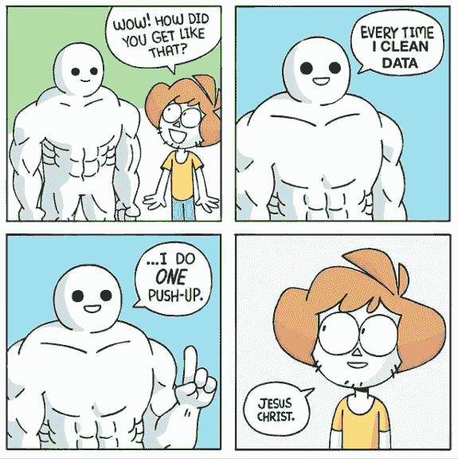
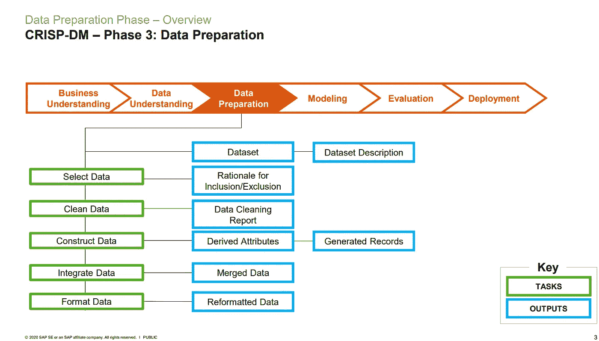

# CRISP-DM 第 3 阶段:数据准备

> 原文：<https://medium.com/analytics-vidhya/crisp-dm-phase-3-data-preparation-faf5ee8dc38e?source=collection_archive---------5----------------------->

图片来自[印度分析杂志](https://www.google.com/url?sa=i&url=https%3A%2F%2Fanalyticsindiamag.com%2Ftop-data-preparation-tools-to-watch-out-for-in-2020%2F&psig=AOvVaw2WKhbN2SxYvmok4CbRbpZA&ust=1628659237655000&source=images&cd=vfe&ved=0CAsQjRxqFwoTCKDjg8_apfICFQAAAAAdAAAAABAK)

*这是由*[*Stuart Clarke*](https://www.linkedin.com/in/stuartclarkeanalytics/?originalSubdomain=uk)*主讲的* [*openSAP 为期 6 周的数据科学入门(2021 版)*](https://open.sap.com/courses/ds3) *课程的第 4 部分。第三部分是* [*这里的*](/analytics-vidhya/crisp-dm-phase-2-data-understanding-b4d627ba6b45) *。*

# 第 3 部分概述

在本系列的 [*第三部分*](/analytics-vidhya/crisp-dm-phase-2-data-understanding-b4d627ba6b45) 中，我解释了为什么有一个数据理解很重要:采集什么数据，从哪里采集，如何采集，采集多少数据。

CRISP-DM 有六个阶段，具有特定的任务和输出:

**六期酥-DM** :

1.  商业理解
2.  数据理解
3.  数据准备
4.  建模
5.  估价
6.  部署

现在，我们将关注第三阶段，即 ***数据准备*** 。识别和理解数据后，您需要准备数据—清理、集成数据、进行数据编码、特征工程以及选择变量和特征。这些只是你在准备数据时可以做的少数过程或方法中的一部分，并不是所有这些都是必要的。正如在数据理解阶段所讨论的，这完全取决于您拥有哪些数据。

# 为什么需要准备数据？难道模型不能做到这一切吗？

你可能听过或者熟悉 ***“垃圾进，垃圾出。”*** 短语不仅仅是在数据科学领域而是在你遇到的任何数据分析任务中。但是如果这个短语对你来说是新的，那就永远记住它。

图片来自谷歌

> “数据准备是在处理和分析之前清理和转换原始数据的**过程。这是处理之前的一个重要步骤，通常涉及重新格式化数据、对数据进行修正以及合并数据集以丰富数据。”**

在模型中使用未清理或脏的数据会使模型产生错误的结果或数据假设。《纽约时报》的一篇文章报道称，在数据可用于探索之前，尤其是在将数据输入模型之前，数据科学家要花费 50%到 80%的时间来收集和准备数据。

# **数据准备的好处**

*   在将错误提供给模型之前，识别并修复错误
*   高质量数据
*   做出更好的商业决策
*   让模型解释并产生好的结果

# 崩溃

在课程中，Stuart 详细分解了第三阶段的任务和产出。**见下文*

在上面的流程中，数据准备被分解为五个任务，以及详细的预计结果或输出。

简而言之，数据准备阶段的目标是:

*   ***选择数据*** 或决定用于分析的数据。选择数据的标准之一是它应该与在 [*业务理解*](/analytics-vidhya/crisp-dm-phase-1-business-understanding-255b47adf90a) 阶段确定的数据科学目标相关。在选择数据时，您还需要列出要排除和包含的数据以及做出这些决定的原因。
*   ***通过将数据质量提高到所选分析技术要求的水平来清理数据*** 。在这里，您还需要描述在 [*数据理解*](/analytics-vidhya/crisp-dm-phase-2-data-understanding-b4d627ba6b45) 阶段的*验证数据质量*任务期间，采取了哪些决策和行动来解决报告的数据质量问题。
*   ***通过包含派生属性、全新记录或现有属性的转换值来构建数据*** 。这可能是进行[编码方法](/analytics-vidhya/one-hot-encoding-categorical-variables-what-is-it-why-is-it-how-is-it-6fd9ed3a161)特别是分类变量或特征工程。
*   ***通过合并多个表或记录来集成数据*** 以创建新的记录或值。SQL 知识和技能非常重要，在这部分会派上用场。
*   ***格式数据*** 通过转换数据但不一定改变其含义，但可能是建模工具所要求的。例如，通过 [*标准化或*](https://python.plainenglish.io/feature-scaling-when-should-you-use-standardization-and-normalization-ea2eabb4a1d5) 规范化来转换数据。

在下一部分，我们将讨论第四个阶段，即**。*如果您正在为您的公司甚至个人项目进行数据科学项目，请尝试应用上述步骤(如果适用)。同样，不同的数据科学项目有不同的需求。CRISP-DM 方法只是作为一个模板，确保您已经考虑了项目的所有不同方面。*

*您还可以查看我以前的文章，其中涵盖了几个数据准备过程:*

*   ***检测异常值**:[*https://python . plain English . io/what-it-means-to-be-different-outlier-2c 680 e3b 4742*](https://python.plainenglish.io/what-it-means-to-be-different-outlier-2c680e3b4742)*
*   ***处理缺失值**:[*https://medium . com/analytics-vid hya/how-to-deal-Missing-Values-600 b70b 79918*](/analytics-vidhya/how-to-deal-with-missing-values-600b70b79918)*
*   ***一热编码**:[*https://medium . com/analytics-vid hya/One-Hot-Encoding-category-variables-what-is-it-why-it-why-it-how-it-it-6fd 9 ed 3a 161*](/analytics-vidhya/one-hot-encoding-categorical-variables-what-is-it-why-is-it-how-is-it-6fd9ed3a161)*
*   ***特征缩放**:[*https://python . plain English . io/Feature-Scaling-when-you-should-use-standard-and-normalization-ea 2 eab B4 a1 D5*](https://python.plainenglish.io/feature-scaling-when-should-you-use-standardization-and-normalization-ea2eabb4a1d5)*
*   ***特征选择**:[*https://medium . com/geek culture/Feature-Selection-in-machine-learning-correlation-matrix-univariable-testing-rfe cv-1186168 fac 12*](/geekculture/feature-selection-in-machine-learning-correlation-matrix-univariate-testing-rfecv-1186168fac12)*

****参考文献:****

* [## 数据科学入门(2021 版)

### 加入这个免费的在线课程，了解数据科学。本课程将向您介绍数据的基本原理…

open.sap.com](https://open.sap.com/courses/ds3)  [## 数据科学无限

### 以正确的方式学习正确的内容，并提供无限的支持和指导，我致力于帮助您成为一名…

data-science-infinity.teachable.com](https://data-science-infinity.teachable.com/courses/data-science-infinity?affcode=716157_jcwmqdhh)  [## 什么是数据准备？(+如何让它更简单)- Talend

### 数据准备是在处理和分析之前清理和转换原始数据的过程。这是一个时间…

www.talend.com](https://www.talend.com/resources/what-is-data-preparation/#:~:text=Data%20preparation%20is%20the%20process,data%20sets%20to%20enrich%20data)  [## 对于大数据科学家来说，“看门人工作”是洞察的关键障碍(2014 年出版)

### 技术革命是有分寸的，有时是拖后腿的。实验室科学和营销热情倾向于…

www.nytimes.com](https://www.nytimes.com/2014/08/18/technology/for-big-data-scientists-hurdle-to-insights-is-janitor-work.html)*