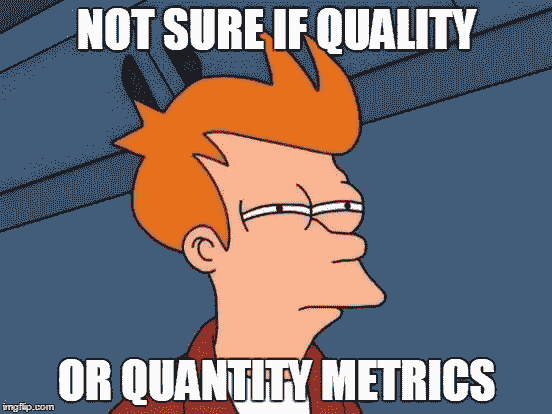
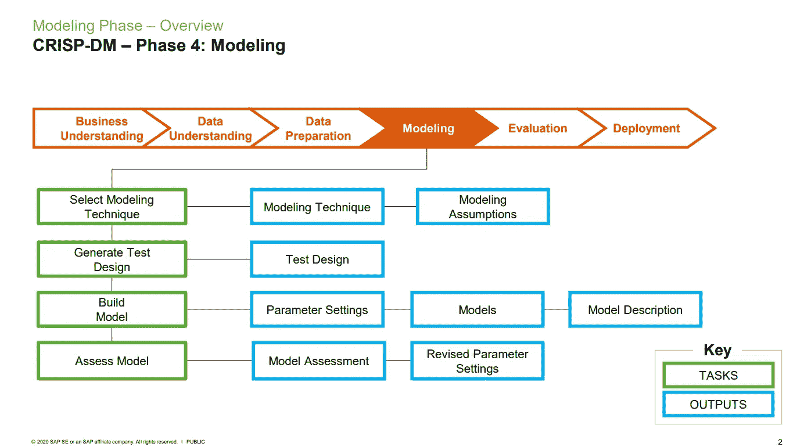

# CRISP-DM 阶段 4:建模阶段

> 原文：<https://medium.com/analytics-vidhya/crisp-dm-phase-4-modeling-phase-b81f2580ff3?source=collection_archive---------8----------------------->

图片来自 [Analytics Insight](https://www.analyticsinsight.net/understanding-the-limitations-of-deep-learning-models/)

*这是由*[*Stuart Clarke*](https://www.linkedin.com/in/stuartclarkeanalytics/?originalSubdomain=uk)*主讲的* [*openSAP 为期 6 周的数据科学入门(2021 版)*](https://open.sap.com/courses/ds3) *课程的第 5 部分。第四部分是* [*这里的*](https://zluna.medium.com/crisp-dm-phase-3-data-preparation-faf5ee8dc38e) *。*

# 第 4 部分概述

在本系列的[第四*部分*](https://zluna.medium.com/crisp-dm-phase-3-data-preparation-faf5ee8dc38e) 中，我解释了为什么准备数据是数据科学项目中至关重要的一部分，简要讨论了如何准备数据，并提供了该领域中一些最常见的数据准备方法的代码。

CRISP-DM 有六个阶段，具有特定的任务和输出:

**六期酥-DM** :

1.  商业理解
2.  数据理解
3.  数据准备
4.  建模
5.  估价
6.  部署

在本文中，我们将重点介绍第四个阶段，即 ***数据建模*** 。在所有的清理、格式化、特征工程(如果需要)和特征选择之后，我们现在将数据输入到所选择的模型中。但是如何选择一个模型来使用呢？

***注:*** 我只会简单的讨论如何选择一款机型，有哪些可用的机型。我不会涉及每个模型以及它是如何工作的。要了解每个不同类型的模型及其工作原理，可以在这里报名: [*openSAP 的 6 周数据科学入门(2021 版)*](https://open.sap.com/courses/ds3) *课程。*

# 如何选择型号？

**看情况**。你没看错，这要看情况。这完全取决于你的任务或项目的目标是什么，这应该已经在 CRISP-DM 的 [*业务理解*](/analytics-vidhya/crisp-dm-phase-1-business-understanding-255b47adf90a) 阶段确定了。

## 选择模型的步骤

1.  **确定训练数据的大小** —如果你有一个小的数据集，少量的观察值，大量的特征，你可以选择高偏差/低方差算法*(线性回归，朴素贝叶斯，线性 SVM)* 。如果您的数据集很大，并且与要素数量相比具有大量的观察值，您可以选择低偏差/高方差算法 *(KNN，决策树)*。
2.  **输出的准确性和/或可解释性** —如果你的目标是推断，选择限制性模型，因为它更容易解释*(线性回归，最小二乘法)。*如果你的目标是更高的精度，那么选择灵活的型号*(装袋、增压、SVM)* 。
3.  **速度或训练时间** —请始终记住，更高的准确度和更大的数据集意味着更长的训练时间。易于运行和实施的算法示例有:*朴素贝叶斯、线性和逻辑回归。*一些需要更多时间训练的算法的例子有: *SVM、神经网络、随机森林*。
4.  **线性**—首先尝试通过拟合线性线或尝试运行逻辑回归来检查数据的线性，您也可以检查它们的残差。更高的误差意味着数据不是线性的，需要复杂的算法来拟合。如果数据是线性的，可以选择:*线性回归，Logistic 回归，支持向量机*。如果非线性:*核 SVM，随机森林，神经网络*。

# **参数与非参数机器学习模型**

## ***参数化机器学习算法***

***参数 ML 算法*** 是将函数简化为已知形式的算法。它们通常被称为“线性最大似然算法”。

**参数 ML 算法**

*   逻辑回归
*   线性判别分析
*   感知器
*   朴素贝叶斯
*   简单神经网络

**参数 ML 算法的优势**

*   ***更简单***——易于理解的方法和易于解释的结果
*   ***速度*** —从提供的数据中学习非常快
*   ***数据较少*** —不需要太多的训练数据

**参数 ML 算法的局限性**

*   ***有限的复杂性***——只适合较简单的问题
*   ***不适合*** —方法不太可能匹配底层映射函数

## ***非参数机器学习算法***

***非参数 ML 算法*** 是不对映射函数的形式做出假设的算法。当您拥有大量数据且没有先验知识，并且不想过多担心如何选择正确的功能时，这种方法非常有用。

**非参数 ML 算法**

*   k-最近邻(KNN)
*   像 CART 这样的决策树
*   支持向量机(SVM)

**非参数 ML 算法的优势**

*   ***灵活性*** —能够适应大量的功能形式
*   ***Power*** —不要对底层功能进行假设
*   ***性能*** —能够给出更高性能的预测模型

**非参数最大似然算法的局限性**

*   ***需要更多数据*** —需要大量训练数据集
*   ***处理较慢*** *—* 它们通常有更多的参数，这意味着训练时间要长得多
*   ***过度拟合*** —过度拟合训练数据的风险更高，结果更难解释为什么会做出特定的预测

# 崩溃

在课程中，Stuart 详细分解了第四阶段的任务和产出。**见下文*

在上面的流程中，数据建模被分解为四个任务，以及其详细的预计结果或输出。

简而言之，数据建模阶段的目标是:

*   ***通过选择实际使用的建模技术来选择建模技术*** 。这应该已经在 [*业务理解*](/analytics-vidhya/crisp-dm-phase-1-business-understanding-255b47adf90a) 阶段确定了。不要忘记记录将要使用的建模技术和将要使用的其他模型。
*   ***生成测试设计*** 通过生成一个程序来测试模型的质量和有效性。在这里，您将能够描述培训、测试以及如何评估模型的预期计划。
*   ***通过使用准备好的数据集运行模型来构建模型*** 。一旦模型经过运行测试，请列出参数及其选择值，以及选择参数设置的理由，因为您不希望仅仅因为忘记了使用的初始参数而一次又一次地运行已经运行的模型。
*   ***根据领域知识和数据科学标准，通过解释模型来评估模型*** 。在这一阶段，您需要总结生成的模型的结果，并对它们的质量进行排名。评估模型性能指标、图表和混淆矩阵。

在下一部分，我们将讨论第五个阶段，即 ***评估阶段*** *。*如果您正在为您的公司甚至个人项目进行数据科学项目，请尝试应用上述步骤(如果适用)。同样，不同的数据科学项目有不同的需求。CRISP-DM 方法只是作为一个模板，确保您已经考虑了项目的所有不同方面。

***参考文献:***

 [## 数据科学入门(2021 版)

### 加入这个免费的在线课程，了解数据科学。本课程将向您介绍数据的基本原理…

open.sap.com](https://open.sap.com/courses/ds3)  [## 数据科学无限

### 以正确的方式学习正确的内容，并提供无限的支持和指导，我致力于帮助您成为一名…

data-science-infinity.teachable.com](https://data-science-infinity.teachable.com/courses/data-science-infinity?affcode=716157_jcwmqdhh)