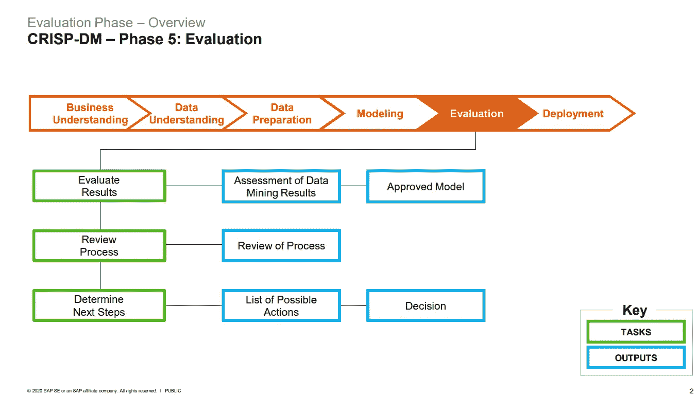

# CRISP-DM 第 5 阶段:评估阶段

> 原文：<https://medium.com/analytics-vidhya/crisp-dm-phase-5-evaluation-phase-d7bb3c75220a?source=collection_archive---------2----------------------->

图片由 [Shopify](https://www.google.com/url?sa=i&url=https%3A%2F%2Fwww.shopify.com%2Fblog%2F7365564-32-key-performance-indicators-kpis-for-ecommerce&psig=AOvVaw0BCICEiXxCPW_bbSrFyxsQ&ust=1634221159367000&source=images&cd=vfe&ved=0CAsQjRxqFwoTCKiat7XKx_MCFQAAAAAdAAAAABAU)

*这是由*[*Stuart Clarke*](https://www.linkedin.com/in/stuartclarkeanalytics/?originalSubdomain=uk)*主讲的* [*openSAP 为期 6 周的数据科学入门(2021 版)*](https://open.sap.com/courses/ds3) *课程的第 6 部分。第五部分是* [*这里的*](/analytics-vidhya/crisp-dm-phase-4-modeling-phase-b81f2580ff3) *。*

# 第 5 部分概述

在本系列的 [*第五*](/analytics-vidhya/crisp-dm-phase-4-modeling-phase-b81f2580ff3) 部分，我简单解释了如何选择模型，有哪些可用的模型，以及参数化和非参数化机器学习模型的区别。

CRISP-DM 有六个阶段，具有特定的任务和输出:

**六期酥-DM** :

1.  商业理解
2.  数据理解
3.  数据准备
4.  建模
5.  估价
6.  部署

在本文中，我们将重点介绍第五个阶段，即 ***评估阶段*** 。在选择并运行模型之后，我们需要评估结果，以确定是否有某种原因导致该模型不起作用，并证明为什么该模型适合使用。

***注:*** 我不会一一介绍每个型号以及它是如何工作的。要了解更多关于每种不同类型的模型，它是如何工作的，以及如何评估它们，可以在这里报名: [*openSAP 的 6 周数据科学入门(2021 版)*](https://open.sap.com/courses/ds3) *课程。*

在上面的流程中，评估阶段被分解为三个主要任务，以及详细的预计结果或输出。

简而言之，评估阶段的目标是:

*   ***评估结果*** 评估模型满足业务目标的程度，并在时间和预算允许的情况下在测试应用程序中测试模型。
*   ***审核流程*** 通过对数据挖掘项目进行更彻底的审核，确定流程中是否有任何被忽略的重要因素或任务，识别任何质量保证问题，并总结流程审核，突出已错过和/或应重复的活动。
*   ***通过评估如何进行项目来决定接下来的步骤*** 。在这一部分，列出潜在的进一步行动以及支持和反对每个选项的理由，并描述如何进行是很重要的。

在下一部分中，我们将讨论最后一个阶段，即 ***部署阶段*** *。*如果您正在为您的公司甚至个人项目进行数据科学项目，请尝试应用上述步骤(如果适用)。同样，不同的数据科学项目有不同的需求。CRISP-DM 方法只是作为一个模板，确保您已经考虑了项目的所有不同方面。

***参考文献:***

 [## 数据科学入门(2021 版)

### 加入这个免费的在线课程，了解数据科学。本课程将向您介绍数据的基本原理…

open.sap.com](https://open.sap.com/courses/ds3)  [## 数据科学无限

### 以正确的方式学习正确的内容，并提供无限的支持和指导，我致力于帮助您成为一名…

data-science-infinity.teachable.com](https://data-science-infinity.teachable.com/courses/data-science-infinity?affcode=716157_jcwmqdhh)