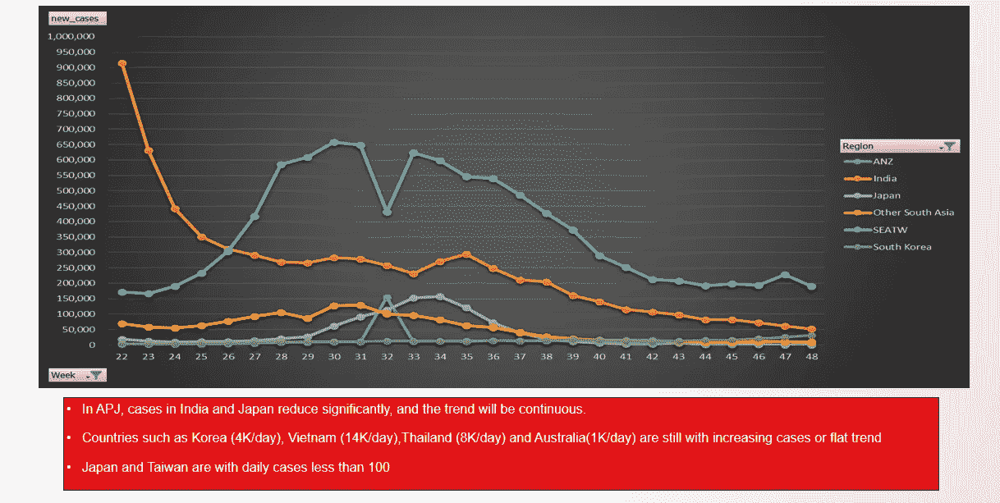

# 分析技能之外的批判性思维

> 原文：<https://medium.com/analytics-vidhya/critical-thinking-beyond-skills-for-analytics-1e92d3c4713e?source=collection_archive---------1----------------------->

商业分析、商业智能或数据分析是当今的热门话题。许多课程，人才把重点放在分析技能和工具。毫无疑问，技能是分析的基础。但在现实的商业世界中，分析背后的批判性思维(所谓的故事情节)更为迫切，批判性思维相对于技能来说更难培养。我想使用一个简单但强大的结构来利用分析演示文稿中的基本思想。

# 首先，描述数据。

第一步，我们需要在幻灯片中描述一个事实，正确解释数据。这里有一个例子。我们有 APJ·科维德每周确诊病例趋势，我们确实从幻灯片中看到了一些趋势，然后我们给出了一些要点来总结我们从图表中发现的情况。

在某些培训中，您可能会了解如何在三个方面准备幻灯片，同样，我们也需要用图表来解释我们想向观众介绍的信息。

> (1)标题——你正在谈论的主题
> 
> (2)副标题-简短的结论涵盖了关键点
> 
> (3)主体-证据、数据或示例

# 其次，提供原因(或假设)

我们有足够的信息来理解从这一步的第一步开始发生了什么。那我们就要多挖掘，才能知道是什么导致了这个结果。大多数时候，我们不能 100%确定原因，所以我们必须做出假设并建立实验来验证我们的猜测。做出假设是第二阶段的关键步骤。这是我们在 MECE 的基础上做出假设的有效方式。我们列出尽可能多的可能原因，逐一排除，并对可能的原因进行测试。

例如，对于上述趋势，我们列出了日本确诊病例显著下降的可能原因，并解释了我们如何消除这些原因并缩小到具体原因。

背后的原因是战略制定者的根本。战略制定者(或所谓的分析师的利益相关者)对当前的业务有怀疑、猜测，他们需要数据来支持他们的想法。不幸的是，大多数分析师对业务的理解有限，或者分析师和利益相关者之间存在差距。结果是分析师，BI 人员，或者数据专家都不知道自己最后打的是什么。

# 第三，行动号召。

在第二阶段，我们有我们想要证明的理由或假设。所以我们必须提出我们的建议来推进项目。为了验证假设，我们利用敏捷概念**设置实验**或**收集更多证据**来证明或拒绝想法。

如果在第二阶段确定了原因，我们计划改进或修改根本原因。改进后的计划也是基于敏捷理念，快速监控和迭代。这个阶段在某种意义上就是所谓的战略。

# 对于分析师来说，下一步是超越技能。

描述、假设和假说，以及行动号召对分析师来说是必不可少的，可以帮助我们理解为什么我们需要做分析，以及我们应该向利益相关者提供什么。我们有扎实的技能和方法知识。我们应该更多地走出去，挖掘导致这种结果的原因，并根据我们收集的数据，从多元化的角度分析，提出我们的建议。

我还建议分析师多了解业务，尤其是你所在地区的市场、产品和财务表现。试着从商业的角度思考，设身处地为客户着想。我们可以为企业和世界创造价值，而不仅仅是技能。