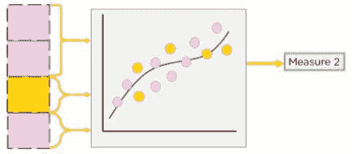
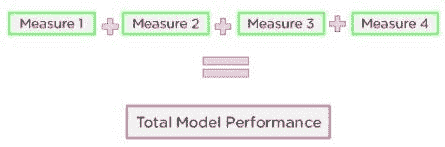
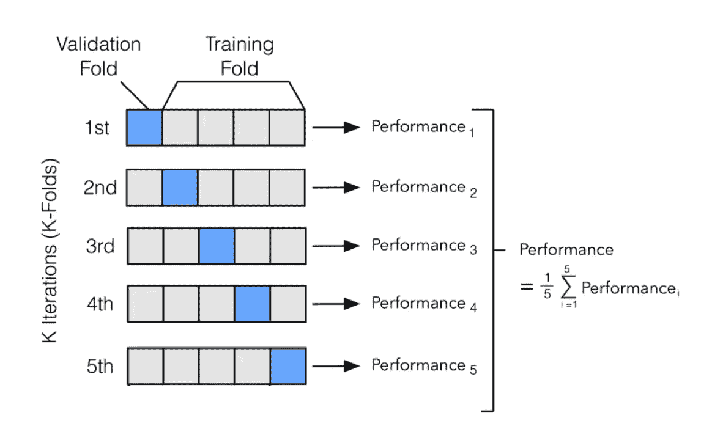

# 交叉验证技术

> 原文：<https://medium.com/analytics-vidhya/cross-validation-techniques-bacb582097bc?source=collection_archive---------3----------------------->

这篇文章解释了不同的交叉验证技术及其在 python 中的实现。

来源:https://tenor.com/bfqDW.gif

交叉验证是一种估计预期预测误差的方法。

在选择机器学习模型时，我们需要比较模型，看看不同的模型在我们的数据集上表现如何，这不仅仅是比较不同的模型，还可以向那些与你一起工作的人解释。

您需要知道您正在使用的数据集或模型的有效性。因此，当数据通常是有限的，并且对数据的相同部分的训练和测试不能给我们一个关于我们的模型如何执行的准确视图时，交叉验证的需求就出现了。

如果我已经编写了一些模型来猜测一些东西，我不想使用我用于训练的相同数据进行测试，我想看看它在相同数据集的不同集合上的表现如何(这在训练中没有使用)，否则，如果我给测试提供我用于训练该模型的相同数据，我只是在欺骗自己。

您需要了解您的模型与您的数据的吻合程度，以及它与新数据的吻合程度。因此，在相同的数据中训练模型意味着模型最终只会对该数据学习得很好，而在新数据上失败，这被称为过度拟合。或者它可能经历欠拟合(当模型不适合训练数据时发生。它在数据中找不到模式，因此当给它新的数据来预测时，它也找不到模式。它在已知和未知数据上都表现不佳。)

# ***什么是交叉验证？***

“机器学习中的交叉验证是一种技术，用于在重新划分数据集并对新部分进行评估之前，在我们数据库的一部分上训练和评估我们的模型。”— — —更简单地说，不是将我们的数据集分成两个不同的部分(一个用于训练，另一个用于测试)，而是将你的数据集分成多个部分，使用其中的一部分进行训练，其余部分进行测试。这确保了我们的模型在每一个新的步骤中对新数据进行训练和测试。

# ***交叉验证的步骤:***

**第 1 步**:将数据分为训练集和测试集，并评估模型的性能为“测量 1”。(粉色块代表训练数据，黄色块代表测试数据。)

**第一步**(来源:[https://www . simpli learn . com/ice 9/free _ resources _ article _ thumb/7-step 1。JPG](https://www.simplilearn.com/ice9/free_resources_article_thumb/7-step1.JPG)

**第二步:**拆分数据，拆分成新的训练集和测试集。重新评估模型的性能。当我们以类似的方式“测量 1”时，我们测量“测量 2”，“测量 3”等等。

**第二步**(来源:[https://www . simpli learn . com/ice 9/free _ resources _ article _ thumb/8-step-2ml。JPG](https://www.simplilearn.com/ice9/free_resources_article_thumb/8-step-2ml.JPG)

**重复交叉验证的步骤 2** 。(来源:[https://www . simpli learn . com/ice 9/free _ resources _ article _ thumb/9-repeating-ml。JPG](https://www.simplilearn.com/ice9/free_resources_article_thumb/9-repeating-ml.JPG)

**步骤 3** :为了获得实际的性能指标，取所有度量的平均值。

**第三步**(来源:[https://www . simpli learn . com/ice 9/free _ resources _ article _ thumb/10-Step 3。JPG](https://www.simplilearn.com/ice9/free_resources_article_thumb/10-step3.JPG)

# 交叉验证的类型:

1.  ***撑出验证方法:*** 最简单的拆分，在此我们通常做一个训练和测试拆分。这意味着，假设您有一个数据集，我们尝试进行训练-测试分离，我们用训练数据集训练我们的模型，并用测试数据集验证我们的模型。(我们通常使用的技术)。

***Hold 出验证方法(来源:***[https://editor . analyticsvidhya . com/uploads/62390 Hold % 20 Out _ data Vedas . jpg](https://editor.analyticsvidhya.com/uploads/62390hold%20out_datavedas.jpg)***)***

2. ***K-Fold 交叉验证:*** 基于随机状态的 ***保持验证方法*** ，生成随机的训练测试分裂，我们可能得到不同的-不同的精度，这可能导致模型过拟合或欠拟合。为了克服这一点，我们进行 ***K 重交叉验证，在 K 重交叉验证中*** 我们可以进行 K 次拆分。它将数据集分割成 k 个连续折叠(默认情况下没有洗牌)。然后，每个折叠被用作一次验证，而剩余的 k-1 个折叠形成训练集。

***示例 k =5 时的 K-Fold 交叉验证(来源:***[http://ethen 8181 . github . io/machine-learning/model _ selection/img/kfolds . png](http://ethen8181.github.io/machine-learning/model_selection/img/kfolds.png)***)***

3. ***分层 K 折交叉验证:*** 当我们的数据中存在少数类时，这种方法很有用。在某些情况下，在划分数据时，一些测试集将包含少数类的实例，而其他测试集则不包含。当这种情况发生时，我们的准确性将不能正确地反映少数民族类的预测情况。为了克服这一点，数据被分割，以便每个部分在数据集中存在的所有不同类中具有相同的百分比。

***分层 K 折交叉验证*** (来源:[https://raw . githubusercontent . com/satishgunjal/images/master/layered _ KFold _ Cross _ Validation . png](https://raw.githubusercontent.com/satishgunjal/images/master/Stratified_KFold_Cross_Validation.png))

4. ***留一交叉验证(LOOCV) :*** [留一交叉验证是交叉验证的一个特例，其中折叠数等于数据集中的实例数。因此，学习算法对每个实例应用一次，将所有其他实例用作训练集，并将所选实例用作单项测试集。这个过程与刀切估计的统计方法密切相关](https://link.springer.com/referenceworkentry/10.1007%2F978-0-387-30164-8_469#howtocite)。(我们选择一个数据点作为测试数据。数据集的其余部分将用于训练，单个数据点将用于训练后的预测。).LOOCV 的一般化版本是 LPOCV ( ***省去 P 交叉验证*** )。

***LOOCV(来源:***[https://slide player . com/slide/13519285/82/images/26/Leave-one-out+Cross+validation . jpg](https://slideplayer.com/slide/13519285/82/images/26/Leave-one-out+Cross+Validation.jpg)***)***

5. ***重复随机测试-训练:*** 该技术是传统训练-测试分裂和 k 倍交叉验证方法的混合。在这种技术中，我们以训练测试集的方式创建数据的随机拆分，然后重复多次拆分和评估算法的过程，就像交叉验证方法一样。(像上面描述的训练/测试分割那样创建数据的随机分割，但是多次重复分割和算法评估的过程，像交叉验证。)

# ***Python 代码进行交叉验证的技巧上面讨论过:***

来源:https://media.giphy.com/media/OWtpNt0fbvwLeKbHcB/source.gi

# 参考:

 [## 统计学习的要素:数据挖掘、推理和预测。第二版。

### 编辑描述

web.stanford.edu](https://web.stanford.edu/~hastie/ElemStatLearn/)  [## 2021 年机器学习交叉验证终极指南

### 我们如何知道我们的模型是否有效？如果我们训练得好？所有这些都可以通过观察我们的…

www.simplilearn.com](https://www.simplilearn.com/tutorials/machine-learning-tutorial/cross-validation?utm_campaign=CrossValidationInMachineLearningDec21&utm_medium=Description&utm_source=youtube)  [## 3.1.交叉验证:评估评估器性能-sci kit-学习 0.24.2 文档

### 学习预测函数的参数并对相同的数据进行测试是一个方法错误:模型…

scikit-learn.org](https://scikit-learn.org/stable/modules/cross_validation.html)  [## 人工智能神经网络常见问题，第 3 部分，共 7 部分:归纳部分-什么是交叉验证和…

### 顶部文档:comp.ai.neural-nets 常见问题解答，第 3 部分，共 7 部分:泛化之前的文档:泛化错误是如何…

www.faqs.org](http://www.faqs.org/faqs/ai-faq/neural-nets/part3/section-12.html)