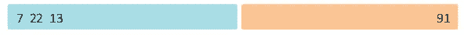
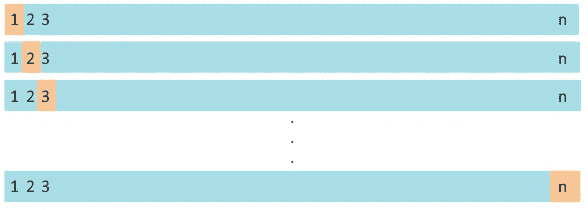

# 交叉验证-什么、为什么和如何|机器学习

> 原文：<https://medium.com/analytics-vidhya/cross-validation-what-why-and-how-machine-learning-f8a1159ce5ff?source=collection_archive---------2----------------------->

## 什么是交叉验证，为什么使用它，有哪些不同的类型？

交叉验证周期

# 什么是交叉验证，为什么我们需要它？

在有监督的机器学习问题中，我们通常在数据集上训练模型，并使用训练的模型来预测目标，给定新的预测值。但是，我们如何知道我们在数据集上训练的模型是否会对新的输入数据产生有效和准确的结果。
根据我们从训练模型的数据集获得的错误率或某些统计测量*(如 R 平方统计)*，我们不能得出模型表现良好的结论。
主要的问题是没有办法知道模型是否有高偏差(*欠拟合*)或高方差(*过拟合*)，以及仅仅从模型的错误率来看，模型在新数据上的表现如何。
说到预测建模，数据科学家的职责是确保模型在新数据上表现良好。
交叉验证正是帮助我们做到这一点的过程。

> 在这个过程中，机器学习模型在一个称为验证集或保留集的独立集上进行评估，通过该集可以找到最佳超参数，从而获得最佳模型，该模型可用于未来数据，并能够产生最佳预测

一种方法是将我们的数据集分成 3 部分:**训练集**、**验证集**或**保持集**和**测试集**。

*在继续之前，需要熟悉偏差和方差等概念。*

# 培训、验证和测试分离

**训练集**:数据集的一部分，在其上训练模型

**验证集**:然后在该集上使用训练好的模型来预测目标，并记录损失。将该结果与训练集结果进行比较，以检查过度拟合或欠拟合，并且重复进行该操作，直到产生某个最佳结果。基本上，我们是在训练集上训练模型。但是，超参数会不断更新和再次训练，直到模型在交叉验证集上表现最佳。*(通过表现最佳，我们试图最小化验证集，同时也防止过度拟合)*

**测试集:**经过验证或保留集评估的完全训练的模型用于测试集，以获得真实的测试误差，并且该误差可以被视为对模型在任何新数据上的性能的非常好的估计

# 为什么测试集不能被多次使用？

为什么测试集不应该使用超过一次？为什么我们要用单独的一套来进行交叉验证和测试。为什么两者不能用同一套数据？

所有这些问题本质上都是一样的，并且有一个共同的答案:
多次使用测试集最终会导致偏差*(不是我们通常所说的机器学习中的偏差)*因为 hyper 参数正在被调整以获得测试集上的最佳性能。在这种情况下，我们不能使用测试集来估计模型在新的现实生活数据中的表现。
" *同时，在验证集上多次使用该模型，以找到最佳超参数。从中选出最好的一个用于测试设备*。只是强调这一点。

# 交叉验证的类型

有 3 种主要类型的交叉验证技术

*   标准验证集方法
*   遗漏一项交叉验证(LOOCV)
*   k 倍交叉验证

在上述所有方法中，数据集被分成训练集、验证集和测试集。我们将主要讨论培训和验证集，因为测试集的使用对于所有 3 种方法都是常见的，并且已经在上面提到过。

*注意:在下面所有的方法中，测试集已经被分割并且是独立的。由于我们更关注训练集和验证集*，所以不会过多提及测试集

## **标准验证集方法**

训练-验证分割

这是一个非常简单和标准的方法，通常被使用。我们从原始数据集以不同的比例随机分割训练集和验证集。

该模型在训练集上被训练，在验证集上被评估，并且在具有不同超参数的训练集上被重新训练。这样做，直到找到最佳超参数，减少了验证集损失，也不会导致过度拟合。

选择在交叉验证集上产生最佳结果的模型超参数，然后在单独的测试集上测量其性能。

**这种方法的缺点**

*   最初，我们将数据随机分为训练集和验证集。由于这个原因，测试集的验证误差估计可能是高度可变的，并且哪个观察进入哪个集可能是影响模型参数的因素。
*   我们知道，为模型提供的用于训练的数据越多越好。但是，由于这种分割，用于训练的数据量减少了

## 遗漏一个交叉验证

遗漏一个交叉验证

这种方法试图克服前一种方法的缺点，并且采用迭代方法。

**第一次迭代**
在第一次迭代中，我们仅使用观测值 **(x1，y1)** 作为整个验证集，并在其余的 **n-1** 观测值上训练模型。
这里，验证集误差 **E1** 计算为 **(h(x1) — (y1))，**其中 h(x1)是模型对 x1 的预测。

**第二次迭代** 我们留下 **(x2，y2)** 作为验证集，并在剩余的 **n-1** 观察值上训练模型。 **E2** 的计算方式与第一次迭代类似，但使用第二次迭代的验证数据。

该过程重复进行 **n** 次迭代，直到来自训练集的每一个观察值恰好一次成为验证集。这给了我们一组误差估计值**n****{ E1，E2，E3…En}**

然后，通过取上面得到的 n 个误差估计值的平均值来计算总验证误差。
即
**(E1 + E2 + E3 + E4 + …..+ En)/n**

这就是在该方法中计算验证集误差的方式，由于我们使用了除一个之外的所有观测值，为了训练，给模型提供了更多的数据，并且误差估计值也不是高度可变的，因为我们取了 **n** 误差估计值的平均值。

**这种方法的缺点** 这种方法被认为计算量很大，因为我们要对模型进行 n 次拟合，以仅获得一次验证误差估计值。

## k 倍交叉验证

k 折叠交叉验证

K-fold 交叉验证旨在通过减少模型为了计算一次验证误差而需要训练的次数来解决计算问题。

它非常类似于 LOOCV 验证方法，除了对于每次迭代，它将 **K** 个观察值而不是 **1** 作为验证集的一部分，并且每次迭代在这些 **k** 个观察值上计算验证误差，最后，所有这些误差率的平均值被认为是真正的验证集误差。通过这样做，必须在训练集上训练模型的次数减少到 **n/k.**

通常，这个数字 K 被选择为大约 5 或 10。但是，这取决于数据集的大小。如果我们有很多数据，可以使用更大的 K 值。

# 结论

很多时候，在机器学习中，我们不希望模型或算法在训练数据上表现最好。相反，我们需要一个在测试集上表现最好的模型，以及一个保证在新的输入数据上表现良好的模型。交叉验证是一个非常重要的过程，它确保我们能够找到这样的算法或模型。

# 谢谢你