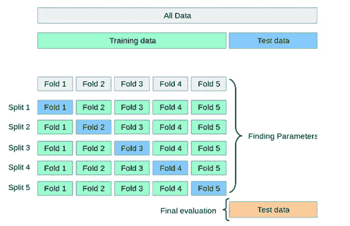
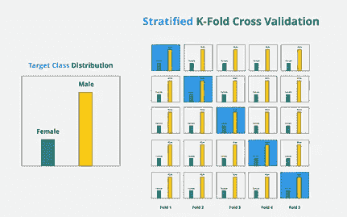
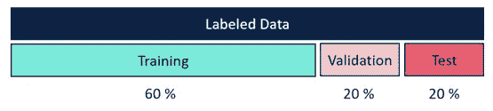
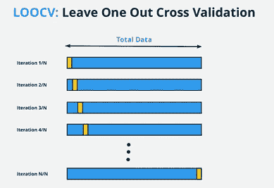
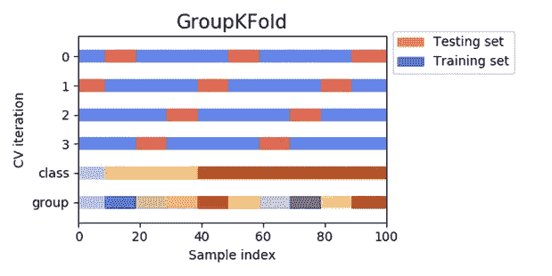

# 使用 Python 中的代码进行交叉验证

> 原文：<https://medium.com/analytics-vidhya/cross-validation-with-code-in-python-55b342840089?source=collection_archive---------0----------------------->

## 是的，我们将在这里编写 5 种不同的技术！

交叉验证是解释模型性能的最有效的方法之一。它确保模型准确地符合数据，并检查任何过度拟合。它是评估统计分析结果如何推广到独立数据集的过程。

当模型完全适合训练集，而在测试集中表现不佳时，就会发生过度拟合。这意味着模型将很好地学习训练数据，但不会对看不见的样本进行归纳。

有不同的交叉验证技术，例如，

1.  **K 倍交叉验证**
2.  **分层 K 倍交叉验证**
3.  **基于坚持的验证**
4.  **留一交叉验证**
5.  **K 倍组交叉验证**

交叉验证背后的一般思想是，我们将训练数据分成几个部分。我们选择其中的一些部分进行训练，其余的部分用于测试模型。不同的交叉验证技术基于我们如何划分数据。

1.  **K 倍交叉验证**



k 倍简历(来源-互联网)

我们将数据分割成 k 个相等的部分，在每次分割时，使用一部分作为测试集，其他部分作为训练集，我们对多次分割一直这样做。这种方法最大限度地减少了数据的浪费，因此在样本数量较少的情况下证明是有益的。

启动 K 重交叉验证的代码片段，

```
*# import model_selection module of scikit-learn***from sklearn import model_selection***# initiate the k-fold class from model_selection module***kf = model_selection.KFold(n_splits=5)***# fill the new kfold column***for fold, (trn_, val_) in enumerate(kf.split(X=df)):****df.loc[val_, 'kfold'] = fold**
```

2.**分层 K 倍交叉验证**



分层 K 倍(来源-互联网)

分层 K-Fold 用于从数据中创建 K 个 Fold，以保持每个类别的样本百分比。

例如，在二进制分类问题中，类的偏斜比例为 90:10，分层 K-Fold 将创建保持该比例的折叠，这与 K-Fold 验证不同。

这种交叉验证技术是用于分类问题的，然而，对于回归，我们必须在一定范围内将数据绑定在一起，然后对其应用分层 K-Fold。

为了找到适当数量的箱子，我们遵循**斯特奇法则**，

箱数= **1 + log2(N)**

其中 N 是数据集中的样本数。

分层 K-Fold 的代码是类似的，只是我们提供了目标变量，我们希望保留样本的百分比，

```
**# import model_selection module of scikit-learn****from sklearn import model_selection****# fetch targets****y = df.target.values****# initiate the kfold class from model_selection module****kf = model_selection.StratifiedKFold(n_splits=5)****# fill the new kfold column****for f, (t_, v_) in enumerate(kf.split(X=df, y=y)):****df.loc[v_, 'kfold'] = f**
```

3.**基于持有的验证**



基于简历(来源-互联网)

这是最常见的交叉验证。这里，我们将数据集分为训练集和测试集，通常比例为 70:30 或 80:20。根据训练数据训练模型，并根据测试数据进行性能评估。因为我们知道模型看到的数据越多，它就越好，这种方法在这方面有所欠缺，因为它在训练时从模型中分离出大量数据。

保留交叉验证也用于时间序列模型，其中最近的数据用作验证集。例如，我们有 2005-2010 年的数据，所以我们将 2010 年的数据用于验证，而将 2005-2009 年的数据用于训练。

我们可以使用 scikit-learn 函数来拆分数据，或者针对上面讨论的问题进行手动拆分。

```
**# import model_selection module of scikit-learn****from sklearn import model_selection****#holding out 40% of the data for testing (evaluating)****X_train, X_test, y_train, y_test = model_selection.train_test_split (X, y, test_size=0.4, random_state=0)**
```

4.**留一交叉验证**



LOOCV(来源-互联网)

留一交叉验证是 K 重交叉验证的极端情况，其中 K 是数据中的样本数。这种技术在计算上非常昂贵，应该只用于小型数据集。由于这种技术适合许多模型，它在评估估计方面是稳健的。

我们可以使用 K-Fold 验证代码来创建 n-Fold，其中 n 是数据中的样本数。或者，我们也可以利用 scikit-learn 的 LeaveOneOut()方法，

```
**# import model_selection module of scikit-learn****from sklearn.model_selection import LeaveOneOut****# Instantiate the LeaveOneOut() object****loo = LeaveOneOut()****# Run the function through the dataset (here, X)****loo.get_n_splits(X)****# Get the list of Train-Test sets****for train_index, test_index in loo.split(X):****X_train, X_test = X[train_index], X[test_index]****y_train, y_test = y[train_index], y[test_index]**
```

5.**K 倍组交叉验证**



K-Fold 组(来源-互联网)

GroupKFold 是 k-fold 的变体，它确保同一组不会同时出现在测试/验证和训练集中。

例如，如果您的数据包括每个客户的多行(但对单个事务/行进行训练仍然有意义)，并且您的生产用例涉及对新客户进行预测，那么对来自客户的行进行测试(这些行在您的训练集中也有行)可能会有乐观偏差。

GroupKFold 使检测这种过拟合情况成为可能。

用于相同应用的片段，

```
**# import model_selection module of scikit-learn****from sklearn.model_selection import LeaveOneOut****# Creating GroupKFold Object****n_splits = 5****gkf = GroupKFold(n_splits = 5)****# Creating Group Folds****result = []****for train_idx, val_idx in gkf.split(train_df, y_labels, groups =groups_by_patient_id_list):****train_fold = train_df.iloc[train_idx]****val_fold = train_df.iloc[val_idx]****result.append((train_fold, val_fold))**
```

交叉验证是对我们的模型进行统计评估时的一项重要技术。确保正确的技术可以提高模型的准确性和稳健性。使用这些技术推断性能指标有助于创建在看不见的数据上表现更好的模型。

还有更多这样的交叉验证技术，但是我们留给你去探索和发现！

如果你已经走了这么远，请鼓掌并跟随我了解更多！

此外，为 Abhishek Thakur 令人惊叹的著作《接近(几乎)任何机器学习问题详细介绍了交叉验证，以及 scikit-learn 网站提出了令人惊叹的交叉验证可视化，干杯。