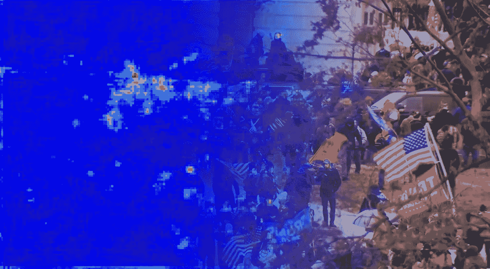

# 使用 PyTorch 和 Streamlit 对国会大厦暴乱进行人群估计

> 原文：<https://medium.com/analytics-vidhya/crowd-estimates-at-the-capitol-riot-using-pytorch-and-streamlit-54b960219b25?source=collection_archive---------7----------------------->

来自 C-SPAN 的图片，分层显示人群估计热图。

虽然专家们说没有任何暴乱的航拍照片，很难估计人群的规模，但是每个人都同意的一个估计是，与暴乱者的人数相比，有几个警察。

使用由李蔚红、范晓 Z 和陈德明开发的 [Streamlit](http://streamlit.io/) 和 [CSRNet](https://github.com/leeyeehoo/CSRNet-pytorch) ，让我们组装一个工具来评估…