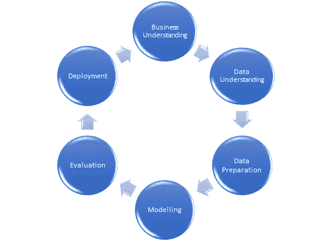

# CRSIP-DM 方法

> 原文：<https://medium.com/analytics-vidhya/crsip-dm-methodology-243b57a3d9b0?source=collection_archive---------18----------------------->

CRISP-DM 或跨行业数据挖掘标准流程是执行任何数据科学/数据挖掘项目的一组清晰的步骤/框架。这确保了我们在项目中有一个流线型的过程。直接跳到清理和建模数据可能不是启动数据科学项目的最佳方式。

那么步骤是什么呢？

1.  商业理解
2.  数据理解
3.  数据准备
4.  系统模型化
5.  估价
6.  部署

CRISP-DM 方法

**业务理解**

业务理解是 CRISP-DM 的第一步。这里，分析师/数据科学家需要深入挖掘客户对数据挖掘项目的需求。了解业务环境、棘手问题、限制等。然后，接下来必须定义指标。这些必须是可衡量的。只有这样，才能显示目标方面的改进。可能使用的工具和技术可能会根据客户的输入列出。最后，可以创建一个流程图，以供参考和理解。

**数据理解**

这是 CRISP-DM 中非常重要的一步。理解数据源、数据类型、源数据中的缺陷对于我们应用的任何模型的性能都是至关重要的。因此，为了获得一个干净的数据，我们需要对所有可用的数据有一个非常好的理解。一份清晰简明的报告，详细说明数据来源、格式、特征、记录、异常等。

理解数据还可以包括进行单变量、多变量、分布分析等。这有助于我们理解数据的性质。它有助于理解自变量如何影响相关数据集中的从属变量。

**数据准备**

这是我们将业务理解和数据理解应用到工作中的阶段。基于业务逻辑约束等。，我们从数据湖、数据库、集群或任何有数据的地方获取数据。然后使用可用的工具和技术来准备数据，这些数据将适用于使用连接集成等进行建模。此外，我们还进行缺失值插补、异常值处理、转换、数据标准化、编码、特征工程、新变量创建等工作。

**数据建模**

现在我们有了一个干净的数据，其中包含了正确的特征，我们准备应用建模技术来解决我们特定的业务问题。通常情况下，应该基于这里建立模型所需的输出来应用多个 ML 算法，以便在稍后阶段我们可以验证每个算法的结果。

**模型评估**

现在我们有模型了。因此，我们可以使用各种参数来评估模型的结果。对每个模型的各种结果做一个总结报告，并根据我们对产出和业务的理解进行排序。与客户和其他利益相关者讨论结果，以获得更清晰的结果。

**部署**

最后但也是重要的一步，我们有了结果，我们最终将结果呈现给客户&一旦获得批准，就将结果推送到生产环境中。此外，该过程并未在此结束。必须评估模型的实时性能&如果有任何问题，需要根据 CRISP-DM 策略再次进行适当的维护。

请注意，虽然 CRISP-DM 中的步骤是按顺序提到的，但每个步骤都有一个反馈循环，这意味着，当当前步骤中有问题时，我们应该再次返回到前面的步骤，直到我们了解每个步骤所需的内容。

参考资料:

*   https://www.sv-europe.com/crisp-dm-methodology/
*   [https://www . LinkedIn . com/pulse/chapter-1-简介-crisp-DM-框架-数据-科学-anshul-roy/](https://www.linkedin.com/pulse/chapter-1-introduction-crisp-dm-framework-data-science-anshul-roy/)
*   [https://en . Wikipedia . org/wiki/Cross-industry _ standard _ process _ for _ data _ mining](https://en.wikipedia.org/wiki/Cross-industry_standard_process_for_data_mining)