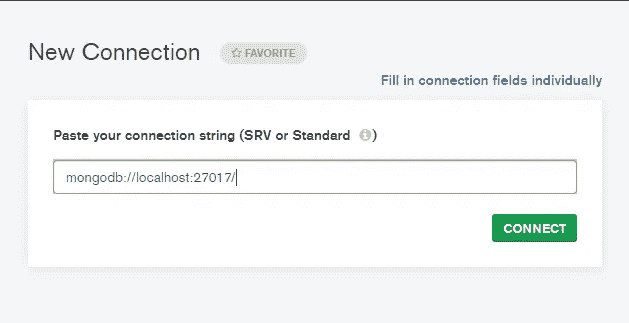
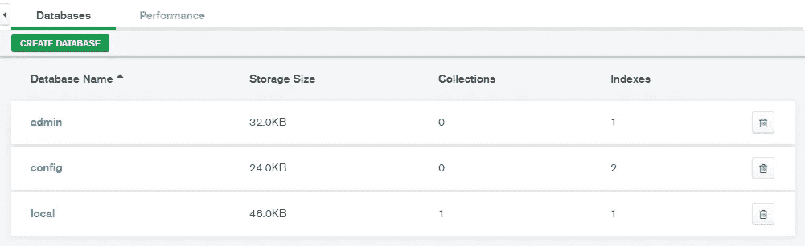
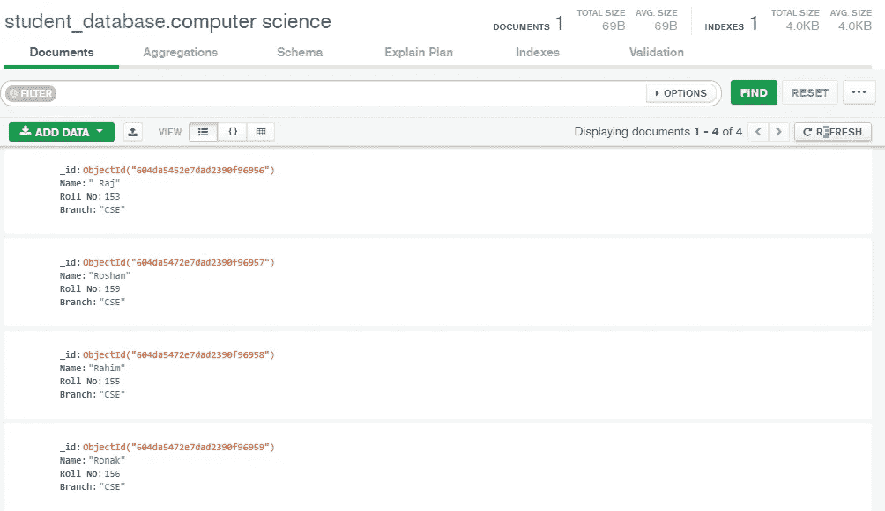
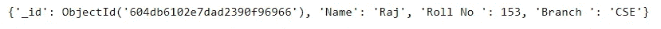
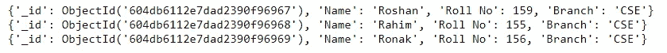
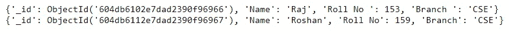
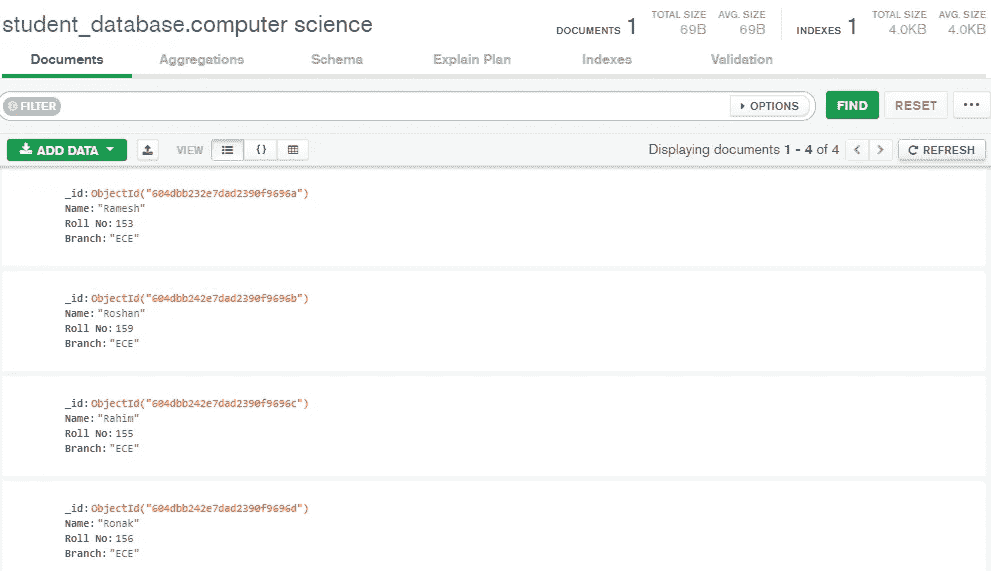

# 使用 python 在 MongoDB 中进行 CRUD 操作

> 原文：<https://medium.com/analytics-vidhya/crud-operations-in-mongodb-using-python-49b7850d627e?source=collection_archive---------1----------------------->


MongoDB CRUD 操作(图片由作者提供)

> **MongoDB** …。有没有听说过 MongoDB，想知道什么是 MongoDB，如何在 MongoDB 中进行 CRUD 操作？

到本文结束时，您将会熟悉。

1.  什么是 MongoDB？
2.  如何使用 python 在 MongoDB 中执行 C-Create R-Retrieve U-Update D-Delete 操作？

**什么是 MongoDB？**

MongoDB 是一个面向文档的 NoSQL 数据库。由于其灵活性和易用性，它是业内广泛使用的数据库之一。MongoDB 的架构由集合和文档组成。MongoDB 以 JSON 文档格式存储数据，也就是说，它以键值对的形式存储数据。一组 JSON 文档可以称为一个集合。与 SQL 表不同，MongoDB 文档没有任何固定的模式。通过使用动态模式，我们可以轻松地对应用程序进行更改，而不会出现任何中断。

**如何使用 Python 在 MongoDB 中执行 CRUD 操作。**

要使用 python 连接 MongoDB 服务器，我们需要安装一个名为 pymongo 的 python 驱动程序。它包含使用 python 与 MongoDB 交互的工具。

要安装 pymongo，我们需要在命令提示符下输入下面的命令。

```
pip install pymongo
```

我们将使用 MongoDB compass，这是一个用于与存储在 MongoDB 中的数据进行交互的 GUI。你可以在这里找到 MongoDB 指南针安装说明[。](https://docs.mongodb.com/compass/master/install/)

一旦您成功安装了 MongoDB compass，通过传递下面的字符串作为输入来连接到 MongoDB compass，然后单击 connect 按钮。

mongodb://localhost:27017/



现在我们将看到如何连接 MongoDB 并使用 python 执行 CRUD 操作。

首先，我们需要导入 pymongo 包

```
import pymongo
```

我们将定义一个名为 connection_url 的变量来存储 MongoDB 连接 url

```
connection_url="mongodb://localhost:27017/"
```

为了连接到 MongoDB 服务器，我们将使用 MongoClient 方法。

```
client=pymongo.MongoClient(connection_url)
```

使用上面创建的客户机对象，我们可以访问 MongoDB 中的数据库。为了显示数据库，我们使用 list_database_names()方法。

```
client.list_database_names()
```

默认情况下，我们可以看到 3 个数据库，分别是 admin、config 和 local。使用 MongoDB compass 可以看到同样的情况。



默认数据库

我们可以使用下面的命令创建一个数据库。

```
database_name=”student_database”
student_db=client[database_name]
```

在 MongoDB 中，除非我们向数据库添加任何文档，否则我们无法在可用数据库列表中看到创建的数据库。为了创建文档，我们需要在数据库中创建一个存储文档的集合。这里我们将集合名称定为计算机科学。

```
collection_name=”computer science”
collection=student_db[collection_name]
```

要列出数据库中可用的集合，我们可以使用下面的命令。

```
student_db.list_collection_names()
```

**在集合中插入文档**

可以通过以下两种方式将文档插入到集合中

1.  将单个文档插入集合。
2.  将多个文档插入集合。

要插入单个文档，我们使用 insert_one()方法。

```
document={"Name":"Raj",
"Roll No ":  153,
"Branch ": "CSE"}
collection.insert_one(document)
```

要插入多个文档，我们将使用 insert_many()方法。为了插入这些文档，我们将创建一个包含要插入到集合中的数据的字典列表，并将该列表传递给 insert_many()方法。

```
documents=[{"Name":"Roshan","Roll No":159,"Branch":"CSE"},{"Name":"Rahim","Roll No":155,"Branch":"CSE"},{"Name":"Ronak","Roll No":156,"Branch":"CSE"}]
collection.insert_many(documents)
```



将数据插入 MongoDB

在这两种情况下，我们可以看到为每个文档创建了一个名为 _id 的附加条目。_id 是为每个文档创建的唯一标识。用户也可以在插入文档时给出一个 custom _id。

**从集合中检索数据**

可以通过以下两种方式检索数据。
1。检索单个文档
2。检索多个文档

从集合中检索单个文档。

为了检索单个文档，我们使用 find_one()方法。我们需要将一个查询作为参数传递给 find_one()方法，find_one()方法搜索集合，它将返回第一个命中的文档。

```
query={"Name":"Raj"}
print(collection.find_one(query))
```



检索单个记录

从集合中检索多个文档。

为了检索多个文档，我们使用 find_many()方法。find_many()的返回类型是一个游标对象。我们可以使用 for loop 来循环游标对象。

```
query={"Branch":"CSE"}
result=collection.find(query)
for i in result:
    print(i)
```



检索多条记录

要检索所有文档，您需要向 find 方法传递一个空查询。如果我们想要限制要检索的文档数量，那么我们使用 limit()方法。

```
result=collection.find({}).limit(2)
for i in result:
    print(i)
```



限制结果

您可以使用查询运算符(如 gt、lt、eq 等)过滤查询。，您可以在这里找到查询操作[的完整列表](https://docs.mongodb.com/manual/reference/operator/query/)。
查询过滤示例:

```
query={"Roll No ":{"$eq":153}}
print(collection.find_one(query))
```


在查询中使用过滤器

**更新集合中的文档**

可以通过以下两种方式更新文档。
1。更新单个文档
2。更新多个文档

为了更新单个文档，我们使用 update_one()方法。

为了更新文档，我们需要在方法中提供两个参数。第一个参数是过滤参数，第二个参数是更新参数。filter 参数是一个与要更新的文档相匹配的查询。更新参数是应用于该文档的修改。

```
query={"Roll No":{"$eq":153}}
present_data=collection.find_one(query)
new_data={'$set':{"Name":'Ramesh'}}
collection.update_one(present_data,new_data)
```

为了更新多个文档，我们使用 update_many()方法。

```
present_data={“Branch”:”CSE”}
new_data={“$set”:{“Branch”:”ECE”}}
collection.update_many(present_data,new_data)
```



更新的文档

**从集合中删除文档**

可以通过以下两种方式删除文档。
1。删除单个文档
2。删除多个文档

要删除单个文档，我们使用 delete_one()方法，将一个查询作为参数传递。

```
query={“Roll No”:153}
collection.delete_one(query)
```

要删除多个文档，我们使用 delete_many()方法。

```
query={"Branch":"ECE"}
collection.delete_many(query)
```

**从数据库中删除集合**

要删除一个集合，我们使用 drop()方法。一旦执行 drop 方法，该集合中的所有数据都将被删除。

```
collection.drop()
```

你可以在 Github 找到完整的代码。

感谢您阅读这篇文章。如果您在执行代码时遇到任何问题，请随时在下面发表评论。