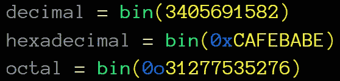
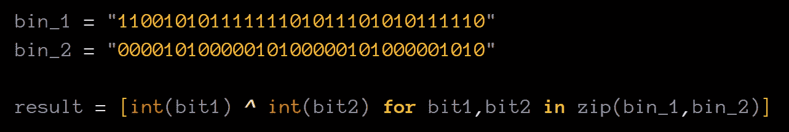
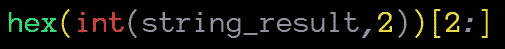

# 加密基础:固定 XOR 实现[Python][Cryptopals]

> 原文：<https://medium.com/analytics-vidhya/crypto-basics-fixed-xor-implementation-python-9cfba54f4661?source=collection_archive---------3----------------------->

如果你是一个像我一样在做决定时不断遇到困难的人，那意味着你在生活中使用了很多“或”这个词。

在计算机科学中，OR 运算符相当常见，但这可能不是因为计算机科学家在做决策时有困难。

而且在一个词的开头加上' **exclusive** '总是让那个词更酷。对吗？


里克·阿斯特利>异或>或>与(酷度排名)

你可以用这个运算符，只是因为它超级酷(我觉得这是个相当好的理由)。然而，那些处理密码术的人有充分的理由使用“异或”运算符。XOR 允许您轻松地加密和解密字符串。使用其他逻辑运算符无法做到这一点:


异或运算的向后兼容性

在本文中，我们不会像上面那样从将单词插入 XOR 运算符开始。通过一个更基本和有趣的挑战，我们将看到如何在 Python 中进行固定的 XOR 运算。

这里的目的不是要以最短的方式快速解决挑战，而是要完全理解所使用的流程和功能。因此，要在不同的问题/挑战中有效地使用它。

剧透:我们会像 [**base64 post**](/analytics-vidhya/crypto-basics-understand-create-your-own-base64-encoding-with-python-a1481686a35a) 那样做，不导入任何模块！

> W **ARNING:** 不要因为我没有从一开始就解释什么是 XOR 而生气，只要相信如果我详细解释**它只是 mod 2** 中两位的和，那会很无聊。

# 我们要挑战的是:

我们将在 [cryptopals](https://cryptopals.com/sets/1/challenges/2) 上解决集合 1 的挑战 2:固定异或。

> Cryptopals 是一个制作精良的网站，有很多加密挑战。新手和想提升自己的人必访！

首先，让我们来看看挑战:


当我试图解决这个问题时

## C 挑战:

编写一个函数，它采用两个等长的缓冲区，并产生它们的 XOR 组合。

如果你的函数工作正常，那么当你给它输入字符串:

```
1c0111001f010100061a024b53535009181c
```

…在十六进制解码后，当与以下内容进行异或运算时:

```
686974207468652062756c6c277320657965
```

…应该产生:

```
746865206b696420646f6e277420706c6179
```

# 战斗时间！(或编码):


## 1-将十六进制转换为整数:

首先，我们需要将十六进制转换成整数(我也会解释我们实际上并不需要)。

Python 有一个 int()函数，它有两个参数:

> **int(α，base)**
> 
> **α** =要转换为整数的数字(有或没有 0x 前缀都有效)
> 
> **基数**=α的基数

我们知道，“十六进制”是由 16 个符号组成的数字系统。意思是十六进制是十六进制。

**int()函数将十六进制转换为整数的用法示例:**

```
hex_value = "CAFEBABE" # or "0xCAFEBABE"
base = 16
result = int(hex_value***,*** base)
```


更方便阅读

## 2-将整数转换为二进制:

Python 有一个 bin()函数，它接受 1 个参数。

> **宾(α)**
> 
> **α** =任意数值

任何数值…这意味着您可以:

```
decimal = bin(3405691582)
hexadecimal = bin(0xCAFEBABE)
octal = bin(0o31277535276)
```



更方便阅读

它们都给出相同的“二进制字符串”输出:


我不想破坏原创性，因为挑战中没有给出前缀“0x ”,所以我首先将其转换为整数。如果您愿意，可以添加 0x 前缀并直接使用 bin()函数。

## 3-将二进制转换为所需格式:

什么是理想的格式？

为了得到想要的格式，我们必须解决以下两个问题:

1.  bin()函数的输出总是以“0b”为前缀。
2.  bin()函数总是试图用最短的方式表示数字。

我的意思是:


bin()函数的问题

对于我们来说，具有相等长度的输出来进行逐位**异或**运算将是方便的。但是如上所述，输出的长度取决于输入的值。

我们可以通过排除输出的前两个值来解决第一个问题:


不包括“0b”部分

要解决第二个问题，我们如何使两个输出相等？

Python 有一个 zfill()函数，它接受 1 个参数。

> **zfill(宽度)**
> 
> **宽度** =期望的输出长度

zfill()函数基本上是在输出的开头加上 0，使其达到所需的长度。

所以我们首先要搞清楚我们要异或的两个值哪个长。然后，我们必须按照这个长度生成另一个输出:

```
# example hex values:
hex_1 = "CAFEBABE"
hex_2 = "0A0A0A0A"bin_1 = bin(int(hex_1***,*** 16))[2***:***]
bin_2 = bin(int(hex_2***,*** 16))[2***:***]# find out length of the longer binary:
desired_length = len(bin_1) **if** len(bin_1) > len(bin_2) **else** len(bin_2)# use zfill() to make equal lengths:
bin_1 = bin_1***.***zfill(desired_length) 
bin_2 = bin_2***.***zfill(desired_length)
```


更方便阅读

最后，我们有两个长度相同的二进制值。

## **4-异或:**

我们可以用 zip()函数聚合两个二进制值，并在一行中逐位应用 XOR 运算:

```
bin_1 = "11001010111111101011101010111110"
bin_2 = "00001010000010100000101000001010"result = [int(bit1)***^***int(bit2) **for** bit1***,***bit2 **in** zip(bin_1***,***bin_2)]
```



更方便阅读

唯一的问题是，结果返回“列表”:


列出结果输出

我们可以很容易地将其转换为字符串值:

```
string_result = ""***.***join([str(bits) **for** bits **in** result])
```


更方便阅读

现在，我们准备好了最后一部分！

## 5-二进制到十六进制:

Python 有一个 hex()函数，它接受 1 个参数。

> **十六进制(α)**
> 
> **α** =整数

**hex()** 函数将一个整数转换为其对应的带“0x”前缀的十六进制字符串。

那就好！但是……我们有二进制数。可以吗？

耶！此时，我们可以使用一开始学过的 **int()** 函数:

```
hex(int(string_result***,***2))
```



我们指定了基数 2 并去掉了“0x”前缀

## ayyyyyy，我们成功了！


# 决赛:


就像我之前说的，这里的目的不是用最快最短的方式解决挑战，而是充分理解使用的流程和函数。现在我们已经揭示了所有的细节，我们可以解决真正的挑战:

```
# CRYPTOPALS SET 1 CHALLENGE 2 : FIXED XOR
hex_value1 = "1c0111001f010100061a024b53535009181c"
hex_value2 = "686974207468652062756c6c277320657965"#step 1-2
bin_value1 = bin(int(hex_value1***,*** 16))[2***:***]
bin_value2 = bin(int(hex_value2***,*** 16))[2***:***]#step 3
desired_length = len(bin_value1) **if** len(bin_value1) > len(bin_value2) **else** len(bin_value2)bin_value1 = bin_value1***.***zfill(desired_length)
bin_value2 = bin_value2***.***zfill(desired_length)#step 4
result = [int(bit1) ***^*** int(bit2) **for** bit1***,***bit2 **in** zip(bin_value1***,***bin_value2)]string_result = ""***.***join([str(bits) **for** bits **in** result])#step 5
final_output = hex(int(string_result***,*** 2))[2***:***]
```


很清楚的一个

如果你已经走到这一步，你要么是真的感兴趣并喜欢它，要么你只是想知道答案。两个选项看起来都不错，谢谢！

> S 源代码:[https://github . com/oz9un/crypto _ basics/blob/master/medium _ writings/crypto pals 12 _ medium . py](https://github.com/oz9un/crypto_basics/blob/master/medium_writings/cryptopals12_medium.py)
> 
> 如果您有任何反馈/问题，只需发一封电子邮件给我:
> 
> **ozgunkultekin@gmail.com**