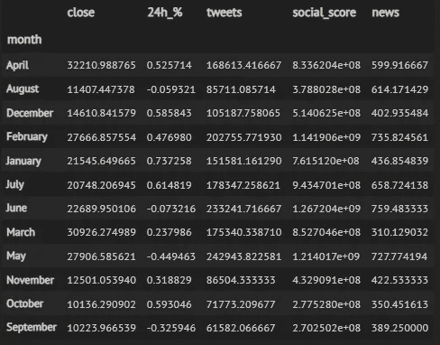
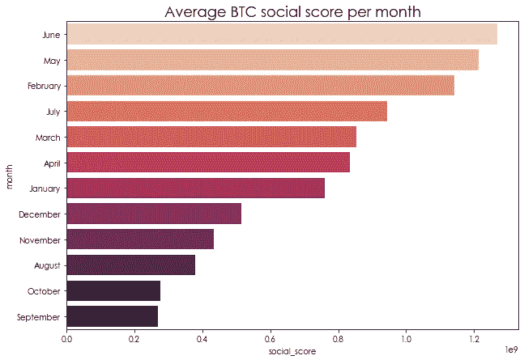
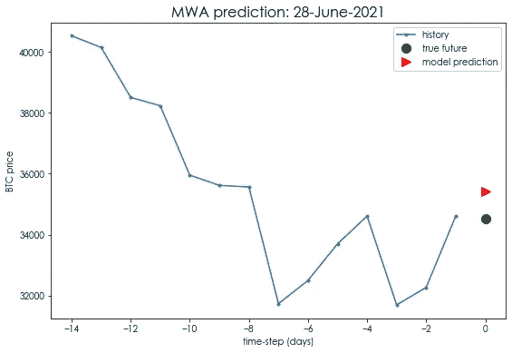
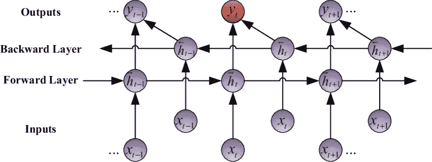

# 用 GRU 预测加密价格

> 原文：<https://medium.com/analytics-vidhya/crypto-price-forecasting-with-bi-gru-c9bcec76b69f?source=collection_archive---------4----------------------->


安德烈·弗朗索瓦·麦肯齐在 [Unsplash](https://unsplash.com?utm_source=medium&utm_medium=referral) 上的照片

**注:不作为理财建议。**

众所周知，加密货币非常不稳定，因此预测大方向更具挑战性，更不用说每天的信号了。在这篇博文中，我将尝试借助一些深度学习技术来解决这个挑战。

# 内容:

1.  问题定式化
2.  收集数据
3.  预处理数据
4.  探索性数据分析
5.  生成序列数据
6.  基线模型
7.  序列模型介绍
8.  LSTM 模型
9.  双 GRU 模型
10.  主要学习内容

# 1.问题定式化

手头的任务是在给定固定长度的先前序列的情况下预测单个时间序列值。为这个问题选择的加密货币将是中本聪的创造，独一无二的**比特币**。但是这可以很容易地扩展到任何令牌，您将在下一节中发现这一点。

**类型:** ***多变量单步*** 预测，即在序列中使用多个特征进行预测，而不是只使用一个特征(单变量预测)。单步表示预测序列前面的一个值。或者，也可以预测多个值。

**性能度量:**平均绝对误差( **MAE** )，它是测试数据中绝对误差的平均值。


# 2.收集数据

我将利用 [LunarCRUSH API](https://lunarcrush.com/developers/docs) 获取历史比特币数据。此外，您可以实时获取几乎任何令牌的数据并对其进行分析，这使得该资源变得如此强大。我们将利用[资产](https://lunarcrush.com/developers/docs#assets) Rest API 端点来加载时序数据，并选择我们选择的任意数量的指标。


[LunarCRUSH API](https://lunarcrush.com/developers/docs)


资产端点

选择 LunarCrush 的原因是，除了返回开盘价/收盘价等正常的时间序列数据外，它还包括社交优势、情绪得分、推文频率、Reddit 活跃度等有见地的指标，以及他们自己的一些指标，如所有受支持的加密货币资产的 Galaxy 得分。自由层计划允许我们一次请求 720 个数据点。

让我来分解一下这个请求:

*'****&key =***`*{api_key}*`***'***:*使用加载的 API 密钥(每个账户唯一)。*

**'****&symbol =***`*BTC*`*'*:请求比特币的时序数据。也可以传递逗号分隔的列表来获取多种加密货币的数据。*

**'****&interval =***`*day*`*'*:间隔字符串值，可以是“小时”，也可以是“天”。如果省略，则默认为“小时”。*

**'*'***&time _ series _ indicators =***`*{features}*`*'*:要包含在时间序列值中的度量的逗号分隔列表。*

**'*'***&data _ points =***`*720*`*'*:资产要包含的时间序列数据点的数量。默认为 24。最多接受 720 个数据点。*

*我们接收到一个 JSON 字符串对象，其中包含时间序列数据，可以使用`json.loads()`方法解析并转换成 Python 字典对象。正如您在上面看到的，我们获得了我们传递的各个指标的比特币系列数据(仅显示了前三个数据点)，以及发送请求的特定日期的其他指标。*

# *3.预处理数据*

*有必要将原始数据转换为一种形式，这种形式可以进入数据分析的高级阶段，并可用于机器学习模型。让我们来看看这个过程中的一些步骤:*

***转换为数据帧:**首先，我们通过引用‘time series’键将时间序列 JSON 字符串转换为字典，并将其转换为 pandas 数据帧以供进一步处理。*

```
*series_dict = json.loads(obj)[‘data’][0][‘timeSeries’]
df = pd.DataFrame(series_dict)
df*
```

**

***处理空值:**有许多时间序列数据的插补技术，如后移下一次观测值(NOCB)、LOCF、线性/样条插值，但这些方法依赖于相邻观测值相似的假设。因为只有开始的 20 个点包含空值，所以我决定删除这些点本身。*

```
*# removing rows with null values
df = df.dropna()
df = df.reset_index(drop=True)*
```

***提取日期和月份:**time 列包含 Unix 时间戳(从 epoch 开始的秒数)，可以使用 datetime 模块的`utcfromtimestamp()`方法将其转换为更易理解的格式。我们还将从时间戳中提取月份，这可用于下一节中的一些数据分析。*

**

*最终数据帧*

# *4.探索性数据分析*

## ***多重共线性***

*具有一个以上隐藏层的神经网络[不会遭受多重共线性](https://datascience.stackexchange.com/a/87741)。无论如何，检查彼此之间高度线性相关的特征是一个好的做法。我们将通过在 pandas 的`corr()`方法上使用 seaborn 的热图显示相关矩阵来检查数据集中的共线性。*

```
*import seaborn as snsdata = df.iloc[:, 2:].copy()
ax = sns.heatmap(data.corr(), cmap='inferno', annot=True)*
```

**

*`Close`价格与推文和社交评分高度相关(> 0.7)。如果你不熟悉,“预测者”和“目标”之间的相关性是更好的可预测性的良好标志。`tweets`和`social_score`如预期的那样高度相关，而`news`和`24h_%`与任何其他特征都不相关，这些特征并不令人印象深刻，但鉴于比特币的波动性，这是意料之中的。现在让我们绘制`close`和`social_score`来仔细观察特征之间的关系的本质。*

****

*上面的图再次证实了之前的观察:收盘价和社会活跃度几乎成反比。随着比特币价格上涨，推文活跃度和社交得分通常会下降(除非大幅上升)，而当市场下跌时，社交活跃度似乎会增加。为什么会这样呢？这个世界以恐惧和消极为食，在秘密空间中被称为“FUD”。*

## ***月度分析***

*按月对我们的数据进行分组并探索趋势可以为我们提供一些关于特定令牌的有趣见解。*

```
*monthly = df.groupby('month').mean()
monthly*
```

**

*让我们来看看社交得分和每日价格变化(百分比)是如何按月变化的。*

****

*我们可以再次间接观察到市场和社会活动之间的反向关系，六月和五月是社会活动最活跃的月份，同时也是社会活动最低迷的月份。九月表现突出，平均降幅第二，社交活动仍然最少。我们必须注意并记住，数据集仅限于 700 天(近 2 年)的数据，洞察仅限于这一时间框架，因此不能在未来数据点的月度或季度基础上进行概括。*

## ***烛台图表***

*蜡烛图是一种金融图表，用于描述证券、衍生品或货币的价格变动。在交易者指定的时间内，它使用四个价格点(开盘价、收盘价、最高价和最低价)。交易通常受情绪支配，这可以从蜡烛图中看出。*

**

*烛台吧。演职员表[dummies.com](https://www.dummies.com/personal-finance/investing/technical-analysis/basics-of-candlestick-charts-in-technical-analysis/)*

*它有三个基本特征:*

1.  ***主体**代表从打开到关闭的范围。*
2.  ***灯芯**，或阴影，表示日内最高价和最低价。*
3.  ***颜色**，揭示市场运动方向——绿色(或白色/蓝色)体表示价格上涨，红色(或黑色)体表示价格下跌。*

*我们将使用 [Plotly](https://plotly.com/) ，一个交互式图形库和袖扣库，使我们能够直接从熊猫创建可视化。如果为给定的资产提供了所需的开盘、收盘、盘高和盘低柱，该方法可以轻松地绘制出蜡烛图。*

**

*这是 2019 年 8 月 28 日至 2021 年 7 月 27 日所有数据点的简单移动平均线(红色)的烛台图快照。该图本质上是交互式的(在笔记本中)，可以在特定时间段内放大或缩小，如下所示为最近 2 个月的情况。*

**

*专业交易员利用蜡烛图作为技术分析的最重要组成部分之一，来识别不同类型的模式(看涨、看跌和中性)，并做出购买、出售或持有资产的相关决定。更多探索，你可以在这里找到最流行的烛台图案。*

# *5.生成序列数据*

*这是本帖最微妙也是最关键的部分。如果序列数据不合适，或者哪怕有一点点错误，所有的预测模型都会崩溃。首先，让我们看看如何分割数据集和缩放要素。*

## *基于时间的拆分:*

*标准化数据集中的特征(即，将它们放在相同的尺度上)是神经网络良好运行和更快收敛所必需的。我们更喜欢进行基于时间的分割，而不是随机分割——将时间序列数据分割成训练集和测试集。在我们的例子中，训练数据点将用于预测过去 30 天的价格。首先，我们将数据拟合到`split_index`，然后使用 sklearn 的`StandardScaler`实现来缩放数据集。*

*除了缩放特征之外，保持标签(`close`价格)的缩放比例(均值和方差)也很重要。该缩放器将用于将预测转换回最初使用`inverse_transform`方法的比例，如稍后在绘图功能中演示的。*

## *进入序列数据的窗口*

*首先，让我直观地告诉您如何对数据点进行窗口处理，并生成序列数据，这些数据可以输入到模型中进行预测。*

```
*1 --> 2 --> 3 --> 4 --> 5 --> 6 --> 7 --> 8 --> 9 --> 10*
```

*让我们假设一个简单的时间序列，前十个自然数。现在我们将把它转换成给定窗口大小的序列。**窗口大小**决定了每个序列的长度，并且是一个超参数，选择正确的大小将导致最佳结果。假设窗口大小为 4，序列将如下所示:*

```
*features --> label
__________________1, 2, 3, 4 --> 5
2, 3, 4, 5 --> 6
3, 4, 5, 6 --> 7
4, 5, 6, 7 --> 8*
```

*给定左边的序列，该模型将被训练来预测相应的标签。类似地，在我们的例子中，训练集和测试集都将以这种格式形成。主要的区别是我们正在处理一个多变量的问题，它将包括 4 维而不是 1 维的序列。*

*让我们定义一个`windowingData`函数，它接受数据集的开始/结束索引、窗口大小(`14`和数据集本身。该函数返回训练数据和测试数据的序列及其各自的标签。*

**

*训练和测试数据形状。*

*训练数据包含 656 个序列，每个输入序列的大小为 14x4，即 14 天，具有 4 个特征:关闭、推文、社交得分和新闻。下面显示的输入序列预计输出值-0.5761。*

**

*样本输入序列和标签。*

## *绘图功能:*

*定义这个效用绘图函数将帮助我们方便地对测试数据进行单个未来预测或多个未来预测的绘图。*

*该函数接受数据标签(历史、真实和预测的未来)、先前保存的定标器、绘图标题和一个布尔变量作为参数。`multi`决定剧情类型，单未来或多未来。使用保存的缩放器将点转换为其原始比例，并使用相关标记进行绘制，如下图示例所示:*

```
*i = 0
day = df.index[i+14]
title = f'Sample plot: {day}'
ax = plot((X_train[i], y_train[i]), scaler_labels, title)*
```

**

*第一个输入序列和标签，原始比例。*

# *6.基线模型*

*基线模型通常是您可以实现的最基本的模型，对于前面的复杂模型，它们的性能应该是最低的。在我们的例子中，我们将实现一个简单的移动窗口平均模型，它将返回最后 14 个观察值(收盘价)的平均值作为输出。*

*该函数将在通过测试数据时返回一个值列表(序列的平均值),这是一个三维 numpy 数组。让我们来看几个基于基线模型的预测:*

****

*还不错！我们现在将通过使用`base_ma`函数传递测试序列、标签和移动平均值来可视化所有测试数据的所有单步预测。*

**

*预测曲线看起来过于简单，比真实的未来价格更平滑，但仍然做得不错。因此，预计下一个模型将更好地概括预测，但在实施之前，我将在下一节中简要介绍序列模型及其特点或优势。*

# *7.序列模型介绍*

> *人类不是每秒钟都从零开始思考。当你阅读这篇文章时，你是在理解前面单词的基础上理解每个单词的。你不会抛弃一切，重新从头开始思考。你的思想有持久性。*

*以上是克里斯多夫·奥拉在《T4》中对 RNN 和 LSTM 的精彩阐述中的一段。传统的技术和神经网络根本不关心序列的概念，也不能保存以前对解决当前任务有用的信息。**循环神经网络**前来救援。RNN 可以被认为是同一个神经网络的多个副本，随着时间的推移，将信息从一个时间点传送到另一个时间点。*

**

*展开 RNN。演职员表:[维基百科](https://en.wikipedia.org/wiki/Recurrent_neural_network)*

*但是 RNN 患有**短期记忆**。如果一个序列足够长，它们将很难把信息从较早的时间步骤传送到较晚的时间步骤。考虑尝试预测`“Lionel Messi is Argentine, he speaks Spanish.”`中的最后一个单词最近的信息表明，最后一个单词应该是一种语言的名称。在这里，上下文单词`“Argentine”`和最后一个单词之间的差距很小，但是随着这种差距的扩大，RNN 将无法很好地表现。在反向传播过程中，RNN 可能会遇到**消失梯度**问题。当一个梯度变得太小，对学习的贡献就不大。*

*长短期记忆( **LSTM 的**)网络和门控循环单元( **GRU 的**)负责长期依赖性。它们是特殊种类的 RNN，具有被称为“门”的内部机制来调节信息的流动。*

**

*LSTM 和 GRU 建筑。[学分](https://www.slideshare.net/hytae/recent-progress-in-rnn-and-nlp-63762080)*

*这些门具有不同的功能，例如保留来自前一单元(时间步长)的累积信息的多少部分，或者确定当前单元的输出。GRU 的体系结构不太复杂，导致方程较少，这反过来加快了反向传播。因此，GRU 的解决方案提供了更快、更有效的解决方案，并且被发现在更少量的数据上表现得更好。因此，可以说 GRU 比 LSTM 更适合我们的问题。*

## ***双向网络:***

**

*双向 RNN。[学分](https://www.researchgate.net/figure/Bidirectional-recurrent-neural-networks-BRNNs_fig3_282530613)*

*在双向 RNN 中，一个网络的输入序列按正常时间顺序输入，另一个网络则按相反的时间顺序输入。这两个网络的输出通常在每个时间步被连接起来。这种实现允许网络在每个时间步都具有关于该序列的前向和后向信息，即也查看未来的上下文。*

# *8.LSTM 模型*

*现在是代码实现和测试一些模型的时候了。我将利用`Tensorflow 2.0/Keras`。首先，我们将定义一些**回调**，这是在培训或评估阶段定制我们模型的一种强有力的方式。*

*`ModelCheckpoint`:以某一频率保存模型或模型权重，在我们的情况下，只要验证损失最小(最佳权重)。*

*`EarlyStopping`:当确认损失 10 个周期没有改善时，停止训练。*

*`LearningRateScheduler`:每隔 2 个历元降低 5%的学习率。为了取得更好的成绩，经常改变/降低学习速度通常是一个很好的做法。*

*这是一个堆叠的 LSTM 架构(多个 LSTM 层)，带有`Relu`激活和`Adam`优化器。使用`return_sequences=True`，下一层的输入将是一个相同长度的序列，而不仅仅是一个向量。*

**

## *综合预测:*

```
*day = df.index[670]
title = f'LSTM model: {day} onwards'
ax = plot((y_train[-30:], y_test, lstm.predict(X_test)), scaler_labels, title, multi=True)*
```

**

*预测曲线比基线移动平均线稍精确，但不太平滑。然而，它无法更精确地描述比特币价格在接近尾声时的突然上涨，以及在开始时相当低的价格。让我们尝试另一种架构。*

# *9.双 GRU 模型*

*如前所述，有理由假设 GRU 可能更适合这个问题。此外，我们将利用**堆叠双向 GRU 的**，最终使用密集连接层，而不是另一个 GRU 层。休息与辍学相同，以控制过度拟合，重新激活和亚当优化。*

**

*BiGRU 训练阶段，过去 10 个纪元。*

**

*我们从第 30 个**时段(图中的#29)加载模型权重，这给了我们最佳的测试损失(在随后的时段中没有改善)。注意，训练损失持续下降，直到最后一个时期，并且随着两个损失之间的差距扩大，过拟合增加。我们来看一些测试数据序列的单步预测和合并预测。***

****

## *综合预测:*

```
*day = df.index[670]
title = f'BiGRU model: {day} onwards'
ax = plot((y_train[-30:], y_test, BiGRU.predict(X_test)), scaler_labels, title, multi=True)*
```

**

*绝对是三个模型中对比特币价格最好的概括。当合并后，它能够比 LSTM 更好地预测接近尾声时的突然上升。几乎不可能预测准确的价格，但利用社交评分或新闻活动等特征提前了解资产价格方向是一个重大利好。*

*车型对比。*

# *10.主要学习内容*

*学习了从零开始为金融数据构建多变量时间序列预测模型的生命周期，步骤包括:获取实时加密货币数据，清理并转换为相关格式，通过数据分析了解关键模式，生成序列数据，实施并调整序列模型。*

## *未来的工作*

*从特征工程的角度来看，可以添加一些复杂的特征(例如，当天最高价和最低价的差异/平均值)。如果有更多的数据点以及模型架构的变化，那么像窗口大小(在我们的例子中是 14 天)这样的超参数可能会增加。*

## *参考*

*[1]应用人工智能课程，【https://www.appliedaicourse.com/ *

*[2] LunarCRUSH API，【https://lunarcrush.com/developers/docs *

*[3] Tensorflow 教程，时间序列预测，[https://www . tensor flow . org/tutorials/structured _ data/time _ series](https://www.tensorflow.org/tutorials/structured_data/time_series)*

*[4]克里斯多佛·奥拉，2015 年，[https://colah.github.io/posts/2015-08-Understanding-LSTMs/](https://colah.github.io/posts/2015-08-Understanding-LSTMs/)*

*[5] Michael Phi，2018，[https://towardsdatascience . com/illustrated-guide-to-lstms-and-gru-s-a-step-by-step-explain-44e 9 EB 85 BF 21](https://towardsdatascience.com/illustrated-guide-to-lstms-and-gru-s-a-step-by-step-explanation-44e9eb85bf21)*

*[6]贾森·龙，2016 年，[https://senseful.github.io/text-table/](https://senseful.github.io/text-table/)*