# 使用 Python 解释和实现密码算法

> 原文：<https://medium.com/analytics-vidhya/cryptographic-algorithms-interpretation-and-implementation-using-python-c90da275b3ab?source=collection_archive---------6----------------------->

算法:AES、RSA、MD5、SHA256

在这个数字时代，每天都有大量的数据需要处理。数据安全问题来了。安全性可以是在通信层或存储层或任何地方。密码术是将数据从一种形式转换成另一种形式的过程，其中只有具有访问权的人可以读取或修改它。

基本上，数据从一种形式转换成另一种形式，并且可以还原成原来的形式，这就是所谓的加密和解密。如果数据从一种形式转换到另一种形式，并且没有办法恢复到原来的形式，这被称为**哈希。**

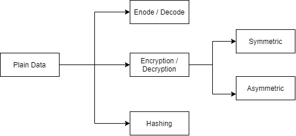

# **编码和解码**

**编码:**传送基本字母、字母表、特殊字符等的过程。根据编码技术类型转换成特殊格式。
**解码:**是将编码后的数据转换成原始数据的过程。

> 编码或解码不需要任何密钥。

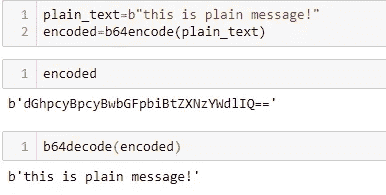

# **加密和解密**

**加密:**使用密钥将明文数据转换为密码数据的过程。
**解密:**是使用密钥将密码数据转换为明文数据的过程。

> 这里的 KEYS 代表公钥和私钥。

公钥:可以与任何人共享的密钥。
**私钥:**是不能与他人共享的密钥称之为个人密钥。

有两种类型的加密算法:对称和非对称

# **对称算法**

这些算法使用单个密钥(即私钥)执行加密。

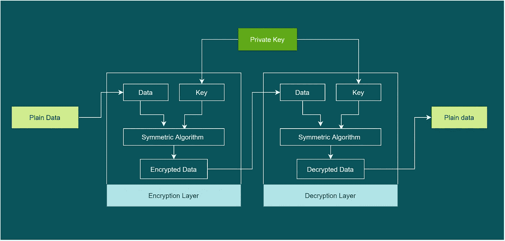

**用 Python 代码实现 AES**

导入库

```
from Crypto.Cipher import AES
from base64 import b64encode, b64decode
from Crypto import Random
```

消息，私钥

```
plain_text=”hi this is the message”
private_key=”privatekey123456"
```

加密数据

```
iv = Random.new().read(AES.block_size)
cipher = AES.new(private_key.encode(“utf8”), AES.MODE_CFB, iv)
encrypted_text=cipher.encrypt(plain_text.encode(“utf8”))
```

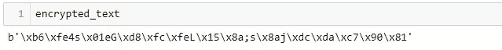

解密数据

```
cipher = AES.new(private_key.encode(“utf8”), AES.MODE_CFB, iv)
decrypted_text=cipher.decrypt(encrypted_text).decode(“utf8”)
```

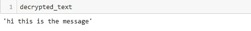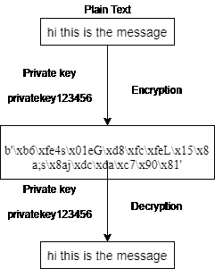

这里，AES 算法用于加密和解密数据。明文使用私钥“privatekey123456”加密。使用相同的私钥对加密的消息进行解密。

# **不对称算法**

这些算法使用公钥和私钥对来执行加密和解密。

**场景 1:用公钥加密，用私钥解密
示例:RSA**

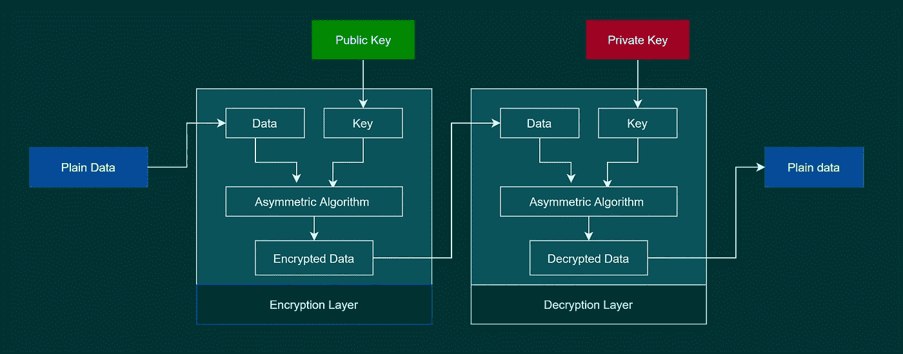

**用 python 实现 RSA**

导入库

```
from Crypto.PublicKey import RSA
from Crypto.Cipher import PKCS1_OAEP
from Crypto import Random
```

公钥、私钥生成

```
random_generator = Random.new().read
key = RSA.generate(1024, random_generator)
private_key, public_key = key, key.publickey()
```

加密数据

```
plain_text=”this is the message”
cipher = PKCS1_OAEP.new(public_key)
encrypted_text=cipher.encrypt(plain_text.encode(“utf8”))
encrypted_text
```

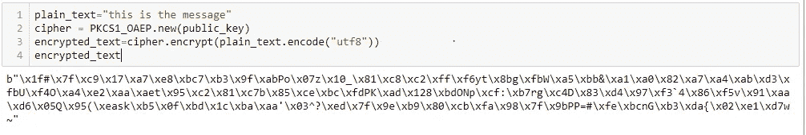

解密数据

```
cipher = PKCS1_OAEP.new(private_key)
decrypted_text =cipher.decrypt(encrypted_text).decode(“utf8”)
decrypted_text
```

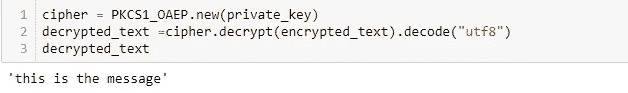

在这种情况下，RSA 算法用于执行加密和解密。数据使用公钥加密，使用私钥解密。如果网络中有人窃取了加密的数据，他/她无法解密，因为没有私钥。这些类型的算法主要用于通过网络传输信息。

**场景 2:用私钥加密，用公钥解密**

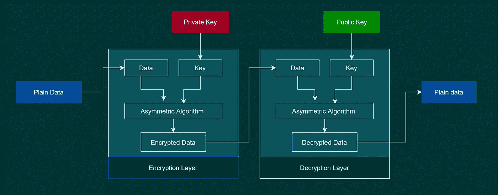

这种情况与情况 1 完全相反，在情况 1 中，使用私钥执行加密，使用公钥执行解密。你会想知道它有多安全！
这种类型的加密主要用于生成数字签名。

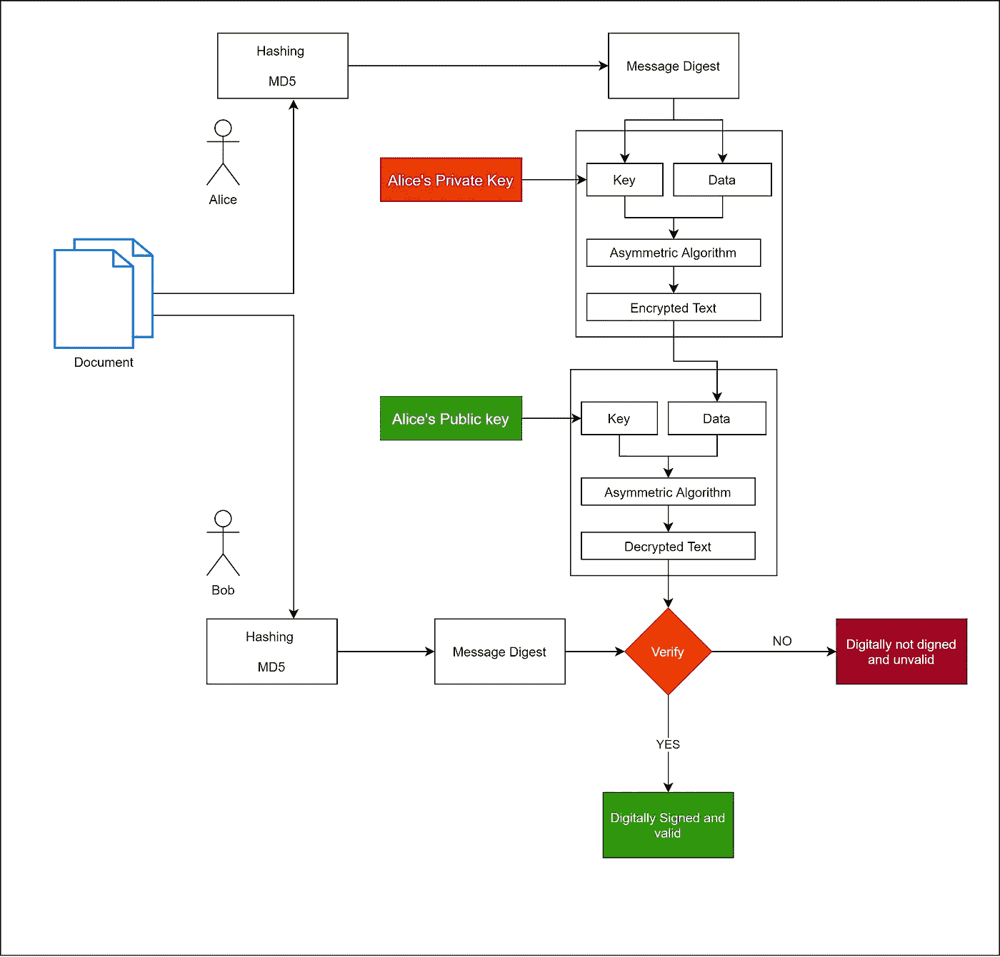

数字签名生成

该架构说明了如何对文档进行数字签名。考虑**爱丽丝**想要签署 B **ob** 发送的文件。Alice 将与 Bob 共享他的公钥，因为它是可共享的密钥。Alice 将使用散列算法对文档进行散列，并用他的私钥对散列后的文档(摘要文档)进行加密。加密的消息将被发送给鲍勃。现在，Bob 将使用 Alice 的公钥解密消息，并用 Bob 的散列文档验证 Alice 的散列文档。如果两个哈希(消息摘要)相同，则它是有效的数字签名文档。

# 散列法

这是一个单向的过程，消息只被加密，没有办法解密。这里，加密的消息被称为消息摘要。

示例:MD5，SHA

**MD5 Python 代码**

```
import hashlib 
plain_text=”this is confidential message”
hashlib.md5(plain_text.encode(“utf8”)).digest()
```

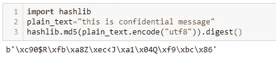

**SHA 256 Python 代码**

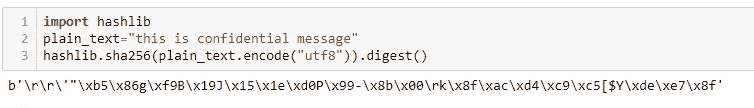

因此，我们可以使用 Python 执行 AES、RSA、MD5、SHA256、数字签名算法。

> 感谢和问候
> Praveen Sujanmulk