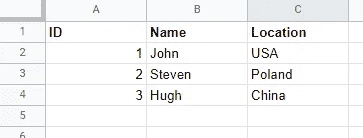
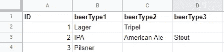
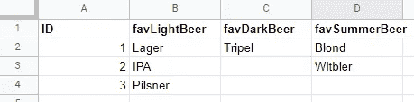

# 简单英语的 CSV

> 原文：<https://medium.com/analytics-vidhya/csv-in-plain-english-49965aa26e81?source=collection_archive---------21----------------------->

*CSV 文件格式说明。*


照片由[米卡·鲍梅斯特](https://unsplash.com/@mbaumi?utm_source=unsplash&utm_medium=referral&utm_content=creditCopyText)在 [Unsplash](https://unsplash.com/s/photos/data?utm_source=unsplash&utm_medium=referral&utm_content=creditCopyText) 上拍摄

我们在任何地方都使用电子表格和其他数据。跟踪物流、财务、用户数据或只是存储购物清单。

大多数电子表格应用程序都能够保存为 CSV 格式，即**C**omma-**S**epeted**V**values。但是，虽然许多人只是将他们的 Excel 文件保存为 CSV 格式，以便上传到某些应用程序，但您可能也必须编写它们。也许一次，也许你需要每天都做。这就是这个解释的目的。

# 句法

您可能有这样一个电子表格:



电子表格示例

它有一行标题和三行数据。我们可以在 CSV 中实现同样的目标，就像这样:

```
ID,Name,Location
1,John,USA
2,Steven,Poland
3,Hugh,China
```

如您所见，所有值都用逗号分隔。

另一个常用的分隔符是分号:`;`。

# 空值

“但是如果有些值是空的呢？”不要担心。只要保持逗号之间的空格是空的。(也没有空格)。



样张

```
ID,beerType1,beerType2,beerType3
1,Lager,Tripel,
2,IPA,American Ale,Stout
3,Pilsner,,
```

正如你可能已经注意到的，我们在第 1 行有一个尾随逗号，在第 3 行有两个尾随逗号，而在唯一的整行，第 2 行没有尾随逗号。

让我们看另一个空值的例子。



另一张样张

在这个示例中，中间一列的值为空，而 D 列在 ID 为 2 的行上仍有一个值。我们像你期望的那样处理它们。

```
ID,favLightBeer,favDarkBeer,favSummerBeer
1,Lager,Tripel,Blond
2,IPA,,Witbier
3,Pilsner,,
```

我们像以前一样使用逗号来分隔值，我们将在一个空格后继续。

这就结束了对 CSV 的解释。还有 TBV，它代表制表符分隔的值。它们的工作方式相同，但使用制表符分隔数据。从上面看，我们的工作表如下所示:

```
ID favLightBeer favDarkBeer favSummerBeer
1 Lager Tripel Blond
2 IPA  Witbier
3 Pilsner
```

Medium 并没有真正呈现它应该呈现的标签，但我希望它是清晰的。

# 我需要更多的复杂性

CSV 是一种非常简单的文件格式。你不能真的存储非 2D 的数据。我写了一个关于格式的解释，也许*适合你的需要。是 JSON。*

[](/javascript-in-plain-english/json-in-plain-english-a59fe38c9bea) [## JSON 用简单的英语

### JSON 对非程序员的强大作用

medium.com](/javascript-in-plain-english/json-in-plain-english-a59fe38c9bea) 

JSON 更复杂，但是提供了更多的类型、列表、子对象等等。如果你想了解更多关于数据格式的内容，我建议你看一看。

我希望这是有用的，我希望你有一个美好的一天。